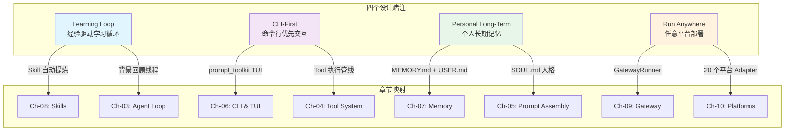
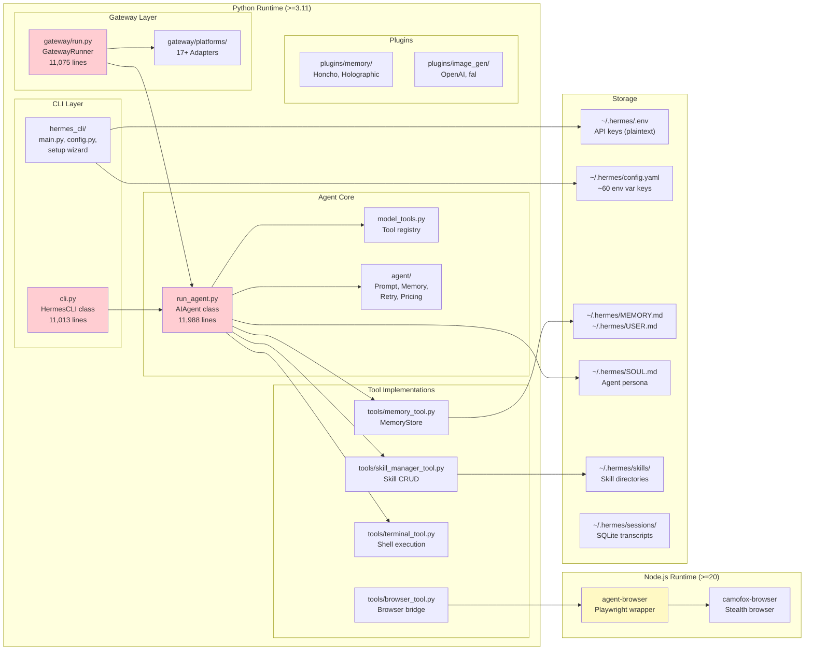

# 第一章：设计赌注与竞争差异

> 当 Claude Code、Codex CLI、Goose 等 Agent 已经存在时，Hermes Agent 为什么还有价值？

## 1.1 为什么还需要另一个 Agent

2025 年下半年到 2026 年初，AI Agent 赛道经历了一轮井喷式爆发。Anthropic 推出 Claude Code，将"对话即编程"的体验做到了极致；OpenAI 紧随其后发布 Codex CLI，凭借 GPT 系列模型的生态优势迅速占据开发者心智；Block 开源的 Goose 则走通用自动化路线，试图做"什么都能干"的桌面 Agent。三个产品背后站着的，是三家数百亿估值的公司。

面对这样的竞争格局，Nous Research——一个以开源模型训练闻名的研究团队——为什么还要做 Hermes Agent？

要回答这个问题，我们需要先看清现有产品的共同盲区。

**Claude Code 是瑞士军刀。** 它的设计哲学是"Anthropic 模型的最佳搭档"：深度集成 Claude 的 thinking、extended thinking 等独家特性，通过精心调优的 system prompt 和 tool schema 将代码编写体验推到极致。但它的局限也很明显——你只能用 Claude 模型，只能在终端里用，不能把它接到 Telegram 群里去当客服，也不能让它在每次对话结束后自动沉淀经验。

**Codex CLI 是 OpenAI 的终端入口。** 它与 GPT 系列深度绑定，强调安全沙箱执行和 Responses API 的原生支持。但同样是单模型、单平台的封闭循环。

**Goose 追求通用性，却止步于桌面。** 它的扩展体系虽然灵活，但缺乏跨平台分发能力，也没有系统性地解决"Agent 如何从错误中学习"这个核心问题。

Hermes Agent 的定位，不是做一把更好的瑞士军刀，而是做一把**精磨单刀**——一个模型无关的、可嵌入任意平台的、能从经验中自我改进的个人 AI Agent。这把刀不追求在某个模型上做到极致，而是追求在任意模型、任意平台上都能可靠运行，并且**越用越好**。

这个定位背后有四个核心设计赌注。

## 1.2 四个设计赌注

Hermes Agent 的整个架构围绕四个设计赌注展开。所谓"赌注"，是因为这些方向在工程上都有显著的代价——选择它们意味着放弃另一些东西。本书的上卷（源码分析）将逐章剖析这些赌注在代码中的落地方式，下卷（重构方案）将评估它们的投资回报。



### 1.2.1 Learning Loop：经验驱动学习循环

这是 Hermes Agent 最大胆的设计赌注，也是与竞品差异最大的地方。

核心理念很简单：Agent 在完成任务的过程中会积累经验，这些经验应该被自动提炼成可复用的"技能"（Skill），而技能反过来应该指导 Agent 在未来的任务中做出更好的决策。这形成了一个**正反馈循环**——用得越多，Agent 越聪明。

在代码层面，这个循环由三个组件驱动：

**第一，Skill 文件体系。** 每个 Skill 是一个目录，核心文件是 `SKILL.md`，可以附带参考资料、模板和脚本。Skill 存储在 `~/.hermes/skills/` 下，支持分类组织（`tools/skill_manager_tool.py:22-33`）。Agent 通过 `skill_manage` 工具创建、编辑和删除 Skill（`tools/skill_manager_tool.py:622`），通过 `skills_list` 和 `skill_view` 工具检索和阅读 Skill（`tools/skills_tool.py:666`, `tools/skills_tool.py:823`）。

**第二，System Prompt 中的 Skill 索引。** 每次会话开始时，`build_skills_system_prompt()` 函数会扫描所有 Skill 目录，构建一个紧凑的索引注入 system prompt（`agent/prompt_builder.py:595-614`）。这个索引使用两层缓存——进程内 LRU 字典和磁盘快照——避免每次都做文件系统扫描。Agent 看到索引后就知道自己"会什么"，遇到匹配的任务时会主动加载对应 Skill 的完整内容。

**第三，背景回顾线程。** 这是循环的关键闭环。在对话结束后，Agent 会在后台启动一个独立线程，用一个精简版的 `AIAgent` 实例回顾整个对话，判断是否有值得沉淀的经验（`run_agent.py:2772-2780`）。回顾的提示词很具体：

```python
# run_agent.py:2772-2779
_SKILL_REVIEW_PROMPT = (
    "Review the conversation above and consider saving or updating a skill if appropriate.\n\n"
    "Focus on: was a non-trivial approach used to complete a task that required trial "
    "and error, or changing course due to experiential findings along the way, or did "
    "the user expect or desire a different method or outcome?\n\n"
    "If a relevant skill already exists, update it with what you learned. "
    "Otherwise, create a new skill if the approach is reusable.\n"
    "If nothing is worth saving, just say 'Nothing to save.' and stop."
)
```

注意这段提示词的措辞——它不是要求 Agent 机械地记录步骤，而是要求 Agent 识别"试错过程"和"路线调整"。这是一种**元认知**：Agent 需要判断哪些经验具有迁移价值。

回顾线程在后台静默运行，共享主 Agent 的 memory store 但独立执行，最多进行 8 轮工具调用（`run_agent.py:2828`）。这个设计意味着 Skill 的创建和更新对用户完全透明——你不需要手动告诉 Agent "把刚才的方法记下来"。

与 Claude Code 的对比很能说明问题。Claude Code 有 Auto-Memory 功能（每项目 25KB 自动积累的上下文笔记），也有用户手动维护的 CLAUDE.md 规则文件，但两者是分离的——Auto-Memory 记录的是项目上下文，而非可复用的操作经验。Hermes Agent 的 Learning Loop 更进一步，不仅自动积累记忆，还将试错经验提炼为结构化的 Skill 文档，且这个提炼过程由 Agent 自主判断（通过后台回顾线程）。这个赌注的核心是：**让 Agent 自己管理自己的知识，比让用户手动维护更可靠。**

代价也很明显：每次对话结束后都要启动一个回顾 Agent，消耗额外的 API 调用；Skill 文件可能膨胀失控；低质量的自动提炼可能引入噪声。这些问题我们将在 Ch-08 详细分析。

### 1.2.2 CLI-First：命令行优先交互

Hermes Agent 选择不做 Web IDE，不做 VS Code 插件，而是做一个**命令行原生**的交互界面。这个选择在竞品中并不独特——Claude Code 和 Codex CLI 都是 CLI 工具——但 Hermes Agent 的 CLI 实现有一个重要区别：它是用 Python 的 `prompt_toolkit` 构建的全功能 TUI（Terminal User Interface），而不是简单的 readline 交互。

`HermesCLI` 类（`cli.py:1728`）是整个 TUI 的核心。它基于 `prompt_toolkit` 的 `Application` 框架，实现了固定输入区域、自动补全、命令历史、丰富的格式化输出等功能。启动时通过 `FileHistory` 持久化命令历史（`cli.py:43`），支持通过 `--toolsets` 参数选择工具集（`cli.py:10`），甚至可以通过 `-q` 参数进行单次查询（`cli.py:12`）。

CLI-First 的设计赌注不在于 CLI 本身，而在于它背后的**可嵌入性**。`AIAgent` 类的构造函数接受 40+ 个参数（`run_agent.py:708-766`），涵盖模型配置、工具选择、回调函数、平台信息等各个维度。这种高度参数化的设计意味着 `AIAgent` 可以被任何上层应用嵌入——CLI 只是其中一个前端。Gateway（见 1.2.4）是另一个。ACP adapter（`pyproject.toml:120`）是第三个。

Claude Code 的 CLI 虽然体验更好（基于 Ink/React 的现代终端渲染），但它是一个**封闭产品**——你不能把 Claude Code 的 Agent 核心拿出来嵌入到你自己的 Telegram bot 里。Hermes Agent 的 CLI-First 策略本质上是说：**终端是最小公分母，从终端出发可以向上兼容所有平台。**

代价是 TUI 的视觉表现力受限（prompt_toolkit 的渲染能力远不及 Ink），以及需要维护一个万行级别的 `cli.py`（11,013 行，`cli.py:1`）。

### 1.2.3 Personal Long-Term：个人长期记忆

大多数 AI Agent 是无状态的——每次对话都是一张白纸。Hermes Agent 赌的是：一个**记住你**的 Agent 比一个每次都要从头解释的 Agent 更有价值。

这个赌注通过三层持久化机制落地：

**第一层：MEMORY.md。** 这是 Agent 的"个人笔记本"，记录环境事实、项目惯例、工具特性等客观信息。`MemoryStore` 类（`tools/memory_tool.py:105`）管理这些条目，使用 `§` 符号作为分隔符，施加字符数限制（非 token 限制，因为字符计数与模型无关）。Memory 在会话开始时作为冻结快照注入 system prompt（`tools/memory_tool.py:11-13`），会话中的写入立即持久化到磁盘但**不修改 system prompt**——这是一个精妙的设计，保护了 prefix cache 的稳定性。

**第二层：USER.md。** 这是 Agent 对用户的认知——偏好、沟通风格、工作习惯。与 MEMORY.md 分开存储是因为两者的更新频率和访问模式不同：环境信息经常变化，但用户偏好通常是稳定的。

**第三层：SOUL.md。** 这是 Agent 的"人格定义"，决定了它的说话方式、行为边界和价值取向。当 `~/.hermes/SOUL.md` 存在时，它会替代硬编码的 `DEFAULT_AGENT_IDENTITY`（`agent/prompt_builder.py:134-142`）成为 system prompt 的第一层（`run_agent.py:3990-3996`）。这意味着用户可以完全重塑 Agent 的人格，而不需要修改任何代码。

System prompt 的组装顺序清晰地体现了这三层的优先级（`run_agent.py:3981-3988`）：

```
1. Agent identity — SOUL.md (or DEFAULT_AGENT_IDENTITY)
2. User/gateway system prompt
3. Persistent memory (frozen snapshot)
4. Skills guidance
5. Context files (AGENTS.md, .cursorrules)
6. Current date & time
7. Platform-specific formatting hint
```

记忆系统还有一个重要的行为指导（`agent/prompt_builder.py:144-154`）：它明确告诉 Agent **什么该记、什么不该记**。任务进度、会话结果、临时 TODO 不应该进入 memory——这些是短期信息，应该通过 `session_search` 从历史转录中检索。Memory 只存储"减少未来用户纠正次数"的持久事实。

此外，Hermes Agent 还支持外部记忆提供者（`agent/memory_manager.py:1-27`）。`MemoryManager` 类可以同时管理内置记忆和一个外部插件（如 Honcho），通过统一的 `prefetch_all()` 和 `sync_all()` 接口在每轮对话前后同步状态。

与 Claude Code 相比：Claude Code 有 CLAUDE.md（用户手动编写的规则）和 Auto-Memory（自动积累的项目笔记），但它没有结构化的用户画像机制。Hermes Agent 的记忆系统是**双向的**——用户可以通过 SOUL.md 定义 Agent 的人格，Agent 可以通过 MEMORY.md 和 USER.md 记住用户的世界。

代价是显著的：记忆注入增加了 system prompt 的长度（消耗上下文窗口），冻结快照模式意味着会话中的记忆更新直到下次会话才会生效，多层记忆的一致性管理也增加了复杂度。

### 1.2.4 Run Anywhere：任意平台部署

这是 Hermes Agent 与所有竞品最显著的差异点。Claude Code 只跑在终端里，Codex CLI 只跑在终端里，Goose 只跑在桌面上。Hermes Agent 通过一个 Gateway 架构，可以同时连接到 **20 个消息平台**。

`GatewayRunner` 类（`gateway/run.py:597`）是这个架构的核心控制器。它管理所有平台 Adapter 的生命周期，路由消息到 Agent，处理并发会话。`Platform` 枚举（`gateway/config.py:48-69`）列出了所有支持的平台：

```
LOCAL, TELEGRAM, DISCORD, WHATSAPP, SLACK, SIGNAL,
MATTERMOST, MATRIX, HOMEASSISTANT, EMAIL, SMS,
DINGTALK, API_SERVER, WEBHOOK, FEISHU, WECOM,
WECOM_CALLBACK, WEIXIN, BLUEBUBBLES, QQBOT
```

每个平台通过继承 `BasePlatformAdapter`（`gateway/platforms/base.py:879`）实现。这个基类定义了标准接口：连接认证、消息接收、消息发送、媒体处理。具体的 Adapter 实现分布在 `gateway/platforms/` 目录下，覆盖了从主流国际平台（Telegram、Discord、Slack）到中国特色平台（飞书、钉钉、企业微信、微信公众号、QQ Bot）的广泛光谱。

这个设计赌注的本质是**解耦**：Agent 核心（`AIAgent`）不关心消息来自哪里，Gateway 不关心 Agent 怎么做决策。两者通过回调函数和消息事件松耦合。`AIAgent` 的构造函数中有一组回调参数（`run_agent.py:736-746`）——`tool_progress_callback`、`stream_delta_callback`、`clarify_callback` 等——正是这种解耦的接口层。

Gateway 还包含了生产级的运维特性：Agent 缓存上限（128 个并发会话，`gateway/run.py:40`）、空闲超时驱逐（1 小时，`gateway/run.py:41`）、优雅重启和排水（drain）机制、SSL 证书自动检测（`gateway/run.py:47-78`）。这些不是 demo 级别的代码——它们说明 Hermes Agent 确实被设计为一个**可运维的服务**，而不仅仅是一个开发者工具。

代价同样巨大：20 个平台 Adapter 意味着 20 套消息格式、20 套认证流程、20 套错误处理逻辑需要维护。`gateway/platforms/feishu.py` 一个文件就有 4,360 行。Gateway 自身 `gateway/run.py` 也达到了 11,075 行。这是一个巨大的维护负担，尤其是对一个开源社区项目而言。

## 1.3 技术栈全景

理解了四个设计赌注之后，我们来看支撑这些赌注的技术栈。Hermes Agent 是一个**双运行时**项目：核心逻辑用 Python 编写，浏览器自动化工具依赖 Node.js。



### 1.3.1 Python 层

项目使用 Python 3.11+（`pyproject.toml:10`），由 Nous Research 开发，MIT 协议开源（`pyproject.toml:12`），当前版本 0.10.0（`pyproject.toml:7`）。

核心依赖 15 个包（`pyproject.toml:13-37`），涵盖了 LLM SDK（`openai`、`anthropic`）、HTTP 客户端（`httpx`）、重试逻辑（`tenacity`）、配置管理（`python-dotenv`、`pyyaml`）、模板引擎（`jinja2`）、数据校验（`pydantic`）和终端 UI（`prompt_toolkit`、`rich`）等基础设施。

可选依赖分为 18+ 个组（`pyproject.toml:39-115`），从 `messaging`（Telegram/Discord/Slack SDK）到 `voice`（faster-whisper 语音识别）到 `rl`（强化学习训练），覆盖了极其广泛的使用场景。这种高度模块化的依赖组织说明项目有意识地控制基础安装的体积，但也意味着完整功能需要安装大量额外包。

三个入口点（`pyproject.toml:117-120`）清晰地映射了三种使用方式：

| 入口点 | 命令 | 功能 |
|--------|------|------|
| `hermes` | `hermes_cli.main:main` | 综合 CLI（chat、gateway、setup、cron 等） |
| `hermes-agent` | `run_agent:main` | 独立 Agent runner（脚本/自动化场景） |
| `hermes-acp` | `acp_adapter.entry:main` | ACP 协议适配器（编辑器集成） |

### 1.3.2 Node.js 层

Node.js 20+（`package.json:26`）仅用于浏览器自动化：`agent-browser`（Playwright 封装）和 `@askjo/camofox-browser`（反检测浏览器）（`package.json:19-20`）。Python 的 `browser_tool.py` 通过进程间通信桥接到 Node.js 运行时。

这是一个务实但昂贵的选择。Playwright 的 Python binding 存在已知的稳定性问题，而 Node.js 版本是一等公民。但这意味着部署 Hermes Agent 需要同时安装 Python 和 Node.js 两个运行时——对于一个 CLI 工具来说，这个入门门槛偏高。

### 1.3.3 存储层

所有持久化数据存储在 `~/.hermes/` 目录下（`hermes_cli/config.py:1-13`）。配置文件使用 YAML 格式（`config.yaml`），API 密钥使用 `.env` 格式明文存储。记忆使用 Markdown 文件（`MEMORY.md`、`USER.md`），Agent 人格使用 Markdown 文件（`SOUL.md`），技能使用目录结构。会话转录存储在 SQLite 数据库中。

这种"一切皆文件"的存储策略有几个优势：用户可以直接编辑，版本控制友好，跨平台兼容。但也有明显的局限：没有加密（API 密钥明文），没有并发控制（虽然 `memory_tool.py` 使用了 `fcntl`/`msvcrt` 文件锁，`tools/memory_tool.py:36-45`），数据量大时性能退化。

## 1.4 代码规模与工程挑战

让我们用数字来感受这个项目的工程规模。

**总代码量**：Python 约 258,000 行（不含测试），JavaScript/TypeScript 约 50,000 行。这个规模已经超越了大多数开源 AI Agent 项目。

**头部文件集中度**触目惊心：

| 排名 | 文件 | 行数 | 职责 |
|------|------|------|------|
| 1 | `run_agent.py` | 11,988 | AIAgent 类、对话循环、工具执行、错误恢复 |
| 2 | `gateway/run.py` | 11,075 | 多平台 Gateway、会话管理、生命周期控制 |
| 3 | `cli.py` | 11,013 | HermesCLI、prompt_toolkit TUI、工具集管理 |
| 4 | `hermes_cli/main.py` | 8,819 | CLI 子命令路由、gateway 管理、setup wizard |
| 5 | `gateway/platforms/feishu.py` | 4,360 | 飞书平台适配器 |

仅前三个文件就占了 34,076 行——超过许多中型项目的全部代码。这种分布模式是一个重要的工程信号。

从积极的角度看，已经有一些模块化的迹象。`run_agent.py` 在行 82-100 导入了一系列从 `agent/` 包中提取出的功能模块：`memory_manager`、`retry_utils`、`error_classifier`、`prompt_builder`、`model_metadata`、`context_compressor`（`run_agent.py:82-99`）。但这些提取还远远不够——`AIAgent.__init__` 方法仍然有 60+ 个参数（`run_agent.py:708-766`），`_build_system_prompt` 方法的职责也依然庞杂。

配置管理的复杂度同样值得关注：`hermes_cli/config.py` 在前 61 行就定义了超过 60 个环境变量键（`hermes_cli/config.py:35-61`），涵盖了从 OpenAI API 到微信公众号到 Matrix 加密的方方面面。每个平台集成都带来了自己的配置维度，累积效应是配置爆炸。

## 1.5 问题清单

基于以上分析，本章识别出四个架构级问题。后续章节将深入每个问题的根因和改进方案。

---

### P-01-01 [Arch/High] 巨型单文件：run_agent.py 和 cli.py 各超万行

**现状**：`run_agent.py`（11,988 行）、`cli.py`（11,013 行）和 `gateway/run.py`（11,075 行）各自包含一个巨型类（`AIAgent`、`HermesCLI`、`GatewayRunner`），承担了从初始化到业务逻辑到错误处理的全部职责。`AIAgent.__init__` 接受 60+ 个参数（`run_agent.py:708-766`），是典型的 God Object 反模式。

**影响**：代码可读性严重下降——新贡献者理解 `run_agent.py` 需要通读近 12,000 行代码。合并冲突频繁——任何涉及 Agent 行为的修改都会触碰同一个文件。单元测试困难——无法独立测试 `AIAgent` 的子功能而不初始化整个对象。

**根因**：项目从原型快速成长，功能不断追加到已有类中，缺乏阶段性的架构重构。虽然已有从 `run_agent.py` 提取 `agent/` 包的趋势（`run_agent.py:82-99`），但提取速度远慢于功能增长速度。

---

### P-01-02 [Arch/Medium] 双运行时依赖：Python + Node.js

**现状**：核心逻辑使用 Python 3.11+，浏览器自动化依赖 Node.js 20+（`package.json:26`）。两个运行时通过 `browser_tool.py` 的进程间通信桥接。

**影响**：安装步骤翻倍——用户需要配置两个包管理器（pip + npm）。Docker 镜像体积膨胀。CI/CD 管线复杂度增加。对于不使用浏览器工具的用户，Node.js 是完全不必要的开销。

**根因**：Playwright Node.js 版本比 Python binding 更成熟稳定。`agent-browser` 和 `camofox-browser` 是 Node.js 原生库，没有 Python 等效物。这是一个技术驱动的务实选择，但缺乏优雅的降级机制——即使用户永远不用浏览器，安装时仍然触发 Node.js 依赖解析。

---

### P-01-03 [Perf/Medium] 部署复杂：pip install + 50+ 依赖链

**现状**：基础安装包含 15 个核心依赖（`pyproject.toml:13-37`），完整安装（`[all]` extra）拉取 18 个可选依赖组，总依赖树可达 50+ 个包。部分依赖需要 C 编译（如 `faster-whisper` 依赖 `ctranslate2`），在非标准平台上（如 Termux）需要特殊处理（`pyproject.toml:67-78`）。

**影响**：首次安装可能需要 5-10 分钟（取决于网络和编译环境）。依赖冲突风险随依赖数量指数增长。供应链攻击面扩大——项目已经在依赖声明中注明了 CVE 修复（`pyproject.toml:23`, `pyproject.toml:36`）。

**根因**：四个设计赌注中的 Run Anywhere 需要支持 17+ 个平台的 SDK，Learning Loop 需要 LLM SDK，CLI-First 需要终端 UI 库。每个设计赌注都带来了不可压缩的依赖。可选依赖分组是正确的缓解策略，但核心依赖仍然较重。

---

### P-01-04 [Perf/Low] 冷启动延迟与空载内存消耗

**现状**：`run_agent.py` 在模块加载阶段就导入了 `openai`、`anthropic`、`httpx` 等重型库（`run_agent.py:41`），并立即执行 `.env` 文件加载（`run_agent.py:56-63`）。`cli.py` 在模块级别导入了整个 `prompt_toolkit` 组件树（`cli.py:42-55`）。这意味着即使是一个简单的 `hermes --help` 命令，也需要加载这些库。

**影响**：冷启动延迟预计在 1-3 秒范围内（取决于磁盘速度和 Python 版本）。空载内存消耗（加载所有模块但不执行任何请求）预计在 100-200 MB 范围内。对于 Gateway 这种长期运行的服务，初始开销可以忽略；但对于 CLI 这种交互式工具，每次启动的延迟都是用户体验的摩擦。

**根因**：Python 的模块加载模型是同步阻塞的——`import` 语句在执行到时立即加载整个模块。解决方案是延迟导入（lazy import），但在一个 12,000 行的单文件中实施延迟导入的改造成本很高，且容易引入循环导入问题。

---

## 1.6 本章小结

Hermes Agent 的存在价值不在于"做一个更好的 Claude Code"，而在于它押注了一组与竞品正交的设计方向。

**Learning Loop** 让 Agent 从经验中自动提炼可复用的 Skill，形成"越用越好"的正反馈循环——这是大多数主流 Agent 尚未系统化的能力。**CLI-First** 不是目的，而是手段——通过将 Agent 核心与交互层解耦，实现了一个可嵌入任意上层应用的基础设施。**Personal Long-Term** 通过三层持久化（MEMORY.md、USER.md、SOUL.md）让 Agent 真正"认识"用户，而不是每次都从零开始。**Run Anywhere** 通过 Gateway 架构将同一个 Agent 核心分发到 20 个消息平台，覆盖了从 Telegram 到微信公众号的全球化光谱。

这四个赌注定义了项目的价值，也定义了项目的挑战。一个 12,000 行的 `run_agent.py`、一个双运行时的部署架构、一个 50+ 依赖的安装链——这些都是赌注的工程代价。本书的任务，就是逐章打开这些代价，理解它们的根因，并提出可操作的改进方案。

下一章，我们将从项目的目录结构和模块边界入手，建立对整个代码库的空间认知。
