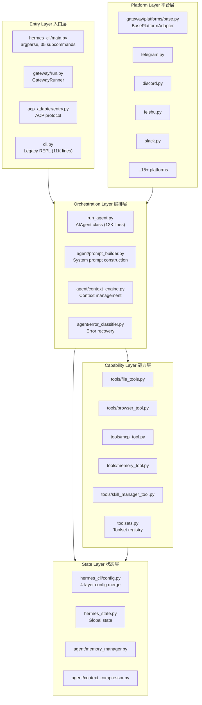
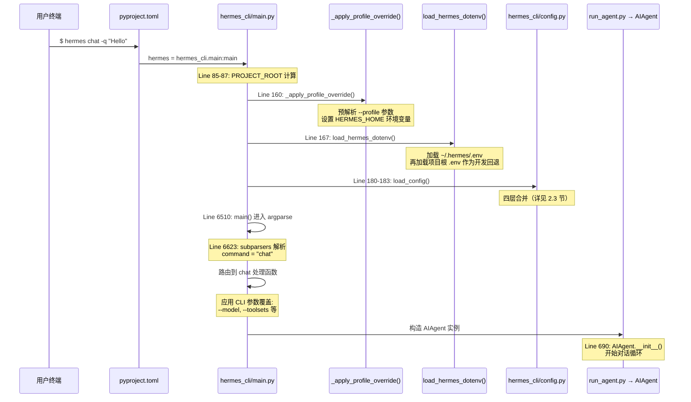
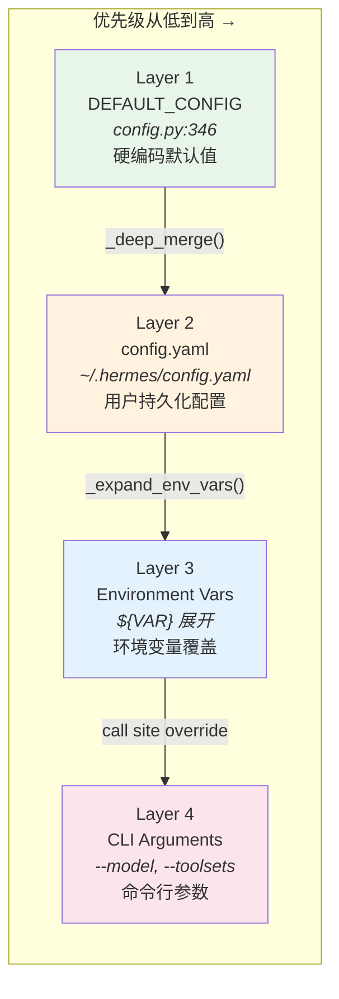

# 第二章：仓库地图与五层架构

> 面对 258,000 行 Python 代码和 100+ 文件，如何快速建立全局认知？

这个问题的答案不是"从头到尾读一遍"。没有人能消化这样的体量。正确的方法是先建立**空间感**——知道某类功能"住"在代码库的哪个区域——然后按需深入。本章将提供两个认知工具：一个五层架构模型帮你俯瞰全局，一个配置系统深度解析帮你理解数据如何流经整个系统。掌握了这两件事，你就能在不到五分钟内定位任意功能的源码位置。

## 2.1 五层架构模型

Hermes Agent 的代码可以按职责分为五个层次。这不是臆造的分类，而是从设计文档中提炼的架构模型。每一层只依赖它下方的层，决不反向依赖。理解这五层之间的边界，就理解了整个代码库的骨架。



### 2.1.1 Entry Layer（入口层）：三条路径进入系统

用户与 Hermes 交互有三个入口，它们最终都汇聚到同一个 `AIAgent` 实例：

1. **CLI 入口** — `hermes_cli/main.py` 是现代命令行界面（`hermes_cli/main.py:6510`，`main()` 函数）。通过 `pyproject.toml:118` 注册为 `hermes` 命令。它用 argparse 定义了 20+ 子命令（`hermes_cli/main.py:6623`），涵盖 `chat`、`gateway`、`setup`、`config`、`model`、`sessions` 等。

2. **Direct Agent Runner** — `run_agent.py` 提供了 `hermes-agent` 命令（`pyproject.toml:119`），可以跳过 CLI 直接启动 agent loop。这在网关模式或程序化调用时特别有用。

3. **ACP Adapter** — `acp_adapter/entry.py` 实现了 Agent Client Protocol（`pyproject.toml:120`，注册为 `hermes-acp`），是编辑器集成（如 VS Code）的标准接口。

还有一个 **Legacy CLI** (`cli.py`，11,013 行)，使用 `prompt_toolkit` 构建的交互式 REPL。它仍然存在于代码库中，但新功能开发已经转向 `hermes_cli/` 包。

### 2.1.2 Orchestration Layer（编排层）：系统的心脏

`AIAgent` 类定义在 `run_agent.py:690`，是整个系统中最核心的类。它管理对话循环、工具调用分发、错误恢复、以及模型交互。这个文件长达 11,988 行——是整个代码库中最大的单个文件。我们将在第三章深入分析 Agent Loop，此处只需知道：

- `agent/prompt_builder.py` 负责组装发送给 LLM 的 system prompt，包括可用工具列表、技能描述、安全策略等。
- `agent/context_engine.py` 管理上下文窗口，决定哪些历史消息保留、哪些压缩。
- `agent/error_classifier.py` 对 API 调用失败进行分类（速率限制、认证错误、模型不可用等），驱动自动重试和 fallback 逻辑。

### 2.1.3 Capability Layer（能力层）：工具即能力

`tools/` 目录包含 40+ 模块，每个模块实现一类工具能力。`toolsets.py` 是工具注册中心，定义了哪些工具集可用。核心工具包括：

| 模块 | 能力 |
|------|------|
| `tools/file_tools.py` | 文件读写、搜索、diff |
| `tools/browser_tool.py` | 浏览器自动化（Playwright/CDP） |
| `tools/mcp_tool.py` | Model Context Protocol 集成 |
| `tools/memory_tool.py` | 持久化记忆 |
| `tools/skill_manager_tool.py` | 技能管理（安装/卸载/更新） |
| `tools/code_execution_tool.py` | 代码执行（多语言） |
| `tools/delegate_tool.py` | Sub-agent 委托 |

这一层的设计哲学是**每个工具是独立的**——它声明自己的 schema，接收参数，返回结果，不持有跨调用状态。工具之间的协调由编排层完成。

### 2.1.4 State Layer（状态层）：记忆与配置

状态层管理所有跨请求持久化的数据：

- `hermes_cli/config.py`（3,939 行）实现了四层配置合并系统（详见 2.3 节）。
- `hermes_state.py` 存放全局运行时状态（当前会话、活跃工具、运行标志等）。
- `agent/memory_manager.py` 管理长期记忆的存取，支持本地文件和 Honcho 云端两种后端。
- `agent/context_compressor.py` 在上下文窗口溢出时，对历史消息进行有损压缩。

### 2.1.5 Platform Layer（平台层）：Run Anywhere 的实现

`gateway/` 目录实现了 Hermes 的"Run Anywhere"设计赌注。`GatewayRunner` 类（`gateway/run.py:597`）管理所有平台适配器的生命周期。平台枚举定义在 `gateway/config.py:48`，列出了 20 个支持的平台：

```python
class Platform(Enum):
    LOCAL = "local"
    TELEGRAM = "telegram"
    DISCORD = "discord"
    WHATSAPP = "whatsapp"
    SLACK = "slack"
    SIGNAL = "signal"
    MATTERMOST = "mattermost"
    MATRIX = "matrix"
    HOMEASSISTANT = "homeassistant"
    EMAIL = "email"
    SMS = "sms"
    DINGTALK = "dingtalk"
    API_SERVER = "api_server"
    WEBHOOK = "webhook"
    FEISHU = "feishu"
    WECOM = "wecom"
    WECOM_CALLBACK = "wecom_callback"
    WEIXIN = "weixin"
    BLUEBUBBLES = "bluebubbles"
    QQBOT = "qqbot"
```

所有平台适配器继承自 `BasePlatformAdapter`（`gateway/platforms/base.py:879`），它定义了统一的接口：连接认证、消息接收、消息发送、媒体处理。每个具体平台只需实现这些抽象方法。这种架构使得新增平台支持变得相对容易——参考 `gateway/platforms/ADDING_A_PLATFORM.md` 即可上手。

## 2.2 入口追踪：从 `hermes` 命令到代码执行

知道了五层模型后，我们来做一次具体的"代码考古"：当用户在终端输入 `hermes chat -q "Hello"` 时，代码的执行路径是怎样的？



### 2.2.1 启动序列的三个阶段

**阶段一：Profile 隔离**（`hermes_cli/main.py:99-160`）

在任何模块导入之前，`_apply_profile_override()` 先从 `sys.argv` 中提取 `--profile` 参数，并设置 `HERMES_HOME` 环境变量。这是因为许多模块在导入时就会缓存 `HERMES_HOME` 路径（模块级常量），如果不在导入前设置，后续代码会使用错误的配置目录。如果没有显式指定 profile，还会检查 `~/.hermes/active_profile` 文件作为粘性默认值（`hermes_cli/main.py:117-128`）。

这个设计的精妙之处在于：profile 不仅是配置隔离，更是**整个运行环境的隔离**——不同 profile 使用不同的 `.env`、`config.yaml`、记忆库和会话历史。

**阶段二：环境加载**（`hermes_cli/main.py:162-189`）

三件事按顺序发生：
1. `load_hermes_dotenv()` 加载 `.env` 文件到 `os.environ`（`hermes_cli/main.py:167`）
2. `setup_logging(mode="cli")` 初始化文件日志（`hermes_cli/main.py:174`）
3. `load_config()` 检测 IPv4 偏好并应用（`hermes_cli/main.py:180-186`）

注意第 3 步的防御性编程——整个块包在 `try/except` 中，注释写道 "best-effort — don't crash if config isn't available yet"。这说明启动序列的鲁棒性要求很高：配置系统自身的失败不能阻止 CLI 启动。

**阶段三：命令分发**（`hermes_cli/main.py:6510-6623`）

`main()` 函数构建 argparse parser，注册所有子命令，然后根据 `args.command` 路由到对应的处理函数。值得注意的是，当 `command` 为 `None`（用户直接运行 `hermes` 不带子命令）时，默认行为是启动交互式 chat——这是最常见的使用场景。

### 2.2.2 三入口的汇聚点

无论用户通过 CLI（`hermes chat`）、Direct Runner（`hermes-agent`）还是 ACP（`hermes-acp`）进入，最终都会创建 `AIAgent` 实例（`run_agent.py:690`）。这个类的构造函数接收 `base_url`、`api_key`、`provider` 等参数（`run_agent.py:708-717`），配置好模型连接后进入对话循环。

Gateway 路径略有不同：`GatewayRunner`（`gateway/run.py:597`）是一个长驻进程，它为每个平台启动适配器，当收到消息时才按需创建 `AIAgent` 实例处理。这意味着 gateway 模式下可以同时存在多个活跃的 agent 会话。

## 2.3 配置系统全景

配置是连接所有层的血管。Hermes 的配置系统实现在 `hermes_cli/config.py`，采用四层合并策略。理解这个系统是排查几乎所有运行问题的前提。

### 2.3.1 四层合并优先级

配置值的来源有四层，优先级从低到高：



让我们逐层分析 `load_config()` 函数（`hermes_cli/config.py:3010-3036`）：

**Layer 1：DEFAULT_CONFIG（硬编码默认值）**

```python
# hermes_cli/config.py:3015
config = copy.deepcopy(DEFAULT_CONFIG)
```

`DEFAULT_CONFIG` 定义在 `hermes_cli/config.py:346`，是一个巨大的嵌套字典，涵盖所有配置项的默认值。几个关键的默认值：

```python
# hermes_cli/config.py:346-428
DEFAULT_CONFIG = {
    "model": "",                    # no default model — forces setup
    "providers": {},                # no pre-configured providers
    "toolsets": ["hermes-cli"],     # only CLI toolset by default
    "agent": {
        "max_turns": 90,            # conversation turn limit
        "gateway_timeout": 1800,    # 30 min inactivity timeout
        "tool_use_enforcement": "auto",
    },
    "terminal": {
        "backend": "local",         # local execution (not Docker/Modal)
        "timeout": 180,             # 3 min command timeout
        "docker_image": "nikolaik/python-nodejs:python3.11-nodejs20",
    },
    # ... more sections
}
```

注意 `model` 默认为空字符串——这是一个有意的设计。新用户首次运行时必须通过 `hermes setup` 选择模型，避免了"用了不想用的模型却不知道"的问题。

**Layer 2：config.yaml（用户配置文件）**

```python
# hermes_cli/config.py:3017-3029
if config_path.exists():
    try:
        with open(config_path, encoding="utf-8") as f:
            user_config = yaml.safe_load(f) or {}
        # ... max_turns migration logic ...
        config = _deep_merge(config, user_config)
    except Exception as e:
        print(f"Warning: Failed to load config: {e}")
```

配置文件路径由 `get_config_path()` 返回（`hermes_cli/config.py:210-212`），默认是 `~/.hermes/config.yaml`。合并使用 `_deep_merge()`——对于嵌套字典递归合并，对于其他类型直接覆盖。

这里有一个向后兼容处理值得注意：如果用户把 `max_turns` 写在了顶层而不是 `agent.max_turns`（`hermes_cli/config.py:3022-3027`），代码会自动迁移到正确位置。这种"沉默迁移"降低了用户升级成本，但也增加了配置代码的复杂性。

**Layer 3：环境变量展开**

```python
# hermes_cli/config.py:3034
expanded = _expand_env_vars(normalized)
```

`_expand_env_vars()` 函数（`hermes_cli/config.py:2846`）递归遍历整个配置树，将 `${VAR}` 引用替换为 `os.environ` 中的值。这允许用户在 `config.yaml` 中写：

```yaml
providers:
  my_custom:
    base_url: "https://api.example.com"
    api_key: "${MY_CUSTOM_API_KEY}"
```

如果环境变量不存在，引用原样保留——这是有意设计，让调用方可以检测未解析的引用。

**Layer 4：CLI 参数覆盖**

CLI 参数的覆盖不在 `load_config()` 内部发生，而是在各子命令的处理函数中——即"call site override"。例如，`hermes chat -m gpt-4o` 中的 `-m` 参数会在 chat 处理函数中直接写入配置字典，覆盖前三层的结果。

这种设计有一个好处：`load_config()` 保持纯粹，不需要感知 CLI 参数的存在。但也有一个代价：CLI 覆盖逻辑散落在多个子命令处理函数中，缺乏统一的验证点。

### 2.3.2 环境变量桥接：便利背后的风险

Hermes 的配置系统有一个独特的"环境变量桥接"机制。当用户通过 `hermes config` 设置 API key 时：

```python
# hermes_cli/config.py:3380
os.environ[key] = value
```

`save_env_value()` 函数不仅将值写入 `~/.hermes/.env` 文件，还同步写入当前进程的 `os.environ`。同样，`reload_env()` 函数（`hermes_cli/config.py:3470-3489`）重新读取 `.env` 文件时，也会逐条推送到 `os.environ`：

```python
# hermes_cli/config.py:3480-3482
for key, value in env_vars.items():
    if os.environ.get(key) != value:
        os.environ[key] = value
```

这个桥接机制的作用域由 `_EXTRA_ENV_KEYS`（`hermes_cli/config.py:35-61`）和 `OPTIONAL_ENV_VARS` 共同定义，涵盖约 60 个已知的环境变量名，包括各 LLM 供应商的 API key、平台 token、终端配置等。

为什么这样设计？因为 Hermes 同时使用多个第三方 SDK（OpenAI SDK、Anthropic SDK、Telegram Bot SDK 等），它们各自从 `os.environ` 读取自己的配置。环境变量桥接让 `.env` 文件成为统一的密钥存储点，避免用户在 shell profile 中手动 export 每个变量。

### 2.3.3 `.env` 文件：大量配置的栖息地

查看 `.env.example` 文件（400 行）可以窥见配置系统的完整表面积：文档化了 60+ 个可配置环境变量，覆盖了：

- **LLM 供应商**：OpenRouter、Gemini、Ollama、GLM、Kimi、Arcee、MiniMax 等
- **工具 API**：Firecrawl、Exa、fal.ai 等
- **终端配置**：SSH、Docker、Modal、Daytona
- **消息平台**：Slack、Telegram、Discord、WhatsApp、WeChat、飞书、钉钉、QQ
- **安全**：Sudo 密码、SSH key 路径
- **高级功能**：上下文压缩参数、RL 训练配置、Skills Hub 凭证

这说明 Hermes 的"Run Anywhere"设计赌注带来了巨大的配置表面积。60+ 个环境变量意味着 60+ 个可能的配置错误点。

### 2.3.4 配置持久化：原子写入

`save_config()` 函数（`hermes_cli/config.py:3110-3128`）采用了原子写入策略——先写临时文件，再 rename 到目标路径。这避免了进程崩溃导致配置文件损坏。一个值得学习的细节是 `_preserve_env_ref_templates()` 函数（`hermes_cli/config.py:2881`），它在保存时会检查：如果一个配置值来自 `${VAR}` 展开且未被用户修改，保存时恢复为原始的 `${VAR}` 模板而不是展开后的明文——这防止了 API key 被意外写入 `config.yaml`。

## 2.4 问题清单

在全面审视了仓库结构和配置系统后，以下是本章发现的四个工程问题。我们按严重程度从高到低排列。

### P-02-02 [Sec/High] API Key 明文存储在 .env

**现状**：`save_env_value()` 将 API key 以明文写入 `~/.hermes/.env`（`hermes_cli/config.py:3380`）。所有 LLM 供应商密钥、平台 bot token、SSH 凭证都以纯文本形式存储在这个文件中。

**影响**：任何拥有文件读取权限的进程或用户都可以获取所有 API key。在共享服务器或容器化部署中，这是一个真实的安全风险。子进程也会通过 `os.environ` 继承这些密钥。

**根因**：项目从未集成操作系统级别的凭证管理器（如 macOS Keychain、Linux Secret Service、Windows Credential Manager），选择了最简单的 dotenv 方案。

**改进方向**：可以引入 `keyring` 库作为后端，`.env` 文件仅存储非敏感配置。对于自动化部署，考虑支持 HashiCorp Vault 或 AWS Secrets Manager 等外部密钥管理系统。

### P-02-01 [Arch/Medium] 配置散落多处，无单一事实来源

**现状**：一个配置值可能来自 `DEFAULT_CONFIG`（`hermes_cli/config.py:346`）、`config.yaml`、`.env` 文件、`os.environ` 或 CLI 参数。当用户报告"我设置了 X 但没生效"时，需要检查至少四个位置。

**影响**：调试配置问题的成本极高。尤其是 Layer 3（环境变量展开）和 Layer 4（CLI 覆盖）的交互——环境变量可能在 shell profile、`.env` 文件、Docker compose 文件中分别设置，哪个生效取决于加载顺序。

**根因**：有机增长而非规划。早期只有 `DEFAULT_CONFIG` 和 CLI 参数，后来陆续添加了 `config.yaml`、`.env` 支持和环境变量桥接，但没有建立统一的配置溯源机制。

**改进方向**：添加 `hermes config debug` 命令，对每个配置值显示其来源（类似 Git 的 `git config --show-origin`）。在内部，可以让 `load_config()` 返回带有溯源元数据的配置对象，而不是普通字典。

### P-02-03 [Rel/Medium] 配置验证静默失败

**现状**：`load_config()` 在解析失败时只打印一行警告，然后静默回退到默认值（`hermes_cli/config.py:3030-3031`）：

```python
except Exception as e:
    print(f"Warning: Failed to load config: {e}")
```

**影响**：用户可能在 `config.yaml` 中写了错误的 YAML 语法或无效的配置键，但系统会使用默认值继续运行。用户很可能没有注意到控制台的 Warning 输出，以为配置已生效。

**根因**：没有配置 schema 验证。`DEFAULT_CONFIG` 是一个普通字典，没有使用 Pydantic model 或 JSON Schema 来定义合法的配置结构。

**改进方向**：引入 Pydantic model 定义配置 schema，在 `load_config()` 中进行严格验证。对于已知的非法值（如 `max_turns: -1`），应该报错而不是静默接受。对于未知的配置键，至少应该发出"did you mean?"提示。

### P-02-04 [Rel/Low] 不支持配置热重载

**现状**：`reload_env()` 可以重新加载 `.env` 文件（`hermes_cli/config.py:3470`），但 `config.yaml` 的修改需要重启进程才能生效。在 gateway 模式（长驻进程）中，这意味着修改模型、工具集等配置需要停止所有活跃的 agent 会话。

**影响**：对于运行多个平台适配器的 gateway 实例，重启的代价特别高。虽然有 `restart_drain_timeout` 机制（`hermes_cli/config.py:363`）来优雅处理重启，但仍然会中断正在进行的对话。

**根因**：没有文件监视器（file watcher），也没有配置变更通知机制。`config.yaml` 在加载时被读取一次，之后的修改对运行中的进程不可见。

**改进方向**：对于 gateway 模式，使用 `watchdog` 库监视 `config.yaml` 变更，触发配置热重载。需要区分"可热重载"的配置（如 `max_turns`、`gateway_timeout`）和"需要重启"的配置（如 `terminal.backend`）。

## 2.5 本章小结

本章建立了理解 Hermes Agent 代码库的两个核心认知工具。

**五层架构模型**将 258K 行代码组织成可理解的层次：Entry 层提供三个入口（CLI、Direct Runner、ACP），Orchestration 层以 `AIAgent` 为核心驱动对话循环，Capability 层的 40+ 工具模块赋予 agent 行动能力，State 层管理配置、记忆和上下文，Platform 层通过 20 个平台适配器实现"Run Anywhere"承诺。

**配置系统**采用四层合并策略（DEFAULT_CONFIG → config.yaml → 环境变量 → CLI 参数），通过环境变量桥接机制统一管理 60+ 个密钥和配置项。这个设计在灵活性和复杂性之间做了取舍——60+ 个环境变量的配置表面积是"Run Anywhere"设计赌注的直接代价。

如果你只记住一件事：当你需要在代码库中定位某个功能时，先判断它属于哪一层，然后到对应目录下搜索。这个简单的策略能将你的搜索范围从 100+ 文件缩小到 10 个以内。

下一章，我们将深入 Orchestration 层的核心——`AIAgent` 的对话循环（Agent Loop），分析它如何驱动工具调用、处理错误、以及管理上下文窗口。
