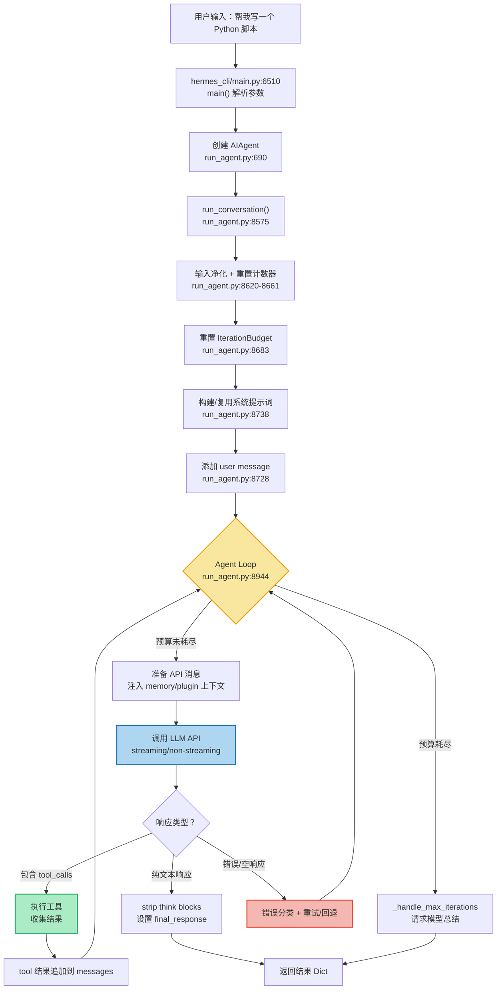
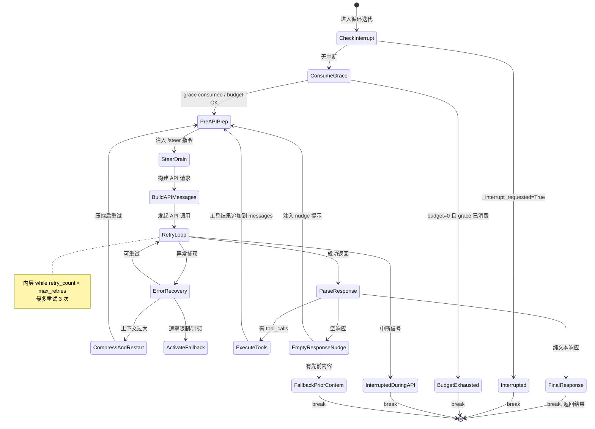
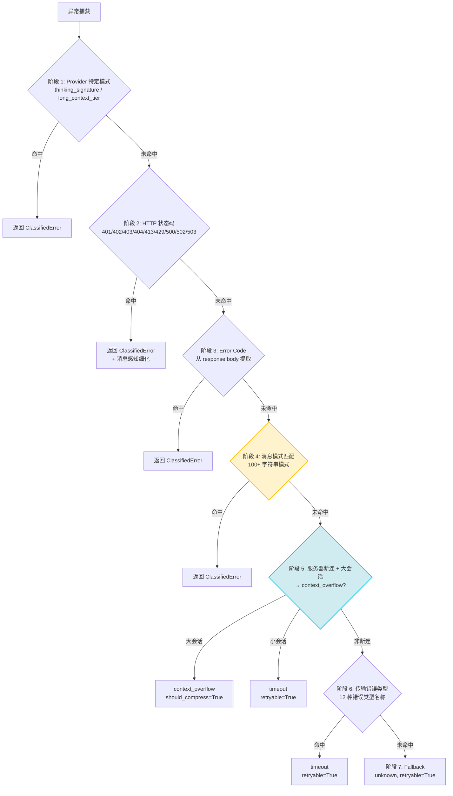

# 第三章：一次请求的旅程

> 当用户输入"帮我写一个 Python 脚本"时，Hermes 内部发生了什么？

这个问题看似简单，答案却横跨从入口函数到模型调用、工具执行、错误恢复的整条链路。本章将用一次完整请求的端到端追踪来建立直觉，然后深入 Agent Loop 的核心机制，最后剖析错误恢复与重试策略。读完本章，你将理解 Hermes 如何在一个 `while` 循环中编排出一个具备自主决策能力的智能体。

---

## 3.1 端到端追踪

让我们从用户按下回车键的那一刻开始，追踪"帮我写一个 Python 脚本"这条消息的完整生命周期。

### 3.1.1 从命令行到 AIAgent

一切始于 `pyproject.toml` 中注册的入口点：

```python
# pyproject.toml:118
hermes = "hermes_cli.main:main"
```

用户执行 `hermes` 命令后，`main()` 函数启动（`hermes_cli/main.py:6510`），解析命令行参数，创建 `AIAgent` 实例，并在交互循环中等待用户输入。当用户键入消息后，CLI 层调用 `agent.run_conversation(user_message)` 将控制权交给 Agent 核心。

`AIAgent` 的构造函数接受 61 个参数（`run_agent.py:708-770`），涵盖了模型选择、工具配置、回调注入、预算控制等方方面面。这个数字本身就暗示了 God Object 的问题（后文 P-03-01 详述），但从功能角度看，这 61 个参数构成了 Agent 运行时的完整配置空间：

```python
# run_agent.py:708-719（摘录关键参数）
def __init__(
    self,
    base_url: str = None,
    api_key: str = None,
    provider: str = None,
    model: str = "",
    max_iterations: int = 90,  # Default tool-calling iterations
    tool_delay: float = 1.0,
    enabled_toolsets: List[str] = None,
    # ... 54 more parameters
):
```

其中 `max_iterations=90` 是父 Agent 的默认迭代上限。子 Agent（通过 delegation 创建）的默认上限则是 50（`run_agent.py:208-212`）。这两个数字之间的关系——以及它们如何被 `IterationBudget` 管理——是 3.3 节的核心议题。

### 3.1.2 run_conversation：一次对话回合的起点

`run_conversation`（`run_agent.py:8575`）是每次对话回合的总控方法。它的签名揭示了设计意图——不仅接受当前消息，还接受完整的对话历史和流式回调：

```python
# run_agent.py:8575-8582
def run_conversation(
    self,
    user_message: str,
    system_message: str = None,
    conversation_history: List[Dict[str, Any]] = None,
    task_id: str = None,
    stream_callback: Optional[callable] = None,
    persist_user_message: Optional[str] = None,
) -> Dict[str, Any]:
```

进入 `run_conversation` 后，第一件事并不是调用模型，而是一系列防御性准备工作。

**第一步：恢复主运行时 + 输入净化**。如果上一轮切换到了 fallback 提供商，先恢复到主提供商（`run_agent.py:8615`）。然后清洗输入中的孤立代理字符（`run_agent.py:8620-8621`）和泄露的 `<memory-context>` 标签（`run_agent.py:8625-8633`）——前者来自富文本编辑器的粘贴，后者是 Honcho `saveMessages` 持久化后的"回流"。

**第二步：重置重试计数器**。每个对话回合都是独立的——上一轮的错误状态不应污染这一轮：

```python
# run_agent.py:8649-8661
# Reset retry counters and iteration budget at the start of each turn
self._invalid_tool_retries = 0
self._invalid_json_retries = 0
self._empty_content_retries = 0
self._incomplete_scratchpad_retries = 0
self._codex_incomplete_retries = 0
self._thinking_prefill_retries = 0
self._post_tool_empty_retried = False
```

七个计数器对应七种生产环境中的真实故障模式：无效工具名、畸形 JSON、空响应体等。

**第三步：连接健康检查 + 重置迭代预算**。先检测并清理上一轮遗留的僵尸 TCP 连接（`run_agent.py:8661-8673`），然后重置迭代预算：

```python
# run_agent.py:8683
self.iteration_budget = IterationBudget(self.max_iterations)
```

每次调用 `run_conversation` 都会创建一个全新的 `IterationBudget`，这意味着**每个对话回合都有独立的 90 次迭代预算**。子 Agent 的预算是独立的（默认 50 次），不会从父 Agent 的预算中扣减。

**第四步：构建系统提示词**。首次调用时构建并缓存（`run_agent.py:8738-8749`），后续复用缓存版本以保持 Anthropic prompt cache 的前缀稳定性。Gateway 场景从 session DB 加载（`run_agent.py:8751-8755`）而非重建。具体组装逻辑是第五章的主题。

**第五步：添加用户消息并进入主循环**。

```python
# run_agent.py:8728-8731
user_msg = {"role": "user", "content": user_message}
messages.append(user_msg)
current_turn_user_idx = len(messages) - 1
```

`current_turn_user_idx` 记录了用户消息的位置索引，后续构建 API 消息时会在此位置注入 memory 和 plugin 上下文（`run_agent.py:9069-9080`），但只修改 API 副本，不触碰原始 `messages`。至此，控制流进入 Agent Loop。

### 3.1.3 端到端请求流程

下面的流程图展示了用户消息从输入到最终响应的完整路径：



这张图的核心是中间的黄色菱形——Agent Loop。模型每次返回 tool calls，循环就继续；返回纯文本，循环就结束。这种"循环直到模型说停"的模式，是 Hermes 作为 Agent 系统的根本特征。

### 3.1.4 API 消息构建：双视图架构

进入 Agent Loop 后、发起 API 调用前，Hermes 将内部 `messages` 列表转换为 API 可接受的 `api_messages` 列表（`run_agent.py:9060-9181`）。这个转换包括四步：注入 memory/plugin 临时上下文到用户消息副本（`run_agent.py:9069-9080`）；剥离 `reasoning`、`finish_reason` 等内部字段（`run_agent.py:9090-9098`）以避免 Mistral 等严格 API 的 422 错误；为 Anthropic 端点注入 `cache_control` 断点降低约 75% 的输入 token 成本（`run_agent.py:9137-9142`）；修复孤立 tool 结果并规范化 JSON 格式（`run_agent.py:9144-9181`）确保 bit 级别前缀一致以最大化 KV 缓存复用。

这种"双视图"架构解决了一个根本矛盾：**内部需要丰富的元数据，而 API 需要干净的标准格式**。

---

## 3.2 Agent Loop：while 循环与隐式状态机

### 3.2.1 循环条件：三重守卫

Agent Loop 的入口是一行信息密度极高的 `while` 语句：

```python
# run_agent.py:8944
while (api_call_count < self.max_iterations
       and self.iteration_budget.remaining > 0
       ) or self._budget_grace_call:
```

这行代码包含三个条件通过 `or` 连接：

1. **`api_call_count < self.max_iterations`**：本地计数器未超限。即使 `IterationBudget` 异常，本地计数器也能阻止无限循环——两个独立机制保护同一个不变量。
2. **`self.iteration_budget.remaining > 0`**：线程安全的全局预算（`run_agent.py:202`）尚有余额。
3. **`self._budget_grace_call`**：恩赐调用标志。设计意图是当前两个条件都为 `False` 时让循环再执行一次。

Python 中 `and` 优先于 `or`，所以求值顺序是 `(A and B) or C`——前两个条件构成"正常预算"守卫，grace call 是独立的旁路通道。**然而，如 3.3.3 节分析，`_budget_grace_call` 从未被设为 `True`，这是死代码**。实际的循环终止完全由前两个条件控制。

### 3.2.2 隐式状态机

在正式的状态机理论中，状态转换应该是显式的——每个状态有明确的进入条件、动作和退出条件。但 Hermes 的 Agent Loop 采用了一种更"有机"的方式：**一个 `while` 循环 + 多个 `break` 条件**。这构成了一个隐式状态机，其状态转换散布在超过 1000 行代码中。

通过系统性地搜索所有 `break` 语句和 `_turn_exit_reason` 赋值，我们可以重构出这个状态机的完整形态：



让我们逐一分析这些状态转换。

### 3.2.3 Break 条件全览

**条件 1：用户中断（Interrupt）**

```python
# run_agent.py:8949-8954
if self._interrupt_requested:
    interrupted = True
    _turn_exit_reason = "interrupted_by_user"
    if not self.quiet_mode:
        self._safe_print("\n⚡ Breaking out of tool loop due to interrupt...")
    break
```

这是循环体中最先检查的条件——在任何 API 调用之前。`_interrupt_requested` 标志由外部线程设置（例如用户发送了新消息），Agent 每次迭代开始时检查它。不使用 `signal.SIGINT` 是因为 Agent Loop 可能运行在非主线程中（Gateway 场景），而 Python 信号处理只能在主线程注册。

**条件 2：预算耗尽（Budget Exhausted）**

```python
# run_agent.py:8963-8969
if self._budget_grace_call:
    self._budget_grace_call = False  # grace consumed
elif not self.iteration_budget.consume():
    _turn_exit_reason = "budget_exhausted"
    if not self.quiet_mode:
        self._safe_print(f"\n⚠️  Iteration budget exhausted ...")
    break
```

注意 `if/elif` 的结构：grace call 分支有更高优先级。如果 grace 标志为 `True`，消费标志但不 break；否则尝试消费预算，消费失败则 break。然而如 3.3.3 节分析，`_budget_grace_call` 从未被激活，`if` 分支是死代码——实际执行总是走 `elif` 分支。

**条件 3：纯文本响应（Text Response = Final Answer）**

```python
# run_agent.py:11381-11383, 11502-11505
# No tool calls - this is the final response
final_response = assistant_message.content or ""
# ...（strip think blocks, build message, etc.）
_turn_exit_reason = f"text_response(finish_reason={finish_reason})"
break
```

这是最常见的正常退出路径。模型返回不包含 `tool_calls` 的响应时，Hermes 清理 `<think>` 标签、弹出 thinking-prefill 消息（避免违反角色交替规则），然后将最终消息追加到历史中。

**条件 4：API 调用中中断**

```python
# run_agent.py:10829-10831
if interrupted:
    _turn_exit_reason = "interrupted_during_api_call"
    break
```

处理 API 调用期间的中断。`_interruptible_streaming_api_call` 抛出 `InterruptedError`，被内层捕获后设置 `interrupted=True`（`run_agent.py:9927-9938`），会话状态被保存。

**条件 5：重试耗尽无响应**

```python
# run_agent.py:10856-10860
if response is None:
    _turn_exit_reason = "all_retries_exhausted_no_response"
    print(f"❌ All API retries exhausted with no successful response.")
    break
```

所有重试（默认 3 次）都失败后，`response` 仍为 `None`，循环必须终止以防后续代码崩溃。

**条件 6：接近上限时的错误**

```python
# run_agent.py:11726-11733
if api_call_count >= self.max_iterations - 1:
    _turn_exit_reason = f"error_near_max_iterations({error_msg[:80]})"
    final_response = f"I apologize, but I encountered repeated errors: {error_msg}"
    break
```

当 API 调用次数接近上限（`max_iterations - 1`）且遇到错误时，直接退出而非继续重试。这是一个防止"在最后几次迭代中反复出错消耗预算"的安全阀。与条件 2（预算耗尽）不同，这里是在出错后主动放弃，而非预算自然耗尽。

**条件 7：部分流恢复 / 先前内容回退**

```python
# run_agent.py:11402-11416
# Partial stream recovery
_turn_exit_reason = "partial_stream_recovery"
final_response = _recovered
break

# run_agent.py:11429-11442
# Fallback to prior turn content
_turn_exit_reason = "fallback_prior_turn_content"
final_response = self._strip_think_blocks(fallback).strip()
break
```

当模型返回空响应时，Hermes 不会立即放弃，而是启动三层回退机制。

**第一层：部分流恢复**（`run_agent.py:11399-11416`）。如果流式传输在连接中断前已经向客户端发送了有意义的文本，直接使用已发送的内容作为最终响应——用户已经在屏幕上看到了这些内容，重新生成只会造成重复。

**第二层：先前内容回退**（`run_agent.py:11428-11442`）。如果上一轮迭代中模型生成了有意义的内容（例如"好的，已经完成！"）然后调用了 memory 工具保存记忆，memory 执行后模型返回空——此时上一轮的内容就是实际的最终答案。但有一个重要限定（`run_agent.py:11422-11427`）：只有当所有工具调用都是"管家类"（memory、todo 等）时才使用先前内容。如果调用了 terminal、search_files 等实质性工具，先前文本可能只是"我来查看一下目录..."这样的中间叙述，不应作为最终答案。

**第三层：Post-tool nudge**（`run_agent.py:11444-11487`）。如果前两层都不适用，Hermes 向模型注入一条 nudge 提示要求继续推理——这是为弱模型（mimo-v2-pro、GLM-5 等）在工具结果后返回空的场景设计的（#9400）。

### 3.2.4 内层重试循环与双层结构

外层 Agent Loop 内嵌套着内层重试循环（`run_agent.py:9238`，`max_retries=3`）。两者的关系是：**外层循环**每次迭代 = 一次完整的"API 调用 → 响应处理 → 工具执行"周期，由迭代预算控制；**内层循环**每次迭代 = 一次 API 调用尝试，由重试计数器控制。外层预算只计一次——`api_call_count` 在进入内层前已自增（`run_agent.py:8956`），不受内层重试次数影响。

Hermes 在内层循环中优先选择流式传输路径（`run_agent.py:9318-9356`），即使没有流式消费者——streaming 提供 90 秒过时流检测和 60 秒读超时，防止连接挂死。

### 3.2.5 隐式状态机的代价

这些 break 条件分散在超过 1000 行代码中（从 `run_agent.py:8944` 到约 `run_agent.py:11734`），形成了一个隐式状态机。`_turn_exit_reason` 字符串的存在本身就是一个信号——**开发者自己也需要一种方式来追踪"循环到底是怎么退出的"**。如果状态机是显式的，退出原因就是状态转换本身，不需要额外的诊断字段。

`_turn_exit_reason` 初始化为 `"unknown"`（`run_agent.py:8903`），在每个退出路径中被覆盖——如果最终仍是 `"unknown"`，意味着出现了未预期的退出路径。这种隐式设计在 break 条件只有 2-3 个时清晰高效，但增长到 10+ 个后，认知负担急剧上升（P-03-02）。

---

## 3.3 迭代预算与 Grace Call

### 3.3.1 IterationBudget：线程安全的计数器

`IterationBudget` 类（`run_agent.py:202`）是一个简洁的抽象：

```python
# run_agent.py:202-219
class IterationBudget:
    """Thread-safe iteration counter for an agent.

    Each agent (parent or subagent) gets its own ``IterationBudget``.
    The parent's budget is capped at ``max_iterations`` (default 90).
    Each subagent gets an independent budget capped at
    ``delegation.max_iterations`` (default 50) — this means total
    iterations across parent + subagents can exceed the parent's cap.
    """

    def __init__(self, max_total: int):
        self.max_total = max_total
        self._used = 0
```

注释中明确说明了一个重要的设计决策：**父子 Agent 的预算是独立的**。父 Agent 有 90 次迭代预算，每个子 Agent 有 50 次（`run_agent.py:208-212`），它们之间不存在"消费共享池"的关系。这意味着一个父 Agent 如果派生 3 个子 Agent，理论上总迭代次数可达 90 + 3 × 50 = 240 次。

这个设计选择的 Why 是什么？答案在于**可预测性**。如果父子共享预算，那么子 Agent 的复杂度直接影响父 Agent 的可用迭代次数，用户无法预估自己的请求能否完成。独立预算让每个层级的行为更加确定。

但独立预算也意味着成本控制的挑战。想象一个场景：用户请求"重构整个项目"，模型决定为每个模块派生一个子 Agent。如果项目有 10 个模块，总迭代次数可达 90 + 10 × 50 = 590 次，远超父 Agent 的 90 次上限。`delegation.max_iterations` 配置项（`run_agent.py:208`）是对此的缓解——用户可以通过 `config.yaml` 降低子 Agent 的上限。子 Agent 创建时，`max_iterations` 从 `function_args` 中传递（`run_agent.py:7607`），而非使用父 Agent 的默认值。

`IterationBudget` 还提供了 `refund()` 方法，用于退还不应计入预算的迭代。例如 `execute_code`（程序化工具调用）的迭代会被退还（`run_agent.py:202-215` 注释说明），因为这些迭代是用户代码驱动的，不应消耗 Agent 的自主决策预算。上下文压缩后重启的迭代也会被退还（`run_agent.py:10834-10835`），因为压缩是系统行为，不是 Agent 的决策消耗。

### 3.3.2 预算耗尽处理：信息隐藏与强制总结

预算耗尽处理的设计理念记录在一段注释中，这段注释的价值远超其代码行数：

```python
# run_agent.py:1011-1018
# Iteration budget: the LLM is only notified when it actually exhausts
# the iteration budget (api_call_count >= max_iterations).  At that
# point we inject ONE message, allow one final API call, and if the
# model doesn't produce a text response, force a user-message asking
# it to summarise.  No intermediate pressure warnings — they caused
# models to "give up" prematurely on complex tasks (#7915).
self._budget_exhausted_injected = False
self._budget_grace_call = False
```

这段注释有两个关键信息：

**第一，模型不知道自己有预算限制**——直到预算真正耗尽。issue #7915 记录了一个真实的问题：当模型收到"你还剩 N 次迭代"的中间压力警告时，它倾向于过早放弃复杂任务——在第 60 次迭代看到"还剩 30 次"就开始草草总结。解决方案是**信息隐藏**：模型一直认为自己有无限预算，直到真正耗尽才被告知。

**第二，耗尽时注入总结请求**——`_handle_max_iterations` 方法（`run_agent.py:8406`）负责这一步：

```python
# run_agent.py:8406-8415
def _handle_max_iterations(self, messages: list, api_call_count: int) -> str:
    """Request a summary when max iterations are reached."""
    print(f"⚠️  Reached maximum iterations ({self.max_iterations}). Requesting summary...")

    summary_request = (
        "You've reached the maximum number of tool-calling iterations allowed. "
        "Please provide a final response summarizing what you've found and "
        "accomplished so far, without calling any more tools."
    )
    messages.append({"role": "user", "content": summary_request})
```

这个方法注入指令后发起一次**不提供工具定义**的 API 调用——模型物理上无法产出 tool_calls，比指令中的否定语句（"不要调用工具"）更可靠。

### 3.3.3 Grace Call：死代码分析（P-03-03）

`while` 循环条件中的 `self._budget_grace_call`（`run_agent.py:8944`）和对应的消费逻辑（`run_agent.py:8963-8964`）构成了一个 Grace Call 机制的**骨架**——当预算耗尽时允许额外一次迭代。

然而，通过全文搜索 `run_agent.py`，我们发现 `_budget_grace_call` **从未被设置为 `True`**。它在 `__init__` 中初始化为 `False`，在循环入口处被消费（重置为 `False`），但没有任何代码路径将它激活。这意味着 `while` 循环条件中的 `or self._budget_grace_call` 分支**永远为 False**——这是经典的死代码。

循环入口的消费逻辑同样是死代码：

```python
# run_agent.py:8963-8964
if self._budget_grace_call:
    self._budget_grace_call = False  # grace consumed — 永远不会执行
```

从注释的历史痕迹推测，Grace Call 可能曾在早期版本中被激活——当预算耗尽检测逻辑触发时设置 `_budget_grace_call = True`。但在后续的重构中，激活路径被移除或替换为直接调用 `_handle_max_iterations`，而骨架代码被遗忘了。

这不是一个功能缺陷，而是一个代码卫生问题：死代码增加了阅读者的认知负担（本章 3.2.1 节对 Grace Call 的分析本身就是一个例证），并可能误导后续开发者认为该机制是活跃的。

---

## 3.4 回调机制：一个 AIAgent，三种场景

### 3.4.1 回调清单

`AIAgent.__init__` 接受 11 个回调参数（`run_agent.py:736-746`）：

```python
# run_agent.py:736-746
tool_progress_callback: callable = None,
tool_start_callback: callable = None,
tool_complete_callback: callable = None,
thinking_callback: callable = None,
reasoning_callback: callable = None,
clarify_callback: callable = None,
step_callback: callable = None,
stream_delta_callback: callable = None,
interim_assistant_callback: callable = None,
tool_gen_callback: callable = None,
status_callback: callable = None,
```

这些回调的 Why 可以归结为一个核心需求：**同一个 AIAgent 类需要适配 CLI、Gateway、Batch 三种运行场景**。不同场景对"Agent 正在做什么"的展示方式完全不同：

| 回调 | CLI 场景 | Gateway 场景 | Batch 场景 |
|------|----------|-------------|-----------|
| `thinking_callback` | 显示思考动画 | 发送"正在思考"状态 | 忽略 |
| `stream_delta_callback` | 逐字显示响应 | 推送 SSE 事件 | 忽略 |
| `tool_start_callback` | 打印"正在执行工具" | 发送工具开始事件 | 忽略 |
| `tool_complete_callback` | 打印工具结果摘要 | 发送工具完成事件 | 记录到日志 |
| `step_callback` | 不使用 | 发送 `agent:step` 事件 | 不使用 |
| `clarify_callback` | 弹出交互式问答 | 通过 API 返回问题 | 返回错误 |
| `status_callback` | 打印状态消息 | 发送状态事件 | 忽略 |
| `interim_assistant_callback` | 预览中间内容 | 推送部分响应 | 忽略 |

### 3.4.2 step_callback 的实现

`step_callback` 在每次 API 调用前触发（`run_agent.py:8971-8997`），携带上一轮工具调用的摘要：

```python
# run_agent.py:8971-8995
# Fire step_callback for gateway hooks (agent:step event)
if self.step_callback is not None:
    try:
        prev_tools = []
        for _idx, _m in enumerate(reversed(messages)):
            if _m.get("role") == "assistant" and _m.get("tool_calls"):
                # ... collect tool names, results, arguments
                prev_tools = [
                    {
                        "name": tc["function"]["name"],
                        "result": _results_by_id.get(tc.get("id")),
                        "arguments": tc["function"].get("arguments"),
                    }
                    for tc in _m["tool_calls"]
                    if isinstance(tc, dict)
                ]
                break
        self.step_callback(api_call_count, prev_tools)
    except Exception as _step_err:
        logger.debug("step_callback error ...")
```

代码从 `messages` 末尾向前扫描找到最近的 assistant tool_calls，再从后续 tool 消息中收集结果。异常被吞掉（仅 debug 日志），体现了回调设计的原则：**观察者的失败不应影响被观察者**。

### 3.4.3 clarify_callback 的特殊性

在 11 个回调中，`clarify_callback` 是唯一一个**双向**的——它不仅通知外部，还需要接收外部的输入（用户对问题的回答）。这使得它成为 Agent 与环境之间唯一的同步交互点。

注释说得很清楚（`run_agent.py:797-798`）：

```python
# clarify_callback (callable): Callback function(question, choices) -> str
# for interactive user questions.
# Provided by the platform layer (CLI or gateway). If None, the clarify
# tool returns an error.
```

如果 `clarify_callback` 为 `None`（Batch 模式），clarify 工具直接返回错误。模型收到错误后会转而根据已有信息判断——通过工具反馈塑造行为，比在系统提示词中硬编码"不要提问"更可靠。

---

## 3.5 错误恢复与重试

### 3.5.1 错误分类器：结构化错误处理

在主循环的内层，每次 API 调用都被 `try/except` 包裹。当异常发生时，Hermes 不会简单地重试——它首先通过 `classify_api_error`（`agent/error_classifier.py:242`）对错误进行结构化分类。

`error_classifier.py` 是一个 834 行的独立模块，开头的 docstring 说明了它的定位：

```python
# agent/error_classifier.py:1-9
"""API error classification for smart failover and recovery.

Provides a structured taxonomy of API errors and a priority-ordered
classification pipeline that determines the correct recovery action
(retry, rotate credential, fallback to another provider, compress
context, or abort).

Replaces scattered inline string-matching with a centralized classifier
that the main retry loop in run_agent.py consults for every API failure.
"""
```

### 3.5.2 FailoverReason 枚举：14 种错误类型

错误分类的输出是一个 `FailoverReason` 枚举值（`agent/error_classifier.py:24-57`），定义了 14 种错误类型：

```python
# agent/error_classifier.py:24-57（精简）
class FailoverReason(enum.Enum):
    auth = "auth"                        # 401/403 — rotate credential
    auth_permanent = "auth_permanent"    # Auth failed after refresh — abort
    billing = "billing"                  # 402 — rotate immediately
    rate_limit = "rate_limit"            # 429 — backoff then rotate
    overloaded = "overloaded"            # 503/529 — backoff
    server_error = "server_error"        # 500/502 — retry
    timeout = "timeout"                  # Connection timeout — rebuild + retry
    context_overflow = "context_overflow"  # Too large — compress
    payload_too_large = "payload_too_large"  # 413 — compress payload
    model_not_found = "model_not_found"  # 404 — fallback model
    format_error = "format_error"        # 400 bad request — abort
    thinking_signature = "thinking_signature"  # Anthropic specific
    long_context_tier = "long_context_tier"    # Anthropic specific
    unknown = "unknown"                  # Catch-all — retry
```

每种错误类型对应的恢复策略编码在 `ClassifiedError` 数据类中（`agent/error_classifier.py:63-79`）：

```python
# agent/error_classifier.py:63-79
@dataclass
class ClassifiedError:
    reason: FailoverReason
    status_code: Optional[int] = None
    message: str = ""

    # Recovery action hints
    retryable: bool = True
    should_compress: bool = False
    should_rotate_credential: bool = False
    should_fallback: bool = False
```

四个布尔字段构成恢复动作矩阵——主循环只需检查标志来决定行动，无需重新分析错误本身。这种"分类器产出策略标志，调用方按标志行动"的模式，是关注点分离的典范：

- `rate_limit`：`retryable=True, should_fallback=True` — 先退避重试，若有备用提供商则切换
- `context_overflow`：`retryable=True, should_compress=True` — 压缩上下文后重试
- `auth_permanent`：`retryable=False` — 不可恢复，直接终止
- `billing`：`retryable=False, should_rotate_credential=True, should_fallback=True` — 换凭证或换提供商

以一个典型场景为例：用户在长对话中发送消息，OpenRouter 返回 HTTP 429 错误，消息体包含 `"rate limit exceeded, try again in 30s"`。分类管道依次检查：阶段 1（非 Anthropic 特定模式）跳过；阶段 2（HTTP 429）命中——但 429 需要进一步细化，是真正的速率限制还是计费问题？分类器检查 `_BILLING_PATTERNS`（均不匹配），确认为 `rate_limit`。主循环收到 `should_fallback=True`，检查 fallback chain 是否有可用的备用提供商（`run_agent.py:10358-10371`）：如果有，立即切换而非等待 30 秒；如果没有，退避等待后重试。

### 3.5.3 七阶段分类管道

`classify_api_error` 函数（`agent/error_classifier.py:242-415`）实现了一个七阶段优先级管道。每个阶段只在前一阶段未命中时执行：

```python
# agent/error_classifier.py:242-270（管道结构概览）
def classify_api_error(error, *, provider="", model="", ...):
    """Priority-ordered pipeline:
      1. Special-case provider-specific patterns (thinking sigs, tier gates)
      2. HTTP status code + message-aware refinement
      3. Error code classification (from body)
      4. Message pattern matching (billing vs rate_limit vs context vs auth)
      5. Server disconnect + large session → context overflow
      6. Transport error heuristics
      7. Fallback: unknown (retryable with backoff)
    """
```



阶段 1 将 Anthropic thinking signature 错误（HTTP 400）放在最高优先级——否则它会被阶段 2 归类为不可重试的 `format_error`，而实际上只需清除 thinking 缓存即可重试。

**阶段 5** 的启发式推理尤为精妙。当服务器断连发生在大会话中时，Hermes 推断为上下文溢出而非简单超时：

```python
# agent/error_classifier.py:398-407
is_disconnect = any(p in error_msg for p in _SERVER_DISCONNECT_PATTERNS)
if is_disconnect and not status_code:
    is_large = (approx_tokens > context_length * 0.6
                or approx_tokens > 120000
                or num_messages > 200)
    if is_large:
        return _result(
            FailoverReason.context_overflow,
            retryable=True,
            should_compress=True,
        )
    return _result(FailoverReason.timeout, retryable=True)
```

洞察是：许多本地推理服务器（vLLM、llama.cpp、Ollama）在上下文溢出时直接断开连接而非返回结构化错误码。阶段 5 必须在阶段 6（通用传输错误）之前（`agent/error_classifier.py:392-396`）：否则 `RemoteProtocolError` 总是映射为 `timeout`，无法触发上下文压缩。

### 3.5.4 模式匹配的规模

阶段 4 的消息模式匹配依赖于 6 组字符串模式列表：

| 模式组 | 源码位置 | 模式数量 | 示例 |
|--------|----------|---------|------|
| `_BILLING_PATTERNS` | `error_classifier.py:89-100` | 10 | `"insufficient credits"`, `"payment required"` |
| `_RATE_LIMIT_PATTERNS` | `error_classifier.py:103-119` | 15 | `"rate limit"`, `"too many requests"`, `"throttled"` |
| `_CONTEXT_OVERFLOW_PATTERNS` | `error_classifier.py:150-183` | 27 | `"context length"`, `"超过最大长度"`, `"上下文长度"` |
| `_MODEL_NOT_FOUND_PATTERNS` | `error_classifier.py:186-195` | 8 | `"model not found"`, `"unsupported model"` |
| `_AUTH_PATTERNS` | `error_classifier.py:198-209` | 8 | `"invalid api key"`, `"access denied"` |
| `_TRANSPORT_ERROR_TYPES` | `error_classifier.py:216-226` | 12 | `"ReadTimeout"`, `"APIConnectionError"` |

总计超过 100 个模式，涵盖中文错误消息（`"超过最大长度"`，`error_classifier.py:176-178`）、AWS Bedrock（`"throttlingexception"`）、DashScope（`"rate increased too quickly"`）等多提供商特有格式。分类前，错误消息从多个来源合成（`agent/error_classifier.py:278-317`）：`str(error)`、响应体 `error.message`、OpenRouter `metadata.raw` 内嵌错误，确保 SDK 只暴露部分信息时仍能准确匹配。

### 3.5.5 退避策略：Jittered Backoff

当错误被分类为可重试（`retryable=True`）后，Hermes 使用 `jittered_backoff`（`agent/retry_utils.py:19-57`）计算等待时间：

```python
# agent/retry_utils.py:19-57
def jittered_backoff(
    attempt: int,
    *,
    base_delay: float = 5.0,
    max_delay: float = 120.0,
    jitter_ratio: float = 0.5,
) -> float:
```

退避延迟的计算公式是：`delay = min(base_delay * 2^(attempt-1), max_delay) + uniform(0, jitter_ratio * delay)`。

默认参数下的退避序列：
- 第 1 次重试：5s + jitter(0, 2.5s) = 5.0~7.5s
- 第 2 次重试：10s + jitter(0, 5.0s) = 10.0~15.0s
- 第 3 次重试：20s + jitter(0, 10.0s) = 20.0~30.0s

Jitter 通过 `time.time_ns() ^ (tick * 0x9E3779B9)` 生成种子（`agent/retry_utils.py:53`），其中 `0x9E3779B9` 是黄金比例的 32 位近似值，`tick` 是锁保护的单调计数器（`agent/retry_utils.py:15-16`），确保并发重试不会对齐。

实际的重试逻辑中，Hermes 会先检查 `Retry-After` 响应头（`run_agent.py:10779-10789`）：

```python
# run_agent.py:10779-10789
if is_rate_limited:
    _resp_headers = getattr(getattr(api_error, "response", None), "headers", None)
    if _resp_headers and hasattr(_resp_headers, "get"):
        _ra_raw = _resp_headers.get("retry-after") or _resp_headers.get("Retry-After")
        if _ra_raw:
            try:
                _retry_after = min(int(_ra_raw), 120)  # Cap at 2 minutes
            except (TypeError, ValueError):
                pass
wait_time = _retry_after if _retry_after else jittered_backoff(retry_count, base_delay=2.0, max_delay=60.0)
```

注意两个细节：`Retry-After` 只在 `is_rate_limited` 条件下检查，非速率限制错误不解析；实际使用的 `base_delay=2.0` 比默认的 `5.0` 更激进，因为 CLI 用户等不了 2 分钟。退避期间以 200ms 间隔轮询中断标志（`run_agent.py:10806-10818`），每 30 秒更新活动时间戳防止 Gateway 超时（`run_agent.py:10821-10826`）。

### 3.5.6 /steer 命令注入

`/steer` 命令注入（`run_agent.py:9005-9016`）允许用户在 Agent 执行过程中改变方向。实现面临的约束是消息角色必须严格交替——不能直接插入 user 消息。解决方案是将 steer 文本"寄生"在已有的 tool 结果消息上：

```python
# run_agent.py:9022-9026
for _si in range(len(messages) - 1, -1, -1):
    _sm = messages[_si]
    if isinstance(_sm, dict) and _sm.get("role") == "tool":
        marker = f"\n\nUser guidance: {_pre_api_steer}"
        # ... append to tool result content
```

这不破坏角色交替规则，但语义上模糊——模型看到的是工具结果后突然出现的 "User guidance"。如果没有可用的 tool 消息，steer 文本被放回 pending 队列等待下次注入。

---

## 3.6 问题清单

### P-03-01 [Arch/Critical] 12K 行单文件：AIAgent 包含所有职责

**What**：`run_agent.py` 包含 12,164 行代码，`AIAgent` 类承担了消息管理、API 调用、工具分发、错误恢复、会话持久化、上下文压缩等所有职责。这是一个典型的 God Object。

**Why**：这种结构是有机增长的结果。早期 Agent 只需要"调用 API → 执行工具 → 循环"的简单逻辑，所有代码放在一个类中是最自然的选择。随着功能叠加（stream 支持、多 provider 适配、错误恢复、grace call、/steer、delegation...），文件膨胀到了当前的规模。

**How (to improve)**：提取内聚的子系统为独立模块。`error_classifier.py` 和 `retry_utils.py` 已经是成功的先例。下一步可以考虑：
- 将主循环中的 API 调用 + 重试逻辑提取为 `APICallExecutor`
- 将响应解析 + 归一化逻辑提取为 `ResponseNormalizer`
- 将工具分发逻辑提取为 `ToolDispatcher`（第九章详述）
- 将消息构建 + 清洗逻辑提取为 `MessageBuilder`

每次提取都应该通过接口（Protocol 类）与 `AIAgent` 解耦，确保提取后的单元可以独立测试。

### P-03-02 [Arch/High] 隐式状态机：while 循环 + break，无显式状态转换

**What**：主循环（`run_agent.py:8944`）通过 10+ 个 `break` 条件实现状态转换，状态散布在超过 1000 行代码中。`_turn_exit_reason` 字符串是对这种隐式性的事后补救。

**Why**：`while` + `break` 是最简单的控制流模式，没有引入额外的抽象层。在早期只有 2-3 个退出条件时，这种方式清晰高效。但随着条件增长到 10+，阅读者必须扫描整个循环体才能理解"循环什么时候会退出"。

**How (to improve)**：引入显式状态机。最小可行方案是使用 `enum` + `match/case`：

```python
class LoopState(enum.Enum):
    CHECK_INTERRUPT = auto()
    CONSUME_BUDGET = auto()
    CALL_API = auto()
    PROCESS_RESPONSE = auto()
    EXECUTE_TOOLS = auto()
    HANDLE_ERROR = auto()
    FINAL_RESPONSE = auto()
    TERMINATED = auto()

state = LoopState.CHECK_INTERRUPT
while state != LoopState.TERMINATED:
    match state:
        case LoopState.CHECK_INTERRUPT:
            if self._interrupt_requested:
                state = LoopState.TERMINATED
            else:
                state = LoopState.CONSUME_BUDGET
        # ... each state handler is a small, testable function
```

更完整的方案可以使用 `transitions` 库或自定义状态机框架，但对于 Hermes 的规模，`enum` + `match/case` 足以提供显式性而不引入过度抽象。

### P-03-03 [Arch/Low] Grace Call 死代码：机制骨架存在但从未激活

**What**：`_budget_grace_call` 标志在 `__init__` 中初始化为 `False`（`run_agent.py:1018`），在 `while` 循环条件（`run_agent.py:8944`）和消费逻辑（`run_agent.py:8963-8964`）中被引用，但**从未被设置为 `True`**。整个 Grace Call 机制是死代码。

**Why**：推测在早期版本中，预算耗尽时会设置 `_budget_grace_call = True` 允许额外一次迭代。后续重构将耗尽处理改为直接调用 `_handle_max_iterations`，但遗留了骨架代码。

**How (to improve)**：删除死代码。移除 `_budget_grace_call` 属性及其所有引用，简化 `while` 循环条件为 `while api_call_count < self.max_iterations and self.iteration_budget.remaining > 0`。这不改变任何运行时行为，但显著降低循环条件的认知复杂度。

### P-03-04 [Perf/Medium] 100+ 字符串模式顺序匹配

**What**：`error_classifier.py` 使用 100+ 个字符串模式进行 `in` 操作符匹配，每个模式 O(m) 扫描整个错误消息。

**Why**：字符串模式匹配（`pattern in error_msg`）是最简单、最可读的实现方式。每个模式一目了然，无需理解复杂的匹配引擎。

**Impact**：当前影响可忽略——错误分类只在 API 调用失败时触发（每秒最多几次），100 个 O(m) 的 `in` 检查在现代 CPU 上几乎没有延迟。但如果模式数量增长到 1000+（例如支持更多云服务商的特定错误），可能需要优化。

**How (to improve)**：
1. **Aho-Corasick 多模式匹配**：将所有模式构建为一个自动机，单次 O(m) 扫描即可匹配所有模式。Python 有 `ahocorasick` 库。
2. **模式预编译 + 缓存**：将字符串模式编译为正则表达式，使用 `re.compile` 缓存编译结果。
3. **分层匹配**：先用 HTTP 状态码缩小候选范围（已部分实现），再对候选范围内的模式进行匹配。

### P-03-05 [Rel/Medium] 退避策略对 Rate-Limit 头的利用不完整

**What**：`retry_utils.py:19-57` 使用固定指数退避 + 抖动，仅在 `is_rate_limited` 条件下解析 `Retry-After` 头（`run_agent.py:10779-10789`），且不解析 `X-RateLimit-Reset` 等更精确的速率限制头。

**Why**：不同提供商的速率限制头格式各异（`Retry-After` 秒数 vs. HTTP 日期、`X-RateLimit-Reset` Unix 时间戳、`X-RateLimit-Remaining` 剩余次数...），统一解析的开发成本较高。固定退避是更稳健的通用方案。

**How (to improve)**：

在 `ClassifiedError` 中增加可选的 `retry_after_seconds` 字段，由分类器在提取 HTTP 头时填充：

```python
@dataclass
class ClassifiedError:
    # ... existing fields
    retry_after_seconds: Optional[float] = None  # From Retry-After header

def classify_api_error(error, ...):
    # ... existing pipeline
    retry_after = _parse_retry_after_header(error)
    return _result(reason, retry_after_seconds=retry_after, ...)
```

然后在重试循环中优先使用 `classified.retry_after_seconds`，仅在其为 `None` 时回退到 `jittered_backoff`。这将 Retry-After 的解析从主循环移入分类器，保持了关注点分离。

---

## 3.7 本章小结

回到开篇的问题：当用户输入"帮我写一个 Python 脚本"时，Hermes 内部发生了什么？

答案现在清晰了。一条用户消息要经历**四个阶段**：

1. **准备阶段**：输入净化、计数器重置、预算初始化、连接健康检查、系统提示词构建。这些看似琐碎的操作，实际上在防御前一回合的状态泄露（`run_agent.py:8649-8661`）、环境异常（代理字符、broken pipes、僵尸连接），以及确保 prompt cache 的前缀稳定性。每一行代码都对应着一个生产环境中真实发生过的故障。

2. **循环阶段**：在 `while` 循环（`run_agent.py:8944`）中，消息列表被转换为 API 视图（注入上下文、清理内部字段、应用 cache control），然后调用 LLM，解析响应——如果包含 tool_calls 则执行工具并继续循环，如果是纯文本则作为最终答案退出。模型通过返回 `tool_calls` 或纯文本来隐式控制循环的继续或终止。这是第一章所述"LLM-as-Control-Plane"设计赌注的直接体现——控制权在模型手中，Hermes 只是执行者。

3. **恢复阶段**：当 API 调用失败时，错误分类器（`agent/error_classifier.py`）通过七阶段管道将异常映射为结构化恢复策略。分类器产出的四个布尔标志（`retryable`、`should_compress`、`should_rotate_credential`、`should_fallback`）驱动主循环的恢复逻辑——重试、凭证轮换、上下文压缩、提供商回退——每种恢复动作都有明确的触发条件和执行路径。

4. **终止阶段**：循环通过 10+ 种 break 条件退出（正常文本响应、用户中断、预算耗尽、重试失败、部分流恢复、先前内容回退等），每种退出路径都记录 `_turn_exit_reason` 用于事后诊断。循环退出后，如果没有 `final_response` 且预算已耗尽，`_handle_max_iterations` 发起一次无工具的 API 调用，强制模型总结。

回顾第一章的四个设计赌注，本章揭示了它们在实现层面的映射：

| 设计赌注 | 本章对应 |
|---------|---------|
| LLM-as-Control-Plane | 主循环由模型响应驱动，模型通过 tool_calls / text 决定下一步 |
| 宽工具面 | 11 个回调 + tool_start/complete 回调支撑工具执行的可观测性 |
| 单对话 Agent 模型 | `IterationBudget` 每回合重置，独立于子 Agent，强化了"一次对话回合"的边界 |
| OpenAI 兼容协议 | 响应归一化横跨 Chat Completions / Codex Responses / Anthropic Messages 三种 API 格式，`api_messages` 的清洗确保兼容性 |

本章也暴露了有机增长的代价：12K 行的单文件（P-03-01）、隐式状态机（P-03-02）、Grace Call 的死代码残留（P-03-03）、100+ 模式的线性匹配（P-03-04）、退避策略的信息浪费（P-03-05）。这些不是"技术债务"——它们是在快速迭代中做出的合理权衡。`while` + `break` 在只有 3 个退出条件时是最简洁的方案；`error_classifier.py` 的提取证明了模块化是可行的演进路径；`in` 操作符的模式匹配在 100 个模式时几乎零延迟。

问题不在于当初的选择是否"错误"，而在于随着系统复杂度的增长，这些选择开始产生可观的认知成本。阅读 1000+ 行的循环体来理解"循环什么时候退出"，不应该是贡献者的日常体验。好消息是，`error_classifier.py` 和 `retry_utils.py` 已经展示了提取路径——将内聚的子系统从 God Object 中剥离为独立模块，通过函数签名而非实例变量来传递依赖。本章分析的每个子系统（API 调用执行、响应归一化、消息构建、工具分发）都可以沿着同样的路径演进。

下一章我们将从 Agent Loop 的"内部"转向"外部"——LLM Provider 层如何适配不同的模型提供商，以及 Hermes 如何在 OpenAI 兼容协议之上构建统一的多模型抽象。
