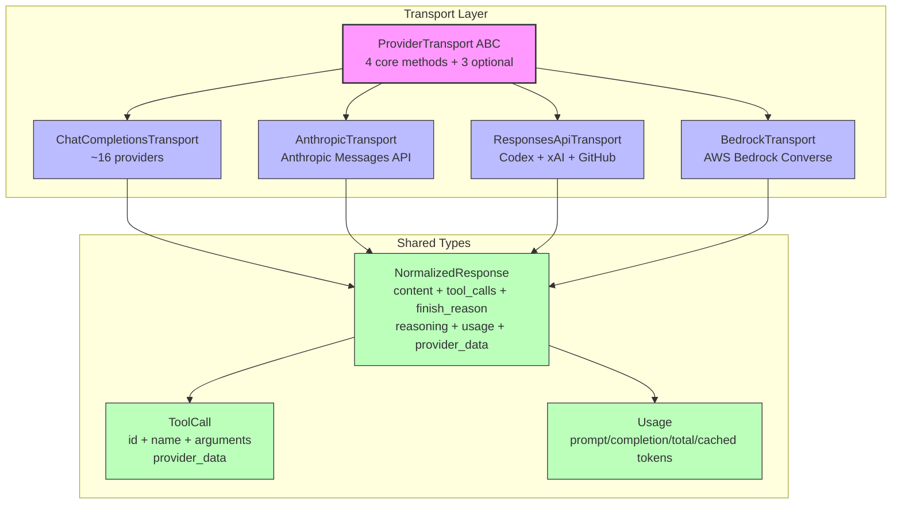
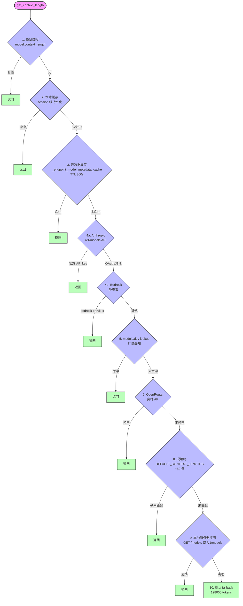

# 第四章 LLM Transport 层：多 Provider 抽象与限制

> **Design Bet:** Run Anywhere（多 Provider 支撑多环境部署）

**开篇问题**：如何用一套代码同时对接 OpenRouter、Anthropic、OpenAI、Mistral 等不同 API？

对于一个真正的"Run Anywhere" Agent，Provider 抽象是生死攸关的基础设施。Hermes 需要在 Anthropic 官方 API、OpenRouter 聚合平台、GitHub Copilot、Ollama 本地服务、AWS Bedrock 企业云之间无缝切换——同一个对话历史、同一套工具定义、同一个会话恢复机制，只是换了个 API endpoint 和认证方式。

这一章我们将深入 Transport 层，看 Hermes 如何用抽象基类 `ProviderTransport` 统一消息格式、响应规范化、缓存策略；也会揭示当前实现的三大限制：if/elif 分支的路由逻辑、硬编码的 Token 估算、不透明的缓存失效边界。

---

## 4.1 Transport 抽象设计

### 4.1.1 ProviderTransport ABC

Hermes 在 `agent/transports/base.py` 中定义了 `ProviderTransport` 抽象基类（90 行），这是所有 Provider 适配器的契约：

```python
# agent/transports/base.py:16-24
class ProviderTransport(ABC):
    """Base class for provider-specific format conversion and normalization."""

    @property
    @abstractmethod
    def api_mode(self) -> str:
        """The api_mode string this transport handles (e.g. 'anthropic_messages')."""
        ...
```

**设计边界**（第 3-7 行明确注释）：

> "It does NOT own: client construction, streaming, credential refresh,
> prompt caching, interrupt handling, or retry logic. Those stay on AIAgent."

Transport 只管**数据路径**的 4 个环节：

1. **convert_messages** (L26-32) — OpenAI 格式 → Provider 原生格式
2. **convert_tools** (L34-40) — OpenAI 工具定义 → Provider 原生 schema
3. **build_kwargs** (L42-57) — 组装完整的 API 调用参数字典
4. **normalize_response** (L59-65) — Provider 原生响应 → `NormalizedResponse` 统一格式

另有 3 个可选方法：

- **validate_response** (L67-73) — 检查响应结构完整性（默认 `return True`）
- **extract_cache_stats** (L75-81) — 提取 Provider 的缓存统计（默认 `return None`）
- **map_finish_reason** (L83-89) — 映射 stop reason 到 OpenAI 语义（默认透传）

### 4.1.2 NormalizedResponse 统一出参

所有 Provider 的响应都被规范化为 `agent/transports/types.py:NormalizedResponse`：

```python
# agent/transports/types.py:52-71
@dataclass
class NormalizedResponse:
    """Normalized API response from any provider.

    Shared fields are truly cross-provider — every caller can rely on
    them without branching on api_mode.  Protocol-specific state goes in
    ``provider_data`` so that only protocol-aware code paths read it.
    """

    content: Optional[str]
    tool_calls: Optional[List[ToolCall]]
    finish_reason: str  # "stop", "tool_calls", "length", "content_filter"
    reasoning: Optional[str] = None
    usage: Optional[Usage] = None
    provider_data: Optional[Dict[str, Any]] = field(default=None, repr=False)
```

**字段规范**：

- **content** — 文本内容（包括 thinking blocks）
- **tool_calls** — 工具调用列表（每个 `ToolCall` 含 id/name/arguments/provider_data）
- **finish_reason** — 停止原因（OpenAI 语义："stop" / "tool_calls" / "length" / "content_filter"）
- **reasoning** — 推理内容（OpenRouter 统一格式、DeepSeek 的 `reasoning_content`）
- **usage** — Token 消耗（prompt_tokens / completion_tokens / total_tokens / cached_tokens）
- **provider_data** — Provider 特有的元数据（Anthropic 的 `reasoning_details`、Codex 的 `codex_reasoning_items`、Gemini 的 `thought_signature`）

### 4.1.3 四大 Transport 实现

Hermes 当前有 4 个具体 Transport：

| Transport | 文件 | 行数 | 负责 Provider |
|-----------|------|------|---------------|
| **ChatCompletionsTransport** | `agent/transports/chat_completions.py` | 387 | OpenRouter, Nous, NVIDIA, Qwen Portal, Ollama, DeepSeek, Kimi, GitHub Models, 自定义 OpenAI 兼容服务（~16 个） |
| **AnthropicTransport** | `agent/transports/anthropic.py` | 135 | Anthropic Messages API（官方 + OAuth） |
| **ResponsesApiTransport** | `agent/transports/codex.py` | 217 | OpenAI Codex Responses API（ChatGPT Plus/Team）、xAI Grok、GitHub Copilot |
| **BedrockTransport** | `agent/transports/bedrock.py` | 154 | AWS Bedrock Converse API |

**架构图**：



---

## 4.2 api_mode 路由与 Provider 检测

### 4.2.1 路由优先级（9 级 Fallback）

`run_agent.py` 的 `__init__` 方法（L852-883）通过 if/elif 链式决策确定 api_mode：

```python
# run_agent.py:852-883
if api_mode in {"chat_completions", "codex_responses", "anthropic_messages", "bedrock_converse"}:
    self.api_mode = api_mode  # 1. 显式指定
elif self.provider == "openai-codex":
    self.api_mode = "codex_responses"  # 2. provider == "openai-codex"
elif self.provider == "xai":
    self.api_mode = "codex_responses"  # 3. provider == "xai"
elif (provider_name is None) and (
    self._base_url_hostname == "chatgpt.com"
    and "/backend-api/codex" in self._base_url_lower
):
    self.api_mode = "codex_responses"  # 4. chatgpt.com/backend-api/codex
    self.provider = "openai-codex"
elif (provider_name is None) and self._base_url_hostname == "api.x.ai":
    self.api_mode = "codex_responses"  # 5. api.x.ai
    self.provider = "xai"
elif self.provider == "anthropic" or (provider_name is None and self._base_url_hostname == "api.anthropic.com"):
    self.api_mode = "anthropic_messages"  # 6. Anthropic 官方
    self.provider = "anthropic"
elif self._base_url_lower.rstrip("/").endswith("/anthropic"):
    self.api_mode = "anthropic_messages"  # 7. 第三方 /anthropic 端点（MiniMax、DashScope）
elif self.provider == "bedrock" or (
    self._base_url_hostname.startswith("bedrock-runtime.")
    and base_url_host_matches(self._base_url_lower, "amazonaws.com")
):
    self.api_mode = "bedrock_converse"  # 8. AWS Bedrock
else:
    self.api_mode = "chat_completions"  # 9. 默认 fallback
```

**优先级从高到低**：

1. **显式 api_mode 参数**（用户在 config 中指定）
2. **provider == "openai-codex"**
3. **provider == "xai"**
4. **base_url 含 chatgpt.com/backend-api/codex**
5. **base_url 是 api.x.ai**
6. **provider == "anthropic" 或 base_url 是 api.anthropic.com**
7. **base_url 以 /anthropic 结尾**（第三方兼容端点）
8. **provider == "bedrock" 或 base_url 含 bedrock-runtime.*.amazonaws.com**
9. **默认 chat_completions**（覆盖 OpenRouter、Nous、Ollama、Qwen、自定义服务等）

### 4.2.2 Transport 实例获取（懒加载单例）

`run_agent.py` 中有 4 个 `_get_*_transport()` 方法（L6691-6725），每个采用懒加载单例模式：

```python
# run_agent.py:6709-6716
def _get_chat_completions_transport(self):
    """Return the cached ChatCompletionsTransport instance (lazy singleton)."""
    t = getattr(self, "_chat_completions_transport", None)
    if t is None:
        from agent.transports import get_transport
        t = get_transport("chat_completions")
        self._chat_completions_transport = t
    return t
```

首次调用时从 `agent/transports/__init__.py` 的全局注册表中获取 Transport 实例，后续复用缓存。

### 4.2.3 build_kwargs 分发逻辑

`_build_api_kwargs()` 方法（L6840-6974）根据 api_mode 分发到对应 Transport：

```python
# run_agent.py:6842-6861 (Anthropic 分支)
if self.api_mode == "anthropic_messages":
    _transport = self._get_anthropic_transport()
    anthropic_messages = self._prepare_anthropic_messages_for_api(api_messages)
    ctx_len = getattr(self, "context_compressor", None)
    ctx_len = ctx_len.context_length if ctx_len else None
    ephemeral_out = getattr(self, "_ephemeral_max_output_tokens", None)
    if ephemeral_out is not None:
        self._ephemeral_max_output_tokens = None  # consume immediately
    return _transport.build_kwargs(
        model=self.model,
        messages=anthropic_messages,
        tools=self.tools,
        max_tokens=ephemeral_out if ephemeral_out is not None else self.max_tokens,
        reasoning_config=self.reasoning_config,
        is_oauth=self._is_anthropic_oauth,
        preserve_dots=self._anthropic_preserve_dots(),
        context_length=ctx_len,
        base_url=getattr(self, "_anthropic_base_url", None),
        fast_mode=(self.request_overrides or {}).get("speed") == "fast",
    )
```

每个分支通过 **kwargs 传递 Provider 检测标志**，避免 Transport 内部直接访问 AIAgent 状态：

- `is_openrouter`, `is_nous`, `is_qwen_portal`, `is_github_models` 等布尔标志
- `session_id`, `qwen_session_metadata`, `github_reasoning_extra` 等上下文数据
- `max_tokens_param_fn`, `qwen_prepare_fn` 等回调函数

### 4.2.4 ChatCompletionsTransport 的复杂性

`chat_completions.py:build_kwargs()` 单方法 200+ 行（L73-286），通过 params 接收 16+ 个检测标志：

```python
# agent/transports/chat_completions.py:95-118 (部分参数列表)
# Provider detection flags (all optional, default False)
is_openrouter: bool
is_nous: bool
is_qwen_portal: bool
is_github_models: bool
is_nvidia_nim: bool
is_kimi: bool
is_custom_provider: bool
ollama_num_ctx: int | None
# Provider routing
provider_preferences: dict | None
# Qwen-specific
qwen_prepare_fn: callable | None
qwen_prepare_inplace_fn: callable | None
# Temperature
fixed_temperature: Any
omit_temperature: bool
# Reasoning
supports_reasoning: bool
github_reasoning_extra: dict | None
# Claude on OpenRouter/Nous max output
anthropic_max_output: int | None
```

方法内部通过 **if 分支**处理：

- **Codex 字段清理**（L120-138）— 剥离 `codex_reasoning_items` / `call_id` / `response_item_id`
- **Qwen Portal 消息预处理**（L126-138）— 调用 `qwen_prepare_fn`
- **developer role swap**（L141-149）— GPT-5/Codex 模型把 system → developer
- **max_tokens 优先级**（L178-198）— ephemeral > user config > provider default（NVIDIA 16384、Qwen 65536、Kimi 32000）
- **reasoning_effort**（L200-213）— Kimi 的 top-level 参数
- **extra_body 组装**（L216-279）— OpenRouter provider routing、Kimi thinking、GitHub Models reasoning、Nous tags、Ollama num_ctx、Qwen vl_high_resolution_images

**问题**：这种设计让 Transport 层泄漏了大量 Provider 检测逻辑，违背了"Transport 只管数据格式转换"的边界。新增 Provider 时需要：

1. 在 `run_agent.py:_build_api_kwargs()` 中添加检测标志
2. 在 `ChatCompletionsTransport.build_kwargs()` 的 if 分支中添加处理逻辑
3. 更新 docstring 的参数列表

---

## 4.3 上下文长度检测：十级 Fallback

### 4.3.1 检测管道

`agent/model_metadata.py:get_context_length()` 实现了 10 级 Fallback 管道（L1057-1179）：



### 4.3.2 关键常量

```python
# agent/model_metadata.py:91-105
CONTEXT_PROBE_TIERS = [
    128_000,
    64_000,
    32_000,
    16_000,
    8_000,
]

DEFAULT_FALLBACK_CONTEXT = CONTEXT_PROBE_TIERS[0]  # 128000

MINIMUM_CONTEXT_LENGTH = 64_000  # 低于此值的模型无法运行 Hermes
```

**设计逻辑**：

- **CONTEXT_PROBE_TIERS** — 当模型未知且探测失败时，从 128K 开始递减重试，直到某个长度不触发 context_length_exceeded 错误
- **MINIMUM_CONTEXT_LENGTH** — 64K 是 Hermes 维持工具调用对话历史的最低要求，sessions、cron jobs 会拒绝更小的模型

### 4.3.3 Fallback 管道细节

**Step 1-3**（缓存层）：

```python
# 1. 模型自报（L1109）
if model and hasattr(model, "context_length"):
    return model.context_length

# 2. 本地缓存（L1112）
cached = load_context_length(model, base_url)
if cached and cached > 0:
    return cached

# 3. 元数据缓存（L1115）
meta = _get_endpoint_metadata_cached(base_url, api_key)
if model in meta:
    return meta[model].get("context_length", 128000)
```

**Step 4a. Anthropic /v1/models API**（L1112-1117）：

```python
if provider == "anthropic" or (
    base_url and base_url_hostname(base_url) == "api.anthropic.com"
):
    ctx = _query_anthropic_context_length(model, base_url or "https://api.anthropic.com", api_key)
    if ctx:
        return ctx
```

仅对官方 API key 有效（OAuth token 无法调用 /v1/models）。

**Step 5. models.dev lookup**（L1133-1153）：

```python
# 厂商感知：provider 为空时，从 base_url 推断（L1139-1143）
effective_provider = provider
if not effective_provider or effective_provider in ("openrouter", "custom"):
    if base_url:
        inferred = _infer_provider_from_url(base_url)
        if inferred:
            effective_provider = inferred

if effective_provider:
    from agent.models_dev import lookup_models_dev_context
    ctx = lookup_models_dev_context(effective_provider, model)
    if ctx:
        return ctx
```

`_URL_TO_PROVIDER` 字典（L245-274）定义了 30+ 个 hostname → provider 映射：

```python
# agent/model_metadata.py:245-274 (部分)
_URL_TO_PROVIDER: Dict[str, str] = {
    "api.openai.com": "openai",
    "chatgpt.com": "openai",
    "api.anthropic.com": "anthropic",
    "api.z.ai": "zai",
    "api.moonshot.ai": "kimi-coding",
    "api.kimi.com": "kimi-coding",
    "portal.qwen.ai": "qwen-oauth",
    "openrouter.ai": "openrouter",
    "generativelanguage.googleapis.com": "gemini",
    "api.x.ai": "xai",
    "integrate.api.nvidia.com": "nvidia",
    "api.xiaomimimo.com": "xiaomi",
    # ...
}
```

**Step 8. 硬编码 DEFAULT_CONTEXT_LENGTHS**（L1160-1169）：

~50 条模式匹配（substring match，按 key 长度降序）：

```python
# agent/model_metadata.py:111-193 (部分)
DEFAULT_CONTEXT_LENGTHS = {
    # Anthropic Claude 4.6 (1M context) — bare IDs only
    "claude-opus-4-7": 1000000,
    "claude-opus-4.7": 1000000,
    "claude-sonnet-4-6": 1000000,
    "claude": 200000,  # catch-all
    # OpenAI GPT-5 family
    "gpt-5.4": 1050000,
    "gpt-5.1-chat": 128000,
    "gpt-5": 400000,
    # Gemini
    "gemini": 1048576,
    # xAI Grok — xAI /v1/models 不返回 context_length
    "grok-4.20": 2000000,
    "grok-4-fast": 2000000,
    "grok-3": 131072,
    "grok": 131072,  # catch-all
    # Qwen
    "qwen3-coder-plus": 1000000,
    "qwen3-coder": 262144,
    "qwen": 131072,
    # MiniMax
    "minimax": 204800,
    # ...
}
```

**注意**：匹配逻辑是 `default_model in model_lower`（L1168），而非反向匹配，避免 "claude-sonnet-4" 误匹配到 "claude-sonnet-4-6"。

**Step 9. 本地服务器探测**（L1171-1176）：

```python
if base_url and is_local_endpoint(base_url):
    local_ctx = _query_local_context_length(model, base_url, api_key=api_key)
    if local_ctx and local_ctx > 0:
        save_context_length(model, base_url, local_ctx)
        return local_ctx
```

对 Ollama、LM Studio、vLLM 等本地服务，通过 `GET /v1/models` 或 `GET /models` 查询。

**Step 10. 默认 fallback**（L1178-1179）：

```python
return DEFAULT_FALLBACK_CONTEXT  # 128000
```

### 4.3.4 _CONTEXT_LENGTH_KEYS（11 个字段名）

`model_metadata.py:195-207` 定义了从 `/models` 响应中提取上下文长度的 11 个字段名：

```python
_CONTEXT_LENGTH_KEYS = (
    "context_length",
    "context_window",
    "max_context_length",
    "max_position_embeddings",
    "max_model_len",
    "max_input_tokens",
    "max_sequence_length",
    "max_seq_len",
    "n_ctx_train",
    "n_ctx",
    "ctx_size",
)
```

本地服务器探测时按顺序尝试这些字段，首个非空值即为上下文长度。

---

## 4.4 Token 估算与中文偏差

### 4.4.1 estimate_tokens_rough() 实现

`agent/model_metadata.py:1182-1191`：

```python
def estimate_tokens_rough(text: str) -> int:
    """Rough token estimate (~4 chars/token) for pre-flight checks.

    Uses ceiling division so short texts (1-3 chars) never estimate as
    0 tokens, which would cause the compressor and pre-flight checks to
    systematically undercount when many short tool results are present.
    """
    if not text:
        return 0
    return (len(text) + 3) // 4
```

**公式**：`(len(text) + 3) // 4`

- **+3** 确保 1-3 字符的短文本至少估算为 1 token（ceiling division）
- **/4** 假设平均 4 characters per token

**无常量**：代码中没有 `CHARS_PER_TOKEN = 4` 常量，魔法数字直接内联。

### 4.4.2 英文场景的合理性

对 OpenAI GPT 系列模型（cl100k_base tokenizer）：

- **英文平均**：~4 chars/token（含空格）
- **源码示例**：
  ```python
  len("function call_api(url, params):") = 33
  33 // 4 = 8 tokens
  ```
  实际 cl100k_base tokenize 约 7-9 tokens，误差可接受。

### 4.4.3 中文场景的 2-3 倍偏差

**问题**：中文 tokenization 密度更高。

对 cl100k_base：

- **中文平均**：~1.5-2 chars/token（每个汉字通常是 1-2 tokens）
- **示例**：
  ```python
  text = "请调用API获取用户数据"  # 12 个字符
  estimate_tokens_rough(text) = (12 + 3) // 4 = 3 tokens
  # 实际 cl100k_base: 约 8-10 tokens
  ```

**偏差**：4 chars/token 假设导致中文 Token 估算**低估 2-3 倍**。

### 4.4.4 影响范围

`estimate_tokens_rough()` 用于 3 个关键场景：

1. **ContextCompressor 预检**（`agent/context_compressor.py`）— 决定是否压缩对话历史
   - 低估 → 误判为"不超限"→ 发送超长请求 → 触发 400 错误

2. **run_agent.py 的 pre-flight check** — `estimate_request_tokens_rough()` (L1200-1220)
   ```python
   def estimate_request_tokens_rough(
       messages: List[Dict[str, Any]],
       *,
       system_prompt: str = "",
       tools: Optional[List[Dict[str, Any]]] = None,
   ) -> int:
       total_chars = 0
       if system_prompt:
           total_chars += len(system_prompt)
       if messages:
           total_chars += sum(len(str(msg)) for msg in messages)
       if tools:
           total_chars += len(str(tools))
       return (total_chars + 3) // 4
   ```
   - **tools 含 50+ 个工具定义** — `len(str(tools))` 可能 20-30K 字符
   - 中文场景低估 → 误判为"未超限"→ API 返回 context_length_exceeded

3. **prompt_builder.py 的动态裁剪** — 决定保留多少条历史消息

**修复建议**：

- 引入 `CHARS_PER_TOKEN` 常量（默认 4）
- 增加 `chars_per_token` 参数，允许针对中文模型覆盖（1.5-2）
- 对 Qwen / GLM / Kimi 等中文模型自动调整估算系数

---

## 4.5 提示词缓存

### 4.5.1 system_and_3 策略

`agent/prompt_caching.py`（72 行）实现了 Anthropic 提示词缓存：

```python
# agent/prompt_caching.py:41-72
def apply_anthropic_cache_control(
    api_messages: List[Dict[str, Any]],
    cache_ttl: str = "5m",
    native_anthropic: bool = False,
) -> List[Dict[str, Any]]:
    """Apply system_and_3 caching strategy to messages for Anthropic models.

    Places up to 4 cache_control breakpoints: system prompt + last 3 non-system messages.

    Returns:
        Deep copy of messages with cache_control breakpoints injected.
    """
    messages = copy.deepcopy(api_messages)
    if not messages:
        return messages

    marker = {"type": "ephemeral"}
    if cache_ttl == "1h":
        marker["ttl"] = "1h"

    breakpoints_used = 0

    # 1. System prompt
    if messages[0].get("role") == "system":
        _apply_cache_marker(messages[0], marker, native_anthropic=native_anthropic)
        breakpoints_used += 1

    # 2-4. Last 3 non-system messages (rolling window)
    remaining = 4 - breakpoints_used
    non_sys = [i for i in range(len(messages)) if messages[i].get("role") != "system"]
    for idx in non_sys[-remaining:]:
        _apply_cache_marker(messages[idx], marker, native_anthropic=native_anthropic)

    return messages
```

**策略**：

- **最多 4 个断点**（Anthropic 上限）
  1. System prompt（稳定，贯穿整个会话）
  2. 倒数第 3 条非 system 消息
  3. 倒数第 2 条非 system 消息
  4. 倒数第 1 条非 system 消息

- **滚动窗口**：每轮对话，后 3 条消息的断点位置向前移动，旧消息的缓存失效

**示例**（10 轮对话）：

| Turn | System | Msg 1-6 | Msg 7 | Msg 8 | Msg 9 | Msg 10 |
|------|--------|---------|-------|-------|-------|--------|
| 7    | ✓ cache | - | ✓ cache | ✓ cache | ✓ cache | - |
| 8    | ✓ cache | - | - | ✓ cache | ✓ cache | ✓ cache |
| 9    | ✓ cache | - | - | - | ✓ cache | ✓ cache |
| 10   | ✓ cache | - | - | - | - | ✓ cache (仅 Msg 8-10 被缓存) |

**节省**：根据 Anthropic 定价，缓存命中时 input tokens 价格降低 90%（10x 折扣）。10 轮对话后，约 75% 的 input tokens 来自缓存。

### 4.5.2 cache_control marker 注入

`_apply_cache_marker()` (L15-38) 处理 3 种 content 格式：

```python
def _apply_cache_marker(msg: dict, cache_marker: dict, native_anthropic: bool = False) -> None:
    """Add cache_control to a single message, handling all format variations."""
    role = msg.get("role", "")
    content = msg.get("content")

    # 1. tool role (Anthropic native format)
    if role == "tool":
        if native_anthropic:
            msg["cache_control"] = cache_marker
        return

    # 2. Empty content
    if content is None or content == "":
        msg["cache_control"] = cache_marker
        return

    # 3. String content → convert to list with text block
    if isinstance(content, str):
        msg["content"] = [
            {"type": "text", "text": content, "cache_control": cache_marker}
        ]
        return

    # 4. List content → inject to last block
    if isinstance(content, list) and content:
        last = content[-1]
        if isinstance(last, dict):
            last["cache_control"] = cache_marker
```

**注意**：cache_control 必须附加到 content 的**最后一个 block**，才能触发 Anthropic 的缓存机制。

### 4.5.3 失效条件

**Anthropic ephemeral cache**（`{"type": "ephemeral"}`）按**内容哈希 + 5 分钟 TTL** 失效：

1. **内容变化** — 任何一个被缓存的消息内容修改，哈希失效
2. **时间过期** — 5 分钟内无新请求，缓存失效
3. **断点移除** — 滚动窗口导致某条消息不再是"后 3 条之一"，失去缓存标记

**问题**（P-04-03）：

- **失效边界不透明** — 用户无法从 API 响应中得知"哪些消息命中了缓存"、"哪些消息的缓存刚失效"
- **cache_creation_input_tokens vs cache_read_input_tokens** — Anthropic 返回这两个字段，但 Hermes 仅在 `extract_cache_stats()` 中提取，**未记录到历史日志**
- **无重试机制** — 若缓存失效导致首次请求超时，Hermes 不会自动重试

**缓存统计提取**（`agent/transports/anthropic.py:106-115`）：

```python
def extract_cache_stats(self, response: Any) -> Optional[Dict[str, int]]:
    """Extract Anthropic cache_read and cache_creation token counts."""
    usage = getattr(response, "usage", None)
    if usage is None:
        return None
    cached = getattr(usage, "cache_read_input_tokens", 0) or 0
    written = getattr(usage, "cache_creation_input_tokens", 0) or 0
    if cached or written:
        return {"cached_tokens": cached, "creation_tokens": written}
    return None
```

**生命周期**：

1. AIAgent 调用 `_build_api_kwargs()` → 在 `anthropic_messages` 分支中调用 `apply_anthropic_cache_control()`
2. Transport 返回带 cache_control 的 messages
3. Anthropic API 响应包含 `usage.cache_read_input_tokens` / `cache_creation_input_tokens`
4. Transport 的 `extract_cache_stats()` 提取统计
5. **问题**：AIAgent 未将这些统计写入 session 日志，用户无法追踪缓存效益

---

## 4.6 API 用量追踪

### 4.6.1 三个 Provider 实现

`agent/account_usage.py`（326 行）提供 3 个 Provider 的用量查询：

| Provider | 函数 | 行数 | API endpoint |
|----------|------|------|--------------|
| **openai-codex** | `_fetch_codex_account_usage()` | L127-172 | `/wham/usage` 或 `/api/codex/usage` |
| **anthropic** | `_fetch_anthropic_account_usage()` | L175-233 | `https://api.anthropic.com/api/oauth/usage` |
| **openrouter** | `_fetch_openrouter_account_usage()` | L236-305 | `/credits` + `/key` |

### 4.6.2 Codex 用量查询

```python
# agent/account_usage.py:127-172
def _fetch_codex_account_usage() -> Optional[AccountUsageSnapshot]:
    creds = resolve_codex_runtime_credentials(refresh_if_expiring=True)
    token_data = _read_codex_tokens()
    tokens = token_data.get("tokens") or {}
    account_id = str(tokens.get("account_id", "") or "").strip() or None
    headers = {
        "Authorization": f"Bearer {creds['api_key']}",
        "Accept": "application/json",
        "User-Agent": "codex-cli",
    }
    if account_id:
        headers["ChatGPT-Account-Id"] = account_id
    with httpx.Client(timeout=15.0) as client:
        response = client.get(_resolve_codex_usage_url(creds.get("base_url", "")), headers=headers)
        response.raise_for_status()
    payload = response.json() or {}
    rate_limit = payload.get("rate_limit") or {}
    windows: list[AccountUsageWindow] = []
    for key, label in (("primary_window", "Session"), ("secondary_window", "Weekly")):
        window = rate_limit.get(key) or {}
        used = window.get("used_percent")
        if used is None:
            continue
        windows.append(
            AccountUsageWindow(
                label=label,
                used_percent=float(used),
                reset_at=_parse_dt(window.get("reset_at")),
            )
        )
    details: list[str] = []
    credits = payload.get("credits") or {}
    if credits.get("has_credits"):
        balance = credits.get("balance")
        if isinstance(balance, (int, float)):
            details.append(f"Credits balance: ${float(balance):.2f}")
        elif credits.get("unlimited"):
            details.append("Credits balance: unlimited")
    return AccountUsageSnapshot(
        provider="openai-codex",
        source="usage_api",
        fetched_at=_utc_now(),
        plan=_title_case_slug(payload.get("plan_type")),
        windows=tuple(windows),
        details=tuple(details),
    )
```

**返回字段**：

- **plan** — "Plus" / "Team" / "Enterprise"
- **windows** — 2 个时间窗口（Session / Weekly）的 `used_percent` + `reset_at`
- **details** — Credits balance（ChatGPT Plus/Team 用户）

### 4.6.3 Anthropic 用量查询（仅 OAuth）

```python
# agent/account_usage.py:175-233
def _fetch_anthropic_account_usage() -> Optional[AccountUsageSnapshot]:
    token = (resolve_anthropic_token() or "").strip()
    if not token:
        return None
    if not _is_oauth_token(token):
        return AccountUsageSnapshot(
            provider="anthropic",
            source="oauth_usage_api",
            fetched_at=_utc_now(),
            unavailable_reason="Anthropic account limits are only available for OAuth-backed Claude accounts.",
        )
    headers = {
        "Authorization": f"Bearer {token}",
        "Accept": "application/json",
        "Content-Type": "application/json",
        "anthropic-beta": "oauth-2025-04-20",
        "User-Agent": "claude-code/2.1.0",
    }
    with httpx.Client(timeout=15.0) as client:
        response = client.get("https://api.anthropic.com/api/oauth/usage", headers=headers)
        response.raise_for_status()
    payload = response.json() or {}
    windows: list[AccountUsageWindow] = []
    mapping = (
        ("five_hour", "Current session"),
        ("seven_day", "Current week"),
        ("seven_day_opus", "Opus week"),
        ("seven_day_sonnet", "Sonnet week"),
    )
    for key, label in mapping:
        window = payload.get(key) or {}
        util = window.get("utilization")
        if util is None:
            continue
        used = float(util) * 100 if float(util) <= 1 else float(util)
        windows.append(
            AccountUsageWindow(
                label=label,
                used_percent=used,
                reset_at=_parse_dt(window.get("resets_at")),
            )
        )
    # ...
```

**限制**：

- **仅 OAuth token** — 常规 API key 不支持 `/api/oauth/usage` endpoint
- **4 个时间窗口** — 5 小时 session、7 天 total、7 天 Opus、7 天 Sonnet

### 4.6.4 OpenRouter 用量查询

```python
# agent/account_usage.py:236-305
def _fetch_openrouter_account_usage(base_url: Optional[str], api_key: Optional[str]) -> Optional[AccountUsageSnapshot]:
    runtime = resolve_runtime_provider(
        requested="openrouter",
        explicit_base_url=base_url,
        explicit_api_key=api_key,
    )
    token = str(runtime.get("api_key", "") or "").strip()
    if not token:
        return None
    normalized = str(runtime.get("base_url", "") or "").rstrip("/")
    credits_url = f"{normalized}/credits"
    key_url = f"{normalized}/key"
    headers = {
        "Authorization": f"Bearer {token}",
        "Accept": "application/json",
    }
    with httpx.Client(timeout=10.0) as client:
        credits_resp = client.get(credits_url, headers=headers)
        credits_resp.raise_for_status()
        credits = (credits_resp.json() or {}).get("data") or {}
        try:
            key_resp = client.get(key_url, headers=headers)
            key_resp.raise_for_status()
            key_data = (key_resp.json() or {}).get("data") or {}
        except Exception:
            key_data = {}
    total_credits = float(credits.get("total_credits") or 0.0)
    total_usage = float(credits.get("total_usage") or 0.0)
    details = [f"Credits balance: ${max(0.0, total_credits - total_usage):.2f}"]
    windows: list[AccountUsageWindow] = []
    limit = key_data.get("limit")
    limit_remaining = key_data.get("limit_remaining")
    # ...
```

**返回字段**：

- **credits balance** — `total_credits - total_usage`
- **API key quota** — `limit` / `limit_remaining` / `limit_reset`
- **usage breakdown** — `usage_daily`, `usage_weekly`, `usage_monthly`

### 4.6.5 入口函数

```python
# agent/account_usage.py:308-326
def fetch_account_usage(
    provider: Optional[str],
    *,
    base_url: Optional[str] = None,
    api_key: Optional[str] = None,
) -> Optional[AccountUsageSnapshot]:
    normalized = str(provider or "").strip().lower()
    if normalized in {"", "auto", "custom"}:
        return None
    try:
        if normalized == "openai-codex":
            return _fetch_codex_account_usage()
        if normalized == "anthropic":
            return _fetch_anthropic_account_usage()
        if normalized == "openrouter":
            return _fetch_openrouter_account_usage(base_url, api_key)
    except Exception:
        return None
    return None
```

**限制**：

- **仅 3 个 Provider** — Gemini、xAI、Qwen、Ollama 等返回 `None`
- **异常静默吞没** — `try/except` 捕获所有异常，无日志

---

## 4.7 问题清单

### P-04-01 [Arch/High] Provider 切换 if/elif 分支，新增 Provider 需修改核心代码

**现象**：

1. **run_agent.py:852-883** — 9 级 if/elif 链式决定 api_mode
2. **run_agent.py:6840-6974** — `_build_api_kwargs()` 按 api_mode 分发到 4 个 Transport
3. **chat_completions.py:73-286** — `build_kwargs()` 内部有 16+ 个 Provider 检测标志的 if 分支

**影响**：

- **新增 Provider 需改 3 处**：
  1. `run_agent.py:__init__` 的 api_mode 路由
  2. `run_agent.py:_build_api_kwargs` 的检测标志传递
  3. `ChatCompletionsTransport.build_kwargs` 的处理逻辑

- **run_agent.py 中仍有 52 处 `api_mode ==` 分支** — Transport 抽象未完全覆盖

**根因**：

- **Transport 边界不清** — `build_kwargs()` 通过 params 接收 16+ 个检测标志，实际上 Transport 变成了"Provider 路由器"，而非单纯的"格式转换器"
- **缺乏 Provider Registry** — 没有全局注册表声明"provider X → api_mode Y → Transport Z"的映射

**修复方向**：

1. **Provider → Transport 映射表**：
   ```python
   PROVIDER_TRANSPORT_MAP = {
       "anthropic": "anthropic_messages",
       "openai-codex": "codex_responses",
       "xai": "codex_responses",
       "bedrock": "bedrock_converse",
       # ... 其他 provider fallback 到 chat_completions
   }
   ```

2. **base_url 模式匹配**（替代当前 if/elif）：
   ```python
   URL_PATTERN_TRANSPORT_MAP = [
       (r"api\.anthropic\.com", "anthropic_messages"),
       (r"chatgpt\.com/backend-api/codex", "codex_responses"),
       (r"api\.x\.ai", "codex_responses"),
       (r"bedrock-runtime\..*\.amazonaws\.com", "bedrock_converse"),
       (r".*/anthropic$", "anthropic_messages"),  # 第三方兼容
   ]
   ```

3. **Provider 检测标志上移**（从 Transport 移到 AIAgent）：
   - Transport 只负责 `convert_messages` / `convert_tools` / `build_kwargs` / `normalize_response`
   - AIAgent 在调用 `build_kwargs()` 前完成所有 Provider 检测，传入最小化的 params

---

### P-04-02 [Perf/High] ~4 chars/token 硬编码，中文偏差 2-3 倍

**现象**：

```python
# agent/model_metadata.py:1189-1191
if not text:
    return 0
return (len(text) + 3) // 4
```

**影响**：

| 场景 | 英文 | 中文 |
|------|------|------|
| **示例文本** | `"Call API with params"` (22 chars) | `"调用API获取数据"` (10 chars) |
| **估算 tokens** | 6 | 3 |
| **实际 tokens** (cl100k_base) | ~5-6 | ~8-10 |
| **误差** | ±10% | **-60% ~ -70%** |

**根因**：

- **无语言感知** — `estimate_tokens_rough()` 不区分英文/中文/混合场景
- **无 tokenizer 信息** — 不同模型的 tokenizer（cl100k_base / tiktoken / sentencepiece）对中文的切分规则差异大
- **魔法数字 4** — 直接内联，无法覆盖

**修复方向**：

1. **引入 chars_per_token 参数**：
   ```python
   def estimate_tokens_rough(text: str, chars_per_token: float = 4.0) -> int:
       if not text:
           return 0
       return max(1, int(len(text) / chars_per_token + 0.5))
   ```

2. **厂商感知估算**（通过 model 名称推断）：
   ```python
   TOKENIZER_CHARS_PER_TOKEN = {
       "qwen": 1.8,     # Qwen 中文密度高
       "glm": 1.8,      # GLM 中文优化
       "kimi": 1.8,
       "claude": 4.0,   # Anthropic cl100k_base-like
       "gpt": 4.0,      # OpenAI cl100k_base
       "gemini": 4.0,
   }
   ```

3. **ContextCompressor 中文检测**：
   ```python
   def _detect_chinese_ratio(text: str) -> float:
       chinese_chars = sum(1 for c in text if '\u4e00' <= c <= '\u9fff')
       return chinese_chars / len(text) if text else 0.0

   def estimate_tokens_adaptive(text: str) -> int:
       chinese_ratio = _detect_chinese_ratio(text)
       # 中文占比 > 30% 时，使用 2.0 chars/token
       chars_per_token = 4.0 if chinese_ratio < 0.3 else 2.0
       return (len(text) + 3) // int(chars_per_token)
   ```

---

### P-04-03 [Perf/Medium] 缓存失效边界不清

**现象**：

1. **用户无法追踪缓存效益** — `extract_cache_stats()` 提取的 `cached_tokens` / `creation_tokens` 未写入 session 日志
2. **缓存失效不透明** — Anthropic ephemeral cache 按内容哈希 + 5 分钟 TTL，但用户从 API 响应中看不到"哪条消息命中了缓存"
3. **无重试机制** — 若缓存失效导致首次请求超时（cache_creation_input_tokens 瞬间增加），Hermes 不会自动重试

**影响**：

- **成本优化盲点** — 无法验证 system_and_3 策略是否真的节省了 90% 的 input token 费用
- **调试困难** — 用户报告"Anthropic 响应变慢"时，无法判断是缓存失效还是模型负载

**修复方向**：

1. **session 日志记录缓存统计**：
   ```python
   # 在 AIAgent._log_assistant_message() 中
   if cache_stats := self._last_cache_stats:
       self.session_logger.log({
           "role": "cache_stats",
           "cached_tokens": cache_stats["cached_tokens"],
           "creation_tokens": cache_stats["creation_tokens"],
           "timestamp": datetime.now(timezone.utc).isoformat(),
       })
   ```

2. **提示用户缓存状态**：
   ```python
   if cached_tokens > 0:
       print(f"[Cache Hit] Saved {cached_tokens} input tokens (90% off)")
   elif creation_tokens > 0:
       print(f"[Cache Write] Cached {creation_tokens} tokens for next turn")
   ```

3. **缓存失效重试**：
   ```python
   # 检测 cache_creation_input_tokens > 10K 且首次请求超时
   if (
       cache_stats.get("creation_tokens", 0) > 10_000
       and response_time > 30.0
   ):
       logger.warning("Large cache write caused timeout, retrying...")
       # 重试时缓存已生效
   ```

---

## 4.8 本章小结

本章深入剖析了 Hermes 的 LLM Transport 层——这是 **Run Anywhere** 设计赌注的核心基础设施。

**架构亮点**：

1. **ProviderTransport ABC** — 4 个核心方法 + 3 个可选方法，定义了清晰的数据路径边界
2. **NormalizedResponse** — 统一的出参格式，让上层代码无需分支处理 Provider 差异
3. **10 级上下文长度检测** — 从模型自报到本地探测，容错性强
4. **system_and_3 缓存策略** — 最多 4 个断点（Anthropic 上限），节省 75% input token 费用

**现存限制**：

1. **P-04-01** — if/elif 分支路由，新增 Provider 需修改核心代码（52 处 `api_mode ==` 分支）
2. **P-04-02** — ~4 chars/token 硬编码，中文 Token 估算偏差 2-3 倍
3. **P-04-03** — 缓存失效边界不透明，无日志追踪缓存效益

**Run Anywhere 的代价**：

- **抽象不完整** — ChatCompletionsTransport 的 `build_kwargs()` 通过 16+ 个检测标志处理 Provider 差异，实际上是"路由器"而非"格式转换器"
- **中文场景盲点** — Token 估算公式源于英文世界（GPT-4 平均 4 chars/token），对 Qwen/GLM/Kimi 等中文模型低估 2-3 倍
- **可观测性不足** — 缓存统计、用量追踪仅支持 3 个 Provider，且未持久化到 session 日志

下一章我们将进入**工具调用与执行**（Tool System），看 Hermes 如何将 50+ 个工具定义转换为不同 Provider 的 schema 格式，以及工具执行的权限控制、错误恢复机制。
