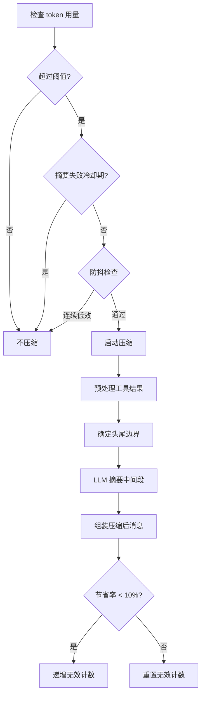
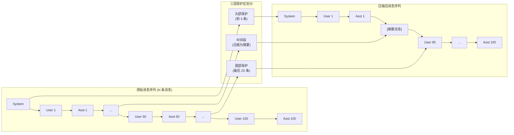

# 第六章 上下文压缩策略

> **开篇问题**：当对话超过模型上下文窗口时，如何在保留关键信息的同时压缩对话历史？

当你与 Claude 进行一次长时间的调试会话，反复修改代码、查看日志、搜索文档，对话历史可能累积到数万个 token。模型的上下文窗口虽大（如 Claude 3.5 Sonnet 为 200K token），但并非无限。如果简单地截断早期对话，可能会丢失关键的任务目标、约束条件或已完成的工作记录；如果不加处理，API 调用会因超出上下文限制而失败。

Hermes 的答案是 **自动上下文压缩**：当对话接近上下文限制时，系统会保护头部和尾部的重要消息，将中间的旧对话通过 LLM 摘要成结构化的任务快照，然后用这个紧凑的摘要替换原始消息。这一机制让 Hermes 能够支持跨越数小时的长对话，同时保持任务连贯性。

本章将深入解析 Hermes 的上下文压缩策略，包括三层保护架构、工具结果预处理、LLM 摘要生成，以及防抖与失败恢复机制。

---

## 6.1 上下文压缩的触发：何时压缩？

### 6.1.1 阈值设计：50% 作为触发点

Hermes 采用 **预防性触发** 策略，在上下文使用量达到模型限制的 **50%** 时就启动压缩，而非等到真正逼近上限。这个设计在 `ContextCompressor.__init__` 中定义：

```python
# agent/context_compressor.py:324
threshold_percent: float = 0.50  # Trigger compression at 50% context usage
```

为什么是 50% 而非 80% 或 90%？这是为了留出足够的缓冲空间，避免在用户正在操作时突然触发压缩（可能需要 5-10 秒）。触发阈值的计算逻辑如下：

```python
# agent/context_compressor.py:356-358
threshold_tokens = max(
    int(context_length * threshold_percent),
    MINIMUM_CONTEXT_LENGTH
)
```

即使是小模型（如上下文窗口仅 4K 的模型），也会确保至少保留 `MINIMUM_CONTEXT_LENGTH` token 的空间。

### 6.1.2 防抖策略：避免无效压缩

如果对话已经非常紧凑（例如，大部分消息都在保护区内），压缩可能只能节省很少的 token。频繁的无效压缩既浪费 API 成本，又拖慢响应速度。Hermes 引入了 **防抖机制**：

```python
# agent/context_compressor.py:388-390
_last_compression_savings_pct: float  # Last compression savings percentage
_ineffective_compression_count: int   # Consecutive ineffective compression count
```

判断逻辑在 `should_compress()` 方法中实现：

```python
# agent/context_compressor.py:409-417
def should_compress(self) -> bool:
    if not self._should_compress_basic():
        return False
    # Skip if last 2 consecutive compressions saved <10%
    if (self._ineffective_compression_count >= 2 and
        self._last_compression_savings_pct < 0.10):
        logger.info("Skipping compression: low effectiveness")
        return False
    return True
```

如果连续 2 次压缩的节省率都低于 10%，系统会跳过后续压缩请求，直到新的消息显著增加上下文用量。这种设计体现了 **Personal Long-Term** 场景的务实选择：对于真正长时间运行的对话，宁可保留更多原始消息，也不要反复进行低效压缩。

### 6.1.3 压缩决策流程

完整的压缩决策流程如下图所示：



---

## 6.2 三层保护策略：头部、尾部与中间段

### 6.2.1 架构设计

Hermes 的压缩策略将对话消息分为三个区域：

1. **头部保护区** (Head): 前 N 条消息，包含系统提示词、任务目标、初始约束
2. **中间段** (Middle): 需要压缩的旧对话，将被摘要替换
3. **尾部保护区** (Tail): 最近 M 条消息，包含当前上下文和用户最新请求

三层架构如下图所示：



### 6.2.2 头部保护：前 3 条消息

头部保护区固定为前 **3 条消息**：

```python
# agent/context_compressor.py:325
protect_first_n: int = 3  # Protect first 3 messages
```

为什么是 3？因为典型的对话开头是：
1. System 消息（系统提示词）
2. User 消息（任务描述）
3. Assistant 消息（确认理解或首次响应）

这三条消息通常包含整个会话的 **任务框架** 和 **约束条件**，必须完整保留。例如，用户可能在第一条消息中说"用 Python 3.10 语法实现，不要用外部依赖"，这种全局约束需要贯穿整个对话。

### 6.2.3 尾部保护：基于 Token 预算

尾部保护区不是固定数量的消息，而是根据 **token 预算** 动态确定。预算计算逻辑如下：

```python
# agent/context_compressor.py:363-364
tail_token_budget = int(threshold_tokens * summary_target_ratio)
```

其中 `summary_target_ratio` 默认为 **20%**：

```python
# agent/context_compressor.py:327
summary_target_ratio: float = 0.20  # Tail takes 20% of threshold
```

假设模型上下文窗口为 200K token，阈值 50% 为 100K token，则尾部预算为 `100K * 0.2 = 20K token`。系统从最后一条消息开始向前累加 token，直到耗尽预算，这个边界就是尾部的起点。

实现在 `_find_tail_cut_by_tokens()` 方法中：

```python
# agent/context_compressor.py:1039-1103
def _find_tail_cut_by_tokens(
    self,
    messages: List[Dict[str, Any]],
    tail_budget: int
) -> int:
    """Find tail boundary by token budget, ensuring last user message is included."""
    cumulative = 0
    for i in range(len(messages) - 1, -1, -1):
        msg_tokens = estimate_messages_tokens_rough([messages[i]])
        cumulative += msg_tokens
        if cumulative > tail_budget:
            # Ensure at least last user message in tail
            return max(i + 1, self._find_last_user_message_index(messages))
    return 0
```

注意最后的保护逻辑：即使 token 预算耗尽，也要确保 **最后一条 user 消息** 在尾部内，否则模型可能不知道当前需要回答什么问题。

### 6.2.4 中间段：摘要目标长度

中间段的所有消息将被压缩为一条摘要消息，摘要的目标长度为上下文窗口的 **5%**，上限 12,000 token：

```python
# agent/context_compressor.py:365-366
max_summary_tokens = min(int(context_length * 0.05), 12000)
```

对应的常量定义：

```python
# agent/context_compressor.py:57
_SUMMARY_TOKENS_CEILING = 12_000
```

为什么有上限？因为对于超大上下文模型（如 Claude 3.5 Sonnet 的 200K），5% 就是 10K token，足够详细。再长的摘要反而会稀释关键信息，降低模型的注意力集中度。

---

## 6.3 工具结果预处理：三遍扫描策略

在调用 LLM 生成摘要之前，Hermes 会先执行一个 **无需 LLM 的预处理步骤**，专门优化工具调用和结果的存储效率。这是一个巧妙的设计：工具输出往往占据大量 token（如读取大文件、终端日志），但其中许多内容是重复的或可以结构化摘要的。

预处理在 `_prune_old_tool_results()` 方法中实现，采用 **三遍扫描** 策略：

```python
# agent/context_compressor.py:424-563
def _prune_old_tool_results(
    self,
    messages: List[Dict[str, Any]],
    protect_head: int,
    protect_tail_start: int
) -> List[Dict[str, Any]]:
    """Three-pass tool result optimization: dedup, summarize, truncate."""
```

### 6.3.1 Pass 1: MD5 去重

第一遍扫描处理 **重复的工具结果**。在长对话中，用户可能多次查看同一个文件或运行相同的命令。Hermes 对超过 200 字符的工具结果计算 MD5 哈希（取前 12 位），保留最新的完整副本，其余替换为去重标记：

```python
# agent/context_compressor.py:493-513
# Pass 1: MD5 deduplication
seen_hashes = {}
for i in range(protect_head, protect_tail_start):
    msg = messages[i]
    if msg.get("role") == "user":
        for tc in msg.get("content", []):
            if tc.get("type") == "tool_result":
                content = self._extract_text(tc.get("content"))
                if len(content) > 200:
                    hash_key = hashlib.md5(content.encode()).hexdigest()[:12]
                    if hash_key in seen_hashes:
                        # Replace with dedup marker
                        tc["content"] = f"[Duplicate of result at turn {seen_hashes[hash_key]}, content omitted for context space]"
                    else:
                        seen_hashes[hash_key] = i
```

为什么是 200 字符？因为短结果（如命令的成功返回 `"OK"`）去重意义不大，反而可能误伤不同上下文中的相同短输出。

### 6.3.2 Pass 2: 结果摘要

第二遍扫描对保护区外的 **旧工具结果** 生成信息性摘要，不调用 LLM，而是根据工具类型应用预定义模板：

```python
# agent/context_compressor.py:515-535
# Pass 2: Summarize old tool results
for i in range(protect_head, protect_tail_start):
    msg = messages[i]
    if msg.get("role") == "user":
        for tc in msg.get("content", []):
            if tc.get("type") == "tool_result" and not self._is_duplicate_marker(tc):
                original = self._extract_text(tc.get("content"))
                tool_name = self._find_tool_name_for_result(messages, i, tc.get("tool_use_id"))
                summary = self._summarize_tool_result(tool_name, original, tc)
                if summary != original:
                    tc["content"] = summary
```

摘要生成逻辑在 `_summarize_tool_result()` 中实现，按工具类型分类处理：

```python
# agent/context_compressor.py:154-275
def _summarize_tool_result(
    self,
    tool_name: str,
    content: str,
    tool_result: Dict[str, Any]
) -> str:
    """Generate informative summary without LLM."""

    if tool_name == "terminal":
        # Extract command, exit code, line count
        return f"[terminal] ran `{command}` -> exit {exit_code}, {line_count} lines output"

    elif tool_name == "read_file":
        # Extract filename, line range
        return f"[read_file] read {filename} from line {start_line} ({len(content)} chars)"

    elif tool_name in ("write_file", "patch"):
        return f"[{tool_name}] wrote {filename} ({len(content)} chars)"

    elif tool_name == "search_files":
        # Parse result count
        return f"[search_files] searched for \"{pattern}\" -> {result_count} results"

    elif tool_name == "web_search":
        return f"[web_search] searched \"{query}\" -> {result_count} results"

    else:
        # Generic fallback
        return f"[{tool_name}] ({len(content)} chars of output, truncated for context space)"
```

这种设计的优势是 **快速且确定性**：不需要调用 LLM，不会出现摘要质量波动，且能保留工具调用的关键元信息（如文件名、命令、结果数量）。

### 6.3.3 Pass 3: 参数截断

第三遍扫描处理 **assistant 消息中的 tool_call 参数**。工具调用的参数可能很长（如 `write_file` 的完整文件内容），但一旦执行完毕，这些参数的历史价值有限。Hermes 对保护区外的 tool_call 参数进行截断：

```python
# agent/context_compressor.py:537-561
# Pass 3: Truncate tool call arguments
for i in range(protect_head, protect_tail_start):
    msg = messages[i]
    if msg.get("role") == "assistant":
        for tc in msg.get("content", []):
            if tc.get("type") == "tool_use":
                args = tc.get("input", {})
                args_str = json.dumps(args)
                if len(args_str) > 500:
                    tc["input"] = {"_truncated": f"[Arguments truncated, {len(args_str)} chars]"}
```

为什么是 500 字符？这是经验值，能容纳大部分简单工具调用的参数（如 `search_files` 的模式和路径），但会截断大块内容（如完整文件写入）。

### 6.3.4 预处理效果评估

三遍扫描的总体效果：

| 优化项 | 节省 Token 估算 | 信息损失 |
|--------|----------------|---------|
| MD5 去重 | 10-30%（重复密集场景） | 低（保留最新副本） |
| 结果摘要 | 50-80%（大文件/日志） | 中（丢失细节，保留元信息） |
| 参数截断 | 20-50%（写文件场景） | 低（结果已在 tool_result 中） |

这个预处理步骤通常能节省 **30-60%** 的 token，且无需调用 LLM，执行速度在毫秒级。对于 Personal Long-Term 场景，这意味着压缩频率显著降低，用户感知的延迟更少。

---

## 6.4 LLM 摘要生成：结构化任务快照

预处理完成后，中间段的消息已经相对紧凑，但仍可能包含数千条消息。Hermes 调用辅助模型（通常是 GPT-4o-mini 或 Claude 3 Haiku）将这些消息压缩为一条结构化的摘要消息。

### 6.4.1 结构化模板：12 个维度

摘要不是自由文本，而是按照预定义的 **12 个维度** 组织：

```python
# agent/context_compressor.py:692-742
SUMMARY_TEMPLATE = """
Generate a structured summary with these sections:

**Active Task**
Current goal or problem being worked on.

**Goal**
What the user is trying to achieve.

**Constraints**
Technical requirements, preferences, limitations.

**Completed Actions**
Key steps already taken (chronological).

**Active State**
Current system state, file changes, environment setup.

**In Progress**
Work started but not finished.

**Blocked**
Issues preventing progress.

**Key Decisions**
Important choices made and rationale.

**Resolved Questions**
Questions answered during the work.

**Pending User Asks**
Questions waiting for user input.

**Relevant Files**
Files created, modified, or referenced.

**Remaining Work**
Next steps needed (not as instructions to execute now).
"""
```

这种结构化设计有两个优势：

1. **可预测性**：摘要始终包含这些维度，模型知道在哪里找信息
2. **可演化性**：后续压缩可以基于上一次的摘要进行 **迭代更新**，而非重新生成

### 6.4.2 迭代更新：增量摘要

当对话经历多次压缩时，Hermes 不会每次都重新摘要所有历史，而是让摘要器 **更新上一次的摘要**：

```python
# agent/context_compressor.py:649-650
if self._previous_summary:
    summarizer_prompt += f"\n\nPrevious summary:\n{self._previous_summary}\n\nUpdate it with new information from the conversation."
```

这种设计的好处是：

- **信息保真度更高**：早期的关键决策会通过多次迭代保留下来
- **摘要成本更低**：摘要器只需处理增量变化，而非全量历史

例如，第一次压缩生成的摘要可能包含"用户要求用 Python 实现 HTTP 服务器"，第二次压缩时，即使原始消息被丢弃，摘要器也会保留这个信息，只需添加"实现了基础路由功能"等新内容。

### 6.4.3 摘要隔离机制：SUMMARY_PREFIX

摘要消息有一个特殊的前缀，用于明确告知模型这是压缩产生的背景信息，而非新的指令或助手响应：

```python
# agent/context_compressor.py:38-42
SUMMARY_PREFIX = (
    "[CONTEXT COMPACTION — REFERENCE ONLY] Earlier turns were compacted "
    "into the summary below. This is a handoff from a previous context "
    "window — treat it as background reference, NOT as active instructions. "
    "Do NOT answer questions or fulfill requests mentioned in this summary; "
)
```

为什么需要这个前缀？因为摘要中可能包含"用户问了如何配置 SSL"这样的描述，模型可能误以为这是当前需要回答的问题。前缀通过明确的指令框架（inspired by OpenCode 和 Codex 的实践）建立了 **语义边界**，将摘要与活跃上下文隔离。

### 6.4.4 角色冲突处理：merge into tail

摘要消息需要插入到头部保护区和尾部保护区之间，但 Anthropic API 要求消息序列不能有连续的相同角色（如两个 `user` 消息连续）。Hermes 需要为摘要选择合适的 `role`：

```python
# agent/context_compressor.py:1211-1231
def _choose_summary_role(
    self,
    head_messages: List[Dict],
    tail_messages: List[Dict]
) -> str:
    """Choose summary role to avoid consecutive same-role conflicts."""
    head_last_role = head_messages[-1].get("role") if head_messages else None
    tail_first_role = tail_messages[0].get("role") if tail_messages else "user"

    # Try "user" first (safer default)
    if head_last_role != "user" and tail_first_role != "user":
        return "user"

    # Try "assistant"
    if head_last_role != "assistant" and tail_first_role != "assistant":
        return "assistant"

    # Both conflict -> merge summary into tail's first message
    return None  # Signal to merge
```

如果两个角色都会冲突（罕见但可能发生），Hermes 会将摘要 **合并到尾部的第一条消息** 中，而非独立插入：

```python
# agent/context_compressor.py:1235-1249
if summary_role is None:
    # Merge summary into tail
    tail_messages[0]["content"] = (
        f"{summary_text}\n\n"
        f"--- End of Context Summary ---\n\n"
        f"{tail_messages[0]['content']}"
    )
    return head_messages + tail_messages
```

### 6.4.5 摘要失败回退：静态 fallback

LLM 摘要可能失败（如 API 超时、速率限制）。Hermes 不会因此阻塞用户，而是插入一条 **静态 fallback 标记**：

```python
# agent/context_compressor.py:1197-1209
if not summary_text:
    summary_text = (
        "[Context compaction attempted but summarization failed. "
        "Earlier conversation turns were removed to free space. "
        "Some context may be missing.]"
    )
```

这个设计体现了 **可用性优先** 原则：即使摘要失败，对话也能继续，模型至少知道有信息丢失，可以主动询问用户。

---

## 6.5 防抖与失败恢复：保障长期稳定性

### 6.5.1 失败冷却期

如果摘要生成失败，Hermes 会启动 **10 分钟冷却期**，避免短时间内反复尝试失败的摘要请求：

```python
# agent/context_compressor.py:64
_SUMMARY_FAILURE_COOLDOWN_SECONDS = 600  # 10 minutes
```

冷却期检查在 `should_compress()` 中实现：

```python
# agent/context_compressor.py:818-822
if summary_failed:
    self._summary_failure_timestamp = time.time()

# Later in should_compress()
if time.time() - self._summary_failure_timestamp < _SUMMARY_FAILURE_COOLDOWN_SECONDS:
    return False
```

这避免了在 API 故障期间产生大量无效请求，也给了用户继续对话的机会（依赖静态 fallback）。

### 6.5.2 压缩效果追踪

每次压缩后，Hermes 计算 **节省率** 并记录：

```python
# agent/context_compressor.py:1258-1264
original_tokens = estimate_messages_tokens_rough(messages)
compressed_tokens = estimate_messages_tokens_rough(result)
savings_pct = (original_tokens - compressed_tokens) / original_tokens

self._last_compression_savings_pct = savings_pct

if savings_pct < 0.10:
    self._ineffective_compression_count += 1
else:
    self._ineffective_compression_count = 0
```

连续两次节省率低于 10% 会触发防抖跳过（见 6.1.2 节）。这个机制确保压缩始终是 **高效的**，而非机械的。

### 6.5.3 兼容旧版摘要

Hermes 保留了对旧版摘要格式的兼容性：

```python
# agent/context_compressor.py:50
LEGACY_SUMMARY_PREFIX = "[CONTEXT SUMMARY]:"
```

当系统检测到旧版摘要时，会将其作为 `_previous_summary` 用于迭代更新，确保升级后的对话可以无缝继续。

---

## 6.6 问题清单：当前实现的局限性

尽管 Hermes 的上下文压缩策略相对成熟，但仍存在以下问题：

### P-06-01 [Perf/High] 阈值硬编码不自适应

**What**: 压缩阈值（50%）、头部保护（3 条）、尾部预算（20%）都是硬编码常量，不随任务类型调整。

**Why**: 不同任务的上下文需求差异巨大：
- **调试任务**：需要保留更多历史日志和错误信息（尾部应更大）
- **代码生成任务**：早期的需求描述更重要（头部应更大）
- **探索性任务**：中间的假设和试错记录需要保留（压缩应更保守）

**How**: 引入 **任务感知的动态阈值**：
```python
class AdaptiveCompressor:
    def get_thresholds(self, task_type: str) -> Dict[str, float]:
        if task_type == "debug":
            return {"trigger": 0.60, "tail_ratio": 0.30, "head_n": 3}
        elif task_type == "codegen":
            return {"trigger": 0.50, "tail_ratio": 0.15, "head_n": 5}
        else:
            return {"trigger": 0.50, "tail_ratio": 0.20, "head_n": 3}
```

### P-06-02 [Perf/High] 缺少微压缩

**What**: 当前只有 **全量压缩**（compress entire middle），没有渐进式的微压缩选项。

**Why**: 全量压缩是一个重操作（调用 LLM，可能需要 5-10 秒），在对话刚刚超过阈值时过于激进。微压缩可以只处理最老的一部分消息，保留更多原始细节。

**How**: 实现 **分层压缩策略**：
- **Tier 1**: Token 使用量 50-60% → 只压缩最老的 20% 消息
- **Tier 2**: Token 使用量 60-70% → 压缩最老的 40% 消息
- **Tier 3**: Token 使用量 >70% → 全量压缩

### P-06-03 [Rel/Medium] 压缩信息丢失无反馈

**What**: 用户不知道哪些信息被压缩了，也无法查看或恢复。

**Why**: 当用户询问"我之前提到的那个配置是什么"，而这部分已被压缩，模型只能说"我没有找到相关信息"，用户会困惑。

**How**: 实现 **压缩审计日志**：
```python
class CompressionAudit:
    def log_compression(self, compressed_messages: List[Dict]) -> str:
        """Return a human-readable summary of what was compressed."""
        return f"Compressed {len(compressed_messages)} messages from turn {start} to {end}, including {tool_count} tool calls."

    def get_compression_history(self) -> List[str]:
        """Return all compression events in this conversation."""
```

用户可以通过 `/compact-history` 命令查看压缩记录，必要时请求恢复。

### P-06-04 [Perf/Medium] 去重仅基于 MD5

**What**: 当前的去重机制只识别 **完全相同** 的工具结果（MD5 匹配），无法识别语义相似的结果。

**Why**: 用户可能多次运行相同命令但输出略有不同（如时间戳、进程 ID），这些结果本质上传递相同的信息，但 MD5 不同。

**How**: 引入 **语义去重**：
```python
from sklearn.metrics.pairwise import cosine_similarity

def semantic_dedup(results: List[str], threshold: float = 0.95) -> List[int]:
    """Return indices of results to keep (others are duplicates)."""
    embeddings = embed_texts(results)  # Use lightweight embedding model
    similarity_matrix = cosine_similarity(embeddings)
    # Cluster similar results, keep one representative per cluster
    return cluster_and_select(similarity_matrix, threshold)
```

### P-06-05 [Perf/Low] 缺少 Repo Map

**What**: 摘要中只有 "Relevant Files" 列表，没有代码库的 **结构化地图**。

**Why**: 对于大型代码库，仅文件列表无法传递模块间的依赖关系和调用链。Repo Map（如 Aider 的实现）可以用极少的 token 表示代码结构。

**How**: 集成 **Tree-sitter 生成 Repo Map**：
```python
def generate_repo_map(files: List[str]) -> str:
    """Generate a compact code structure map."""
    # Example output:
    # src/
    #   main.py: def main(), class App
    #   utils/
    #     parser.py: class Parser, def parse()
```

在摘要的 "Relevant Files" 部分嵌入这个地图，模型能快速定位函数和类的位置。

---

## 6.7 本章小结

上下文压缩是 Hermes 支持 **Personal Long-Term** 场景的核心能力。本章解析了其三层架构：

1. **触发机制**：50% 阈值触发，防抖避免无效压缩，失败冷却保障稳定性
2. **三层保护**：头部 3 条 + 尾部 20% token 预算 + 中间段压缩为 5% 摘要
3. **工具预处理**：三遍扫描（MD5 去重、结果摘要、参数截断）节省 30-60% token
4. **LLM 摘要**：12 维结构化模板、迭代更新、角色冲突处理、失败回退

这套策略在工程实践中证明有效，但仍有优化空间：

- **自适应阈值** 可以根据任务类型调整压缩激进度
- **微压缩** 可以避免全量压缩的延迟
- **语义去重** 和 **Repo Map** 可以进一步提升信息密度

从设计哲学来看，Hermes 的压缩策略体现了 **预防性工程** 思维：不等到上下文窗口真正耗尽才处理，而是在 50% 时就主动压缩，为后续对话留出缓冲空间。同时，通过结构化摘要和迭代更新，确保关键信息在多次压缩中依然保留，这是支持长时间协作的基础。

**设计赌注回顾**：Hermes 押注于 Personal Long-Term 场景（数小时的持续对话），而非 One-Shot 场景。上下文压缩策略是这个赌注的技术支撑——它让模型能够跨越数千条消息记住任务目标、约束条件和已完成工作，同时保持响应速度和 API 成本可控。对于希望构建长期协作型 Agent 的开发者，这套策略值得深入研究和借鉴。

---

**相关文件**：
- `/Users/jguo/Projects/hermes-agent/agent/context_compressor.py` (1276 行) — 核心实现
- `/Users/jguo/Projects/hermes-agent/tools/budget_config.py` (53 行) — 工具结果预算配置

**下一章预告**：第七章将探讨 Hermes 的工具系统设计，包括工具注册、参数验证、结果持久化，以及如何通过 MCP (Model Context Protocol) 实现插件化扩展。
