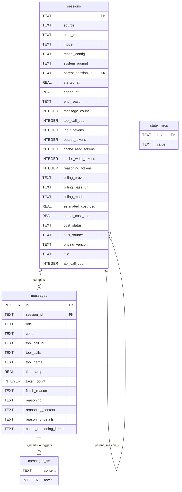

# Ch-08: 会话持久化

> **开篇问题**: 如何在 SQLite 中高效存储和检索 AI Agent 的对话历史？

当 Agent 需要在多个平台（CLI、Telegram、Discord）间提供一致的对话体验时，持久化存储成为核心基础设施。Hermes 选择 SQLite + WAL + FTS5 作为会话存储方案，承载了从消息历史到成本追踪的全部状态。本章深入 `hermes_state.py` (1591 行)，解析其表结构、并发控制、全文检索和维护策略，揭示生产环境下 SQLite 的高并发写锁竞争问题及应对方案。

---

## 8.1 Schema 设计：Personal Long-Term 的基石

Personal Long-Term 赌注（第七章记忆管理器）押注会话历史是长期记忆的底层数据源。SessionDB 的 schema 设计围绕三张核心表展开：



### 8.1.1 sessions 表：会话生命周期追踪

`sessions` 表 (`hermes_state.py:41-70`) 记录每次对话的元信息。其设计有三个关键决策：

**1. parent_session_id 自引用外键**
用于构建会话家族树，支持两种亲子关系：
- **压缩继续链**: parent 的 `end_reason = 'compression'` 且 child 在 parent 结束后创建（用于上下文窗口满载时的历史压缩续接）
- **子 Agent 委托**: parent 仍存活时创建的 child（用于工具调用中启动子 Agent）

外键约束 `FOREIGN KEY (parent_session_id) REFERENCES sessions(id)` 保证引用完整性。删除父会话时，子会话被孤儿化而非级联删除 (`hermes_state.py:1429-1432`)：

```python
conn.execute(
    "UPDATE sessions SET parent_session_id = NULL "
    "WHERE parent_session_id = ?",
    (session_id,),
)
```

**2. 成本追踪字段群**
v5 schema 迁移 (`hermes_state.py:296-319`) 引入 11 个计费相关字段：
- `cache_read_tokens / cache_write_tokens`: 区分 Anthropic prompt caching 的读写 token
- `reasoning_tokens`: OpenAI o1/o3 等推理模型的思考 token 单独计费
- `billing_provider / billing_base_url / billing_mode`: 记录计费来源（直连 Anthropic 或通过 OpenRouter 中转）
- `estimated_cost_usd / actual_cost_usd`: 预估成本 vs API 返回的实际扣费
- `cost_status / cost_source / pricing_version`: 成本计算的状态机和版本追踪

这些字段支持增量更新（`absolute=False`）和绝对覆写（`absolute=True`）两种模式 (`hermes_state.py:467-540`)，分别对应 CLI 场景的每次 API 调用增量和 Gateway 场景的累积总和覆写。

**3. title 唯一索引的 NULL 语义**
v4 迁移 (`hermes_state.py:286-295`) 添加的唯一索引利用 SQLite 的 `WHERE title IS NOT NULL` 过滤索引特性：

```sql
CREATE UNIQUE INDEX IF NOT EXISTS idx_sessions_title_unique
ON sessions(title) WHERE title IS NOT NULL
```

允许多个会话的 title 为 NULL（匿名会话），但所有非 NULL title 必须唯一。用户通过 `/title` 命令手动设置 title 后，系统自动处理冲突 (`hermes_state.py:715-755`)：若新 title 已存在，自动追加后缀 `#2`、`#3` 直到不冲突。

### 8.1.2 messages 表：多模态消息存储

`messages` 表 (`hermes_state.py:72-87`) 存储完整的对话历史。设计亮点：

**1. tool_calls JSON 序列化**
`tool_calls` 字段存储 JSON 字符串，记录 assistant 角色发起的工具调用数组。保存时将 Python dict 序列化为 JSON (`hermes_state.py:579`)，读取时反序列化 (`hermes_state.py:659`)。避免了创建 `tool_calls` 关联表，牺牲查询灵活性换取简单性。

**2. reasoning 字段演进**
v6 迁移添加 `reasoning` / `reasoning_details` / `codex_reasoning_items` (`hermes_state.py:320-338`)，v7 补充 `reasoning_content` (`hermes_state.py:339-347`)。四个字段分工明确：
- `reasoning`: 规范化的思考文本（跨提供商统一格式）
- `reasoning_content`: 提供商原生的 reasoning 块（Kimi/Moonshot 需在重放时保持原样）
- `reasoning_details`: 结构化推理元数据（如 OpenAI o1 的 summary）
- `codex_reasoning_items`: Codex 多步推理的 JSON 数组

迁移时采用 "添加列 + pass 异常" 模式处理幂等性 (`hermes_state.py:331-337`)：

```python
for col_name, col_type in [
    ("reasoning", "TEXT"),
    ("reasoning_details", "TEXT"),
    ("codex_reasoning_items", "TEXT"),
]:
    try:
        safe = col_name.replace('"', '""')
        cursor.execute(
            f'ALTER TABLE messages ADD COLUMN "{safe}" {col_type}'
        )
    except sqlite3.OperationalError:
        pass  # Column already exists
```

**3. 复合索引：session_id + timestamp**
`idx_messages_session` 索引 (`hermes_state.py:97`) 覆盖最常见的查询模式：按 session_id 过滤 + timestamp 排序。单个索引同时满足两个需求，避免额外开销。

### 8.1.3 FTS5 全文检索表

`messages_fts` 虚拟表 (`hermes_state.py:100-119`) 基于 SQLite FTS5 扩展，建立在 `messages.content` 字段上的全文索引：

```sql
CREATE VIRTUAL TABLE IF NOT EXISTS messages_fts USING fts5(
    content,
    content=messages,
    content_rowid=id
);
```

**External Content Table 模式**：`content=messages` 和 `content_rowid=id` 声明 FTS5 不存储原始文本，仅存储倒排索引，通过 rowid 关联回 `messages` 表获取原文。节省约 30% 磁盘空间（避免文本重复存储）。

**同步触发器**：三个触发器 (`hermes_state.py:107-118`) 保持 FTS 索引与 messages 表同步：
- `messages_fts_insert`: 插入消息时自动更新 FTS 索引
- `messages_fts_delete`: 删除消息时移除 FTS 条目（使用特殊的 `'delete'` 命令）
- `messages_fts_update`: 更新消息内容时先删后插

FTS5 初始化延后到 schema 脚本之后 (`hermes_state.py:370-374`)，因为 `CREATE VIRTUAL TABLE IF NOT EXISTS` 在 `executescript()` 中不可靠（SQLite 虚拟表的已知限制）。

---

## 8.2 WAL 并发控制：高并发写的挑战

### 8.2.1 WAL 模式的并发特性

SessionDB 在连接初始化时开启 WAL 模式 (`hermes_state.py:164`)：

```python
self._conn.execute("PRAGMA journal_mode=WAL")
```

WAL (Write-Ahead Logging) 允许 **多读者 + 单写者** 并发：
- **读者**: 快照读，不阻塞写入，也不被写入阻塞
- **写者**: 同一时刻只有一个连接能持有 WAL 写锁，其他写者需等待

在 Hermes 的部署场景下，多个进程（CLI 主会话、worktree 子 Agent、Gateway 多平台协程）共享同一个 `state.db`，写锁竞争不可避免。

### 8.2.2 写锁竞争的表现与根因

默认配置下，SQLite 的内置 busy handler 使用确定性退避（0, 1, 2, 3, 5, 8, 13, 21ms...）。当 10+ 个写者同时竞争时，确定性调度导致 **convoy effect**：
1. Writer A 持有锁，B-J 排队等待
2. A 释放锁时，B-J 同时被唤醒
3. B 获得锁，C-J 再次按相同模式休眠
4. 队列尾部的 writer 反复经历 "唤醒→竞争失败→休眠" 循环

用户侧观察到 TUI 界面周期性卡顿（200-500ms），对应 convoy 尾部 writer 的饥饿延迟。

### 8.2.3 Jitter Retry 策略

Hermes 的解决方案是将 SQLite 的 timeout 缩短至 1 秒 (`hermes_state.py:157`)，并在应用层实现带随机抖动的重试 (`hermes_state.py:130-143`)：

```python
_WRITE_MAX_RETRIES = 15
_WRITE_RETRY_MIN_S = 0.020   # 20ms
_WRITE_RETRY_MAX_S = 0.150   # 150ms
```

核心逻辑在 `_execute_write()` (`hermes_state.py:171-221`)：

```python
for attempt in range(self._WRITE_MAX_RETRIES):
    try:
        with self._lock:
            self._conn.execute("BEGIN IMMEDIATE")
            try:
                result = fn(self._conn)
                self._conn.commit()
            except BaseException:
                try:
                    self._conn.rollback()
                except Exception:
                    pass
                raise
        # Success
        self._write_count += 1
        if self._write_count % self._CHECKPOINT_EVERY_N_WRITES == 0:
            self._try_wal_checkpoint()
        return result
    except sqlite3.OperationalError as exc:
        err_msg = str(exc).lower()
        if "locked" in err_msg or "busy" in err_msg:
            last_err = exc
            if attempt < self._WRITE_MAX_RETRIES - 1:
                jitter = random.uniform(
                    self._WRITE_RETRY_MIN_S,
                    self._WRITE_RETRY_MAX_S,
                )
                time.sleep(jitter)
                continue
        raise
```

**关键技术点**：

1. **BEGIN IMMEDIATE**: 在事务开始时立即获取 WAL 写锁（而非 BEGIN DEFERRED 在首次写时才获取）。锁冲突前置到事务起点，失败后可立即重试，避免部分完成的事务回滚。

2. **随机抖动休眠**: `random.uniform(20ms, 150ms)` 打破确定性调度。多个竞争者的重试时间自然错开，减少碰撞概率。类比 Ethernet 的 CSMA/CD 退避算法。

3. **最多 15 次重试**: 总超时窗口约 2.25 秒（15 × 平均 150ms）。对于用户交互场景（发送消息、保存会话）可接受，避免无限等待。

4. **线程锁保护连接**: `self._lock` 确保同一进程内的多个线程不会并发使用 `self._conn`（SQLite 连接虽然设置了 `check_same_thread=False`，但 Python 的 `sqlite3` 模块在多线程下共享 cursor 不安全）。

### 8.2.4 WAL Checkpoint 策略

WAL 模式下，已提交的数据先写入 `.db-wal` 文件，后台通过 checkpoint 同步回 `.db` 主文件。Hermes 采用两级 checkpoint 策略：

**1. PASSIVE checkpoint (每 50 次写入)**
`_try_wal_checkpoint()` (`hermes_state.py:223-242`) 在成功写入后周期性触发：

```python
if self._write_count % self._CHECKPOINT_EVERY_N_WRITES == 0:
    self._try_wal_checkpoint()
```

```python
def _try_wal_checkpoint(self) -> None:
    try:
        with self._lock:
            result = self._conn.execute(
                "PRAGMA wal_checkpoint(PASSIVE)"
            ).fetchone()
            if result and result[1] > 0:
                logger.debug(
                    "WAL checkpoint: %d/%d pages checkpointed",
                    result[2], result[1],
                )
    except Exception:
        pass  # Best effort — never fatal.
```

PASSIVE 模式 **不阻塞读者和写者**：仅同步当前无读者引用的 WAL 帧。若所有帧都被某个读者的快照引用，checkpoint 返回但不报错。这种 "尽力而为" 策略防止 WAL 文件无限增长，同时不影响并发性能。

**2. TRUNCATE checkpoint (VACUUM 时)**
`vacuum()` (`hermes_state.py:1504-1525`) 在大规模删除后手动触发，使用 TRUNCATE 模式：

```python
self._conn.execute("PRAGMA wal_checkpoint(TRUNCATE)")
self._conn.execute("VACUUM")
```

TRUNCATE 模式等待所有读者完成，强制同步全部 WAL 帧并截断 WAL 文件至 0 字节。配合 VACUUM 重建主数据库文件，回收已删除数据占用的磁盘空间。

> **P-08-01 [Perf/High] SQLite 高并发写锁竞争**
> **现象**: 多进程（CLI + Gateway + 子 Agent）同时写入时，TUI 出现 200-500ms 周期性卡顿
> **根因**: WAL 单写者锁 + SQLite 内置 busy handler 的确定性退避导致 convoy effect
> **现有缓解**: `timeout=1.0` + 应用层 jitter retry (20-150ms, 最多 15 次)，随机化竞争时序
> **残留风险**: 峰值并发超过 20 写者时，重试耗尽导致 `database is locked` 异常抛给用户
> **改进方向**: 引入写队列（单独的写线程 + channel），将多个小写入批处理为一次事务

---

## 8.3 全文检索：FTS5 的查询清洗

### 8.3.1 FTS5 查询语法陷阱

FTS5 支持丰富的查询语法（短语、布尔、前缀匹配），但直接将用户输入传给 `MATCH` 会引发 `sqlite3.OperationalError`：

```python
# 用户输入: my-app.config.ts (常见的文件名)
# FTS5 解析: my AND app AND config AND ts (分词器拆分)
# 用户期望: 精确短语匹配
```

特殊字符如 `()`、`{}`、`"`、`+`、`*` 在 FTS5 中有保留意义，未转义会导致语法错误。

### 8.3.2 六步清洗流程

`_sanitize_fts5_query()` (`hermes_state.py:1095-1146`) 实现了分步清洗策略：

**Step 1: 保护引号短语** (`hermes_state.py:1111-1119`)
```python
_quoted_parts: list = []

def _preserve_quoted(m: re.Match) -> str:
    _quoted_parts.append(m.group(0))
    return f"\x00Q{len(_quoted_parts) - 1}\x00"

sanitized = re.sub(r'"[^"]*"', _preserve_quoted, query)
```
用不可见字符 `\x00` 构造占位符，避免后续步骤误伤用户有意的引号短语。

**Step 2: 移除危险字符** (`hermes_state.py:1122`)
```python
sanitized = re.sub(r'[+{}()\"^]', " ", sanitized)
```
移除未配对的特殊字符（已配对的引号在 Step 1 被保护）。

**Step 3: 折叠通配符** (`hermes_state.py:1124-1127`)
```python
sanitized = re.sub(r"\*+", "*", sanitized)
sanitized = re.sub(r"(^|\s)\*", r"\1", sanitized)
```
- `***` 折叠为单个 `*`
- 移除行首和词首的 `*`（FTS5 前缀匹配要求 `*` 前至少有一个字符）

**Step 4: 移除悬挂布尔操作符** (`hermes_state.py:1131-1132`)
```python
sanitized = re.sub(r"(?i)^(AND|OR|NOT)\b\s*", "", sanitized.strip())
sanitized = re.sub(r"(?i)\s+(AND|OR|NOT)\s*$", "", sanitized.strip())
```
查询首尾的 `AND`/`OR`/`NOT` 无意义且导致语法错误。

**Step 5: 引用点号和横杠术语** (`hermes_state.py:1140`)
```python
sanitized = re.sub(r"\b(\w+(?:[.-]\w+)+)\b", r'"\1"', sanitized)
```
单次正则同时处理点号和横杠，避免两次替换导致双引号嵌套（如 `my-app.config` 先变成 `"my-app".config` 再变成 `""my-app".config"`）。

**Step 6: 还原引号短语** (`hermes_state.py:1143-1144`)
```python
for i, quoted in enumerate(_quoted_parts):
    sanitized = sanitized.replace(f"\x00Q{i}\x00", quoted)
```

### 8.3.3 CJK 回退策略

FTS5 默认的 unicode61 tokenizer 对中日韩文本按字符分词，导致多字查询失败：

```python
# 查询: "机器学习" (3个字符)
# FTS5 索引: '机', '器', '学', '习' (4个独立token)
# MATCH结果: 找到包含这4个字的任意组合，非连续短语
```

`_contains_cjk()` (`hermes_state.py:1150-1162`) 检测 Unicode 范围：

```python
for ch in text:
    cp = ord(ch)
    if (0x4E00 <= cp <= 0x9FFF or    # CJK Unified Ideographs
        0x3400 <= cp <= 0x4DBF or    # CJK Extension A
        0x20000 <= cp <= 0x2A6DF or  # CJK Extension B
        0x3000 <= cp <= 0x303F or    # CJK Symbols
        0x3040 <= cp <= 0x309F or    # Hiragana
        0x30A0 <= cp <= 0x30FF or    # Katakana
        0xAC00 <= cp <= 0xD7AF):     # Hangul Syllables
        return True
```

`search_messages()` (`hermes_state.py:1164-1331`) 先尝试 FTS5，若抛异常且包含 CJK 字符，回退到 LIKE 查询 (`hermes_state.py:1246-1279`)：

```python
if not matches and self._contains_cjk(query):
    raw_query = query.strip('"').strip()
    like_sql = f"""
        SELECT m.id, m.session_id, m.role,
               substr(m.content,
                      max(1, instr(m.content, ?) - 40),
                      120) AS snippet,
               ...
        FROM messages m
        JOIN sessions s ON s.id = m.session_id
        WHERE m.content LIKE ? ...
    """
    like_params = [raw_query, f"%{raw_query}%", ...]
```

LIKE 性能远低于 FTS5（全表扫描 vs 倒排索引），但保证了 CJK 查询的正确性。

### 8.3.4 Snippet 提取与上下文

FTS5 的 `snippet()` 函数 (`hermes_state.py:1219`) 提取匹配上下文：

```sql
snippet(messages_fts, 0, '>>>', '<<<', '...', 40) AS snippet
```

参数含义：
- `0`: 提取第 0 列（content）
- `'>>>'` / `'<<<'`: 匹配词前后的标记（高亮边界）
- `'...'`: 省略标记
- `40`: 上下文长度（匹配词前后各 40 个 token）

返回示例：
```
...how to deploy >>>docker<<< containers on AWS using...
```

额外的上下文查询 (`hermes_state.py:1286-1325`) 提供前后各 1 条消息的完整内容（角色 + 截断至 200 字符）：

```sql
WITH target AS (
    SELECT session_id, timestamp, id
    FROM messages
    WHERE id = ?
)
-- 前一条消息
SELECT role, content FROM (
    SELECT m.id, m.timestamp, m.role, m.content
    FROM messages m
    JOIN target t ON t.session_id = m.session_id
    WHERE (m.timestamp < t.timestamp)
       OR (m.timestamp = t.timestamp AND m.id < t.id)
    ORDER BY m.timestamp DESC, m.id DESC
    LIMIT 1
)
UNION ALL
-- 当前消息
SELECT role, content FROM messages WHERE id = ?
UNION ALL
-- 后一条消息
SELECT role, content FROM (...)
```

时间戳相同时用 `id` 排序（`id` 是 AUTOINCREMENT 主键，严格递增）。

> **P-08-02 [Rel/High] 无数据迁移框架**
> **现象**: Schema 从 v1 演进到 v8，靠 `ALTER TABLE` + `pass OperationalError` 模式实现
> **风险**: 无回滚机制，迁移失败静默跳过，无法验证列是否真的添加成功
> **示例**: v6 迁移添加 `reasoning` 列时，若磁盘满导致 ALTER 失败，异常被吞，后续代码访问 `reasoning` 列触发运行时错误
> **改进方向**: 引入 Alembic 或自研迁移框架，记录迁移版本，支持回滚和验证

---

## 8.4 会话分裂：压缩链的追踪

### 8.4.1 分裂触发场景

当对话历史超过 LLM 上下文窗口时，第七章的 MemoryManager 触发压缩：
1. 将历史消息总结为简短文本
2. 调用 `end_session(session_id, end_reason='compression')`
3. 创建新 session，设置 `parent_session_id` 指向旧 session
4. 新 session 的首条消息包含压缩摘要

关键约束：新 session 的 `started_at` 必须 **大于等于** 旧 session 的 `ended_at` (`hermes_state.py:780-783`)：

```sql
SELECT id FROM sessions
WHERE parent_session_id = ?
  AND started_at >= (
      SELECT ended_at FROM sessions
      WHERE id = ? AND end_reason = 'compression'
  )
```

这区分了压缩继续和子 Agent 委托（子 Agent 在父 session 仍活跃时创建，`started_at < parent.ended_at`）。

### 8.4.2 链式遍历算法

`get_compression_tip()` (`hermes_state.py:757-791`) 沿压缩链向前走到最新节点：

```python
def get_compression_tip(self, session_id: str) -> Optional[str]:
    current = session_id
    for _ in range(100):  # 防御性限制深度
        with self._lock:
            cursor = self._conn.execute(
                "SELECT id FROM sessions "
                "WHERE parent_session_id = ? "
                "  AND started_at >= ("
                "      SELECT ended_at FROM sessions "
                "      WHERE id = ? AND end_reason = 'compression'"
                "  ) "
                "ORDER BY started_at DESC LIMIT 1",
                (current, current),
            )
            row = cursor.fetchone()
        if row is None:
            return current
        current = row["id"]
    return current
```

- **循环上限 100**: 正常场景下压缩链深度 < 10，100 步足以覆盖病态情况（如配置错误导致每条消息都触发压缩）
- **ORDER BY started_at DESC**: 若存在多个子节点（罕见，但理论可能），取最新创建的

### 8.4.3 列表投影：压缩链折叠

`list_sessions_rich()` 的 `project_compression_tips=True` (`hermes_state.py:793-900`) 将压缩链根节点投影为最新续接的数据：

```python
if project_compression_tips and not include_children:
    projected = []
    for s in sessions:
        if s.get("end_reason") != "compression":
            projected.append(s)
            continue
        tip_id = self.get_compression_tip(s["id"])
        if tip_id == s["id"]:
            projected.append(s)
            continue
        tip_row = self._get_session_rich_row(tip_id)
        if not tip_row:
            projected.append(s)
            continue
        # 保留根的 started_at（排序依据），覆盖 tip 的其他字段
        merged = dict(s)
        for key in (
            "id", "ended_at", "end_reason", "message_count",
            "tool_call_count", "title", "last_active", "preview",
            "model", "system_prompt",
        ):
            if key in tip_row:
                merged[key] = tip_row[key]
        projected.append(merged)
    sessions = projected
```

用户侧效果：
- `/list` 显示的会话列表中，一个逻辑对话只出现一次（即使背后有 5 次压缩续接）
- 显示的是最新续接的 ID 和消息数（用户可直接 `/resume {最新ID}` 继续对话）
- 排序仍按原始对话的 `started_at`（保持时间顺序直觉）

> **P-08-03 [Rel/Medium] 连接管理粗放**
> **现象**: 每个 SessionDB 实例持有单一 `sqlite3.Connection`，通过全局锁 `self._lock` 串行化所有操作
> **性能瓶颈**: 读操作（`get_session`、`list_sessions`）也需要获取锁，限制了 WAL 多读者并发的优势
> **改进方向**: 区分读写连接池：写操作用单一连接 + 锁，读操作用连接池无锁并发
> **风险**: 增加复杂度，需处理池化连接的生命周期和 WAL checkpoint 的协调

---

## 8.5 维护操作：VACUUM 与自动清理

### 8.5.1 VACUUM 的必要性

SQLite 删除行时不立即回收磁盘空间，而是将页面标记为 "freelist" 供后续插入复用。长期运行后，大量删除（如 `/prune` 清理 90 天前的会话）导致数据库文件膨胀：

```bash
# 实际数据 50MB，文件大小 200MB（150MB 空洞）
$ ls -lh ~/.hermes/state.db
-rw-r--r--  1 user  staff   200M  state.db
```

VACUUM 重建整个数据库文件，回收空洞：

```python
def vacuum(self) -> None:
    with self._lock:
        try:
            self._conn.execute("PRAGMA wal_checkpoint(TRUNCATE)")
        except Exception:
            pass
        self._conn.execute("VACUUM")
```

**TRUNCATE checkpoint 先行**: 确保 WAL 文件的全部修改已同步到主文件，避免 VACUUM 后 WAL 回放冲突。

**代价**: VACUUM 重写整个文件，100MB 数据库需要 2-5 秒，期间持有独占锁（阻塞所有读写）。

### 8.5.2 幂等自动维护

`maybe_auto_prune_and_vacuum()` (`hermes_state.py:1527-1590`) 在启动时调用，通过 `state_meta` 表记录上次执行时间：

```python
last_raw = self.get_meta("last_auto_prune")
now = time.time()
if last_raw:
    try:
        last_ts = float(last_raw)
        if now - last_ts < min_interval_hours * 3600:
            result["skipped"] = True
            return result
    except (TypeError, ValueError):
        pass  # 忽略损坏的元数据
```

默认 `min_interval_hours=24`，保证多个进程启动时只有第一个执行维护，后续 24 小时内启动的进程跳过。

**VACUUM 触发条件** (`hermes_state.py:1567`)：

```python
if vacuum and pruned > 0:
    try:
        self.vacuum()
        result["vacuumed"] = True
    except Exception as exc:
        logger.warning("state.db VACUUM failed: %s", exc)
```

仅在实际删除了会话时执行（`pruned > 0`），避免对紧凑数据库的无效 VACUUM。

**容错设计**: 维护失败不抛异常，仅记录 `result["error"]`，避免阻塞程序启动。

---

## 本章小结

SessionDB 通过 SQLite + WAL + FTS5 组合，为 Hermes Agent 提供了高并发、全文可搜的会话持久化能力。核心设计权衡：

1. **Schema 演进**: v1 到 v8 的 8 次迁移，通过 `ALTER TABLE` + 异常吞没实现向前兼容，牺牲了迁移验证和回滚能力（P-08-02）。

2. **并发写控制**: WAL 单写者锁 + 应用层 jitter retry (20-150ms, 最多 15 次) 缓解了确定性退避的 convoy effect，但峰值并发仍受限于重试预算（P-08-01）。

3. **全文检索**: FTS5 六步清洗 + CJK LIKE 回退，平衡了查询灵活性和鲁棒性，代价是 CJK 查询性能退化为全表扫描。

4. **压缩链管理**: `get_compression_tip()` 的链式遍历 + `list_sessions_rich()` 的投影折叠，对用户屏蔽了历史压缩的复杂性，保持 "单一对话" 的直觉。

5. **连接管理**: 单连接 + 全局锁的粗放模式限制了 WAL 多读者并发的潜力（P-08-03），但换取了实现简单性和线程安全保证。

PersonaI Long-Term 赌注的实现依赖本章的 SessionDB 作为数据基础：会话历史的完整性、检索效率和并发可靠性直接决定了长期记忆系统的可用性。下一章将探讨如何在 SessionDB 之上构建语义记忆检索，进一步增强 Agent 的上下文延续能力。

**问题清单**：
- P-08-01 [Perf/High] SQLite 高并发写锁竞争 — timeout=1.0, 15 次 jitter retry
- P-08-02 [Rel/High] 无数据迁移框架 — ALTER TABLE + pass 模式，无回滚
- P-08-03 [Rel/Medium] 连接管理粗放 — 单连接 + 全局锁，无连接池
