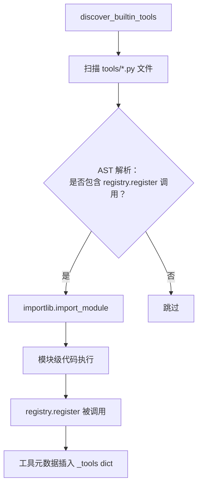
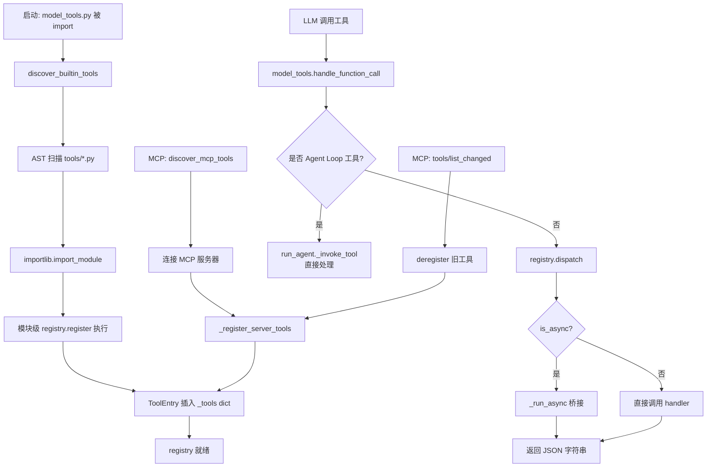

# Ch-09: 工具注册与分发

**开篇问题**：如何让 64+ 工具在启动时自注册，同时支持运行时动态添加 MCP 工具？

当你第一次启动 Hermes Agent 时，终端会闪过一行简洁的日志：

```
🛠️  Final tool selection (64 tools): web_search, terminal, read_file, ...
```

这 64 个工具是如何被发现、注册并准备好响应 LLM 调用的？当你在配置文件中添加一个 MCP 服务器，它的工具又是如何在不重启的情况下动态出现在工具列表中的？这一章我们将揭开工具注册与分发系统的设计内幕。

## 9.1 设计赌注：Learning Loop

> **设计赌注**：工具是 Agent 能力的载体。

这个赌注的核心假设是：Agent 的智能边界由它能调用的工具决定。一个只有 `web_search` 的 Agent 永远学不会写代码；一个有 `terminal` 但没有 `read_file` 的 Agent 会在调试中盲人摸象。工具注册系统必须解决三个问题：

1. **发现（Discovery）**：启动时如何找到所有工具？
2. **分发（Dispatch）**：运行时如何将 LLM 的函数调用路由到正确的处理器？
3. **动态性（Dynamics）**：如何在不重启的情况下添加/移除工具？

如果这三个问题没有统一的架构，你会得到一个 2400 行的 `model_tools.py`，里面充满了 `if function_name == "web_search"` 的分支判断。Hermes 的解决方案是一个全局注册表 + 模块级自注册的模式。

## 9.2 核心架构：Registry 单例

### 9.2.1 ToolEntry：工具元数据

每个工具在注册表中是一个 `ToolEntry` 对象（`registry.py:76-97`）：

```python
class ToolEntry:
    __slots__ = (
        "name", "toolset", "schema", "handler", "check_fn",
        "requires_env", "is_async", "description", "emoji",
        "max_result_size_chars",
    )
```

这些字段定义了一个工具的完整画像：

- **name**：工具的唯一标识符（如 `web_search`）
- **toolset**：工具所属的分组（如 `web`、`terminal`、`mcp-filesystem`）
- **schema**：OpenAI Function Calling 格式的 JSON Schema（手写 dict）
- **handler**：实际执行工具逻辑的 Python 函数
- **check_fn**：可用性检查函数（例如检查 API Key 是否存在）
- **is_async**：标记是否为异步处理器（用于自动桥接）

### 9.2.2 Registry 类：线程安全的全局单例

`ToolRegistry` 类（`registry.py:100-434`）是整个系统的中枢：

```python
class ToolRegistry:
    def __init__(self):
        self._tools: Dict[str, ToolEntry] = {}
        self._toolset_checks: Dict[str, Callable] = {}
        self._toolset_aliases: Dict[str, str] = {}
        self._lock = threading.RLock()  # 线程安全保证
```

**线程安全设计**：为什么需要 `RLock`？因为 MCP 工具可能在后台线程中动态注册/注销（当 MCP 服务器发送 `notifications/tools/list_changed` 时），而主线程的 LLM 同时在查询工具列表。`_snapshot_state()` 方法（`registry.py:112-115`）通过锁保护，确保读取到的工具列表是一致的快照：

```python
def _snapshot_state(self) -> tuple[List[ToolEntry], Dict[str, Callable]]:
    with self._lock:
        return list(self._tools.values()), dict(self._toolset_checks)
```

这种快照模式避免了"一边遍历一边修改"的经典并发问题。

## 9.3 自注册流程：Import 时触发

### 9.3.1 工具文件的自注册模式

每个工具文件（如 `tools/terminal_tool.py`）在模块级别调用 `registry.register()`（`terminal_tool.py:2066-2074`）：

```python
from tools.registry import registry

registry.register(
    name="terminal",
    toolset="terminal",
    schema=TERMINAL_SCHEMA,
    handler=_handle_terminal,
    check_fn=check_terminal_requirements,
    emoji="💻",
    max_result_size_chars=100_000,
)
```

这段代码**不在函数内部**，而是在模块顶层。这意味着当 Python 解释器 `import tools.terminal_tool` 时，`register()` 会立即执行。

### 9.3.2 触发链：discover_builtin_tools()

注册的触发点在 `model_tools.py:138`：

```python
from tools.registry import discover_builtin_tools
discover_builtin_tools()
```

`discover_builtin_tools()` 函数（`registry.py:56-73`）的工作流程：



**关键细节**：为什么不直接 import 所有 `.py` 文件？因为 `tools/` 目录下有 77 个文件，但只有 27 个真正注册了工具（其余是辅助模块）。AST 静态分析（`registry.py:28-53`）可以在不执行代码的情况下判断文件是否包含 `registry.register()` 调用，避免不必要的 import 开销。

### 9.3.3 注册时的冲突检测

`register()` 方法（`registry.py:176-227`）包含冲突保护逻辑：

```python
existing = self._tools.get(name)
if existing and existing.toolset != toolset:
    both_mcp = (
        existing.toolset.startswith("mcp-")
        and toolset.startswith("mcp-")
    )
    if both_mcp:
        logger.debug("MCP toolset '%s' overwriting MCP toolset '%s'", ...)
    else:
        logger.error("Tool registration REJECTED: '%s' would shadow existing tool", name)
        return  # 拒绝注册
```

**规则**：
- MCP 工具可以覆盖另一个 MCP 工具（服务器刷新场景）
- 内置工具不能覆盖内置工具
- MCP 工具不能覆盖内置工具（防止恶意插件劫持 `terminal`）

## 9.4 工具分发：dispatch() 的异常包装

### 9.4.1 永不抛异常的设计

当 LLM 调用工具时，入口是 `model_tools.handle_function_call()`（`model_tools.py:452-588`），它转发给 `registry.dispatch()`（`registry.py:292-309`）：

```python
def dispatch(self, name: str, args: dict, **kwargs) -> str:
    entry = self.get_entry(name)
    if not entry:
        return json.dumps({"error": f"Unknown tool: {name}"})
    try:
        if entry.is_async:
            from model_tools import _run_async
            return _run_async(entry.handler(args, **kwargs))
        return entry.handler(args, **kwargs)
    except Exception as e:
        logger.exception("Tool %s dispatch error: %s", name, e)
        return json.dumps({"error": f"Tool execution failed: {type(e).__name__}: {e}"})
```

**关键设计**：`dispatch()` **永远不会抛异常**。所有错误都被捕获并包装成 JSON 字符串 `{"error": "..."}` 返回。这保证了 Agent 主循环不会因为工具崩溃而中断，LLM 会收到错误信息并有机会修正（例如修改参数重试）。

### 9.4.2 异步工具桥接

注意 `is_async` 分支调用了 `_run_async()`（`model_tools.py:81-131`）。这是一个复杂的异步桥接器，处理三种场景：

1. **主线程 CLI 路径**：使用持久化的 `_tool_loop` 事件循环（避免 `asyncio.run()` 反复创建/关闭循环导致 httpx 客户端失效）
2. **Worker 线程路径**（`delegate_task` 并发执行）：每个线程使用 `threading.local` 存储的线程本地循环
3. **嵌套事件循环路径**（Gateway 异步上下文）：在新线程中运行 `asyncio.run()` 避免冲突

这套机制确保了同步工具和异步工具（如 MCP 工具）可以用相同的 `dispatch()` 接口调用。

## 9.5 MCP 动态注册：运行时扩展

### 9.5.1 MCP 工具的发现与注册

MCP（Model Context Protocol）工具在 `model_tools.py:141-145` 被发现：

```python
from tools.mcp_tool import discover_mcp_tools
discover_mcp_tools()
```

`_register_server_tools()` 函数（`mcp_tool.py:2208-2313`）处理实际注册：

```python
toolset_name = f"mcp-{name}"  # 例如 "mcp-filesystem"

for mcp_tool in server._tools:
    schema = _convert_mcp_schema(name, mcp_tool)
    tool_name_prefixed = schema["name"]  # 例如 "filesystem__read_file"

    # 冲突检测
    existing_toolset = registry.get_toolset_for_tool(tool_name_prefixed)
    if existing_toolset and not existing_toolset.startswith("mcp-"):
        logger.warning("MCP tool collides with built-in tool — skipping")
        continue

    registry.register(
        name=tool_name_prefixed,
        toolset=toolset_name,
        schema=schema,
        handler=_make_tool_handler(name, mcp_tool.name, server.tool_timeout),
        check_fn=_make_check_fn(name),
        is_async=False,
    )
```

**命名策略**：MCP 工具名会加上服务器前缀（`filesystem__read_file`），避免与内置 `read_file` 冲突。工具集名称为 `mcp-{server_name}`，这样可以单独启用/禁用整个 MCP 服务器。

### 9.5.2 动态刷新：tools/list_changed 通知

当 MCP 服务器发送 `notifications/tools/list_changed` 时（表示工具列表变化），Hermes 会：

1. 调用 `registry.deregister(old_tool_name)` 注销旧工具（`registry.py:229-252`）
2. 重新调用 `_register_server_tools()` 注册新工具

`deregister()` 方法会清理孤儿工具集：

```python
toolset_still_exists = any(
    e.toolset == entry.toolset for e in self._tools.values()
)
if not toolset_still_exists:
    self._toolset_checks.pop(entry.toolset, None)
    # 清理别名
```

如果某个工具集的最后一个工具被删除，工具集本身也会从注册表中移除。

## 9.6 工具集分组：Toolsets 系统

### 9.6.1 工具集定义

`toolsets.py` 定义了工具的分组逻辑（`toolsets.py:68-217`）：

```python
TOOLSETS = {
    "web": {
        "description": "Web research and content extraction tools",
        "tools": ["web_search", "web_extract"],
        "includes": []
    },
    "browser": {
        "description": "Browser automation",
        "tools": ["browser_navigate", "browser_snapshot", ...],
        "includes": []
    },
    "hermes-cli": {
        "description": "Full interactive CLI toolset",
        "tools": _HERMES_CORE_TOOLS,  # 64 个工具的列表
        "includes": []
    },
}
```

**三种工具集类型**：

1. **原子工具集**（如 `web`、`terminal`）：包含 1-5 个相关工具
2. **组合工具集**（如 `debugging`）：通过 `includes` 字段引用其他工具集
3. **平台工具集**（如 `hermes-cli`、`hermes-telegram`）：为特定运行环境定制的完整工具列表

### 9.6.2 工具集解析流程

`get_tool_definitions()` 函数（`model_tools.py:202-346`）将工具集名称解析为实际工具名：

```python
if enabled_toolsets is not None:
    for toolset_name in enabled_toolsets:
        if validate_toolset(toolset_name):
            resolved = resolve_toolset(toolset_name)  # 递归解析 includes
            tools_to_include.update(resolved)
```

最终调用 `registry.get_definitions(tools_to_include)` 获取 Schema：

```python
def get_definitions(self, tool_names: Set[str], quiet: bool = False) -> List[dict]:
    result = []
    for name in sorted(tool_names):
        entry = entries_by_name.get(name)
        if entry.check_fn:
            if not entry.check_fn():  # 运行可用性检查
                continue
        result.append({"type": "function", "function": entry.schema})
    return result
```

**check_fn 过滤**：即使工具在 `enabled_toolsets` 中，如果 `check_fn()` 返回 `False`（例如缺少 API Key），工具也不会出现在最终列表中。

## 9.7 特殊工具：Agent Loop 直接处理

并非所有工具都通过 `registry.dispatch()` 分发。某些工具需要访问 Agent 实例的有状态数据，它们在 `run_agent.py:_invoke_tool()` 中被拦截：

```python
_AGENT_LOOP_TOOLS = {"todo", "memory", "session_search", "delegate_task"}

if function_name in _AGENT_LOOP_TOOLS:
    if function_name == "todo":
        return self._todo_store.handle(args)
    elif function_name == "memory":
        return self._memory_manager.handle(args)
    # ...
```

**原因**：`registry` 是全局单例（无状态），但这些工具需要：

- **todo**：访问 `self._todo_store`（每个 Agent 实例独立的任务列表）
- **memory**：访问 `self._memory_manager`（跨会话持久化）
- **session_search**：访问 `self._session_db`（会话历史数据库）
- **delegate_task**：需要整个 `self` 上下文（递归创建子 Agent）

它们仍然在 `registry` 中注册（用于 Schema 查询和工具集管理），但实际执行逻辑在 Agent 实例内部。

## 9.8 工具注册与分发流程图



## 9.9 问题清单

在深入源码后，我们发现了四个架构和可靠性问题：

> **P-09-01 [Arch/Medium] 手写 JSON Schema — 工具的可维护性债务**
>
> 所有工具的 Schema 都是手写的 Python dict（如 `TERMINAL_SCHEMA`），没有 Pydantic 模型或 JSON Schema 生成器。这导致：
> - 参数类型错误只能在运行时发现（LLM 传入错误类型时才会报错）
> - Schema 和 handler 函数签名容易不同步（重构时漏改）
> - 没有自动生成文档的能力
>
> **影响范围**：64 个内置工具 + 所有 MCP 工具。
>
> **Rust 重写方案**：使用 `schemars` crate 从 Rust struct 自动派生 JSON Schema。工具处理器定义为：
>
> ```rust
> #[derive(Debug, Deserialize, JsonSchema)]
> struct TerminalArgs {
>     command: String,
>     #[serde(default)]
>     timeout: Option<u32>,
> }
>
> #[tool_handler]
> async fn terminal(args: TerminalArgs) -> ToolResult {
>     // 编译时类型检查，运行时自动反序列化
> }
> ```
>
> Proc macro `#[tool_handler]` 自动生成注册代码和 Schema。

> **P-09-02 [Rel/Medium] check_fn 异常静默吞掉 — 工具不可用时用户无感知**
>
> 当 `check_fn()` 返回 `False` 时，工具会被静默跳过（`registry.py:276-282`）：
>
> ```python
> if not check_results[entry.check_fn]:
>     if not quiet:
>         logger.debug("Tool %s unavailable (check failed)", name)
>     continue
> ```
>
> 用户只能通过 `--verbose` 日志发现某个工具被跳过，没有明确的错误提示（例如"缺少 OPENAI_API_KEY，web_search 不可用"）。
>
> **影响**：新用户配置工具时经常困惑为什么某个工具"消失了"。
>
> **解决方案**：在 `get_tool_definitions()` 返回时，附加一个 `{"unavailable_tools": [{"name": "web_search", "reason": "Missing OPENAI_API_KEY"}]}` 元数据，CLI 可以在启动时打印警告。

> **P-09-03 [Rel/Low] 无工具版本管理 — MCP 工具动态变化但无版本号**
>
> MCP 工具可以在运行时刷新，但 `ToolEntry` 没有版本字段。如果 MCP 服务器修改了工具的 Schema（例如添加了新参数），Agent 无法检测到这种变化，可能继续使用旧的参数结构调用工具。
>
> **影响场景**：MCP 服务器升级后，Agent 必须重启才能获取新 Schema（即使服务器发送了 `list_changed`）。
>
> **解决方案**：在 `ToolEntry` 添加 `schema_version` 字段（从 MCP Schema 的 `hash(schema)` 派生），刷新时比对版本号，强制 LLM 重新学习工具（清空相关的 few-shot 示例）。

> **P-09-04 [Perf/Low] 64+ 工具 Schema 膨胀 — Token 浪费**
>
> 每次 API 调用都会发送全部 64 个工具的 Schema（约 8000 tokens）。但在单个对话中，LLM 平均只使用 3-5 个工具。
>
> **测试数据**（`hermes-cli` 默认工具集）：
> - 工具 Schema 总大小：7800 tokens
> - 80% 对话中使用的工具数：< 5 个（占 Schema 的 10%）
>
> **解决方案**：
> 1. **懒加载模式**：首次请求只发送工具名列表，LLM 调用时再发送完整 Schema
> 2. **动态裁剪**：根据用户任务关键词预测可能用到的工具（例如"调试"→ 只发送 `terminal`、`read_file`、`search_files`）
> 3. **Schema 压缩**：合并相似工具（如 `browser_*` 系列）为单个工具的 `action` 参数

## 9.10 本章小结

工具注册与分发系统是 Hermes Agent 的神经系统：它决定了 Agent 能"看到"什么，能"做"什么。我们看到了三层架构：

1. **Registry 层**（`registry.py`）：全局单例 + 线程安全快照，提供统一的工具元数据存储
2. **Discovery 层**（`model_tools.py`）：自动发现内置工具 + MCP 工具 + 插件工具
3. **Dispatch 层**（`registry.dispatch` + `run_agent._invoke_tool`）：异步桥接 + 异常包装 + 状态工具拦截

这套架构的核心优势是**扩展性**：添加新工具只需创建一个 `.py` 文件并调用 `registry.register()`，无需修改中央路由逻辑。MCP 协议的集成更证明了这种设计的前瞻性——动态工具注册完全无缝。

但问题清单揭示了另一面：**手写 Schema 的维护成本**、**工具不可用时的沉默失败**、**缺乏版本管理**。这些问题在 Python 的动态类型系统中难以根治，但在 Rust 重写时可以通过类型系统 + Proc Macro 优雅解决。

回到本章开头的设计赌注："工具是 Agent 能力的载体"。注册表不仅是技术实现，更是能力的清单。当你看到 `registry._tools` dict 的 64 个键时，你看到的是 Hermes Agent 的完整技能树。Learning Loop 的下一步是：如何让 Agent 学会**何时使用哪个工具**——这就是下一章"Agent 主循环与上下文管理"的主题。
