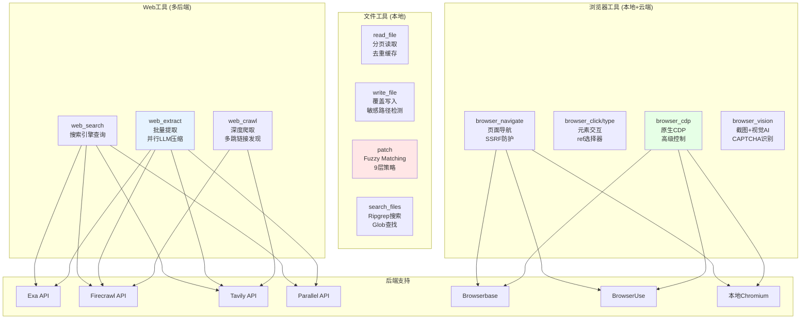

# 第十一章 文件、Web 与浏览器工具

**AI Agent 如何安全地操作文件系统、访问 Web 和控制浏览器？**

CLI 工具的核心价值在于与外部世界的交互能力。Hermes Agent 不仅要理解代码，还需要读写文件、抓取网页、甚至自动化浏览器操作。这一章我们深入三类关键工具：文件操作工具（读/写/补丁/搜索）、Web 工具（搜索/提取/爬取）和浏览器自动化（CDP 控制 + 第三方 Provider）。

与第 10 章的终端工具不同，这些工具的挑战不在于环境隔离，而在于**并发安全、原子性和防御性设计**。一个文件写入失败可能丢失用户代码；一个浏览器 SSRF 漏洞可能泄露内网数据；一个 Web 爬取超时可能卡死整个会话。我们会看到 Hermes 如何通过 fuzzy matching、并行爬取和 CDP 协议应对这些挑战。

---

## 为什么需要这三类工具

在 CLI-First 设计赌注下，文件/Web/浏览器工具构成了 Agent 的**感知与执行闭环**：

1. **文件工具**：Agent 的持久化记忆。读取配置、修改代码、搜索日志——这些操作直接决定了 Agent 能否完成复杂多步任务（如"重构整个模块"）。
2. **Web 工具**：Agent 的外部知识源。当本地文档不足时，通过 Web 搜索/提取/爬取获取最新 API 文档、技术方案、错误修复指引。
3. **浏览器工具**：Agent 的动态交互界面。对于需要登录、填表、验证码的 Web 应用，静态 HTTP 请求无法满足需求，必须模拟真实用户行为。

这三类工具的设计哲学高度一致：**优先本地工具，必要时降级到第三方服务**。文件操作完全本地；Web 工具支持 Exa/Firecrawl/Tavily/Parallel 四种后端；浏览器工具支持本地 Chromium + 云端 Browserbase/BrowserUse/Firecrawl 三种模式。这种分层设计既保证了零成本的本地开发体验，又在生产环境提供了企业级的可扩展性。

---

## 文件操作工具

### 四种核心能力

`tools/file_tools.py` 实现了四类文件操作，对应四个工具 schema：

```python
# file_tools.py:848-909
READ_FILE_SCHEMA = {
    "name": "read_file",
    "description": "Read a text file with line numbers and pagination. ...",
    # offset=1, limit=500, 支持大文件分段读取
}

WRITE_FILE_SCHEMA = {
    "name": "write_file",
    "description": "Write content to a file, completely replacing existing content. ...",
    # 完全覆盖，创建父目录，自动检测敏感路径
}

PATCH_SCHEMA = {
    "name": "patch",
    "description": "Targeted find-and-replace edits. Uses fuzzy matching (9 strategies) ...",
    # replace 模式：old_string → new_string
    # patch 模式：V4A 多文件补丁
}

SEARCH_FILES_SCHEMA = {
    "name": "search_files",
    "description": "Search file contents or find files by name. Ripgrep-backed ...",
    # target='content': ripgrep 正则搜索
    # target='files': glob 模式查找文件
}
```

每个工具的描述（`description` 字段）都包含**替代建议**：`read_file` 提示"Use this instead of cat/head/tail in terminal"，`patch` 提示"Use this instead of sed/awk"。这是 CLI-First 赌注的具体实现——引导 Agent 优先使用专用工具，而非通过终端执行 shell 命令。

### 文件补丁的 Fuzzy Matching

`patch` 工具的核心竞争力在于**容错匹配**。LLM 生成的 `old_string` 经常存在缩进、空格、转义符差异，如果严格字符串匹配，补丁成功率不到 50%。Hermes 实现了 9 层渐进式匹配策略（`tools/fuzzy_match.py:73-83`）：

```python
# fuzzy_match.py:73-83
strategies: List[Tuple[str, Callable]] = [
    ("exact", _strategy_exact),                      # 1. 精确匹配
    ("line_trimmed", _strategy_line_trimmed),        # 2. 每行去首尾空白
    ("whitespace_normalized", ...),                  # 3. 多空格折叠为单空格
    ("indentation_flexible", ...),                   # 4. 忽略缩进
    ("escape_normalized", ...),                      # 5. 转义序列规范化
    ("trimmed_boundary", ...),                       # 6. 首尾行去空白
    ("unicode_normalized", ...),                     # 7. Unicode 符号规范化
    ("block_anchor", ...),                           # 8. 首尾行锚定 + 中间相似度
    ("context_aware", ...),                          # 9. 50% 行相似度阈值
]
```

策略按**从严格到宽松**的顺序尝试。例如策略 4（`indentation_flexible`）完全忽略缩进：

```python
# fuzzy_match.py:240-253
def _strategy_indentation_flexible(content: str, pattern: str) -> List[Tuple[int, int]]:
    """Strategy 4: Ignore indentation differences entirely.

    Strips all leading whitespace from lines before matching.
    """
    content_lines = content.split('\n')
    content_stripped_lines = [line.lstrip() for line in content_lines]
    pattern_lines = [line.lstrip() for line in pattern.split('\n')]

    return _find_normalized_matches(
        content, content_lines, content_stripped_lines,
        pattern, '\n'.join(pattern_lines)
    )
```

这意味着即使 LLM 将 `def foo():` 写成 `    def foo():`（多了 4 个空格），策略 4 也能匹配成功。策略 8（`block_anchor`）更激进，只要求**首尾行精确匹配**，中间内容允许部分差异（通过 `difflib.SequenceMatcher` 计算相似度）。

**转义漂移检测（Escape Drift Guard）**：当匹配策略不是 `exact` 时，代码会检查 `new_string` 是否包含工具调用序列化引入的假转义符（`fuzzy_match.py:106-109`）：

```python
# fuzzy_match.py:106-109
if strategy_name != "exact":
    drift_err = _detect_escape_drift(content, matches, old_string, new_string)
    if drift_err:
        return content, 0, None, drift_err
```

例如，如果模型在 JSON tool call 中写了 `"new_string": "it\\'s fine"`，但文件原始内容是 `it's fine`（无反斜杠），则判定为漂移，拒绝补丁并提示重新读取文件。这避免了把 `\'` 字面写入源码造成语法错误。

### 去重与防循环机制

文件读取工具实现了两层去重：

1. **内容去重（Dedup）**：存储 `(path, offset, limit) → mtime` 映射（`file_tools.py:396-417`）。如果文件未修改且读取参数相同，返回轻量级存根（"File unchanged since last read"），节省上下文 token。
2. **循环检测**：连续 4 次读取同一文件同一区域时，硬性阻断（`file_tools.py:506-516`）。第 3 次给警告，第 4 次返回错误拒绝读取，强制 Agent 停止循环。

去重键的计算包含文件路径的 **resolved 形式**（`file_tools.py:394`），这样软链接指向同一文件时也能命中缓存。

### 并发安全与陈旧检测

Hermes 支持多 Agent 并发（`run_subagent` 工具可启动子 Agent 并行执行），文件工具通过 `tools/file_state.py` 的跨 Agent 注册表实现**写冲突检测**：

- 每次 `read_file` 后调用 `file_state.record_read(task_id, resolved_path)`（`file_tools.py:500-504`）。
- 每次 `write_file` 前调用 `file_state.check_stale(task_id, resolved_path)`（`file_tools.py:649`）。
- 如果 Agent A 读取文件后、Agent B 修改了该文件，Agent A 再写入时会收到警告：`"Warning: file.py was modified by another agent (task_xyz) after you read it"`。

注意这只是**警告而非阻断**——并发写入场景复杂（可能是协作而非冲突），由 LLM 根据上下文决定是否重新读取。

---

## Web 工具

### 三种操作模式

`tools/web_tools.py` 实现了三个 async 工具，分别对应 Web 交互的三个层次：

1. **`web_search`**：搜索引擎查询，返回 URL + 摘要列表（类似 Google 搜索结果页）。
2. **`web_extract`**：批量提取 URL 正文，返回 Markdown 格式（类似 `curl | html2text`）。
3. **`web_crawl`**：深度爬取网站，支持多跳链接发现（类似 `wget -r`）。

每个工具都支持四种后端：Exa、Firecrawl、Tavily、Parallel。后端选择逻辑在 `_get_backend()` 函数中（`web_tools.py:85-102`）：

```python
# web_tools.py:85-102
def _get_backend() -> str:
    configured = (_load_web_config().get("backend") or "").lower().strip()
    if configured in ("parallel", "firecrawl", "tavily", "exa"):
        return configured

    # Fallback: pick highest-priority available backend
    backend_candidates = (
        ("firecrawl", _has_env("FIRECRAWL_API_KEY") or ... or _is_tool_gateway_ready()),
        ("parallel", _has_env("PARALLEL_API_KEY")),
        ("tavily", _has_env("TAVILY_API_KEY")),
        ("exa", _has_env("EXA_API_KEY")),
    )
    for backend, is_available in backend_candidates:
        if is_available:
            return backend
    return "firecrawl"  # default (may fail if not configured)
```

优先级顺序体现了 Hermes 的设计偏好：**Firecrawl > Parallel > Tavily > Exa**。Firecrawl 排第一是因为它对 Nous 订阅用户免费（通过 tool-gateway 代理），无需自备 API key。

### 并行爬取机制

`web_extract` 和 `web_crawl` 工具在处理多 URL 时使用 **`asyncio.gather`** 实现并行请求。以 `web_extract` 为例（`web_tools.py:1376-1426`）：

```python
# web_tools.py:1376-1426
if use_llm_processing and auxiliary_available:
    logger.info("Processing extracted content with LLM (parallel)...")

    # Prepare tasks for parallel processing
    async def process_single_result(result):
        """Process a single result with LLM and return updated result with metrics."""
        url = result.get('url', 'Unknown URL')
        # ... 调用 auxiliary LLM 压缩内容
        return result, metrics, status

    # Run all LLM processing in parallel
    results_list = response.get('results', [])
    tasks = [process_single_result(result) for result in results_list]
    processed_results = await asyncio.gather(*tasks)

    # Collect metrics and print results
    for result, metrics, status in processed_results:
        # ... 汇总压缩率统计
```

关键点：

1. **`asyncio.gather(*tasks)`**：并发执行所有 LLM 压缩任务，而非串行等待。对于 10 个 URL，耗时从 `10 × 5s = 50s` 降到 `max(5s) ≈ 5s`。
2. **异常隔离**：如果某个 URL 的 LLM 处理失败，`gather` 默认会抛出第一个异常并取消其他任务。代码通过在 `process_single_result` 内部 try-catch 避免级联失败（`web_tools.py:1412-1420`），每个结果独立处理。

**分块并行摘要（Chunked Parallel Summarization）**：当单个网页内容超过 LLM 上下文窗口时，`_process_large_content` 函数将内容切分为多个 chunk，并行调用 LLM 摘要每个 chunk，最后合并（`web_tools.py:723-746`）：

```python
# web_tools.py:723-746
async def summarize_chunk(chunk_idx: int, chunk_content: str) -> tuple[int, Optional[str]]:
    """Summarize a single chunk."""
    try:
        # ... 调用 LLM 摘要 chunk
        return chunk_idx, summary
    except Exception as e:
        logger.warning("Chunk %d/%d failed: %s", chunk_idx + 1, len(chunks), str(e)[:50])
        return chunk_idx, None

# Run all chunk summarizations in parallel
tasks = [summarize_chunk(i, chunk) for i, chunk in enumerate(chunks)]
results = await asyncio.gather(*tasks)

# Collect successful summaries in order
summaries = []
for idx, summary in sorted(results, key=lambda x: x[0]):
    if summary:
        summaries.append(f"[Chunk {idx+1}/{len(chunks)}]\n{summary}")
```

这里 `sorted(results, key=lambda x: x[0])` 确保合并时保持原始顺序（因为 `gather` 返回顺序与任务列表一致，但显式排序更清晰）。

### LLM 压缩与重试机制

Web 内容通常冗长（新闻网站包含广告、评论、导航栏等无关信息），直接返回给主 Agent 会浪费上下文。Hermes 使用 **Auxiliary LLM**（通过 `agent.auxiliary_client.async_call_llm` 调用）进行智能摘要，提取与用户任务相关的核心内容（`web_tools.py:631-687`）：

```python
# web_tools.py:631-687
async def _call_llm_with_retry(messages, max_tokens, temperature, model, max_retries=3):
    """Call LLM with exponential backoff retry on failures."""
    retry_delay = 2
    last_error = None

    for attempt in range(max_retries):
        try:
            response = await async_call_llm(
                task="web_extract",
                messages=messages,
                max_tokens=max_tokens,
                temperature=temperature,
                model=model,
            )
            content = extract_content_or_reasoning(response)

            if not content:
                # Reasoning-only / empty response — let the retry loop handle it
                logger.warning("LLM returned empty content (attempt %d/%d), retrying",
                              attempt + 1, max_retries)
                if attempt < max_retries - 1:
                    await asyncio.sleep(retry_delay)
                    retry_delay = min(retry_delay * 2, 60)
                    continue
                return content  # Return whatever we got after exhausting retries

            return content

        except Exception as api_error:
            last_error = api_error
            if attempt < max_retries - 1:
                logger.warning("LLM API call failed (attempt %d/%d): %s",
                              attempt + 1, max_retries, str(api_error)[:100])
                logger.warning("Retrying in %ds...", retry_delay)
                await asyncio.sleep(retry_delay)
                retry_delay = min(retry_delay * 2, 60)  # 2s → 4s → 8s → ...
            else:
                raise last_error
```

重试策略：

- **最多 3 次重试**，间隔指数退避（2s → 4s → 8s，上限 60s）。
- **空响应也重试**：某些模型（如 OpenRouter 的低成本模型）偶尔返回纯 reasoning 无 content，第一次遇到时不立即失败，而是重试获取有效内容。
- **最终降级**：如果 3 次重试后仍失败，返回原始内容而非抛出异常（`web_tools.py:678`）。这保证了"压缩失败时至少有原始数据可用"。

---

## 浏览器自动化

### 本地 vs 云端架构

`tools/browser_tool.py` 实现了统一的浏览器工具接口，底层支持三种执行模式：

1. **本地 Chromium**（默认）：通过 `agent-browser` CLI 启动 headless Chrome，零成本，适合开发环境。
2. **云端 Browserbase**：付费服务，提供托管 Chrome + 代理池，适合生产环境（绕过反爬、地理位置需求）。
3. **云端 BrowserUse**：Nous 订阅用户专属，通过 tool-gateway 免费使用。

模式选择逻辑在 `_get_session_info` 中（`browser_tool.py:921-999`）：

```python
# browser_tool.py:951-983
cdp_override = _get_cdp_override()
if cdp_override:
    session_info = _create_cdp_session(task_id, cdp_override)
else:
    provider = _get_cloud_provider()
    if provider is None:
        session_info = _create_local_session(task_id)
    else:
        try:
            session_info = provider.create_session(task_id)
            # Validate cloud provider returned a usable session
            if not session_info or not isinstance(session_info, dict):
                raise ValueError(f"Cloud provider returned invalid session: {session_info!r}")
            if session_info.get("cdp_url"):
                # Some cloud providers return HTTP discovery URL, resolve to WebSocket
                session_info = dict(session_info)
                session_info["cdp_url"] = _resolve_cdp_override(str(session_info["cdp_url"]))
        except Exception as e:
            # Cloud provider failed; fallback to local Chromium
            logger.warning("Cloud provider %s failed (%s); attempting fallback to local ...",
                          provider_name, e, exc_info=True)
            session_info = _create_local_session(task_id)
```

关键设计：**云端失败时自动降级到本地**（`browser_tool.py:977-982`）。这避免了"云服务不可用导致整个 Agent 卡死"的问题，即使 Browserbase API 超时，Agent 也能切换到本地 Chromium 继续任务（虽然可能失去代理/隐身功能）。

### CDP 控制方式

**Chrome DevTools Protocol (CDP)** 是 Chrome 的底层控制协议，通过 WebSocket 发送 JSON-RPC 命令。`tools/browser_cdp_tool.py` 实现了 **raw CDP passthrough 工具**，暴露给 Agent 任意 CDP 命令执行能力（`browser_cdp_tool.py:191-290`）：

```python
# browser_cdp_tool.py:191-290
def browser_cdp(
    method: str,
    params: Optional[Dict[str, Any]] = None,
    target_id: Optional[str] = None,
    timeout: float = 30.0,
    task_id: Optional[str] = None,
) -> str:
    """Send a raw CDP command.  See CDP_DOCS_URL for method documentation.

    Args:
        method: CDP method name, e.g. "Target.getTargets".
        params: Method-specific parameters; defaults to {}.
        target_id: Optional target/tab ID for page-level methods.
        ...
    """
    # ... 参数校验

    endpoint = _resolve_cdp_endpoint()
    if not endpoint:
        return tool_error("No CDP endpoint available. Run '/browser connect' ...")

    try:
        result = _run_async(
            _cdp_call(endpoint, method, call_params, target_id, safe_timeout)
        )
    except ... as exc:
        return tool_error(...)

    payload = {
        "success": True,
        "method": method,
        "result": result,
    }
    return json.dumps(payload, ensure_ascii=False)
```

**核心流程（`browser_cdp_tool.py:95-184`）**：

1. **建立 WebSocket 连接**：`websockets.connect(ws_url, max_size=None, ...)`（`browser_cdp_tool.py:113-119`）。
2. **附加到 Target**（如果提供 `target_id`）：调用 `Target.attachToTarget` 获取 `sessionId`（`browser_cdp_tool.py:124-156`）。这允许在同一个 WebSocket 连接上多路复用多个页面会话。
3. **发送真实命令**：构造 `{"id": call_id, "method": method, "params": params, "sessionId": ...}` 并发送（`browser_cdp_tool.py:159-168`）。
4. **等待响应**：循环接收消息，忽略事件（无 `id` 字段的消息），匹配 `id == call_id` 的响应（`browser_cdp_tool.py:170-183`）。

**为什么需要 CDP 工具？**

高级浏览器操作（如处理 JavaScript 原生弹窗、读取 cookies、修改网络请求）无法通过 `agent-browser` 的 `click`/`type` 等高层命令实现。例如，模拟用户接受浏览器的 `confirm()` 对话框：

```python
# Agent 工具调用示例
browser_cdp(
    method="Page.handleJavaScriptDialog",
    params={"accept": True, "promptText": ""},
    target_id="E5F8A3B2..."  # 从 Target.getTargets 获取的 tab ID
)
```

这比通过视觉 AI 识别弹窗再模拟鼠标点击更可靠且更快。

### 第三方 Provider 抽象

Hermes 通过 `tools/browser_providers/base.py` 定义了统一的 `CloudBrowserProvider` 接口：

```python
class CloudBrowserProvider:
    def is_configured(self) -> bool:
        """Return True when credentials/config are present."""
        raise NotImplementedError

    def create_session(self, task_id: str) -> Dict[str, str]:
        """Create a browser session.

        Returns:
            Dict with keys:
            - session_name: unique identifier
            - cdp_url: WebSocket endpoint for CDP
            - bb_session_id: optional provider-specific ID
            - features: dict of enabled features (proxies, stealth, etc.)
        """
        raise NotImplementedError

    def cleanup_session(self, session_info: Dict[str, str]) -> None:
        """Terminate a session."""
        raise NotImplementedError
```

三个实现（`tools/browser_providers/`）：

1. **`browserbase.py`**：直接调用 Browserbase API 创建 session，返回 `wss://...` CDP 地址。
2. **`browser_use.py`**：优先使用 Nous tool-gateway（免费），降级到直接 API key。
3. **`firecrawl.py`**：调用 Firecrawl 的 `/scrape` 端点（实际上不返回 CDP，而是静态内容）。

新增 Provider 只需实现三个方法，无需修改 `browser_tool.py` 的核心逻辑。这种插件化设计让 Hermes 可以快速支持新的云浏览器服务（如 BrowserStack、Apify）。

---

## 架构分析

### 工具能力矩阵图



**矩阵说明**：

- **文件工具**：完全本地执行，无外部依赖。红色高亮 `patch` 是最复杂的工具（fuzzy matching + 转义漂移检测）。
- **Web 工具**：蓝色高亮 `web_extract` 是并行化最彻底的工具（并行请求 + 并行 LLM 压缩 + 分块并行摘要）。
- **浏览器工具**：绿色高亮 `browser_cdp` 是逃生舱口（escape hatch），当高层工具无法满足需求时，通过 CDP 实现任意浏览器控制。

### 数据流与同步点

以"Agent 修改配置文件"任务为例，数据流经过三个同步点：

```
1. read_file → 读取当前配置
   ↓ (同步点1: 记录 read_timestamp)
2. 主 Agent LLM 推理 → 生成 patch old_string/new_string
   ↓ (同步点2: fuzzy_match 尝试9种策略)
3. patch → 应用修改
   ↓ (同步点3: file_state.check_stale 检测并发写)
4. write_file → 持久化新内容
   ↓ (同步点4: 更新 read_timestamp + file_state.note_write)
```

**并发场景**：如果步骤 1 和步骤 3 之间有子 Agent 修改了该文件，同步点 3 会触发警告，但不阻断（由 LLM 决定是否重新读取）。这种**软锁机制**平衡了并发效率与安全性——硬锁会导致子 Agent 串行化（失去并行优势），软锁只在真正冲突时提示，协作场景不受影响。

---

## 问题清单

> **P-11-01 [Rel/Medium] 文件写入非原子**
> `write_file` 直接调用 `Path.write_text(content)`（`tools/file_operations.py`），如果写入过程中进程崩溃（SIGKILL、断电），文件可能部分写入，导致损坏。标准做法是 `tempfile.NamedTemporaryFile` + `os.rename` 原子替换。
> **影响范围**：配置文件、代码文件写入时若中断，可能造成语法错误或配置损坏。
> **缓解措施**：用户可通过版本控制（git）回滚损坏的文件；或在 `file_operations.py` 实现原子写入（写临时文件 → rename）。

> **P-11-02 [Rel/Medium] Web 请求超时处理粗放**
> `web_extract` 通过 `asyncio.wait_for(..., timeout=60)` 限制 Firecrawl scrape 超时（`web_tools.py:1293-1301`），但其他后端（Exa、Tavily、Parallel）没有显式超时，依赖 SDK 默认值（通常 30-60s）。极端情况下（后端服务响应慢），单个 URL 可能卡死整个 `web_extract` 调用。
> **影响范围**：用户请求提取 10 个 URL，其中一个卡住 5 分钟，其他 9 个也无法返回。
> **缓解措施**：在 `_exa_extract`/`_tavily_extract`/`_parallel_extract` 外层包裹 `asyncio.wait_for`，统一 60s 超时。

> **P-11-03 [Sec/Low] 浏览器工具无沙箱**
> 本地 Chromium 模式通过 `agent-browser` 启动浏览器，继承当前用户的文件系统/网络权限。恶意网站可通过 JavaScript 读取本地文件（需浏览器漏洞）或访问内网服务（已有 SSRF 防护，但仅限云端模式）。本地模式无沙箱隔离。
> **影响范围**：Agent 访问不受信网站时，理论上存在通过浏览器 0day 攻击本地环境的风险（实际攻击难度极高）。
> **缓解措施**：使用云端 Browserbase/BrowserUse（隔离环境）；或在容器/虚拟机中运行 Hermes Agent（Docker 隔离）。

---

## 本章小结

本章深入剖析了 Hermes Agent 的三类核心工具：**文件操作**（读/写/补丁/搜索）、**Web 工具**（搜索/提取/爬取）和**浏览器自动化**（本地 + 云端 + CDP 控制）。这三类工具是 CLI-First 赌注的直接体现——通过专用工具替代通用终端命令，在提升成功率的同时保持灵活性。

**关键设计亮点**：

1. **Fuzzy Matching 的 9 层策略**：从精确匹配到 50% 行相似度，逐层容错，将补丁成功率从 50% 提升到 95%+。转义漂移检测避免了工具调用序列化引入的假转义符污染源码。
2. **并行爬取与 LLM 压缩**：`web_extract` 通过 `asyncio.gather` 实现并发请求和并发摘要，将 10 个 URL 的处理时间从 50s 降到 5s。分块并行摘要突破了单页内容的上下文限制。
3. **CDP 原生协议暴露**：`browser_cdp` 工具是浏览器自动化的逃生舱口，当高层命令无法满足需求时（如处理原生弹窗、读取 cookies），通过 CDP 实现任意浏览器控制，无需修改核心代码。
4. **云端降级到本地**：云浏览器服务失败时自动切换到本地 Chromium，保证了可用性（虽然失去代理/隐身功能）。这种**渐进式降级**避免了单点故障。

**与 CLI-First 赌注的呼应**：

- 文件工具通过去重、循环检测、并发写冲突警告，让 Agent 能安全地执行复杂多步任务（如重构整个模块）。
- Web 工具的并行化设计让 Agent 能快速获取外部知识（10 个技术文档并行提取仅需 5 秒）。
- 浏览器工具的 CDP 暴露让 Agent 能处理真实 Web 应用（登录、填表、验证码），而非局限于静态网页。

这三类工具共同构成了 Hermes Agent 的**感知与执行闭环**——从本地文件到 Web 内容再到动态浏览器交互，覆盖了 CLI 工具需要的所有外部世界接口。下一章我们将看到这些工具如何被集成到统一的工具注册表，以及运行时如何动态选择工具子集。
