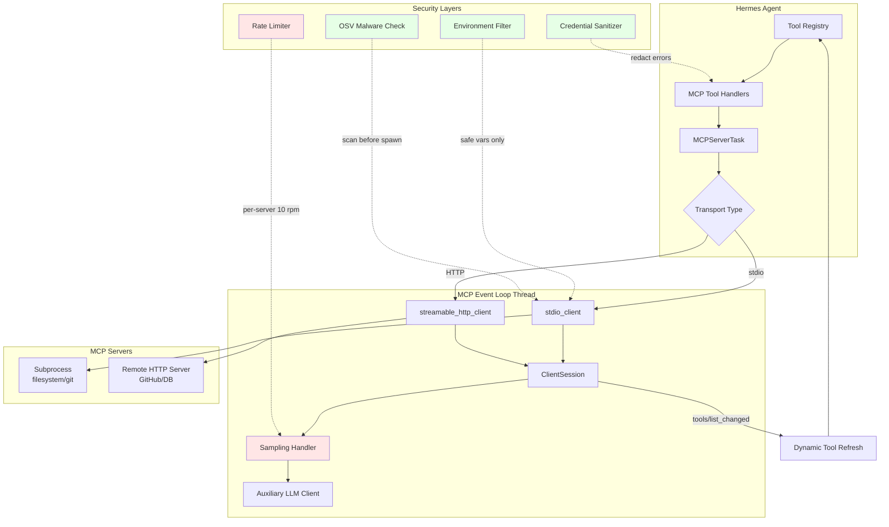
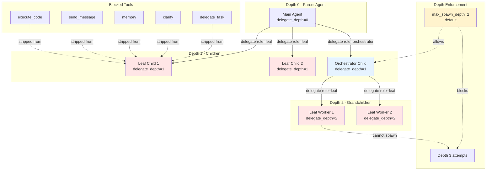

# 第十二章：MCP、代码执行与委派

如何让 AI Agent 安全地调用外部服务（MCP）、执行任意代码、并将子任务委派给其他 Agent？

这个问题直击 Hermes 的两大设计赌注：**Learning Loop**（通过 MCP 扩展能力边界）和 **Run Anywhere**（在多种执行环境中运行代码）。本章剖析 Hermes 的能力扩展架构，揭示其灵活性背后的代价——安全边界的薄弱环节。

---

## 为什么需要能力扩展

内置工具（文件操作、终端命令、Web 搜索）覆盖常见场景，但 AI Agent 在特定领域（数据库查询、API 集成、云服务管理）依然受限。Hermes 通过三种机制突破边界：

1. **MCP 协议**：连接外部工具服务器，动态发现和调用工具（如 GitHub API、数据库查询）
2. **代码执行沙箱**：让 LLM 编写多步工具链脚本，折叠推理轮次，降低延迟和成本
3. **子 Agent 委派**：将复杂任务分解为并行子任务，每个子 Agent 拥有独立上下文和工具集

这些机制共同支撑 Hermes 的 **Learning Loop** 愿景：Agent 能够通过外部工具不断学习新能力，而非依赖固定的工具清单。但这种开放性也带来新的安全和可靠性挑战。

---

## MCP 协议集成

### 双传输模式：stdio 与 HTTP

MCP（Model Context Protocol）支持两种传输方式，Hermes 全部实现：

**1. stdio 传输（子进程管道）**

服务器作为子进程启动，通过标准输入输出与 Hermes 通信：

```python
# tools/mcp_tool.py:931-984
async def _run_stdio(self, config: dict):
    """Run the server using stdio transport."""
    command = config.get("command")
    args = config.get("args", [])
    user_env = config.get("env")

    if not command:
        raise ValueError(
            f"MCP server '{self.name}' has no 'command' in config"
        )

    safe_env = _build_safe_env(user_env)
    command, safe_env = _resolve_stdio_command(command, safe_env)

    # Check package against OSV malware database before spawning
    from tools.osv_check import check_package_for_malware
    malware_error = check_package_for_malware(command, args)
    if malware_error:
        raise ValueError(
            f"MCP server '{self.name}': {malware_error}"
        )

    server_params = StdioServerParameters(
        command=command,
        args=args,
        env=safe_env if safe_env else None,
    )

    sampling_kwargs = self._sampling.session_kwargs() if self._sampling else {}
    if _MCP_NOTIFICATION_TYPES and _MCP_MESSAGE_HANDLER_SUPPORTED:
        sampling_kwargs["message_handler"] = self._make_message_handler()

    # Snapshot child PIDs before spawning so we can track the new one.
    pids_before = _snapshot_child_pids()
    async with stdio_client(server_params) as (read_stream, write_stream):
        # Capture the newly spawned subprocess PID for force-kill cleanup.
        new_pids = _snapshot_child_pids() - pids_before
        if new_pids:
            with _lock:
                _stdio_pids.update(new_pids)
        async with ClientSession(read_stream, write_stream, **sampling_kwargs) as session:
            await session.initialize()
            self.session = session
            await self._discover_tools()
            self._ready.set()
            # stdio transport does not use OAuth, but we still honor
            # _reconnect_event (e.g. future manual /mcp refresh) for
            # consistency with _run_http.
            await self._wait_for_lifecycle_event()
    # Context exited cleanly — subprocess was terminated by the SDK.
    if new_pids:
        with _lock:
            _stdio_pids.difference_update(new_pids)
```

**关键安全机制**：
- 环境变量过滤（`_build_safe_env`，`tools/mcp_tool.py:194-210`）：只传递 `PATH`、`HOME`、`XDG_*` 等安全变量，阻止凭证泄露
- OSV 恶意软件检查（`tools/mcp_tool.py:945-951`）：在启动前扫描 npm 包
- 子进程 PID 追踪（`tools/mcp_tool.py:963-983`）：优雅关闭失败时可强制杀死

**2. HTTP 传输（StreamableHTTP）**

服务器作为独立 HTTP 服务运行，支持 OAuth 2.1 PKCE 认证：

```python
# tools/mcp_tool.py:985-1071
async def _run_http(self, config: dict):
    """Run the server using HTTP/StreamableHTTP transport."""
    if not _MCP_HTTP_AVAILABLE:
        raise ImportError(
            f"MCP server '{self.name}' requires HTTP transport but "
            "mcp.client.streamable_http is not available. "
            "Upgrade the mcp package to get HTTP support."
        )

    url = config["url"]
    headers = dict(config.get("headers") or {})
    connect_timeout = config.get("connect_timeout", _DEFAULT_CONNECT_TIMEOUT)

    # OAuth 2.1 PKCE: route through the central MCPOAuthManager so the
    # same provider instance is reused across reconnects, pre-flow
    # disk-watch is active, and config-time CLI code paths share state.
    _oauth_auth = None
    if self._auth_type == "oauth":
        try:
            from tools.mcp_oauth_manager import get_manager
            _oauth_auth = get_manager().get_or_build_provider(
                self.name, url, config.get("oauth"),
            )
        except Exception as exc:
            logger.warning("MCP OAuth setup failed for '%s': %s", self.name, exc)
            raise

    sampling_kwargs = self._sampling.session_kwargs() if self._sampling else {}
    if _MCP_NOTIFICATION_TYPES and _MCP_MESSAGE_HANDLER_SUPPORTED:
        sampling_kwargs["message_handler"] = self._make_message_handler()

    if _MCP_NEW_HTTP:
        # New API (mcp >= 1.24.0): build an explicit httpx.AsyncClient
        import httpx

        client_kwargs: dict = {
            "follow_redirects": True,
            "timeout": httpx.Timeout(float(connect_timeout), read=300.0),
        }
        if headers:
            client_kwargs["headers"] = headers
        if _oauth_auth is not None:
            client_kwargs["auth"] = _oauth_auth

        async with httpx.AsyncClient(**client_kwargs) as http_client:
            async with streamable_http_client(url, http_client=http_client) as (
                read_stream, write_stream, _get_session_id,
            ):
                async with ClientSession(read_stream, write_stream, **sampling_kwargs) as session:
                    await session.initialize()
                    self.session = session
                    await self._discover_tools()
                    self._ready.set()
                    reason = await self._wait_for_lifecycle_event()
                    if reason == "reconnect":
                        logger.info(
                            "MCP server '%s': reconnect requested — "
                            "tearing down HTTP session", self.name,
                        )
```

**传输选择策略**：
- stdio：本地工具服务器（文件系统、Git），零网络开销
- HTTP：远程服务、需要认证的 API（GitHub、数据库）

### 重连策略与指数退避

MCP 连接可能因网络抖动、服务器重启而中断。Hermes 实现指数退避重连（`tools/mcp_tool.py:1084-1204`）：

```python
# tools/mcp_tool.py:163-167
_DEFAULT_TOOL_TIMEOUT = 120      # seconds for tool calls
_DEFAULT_CONNECT_TIMEOUT = 60    # seconds for initial connection per server
_MAX_RECONNECT_RETRIES = 5
_MAX_INITIAL_CONNECT_RETRIES = 3 # retries for the very first connection attempt
_MAX_BACKOFF_SECONDS = 60
```

**重连状态机**（`tools/mcp_tool.py:1113-1204`）：

```python
retries = 0
initial_retries = 0
backoff = 1.0

while True:
    try:
        if self._is_http():
            await self._run_http(config)
        else:
            await self._run_stdio(config)
        # Transport returned cleanly. Two cases:
        #  - _shutdown_event was set: exit the run loop entirely.
        #  - _reconnect_event was set (auth recovery): loop back and
        #    rebuild the MCP session with fresh credentials.
        if self._shutdown_event.is_set():
            break
        logger.info(
            "MCP server '%s': reconnecting (OAuth recovery or "
            "manual refresh)",
            self.name,
        )
        continue
    except Exception as exc:
        self.session = None

        # If this is the first connection attempt, retry with backoff
        if not self._ready.is_set():
            initial_retries += 1
            if initial_retries > _MAX_INITIAL_CONNECT_RETRIES:
                logger.warning(
                    "MCP server '%s' failed initial connection after "
                    "%d attempts, giving up: %s",
                    self.name, _MAX_INITIAL_CONNECT_RETRIES, exc,
                )
                self._error = exc
                self._ready.set()
                return

            logger.warning(
                "MCP server '%s' initial connection failed "
                "(attempt %d/%d), retrying in %.0fs: %s",
                self.name, initial_retries,
                _MAX_INITIAL_CONNECT_RETRIES, backoff, exc,
            )
            await asyncio.sleep(backoff)
            backoff = min(backoff * 2, _MAX_BACKOFF_SECONDS)
            continue

        # Runtime reconnection after successful initial connection
        retries += 1
        if retries > _MAX_RECONNECT_RETRIES:
            logger.warning(
                "MCP server '%s' failed after %d reconnection attempts, "
                "giving up: %s",
                self.name, _MAX_RECONNECT_RETRIES, exc,
            )
            return

        logger.warning(
            "MCP server '%s' connection lost (attempt %d/%d), "
            "reconnecting in %.0fs: %s",
            self.name, retries, _MAX_RECONNECT_RETRIES,
            backoff, exc,
        )
        await asyncio.sleep(backoff)
        backoff = min(backoff * 2, _MAX_BACKOFF_SECONDS)
```

**参数特点**：
- 初始连接：最多 3 次重试（`_MAX_INITIAL_CONNECT_RETRIES`），避免启动阻塞
- 运行时重连：最多 5 次重试（`_MAX_RECONNECT_RETRIES`）
- 退避上限：60 秒（`_MAX_BACKOFF_SECONDS`），避免无限等待

> **P-12-03 [Rel/Medium] MCP 后台线程无 watchdog**
>
> MCP 服务器运行在专用事件循环线程（`tools/mcp_tool.py:1528-1541`），若线程因未捕获异常崩溃，调用线程会在 `_run_on_mcp_loop` 的 `future.result()` 处永久阻塞（`tools/mcp_tool.py:1544-1574`）。应添加线程健康检查或超时断路器。

### 采样支持与速率限制

MCP 服务器可通过 `sampling/createMessage` 请求 LLM 补全（如代码生成、分析）。Hermes 通过 `SamplingHandler` 处理（`tools/mcp_tool.py:403-767`）：

**每服务器速率限制**（`tools/mcp_tool.py:418-449`）：

```python
class SamplingHandler:
    def __init__(self, server_name: str, config: dict):
        self.server_name = server_name
        self.max_rpm = _safe_numeric(config.get("max_rpm", 10), 10, int)
        self.timeout = _safe_numeric(config.get("timeout", 30), 30, float)
        self.max_tokens_cap = _safe_numeric(config.get("max_tokens_cap", 4096), 4096, int)
        self.max_tool_rounds = _safe_numeric(
            config.get("max_tool_rounds", 5), 5, int, minimum=0,
        )
        # ...
        self._rate_timestamps: List[float] = []
        self._tool_loop_count = 0
        self.metrics = {"requests": 0, "errors": 0, "tokens_used": 0, "tool_use_count": 0}

    def _check_rate_limit(self) -> bool:
        """Sliding-window rate limiter.  Returns True if request is allowed."""
        now = time.time()
        window = now - 60
        self._rate_timestamps[:] = [t for t in self._rate_timestamps if t > window]
        if len(self._rate_timestamps) >= self.max_rpm:
            return False
        self._rate_timestamps.append(now)
        return True
```

**工具循环预算**（`tools/mcp_tool.py:558-570`）：

```python
def _build_tool_use_result(self, choice, response):
    """Build a CreateMessageResultWithTools from an LLM tool_calls response."""
    self.metrics["tool_use_count"] += 1

    # Tool loop governance
    if self.max_tool_rounds == 0:
        self._tool_loop_count = 0
        return self._error(
            f"Tool loops disabled for server '{self.server_name}' (max_tool_rounds=0)"
        )

    self._tool_loop_count += 1
    if self._tool_loop_count > self.max_tool_rounds:
        self._tool_loop_count = 0
        return self._error(
            f"Tool loop limit exceeded for server '{self.server_name}' "
            f"(max {self.max_tool_rounds} rounds)"
        )
```

> **P-12-01 [Sec/High] MCP 采样速率限制弱**
>
> 速率限制是 **per-server**（每个 `SamplingHandler` 实例独立），无全局配额。恶意 MCP 服务器可通过启动多个实例绕过限制。应在 `tools/mcp_tool.py` 模块层级添加全局限流器，或在配置中强制单例服务器。

### 凭证剥离与错误消毒

MCP 错误消息可能泄露 API 密钥或 token。`_sanitize_error` 函数通过正则移除凭证（`tools/mcp_tool.py:175-219`）：

```python
# tools/mcp_tool.py:175-187
_CREDENTIAL_PATTERN = re.compile(
    r"(?:"
    r"ghp_[A-Za-z0-9_]{1,255}"           # GitHub PAT
    r"|sk-[A-Za-z0-9_]{1,255}"           # OpenAI-style key
    r"|Bearer\s+\S+"                      # Bearer token
    r"|token=[^\s&,;\"']{1,255}"         # token=...
    r"|key=[^\s&,;\"']{1,255}"           # key=...
    r"|API_KEY=[^\s&,;\"']{1,255}"       # API_KEY=...
    r"|password=[^\s&,;\"']{1,255}"      # password=...
    r"|secret=[^\s&,;\"']{1,255}"        # secret=...
    r")",
    re.IGNORECASE,
)

def _sanitize_error(text: str) -> str:
    """Strip credential-like patterns from error text before returning to LLM."""
    return _CREDENTIAL_PATTERN.sub("[REDACTED]", text)
```

**应用场景**：
- 工具调用错误（`tools/mcp_tool.py:1705-1707`）
- 采样 LLM 响应（`tools/mcp_tool.py:624`）
- 连接失败消息（`tools/mcp_tool.py:375`）

> **P-12-02 [Sec/Medium] 凭证清除不完整**
>
> 正则未覆盖所有凭证格式（如 AWS `AKIA...` 密钥、JWT token、Base64 编码密钥）。应集成专用凭证扫描库（如 `detect-secrets`）或扩展正则列表。

### MCP 架构图



---

## 代码执行沙箱

### 双传输架构：UDS 与文件 RPC

代码执行工具让 LLM 编写 Python 脚本调用 Hermes 工具，折叠多步推理为单次调用。Hermes 支持本地（Unix Domain Socket）和远程（文件 RPC）两种传输（`tools/code_execution_tool.py:1-29`）：

**本地后端（UDS）**：

```python
# tools/code_execution_tool.py:10-14
#   **Local backend (UDS):**
#   1. Parent generates a `hermes_tools.py` stub module with UDS RPC functions
#   2. Parent opens a Unix domain socket and starts an RPC listener thread
#   3. Parent spawns a child process that runs the LLM's script
#   4. Tool calls travel over the UDS back to the parent for dispatch
```

**远程后端（文件 RPC）**：

```python
# tools/code_execution_tool.py:16-22
#   **Remote backends (file-based RPC):**
#   1. Parent generates `hermes_tools.py` with file-based RPC stubs
#   2. Parent ships both files to the remote environment
#   3. Script runs inside the terminal backend (Docker/SSH/Modal/Daytona/etc.)
#   4. Tool calls are written as request files; a polling thread on the parent
#      reads them via env.execute(), dispatches, and writes response files
#   5. The script polls for response files and continues
```

**传输生成代码对比**（`tools/code_execution_tool.py:132-163`）：

```python
def generate_hermes_tools_module(enabled_tools: List[str],
                                 transport: str = "uds") -> str:
    """
    Build the source code for the hermes_tools.py stub module.

    Only tools in both SANDBOX_ALLOWED_TOOLS and enabled_tools get stubs.

    Args:
        enabled_tools: Tool names enabled in the current session.
        transport: ``"uds"`` for Unix domain socket (local backend) or
                   ``"file"`` for file-based RPC (remote backends).
    """
    tools_to_generate = sorted(SANDBOX_ALLOWED_TOOLS & set(enabled_tools))

    stub_functions = []
    for tool_name in tools_to_generate:
        schema = registry.get_schema(tool_name)
        if not schema:
            continue
        stub_functions.append(_generate_tool_stub(schema, transport))

    if transport == "file":
        header = _FILE_TRANSPORT_HEADER
    else:
        header = _UDS_TRANSPORT_HEADER

    return header + "\n".join(stub_functions)
```

**UDS 传输头**（`tools/code_execution_tool.py:208-220`）：

```python
_UDS_TRANSPORT_HEADER = '''\
"""Auto-generated Hermes tools RPC stubs."""
import json, os, socket, shlex, time

_sock = None

def _connect():
    global _sock
    if _sock is None:
        _sock = socket.socket(socket.AF_UNIX, socket.SOCK_STREAM)
        _sock.connect(os.environ["HERMES_RPC_SOCKET"])
        _sock.settimeout(300)
    return _sock
'''
```

**文件传输头**（`tools/code_execution_tool.py:256-285`）：

```python
def _call(tool_name, args):
    """Send a tool call request via file-based RPC and wait for response."""
    request_id = str(time.time_ns())
    request_file = os.path.join(os.environ["HERMES_RPC_DIR"], f"req_{request_id}.json")
    response_file = os.path.join(os.environ["HERMES_RPC_DIR"], f"resp_{request_id}.json")

    with open(request_file, "w") as f:
        json.dump({"tool": tool_name, "args": args, "id": request_id}, f)

    # Poll for response file (timeout 300s)
    deadline = time.time() + 300
    while time.time() < deadline:
        if os.path.exists(response_file):
            with open(response_file) as f:
                resp = json.load(f)
            os.unlink(response_file)
            if resp.get("error"):
                raise Exception(resp["error"])
            return resp.get("result", "")
        time.sleep(0.1)
    raise Exception(f"Tool call {tool_name} timed out after 300s")
```

### 沙箱工具白名单

只有 7 个工具可在沙箱中调用（`tools/code_execution_tool.py:55-64`）：

```python
# The 7 tools allowed inside the sandbox. The intersection of this list
# and the session's enabled tools determines which stubs are generated.
SANDBOX_ALLOWED_TOOLS = frozenset([
    "web_search",
    "web_extract",
    "read",
    "write",
    "glob",
    "grep",
    "bash",
])
```

**设计理由**：
- 禁止 `delegate_task`：避免递归委派炸弹
- 禁止 `clarify`：沙箱无法与用户交互
- 禁止 `memory`：避免污染全局记忆
- 禁止 `send_message`：防止跨平台副作用

> **P-12-05 [Sec/Low] 代码执行沙箱隔离弱**
>
> 沙箱仅通过工具白名单限制能力，脚本本身在与父进程相同的 Python 环境运行（共享文件系统、网络访问权限）。恶意 LLM 可直接导入 `subprocess` 或 `os` 执行任意命令。应使用 Docker/gVisor 容器隔离，或集成 Python 沙箱库（如 `RestrictedPython`）。

---

## 子 Agent 委派

### 委派深度与层级限制

子 Agent 委派允许父 Agent 将任务分解为并行子任务。每个子 Agent 拥有独立的 `task_id`、终端会话和工具集（`tools/delegate_tool.py:1-17`）。

**深度配置**（`tools/delegate_tool.py:70-74`）：

```python
MAX_DEPTH = 1  # flat by default: parent (0) -> child (1); grandchild rejected unless max_spawn_depth raised.
# Configurable depth cap consulted by _get_max_spawn_depth; MAX_DEPTH
# stays as the default fallback and is still the symbol tests import.
_MIN_SPAWN_DEPTH = 1
_MAX_SPAWN_DEPTH_CAP = 3
```

**深度检查逻辑**（`tools/delegate_tool.py:324-359`）：

```python
def _get_max_spawn_depth() -> int:
    """Read delegation.max_spawn_depth from config, clamped to [1, 3].

    depth 0 = parent agent.  max_spawn_depth = N means agents at depths
    0..N-1 can spawn; depth N is the leaf floor.  Default 1 is flat:
    parent spawns children (depth 1), depth-1 children cannot spawn
    (blocked by this guard AND, for leaf children, by the delegation
    toolset strip).

    Raise to 2 or 3 to unlock nested orchestration. role="orchestrator"
    removes the toolset strip for depth-1 children when
    max_spawn_depth >= 2, enabling them to spawn their own workers.
    """
    cfg = _load_config()
    val = cfg.get("max_spawn_depth")
    if val is None:
        return MAX_DEPTH
    try:
        ival = int(val)
    except (TypeError, ValueError, OverflowError):
        logger.warning(
            "delegation.max_spawn_depth=%r is not a valid integer; " "using default %d",
            val,
            MAX_DEPTH,
        )
        return MAX_DEPTH
    clamped = max(_MIN_SPAWN_DEPTH, min(_MAX_SPAWN_DEPTH_CAP, ival))
    if clamped != ival:
        logger.warning(
            "delegation.max_spawn_depth=%d out of range [%d, %d]; " "clamping to %d",
            ival,
            _MIN_SPAWN_DEPTH,
            _MAX_SPAWN_DEPTH_CAP,
            clamped,
        )
    return clamped
```

**深度强制执行**（`tools/delegate_tool.py:1500-1514`）：

```python
# Depth limit — configurable via delegation.max_spawn_depth,
# default 2 for parity with the original MAX_DEPTH constant.
depth = getattr(parent_agent, "_delegate_depth", 0)
max_spawn = _get_max_spawn_depth()
if depth >= max_spawn:
    return json.dumps(
        {
            "error": (
                f"Delegation depth limit reached (depth={depth}, "
                f"max_spawn_depth={max_spawn}). Raise "
                f"delegation.max_spawn_depth in config.yaml if deeper "
                f"nesting is required (cap: {_MAX_SPAWN_DEPTH_CAP})."
            )
        }
    )
```

> **P-12-04 [Rel/Medium] 委派深度无硬限制**
>
> 虽然 `_MAX_SPAWN_DEPTH_CAP = 3`，但这是配置验证的钳位值，不是运行时强制边界。恶意代理可通过直接修改 `_delegate_depth` 属性绕过限制。应在 `_spawn_child` 中添加断言：`assert child._delegate_depth <= _MAX_SPAWN_DEPTH_CAP`。

### 工具集剥离与角色系统

子 Agent 默认为 `leaf`（叶节点），无法进一步委派。父 Agent 可指定 `role="orchestrator"` 允许子 Agent 再次委派（`tools/delegate_tool.py:769-774`）：

```python
# the normalised role (_normalize_role ran in delegate_task) so
# we only deal with 'leaf' or 'orchestrator' here.
child_depth = getattr(parent_agent, "_delegate_depth", 0) + 1
max_spawn = _get_max_spawn_depth()
orchestrator_ok = _get_orchestrator_enabled() and child_depth < max_spawn
effective_role = role if (role == "orchestrator" and orchestrator_ok) else "leaf"
```

**受限工具集**（`tools/delegate_tool.py:39-48`）：

```python
# Tools that children must never have access to
DELEGATE_BLOCKED_TOOLS = frozenset(
    [
        "delegate_task",  # no recursive delegation
        "clarify",  # no user interaction
        "memory",  # no writes to shared MEMORY.md
        "send_message",  # no cross-platform side effects
        "execute_code",  # children should reason step-by-step, not write scripts
    ]
)
```

**系统提示生成**（`tools/delegate_tool.py:433-503`）：

```python
def _build_child_system_prompt(
    task: str,
    context: str,
    *,
    workspace_path: Optional[str] = None,
    role: str = "leaf",
    max_spawn_depth: int = 2,
    child_depth: int = 1,
) -> str:
    """Build a focused system prompt for a child agent."""
    parts = [
        f"You are a focused subagent. Your ONLY goal is:\n\n{task}\n",
        "Do NOT ask clarification questions — your parent already provided "
        "all the context you need. Work autonomously with the tools available.",
    ]
    if context:
        parts.append(f"\n## Context from Parent\n\n{context}")
    if workspace_path:
        parts.append(f"\n## Workspace\n\nYour working directory: `{workspace_path}`")

    if role == "orchestrator":
        child_note = (
            "Your own children MUST be leaves (cannot delegate further) "
            "because they would be at the depth floor — you cannot pass "
            "role='orchestrator' to your own delegate_task calls."
            if child_depth + 1 >= max_spawn_depth
            else "Your own children can themselves be orchestrators or leaves, "
            "depending on the `role` you pass to delegate_task. Default is "
            "'leaf'; pass role='orchestrator' explicitly when a child "
            "should coordinate multiple workers."
        )
        parts.append(
            "\n## Delegation Authority\n\n"
            "You are an **orchestrator** subagent with access to the "
            "delegate_task tool. Use it to spawn worker agents for parallel "
            "subtasks. Each worker gets its own terminal session (isolated "
            "working directory and file state).\n\n"
            "You are responsible for breaking down your task, delegating to "
            "workers, collecting their results, and synthesizing the final "
            "answer. Workers cannot ask you questions — provide them with "
            "complete, self-contained task instructions.\n\n"
            f"NOTE: You are at depth {child_depth}. The delegation tree "
            f"is capped at max_spawn_depth={max_spawn_depth}. {child_note}"
        )
    else:
        parts.append(
            "\n## No Further Delegation\n\n"
            "You are a **leaf** subagent. You do NOT have access to "
            "delegate_task, clarify, memory, or send_message. Solve your "
            "task directly using the tools available (file ops, terminal, "
            "web, etc.).\n\n"
            "When you complete your task, respond with a concise summary — "
            "your parent only sees your final response, not intermediate "
            "tool calls."
        )
    return "\n".join(parts)
```

### 委派层级架构图



---

## 辅助工具（图像生成、定时任务）

### 图像生成可插拔后端

Hermes 通过 `ImageGenProvider` ABC 支持可插拔图像生成后端（`agent/image_gen_provider.py:51-143`）：

```python
class ImageGenProvider(abc.ABC):
    """Abstract base class for an image generation backend.

    Subclasses must implement :meth:`generate`. Everything else has sane
    defaults — override only what your provider needs.
    """

    @property
    @abc.abstractmethod
    def name(self) -> str:
        """Stable short identifier used in ``image_gen.provider`` config.

        Lowercase, no spaces. Examples: ``fal``, ``openai``, ``replicate``.
        """

    @property
    def display_name(self) -> str:
        """Human-readable label shown in ``hermes tools``. Defaults to ``name.title()``."""
        return self.name.title()

    def is_available(self) -> bool:
        """Return True when this provider can service calls.

        Typically checks for a required API key. Default: True
        (providers with no external dependencies are always available).
        """
        return True

    def list_models(self) -> List[Dict[str, Any]]:
        """Return catalog entries for ``hermes tools`` model picker."""
        return []

    @abc.abstractmethod
    def generate(
        self,
        prompt: str,
        aspect_ratio: str = DEFAULT_ASPECT_RATIO,
        **kwargs: Any,
    ) -> Dict[str, Any]:
        """Generate an image.

        Implementations should return the dict from :func:`success_response`
        or :func:`error_response`. ``kwargs`` may contain forward-compat
        parameters future versions of the schema will expose — implementations
        should ignore unknown keys.
        """
```

**内置 FAL 提供者支持 9 种模型**（`tools/image_generation_tool.py:66-289`）：
- FLUX 2 Klein 9B（<1s，$0.006/MP）
- FLUX 2 Pro（~6s，$0.03/MP）
- Z-Image Turbo（~2s，$0.005/MP）
- Nano Banana Pro（Gemini 3 Pro，~8s）
- GPT Image 1.5/2（~15-20s）
- Ideogram V3（~5s，最佳排版）
- Recraft V4 Pro（~8s，品牌设计）
- Qwen Image（~12s，复杂文字）

### 定时任务安全扫描

Cron 任务在无用户上下文的独立会话中运行，需严格防护提示注入（`tools/cronjob_tools.py:41-68`）：

```python
# Cron prompt scanning — critical-severity patterns only, since cron prompts
# run in fresh sessions with full tool access.
_CRON_THREAT_PATTERNS = [
    (r'ignore\s+(?:\w+\s+)*(?:previous|all|above|prior)\s+(?:\w+\s+)*instructions', "prompt_injection"),
    (r'do\s+not\s+tell\s+the\s+user', "deception_hide"),
    (r'system\s+prompt\s+override', "sys_prompt_override"),
    (r'disregard\s+(your|all|any)\s+(instructions|rules|guidelines)', "disregard_rules"),
    (r'curl\s+[^\n]*\$\{?\w*(KEY|TOKEN|SECRET|PASSWORD|CREDENTIAL|API)', "exfil_curl"),
    (r'wget\s+[^\n]*\$\{?\w*(KEY|TOKEN|SECRET|PASSWORD|CREDENTIAL|API)', "exfil_wget"),
    (r'cat\s+[^\n]*(\.env|credentials|\.netrc|\.pgpass)', "read_secrets"),
    (r'authorized_keys', "ssh_backdoor"),
    (r'/etc/sudoers|visudo', "sudoers_mod"),
    (r'rm\s+-rf\s+/', "destructive_root_rm"),
]

_CRON_INVISIBLE_CHARS = {
    '\u200b', '\u200c', '\u200d', '\u2060', '\ufeff',
    '\u202a', '\u202b', '\u202c', '\u202d', '\u202e',
}

def _scan_cron_prompt(prompt: str) -> str:
    """Scan a cron prompt for critical threats. Returns error string if blocked, else empty."""
    for char in _CRON_INVISIBLE_CHARS:
        if char in prompt:
            return f"Blocked: prompt contains invisible unicode U+{ord(char):04X} (possible injection)."
    for pattern, pid in _CRON_THREAT_PATTERNS:
        if re.search(pattern, prompt, re.IGNORECASE):
            return f"Blocked: prompt matches threat pattern '{pid}'. Cron prompts must not contain injection or exfiltration payloads."
    return ""
```

**脚本路径验证**（`tools/cronjob_tools.py:153-189`）：

```python
def _validate_cron_script_path(script: Optional[str]) -> Optional[str]:
    """Validate a cron job script path at the API boundary.

    Scripts must be relative paths that resolve within HERMES_HOME/scripts/.
    Absolute paths and ~ expansion are rejected to prevent arbitrary script
    execution via prompt injection.

    Returns an error string if blocked, else None (valid).
    """
    if not script or not script.strip():
        return None  # empty/None = clearing the field, always OK

    from hermes_constants import get_hermes_home

    raw = script.strip()

    # Reject absolute paths and ~ expansion at the API boundary.
    # Only relative paths within ~/.hermes/scripts/ are allowed.
    if raw.startswith(("/", "~")) or (len(raw) >= 2 and raw[1] == ":"):
        return (
            f"Script path must be relative to ~/.hermes/scripts/. "
            f"Got absolute or home-relative path: {raw!r}. "
            f"Place scripts in ~/.hermes/scripts/ and use just the filename."
        )

    # Validate containment after resolution
    from tools.path_security import validate_within_dir

    scripts_dir = get_hermes_home() / "scripts"
    scripts_dir.mkdir(parents=True, exist_ok=True)
    containment_error = validate_within_dir(scripts_dir / raw, scripts_dir)
    if containment_error:
        return (
            f"Script path escapes the scripts directory via traversal: {raw!r}"
        )

    return None
```

---

## 架构分析

### Learning Loop 的实现与代价

**实现机制**：
1. **MCP 动态工具注册**：服务器通过 `tools/list_changed` 通知实时更新工具列表（`tools/mcp_tool.py:816-895`）
2. **采样反馈循环**：MCP 服务器可请求 LLM 辅助（分析、生成），结果影响后续工具行为
3. **代码生成能力**：LLM 编写工具链脚本，相当于动态"学习"新的复合工具

**代价**：
- **安全边界模糊**：MCP 服务器由用户配置，Hermes 无法控制其行为（可能泄露数据、消耗配额）
- **采样速率限制弱**：per-server 而非全局，恶意服务器可绕过
- **凭证清除不完全**：正则未覆盖所有凭证格式，依赖提供商错误消息的规范性

### Run Anywhere 的传输抽象

**统一接口**：
- MCP：stdio（本地）+ HTTP（远程）
- 代码执行：UDS（本地）+ 文件 RPC（远程）

**传输选择逻辑**：

```python
# MCP: tools/mcp_tool.py:812-814
def _is_http(self) -> bool:
    """Check if this server uses HTTP transport."""
    return "url" in self._config

# Code execution: tools/code_execution_tool.py:132-163
transport = "uds" if env_type == "local" else "file"
```

**代价**：
- **复杂性**：双传输增加维护成本，UDS 和文件 RPC 的边缘情况（超时、连接泄漏）需独立处理
- **远程隔离弱**：文件 RPC 依赖轮询（`time.sleep(0.1)`），响应延迟可达 100ms，影响多步工具链性能

### 委派深度的软限制风险

**当前实现**：
- 配置验证：`max_spawn_depth` 钳位到 `[1, 3]`（`tools/delegate_tool.py:350`）
- 运行时检查：`depth >= max_spawn`（`tools/delegate_tool.py:1504`）

**风险**：
1. **属性篡改**：`_delegate_depth` 是普通实例属性，恶意代码可直接修改
2. **配置绕过**：`_load_config()` 失败时回退到 `MAX_DEPTH=1`，错误处理不一致

**建议加固**：

```python
# tools/delegate_tool.py:940 之后添加
assert child._delegate_depth <= _MAX_SPAWN_DEPTH_CAP, \
    f"Depth {child._delegate_depth} exceeds hard cap {_MAX_SPAWN_DEPTH_CAP}"
```

---

## 问题清单

> **P-12-01 [Sec/High] MCP 采样速率限制弱**
>
> **位置**：`tools/mcp_tool.py:418-449`
> **现象**：`SamplingHandler` 的速率限制是 per-server 实例，无全局配额。恶意 MCP 服务器可通过配置多个别名实例绕过 10 rpm 限制。
> **影响**：单个物理服务器可通过 10 个别名消耗 100 rpm，导致 LLM API 配额耗尽或高额账单。
> **修复**：在 `tools/mcp_tool.py` 模块层级添加全局滑动窗口限流器，限制所有 MCP 采样请求的总和（如 50 rpm）。

---

> **P-12-02 [Sec/Medium] 凭证清除不完整**
>
> **位置**：`tools/mcp_tool.py:175-219`
> **现象**：`_CREDENTIAL_PATTERN` 正则仅覆盖 GitHub PAT、OpenAI-style key、Bearer token 等常见格式，未包含 AWS `AKIA...` 密钥、JWT token、Base64 编码密钥。
> **影响**：MCP 错误消息可能泄露非标准格式凭证到 LLM 上下文，进而泄露到日志或用户界面。
> **修复**：集成专用凭证扫描库（如 `detect-secrets`），或扩展正则列表：
> ```python
> r"|AKIA[A-Z0-9]{16}"           # AWS Access Key
> r"|eyJ[A-Za-z0-9_-]{10,}\."    # JWT token
> r"|[A-Za-z0-9+/]{40,}={0,2}"   # Base64 (长度 > 40)
> ```

---

> **P-12-03 [Rel/Medium] MCP 后台线程无 watchdog**
>
> **位置**：`tools/mcp_tool.py:1528-1574`
> **现象**：MCP 事件循环运行在守护线程（`daemon=True`），若线程因未捕获异常崩溃，调用线程会在 `future.result()` 处永久阻塞，无超时或健康检查。
> **影响**：MCP 工具调用永久挂起，用户需强制终止进程。
> **修复**：在 `_run_on_mcp_loop` 中添加线程健康检查：
> ```python
> if _mcp_thread and not _mcp_thread.is_alive():
>     raise RuntimeError("MCP event loop thread died unexpectedly")
> ```

---

> **P-12-04 [Rel/Medium] 委派深度无硬限制**
>
> **位置**：`tools/delegate_tool.py:70-74, 940`
> **现象**：`_MAX_SPAWN_DEPTH_CAP = 3` 仅用于配置验证，运行时未强制边界。恶意代理可通过 `child._delegate_depth = 10` 绕过限制。
> **影响**：深度委派炸弹可创建数千子进程，耗尽系统资源。
> **修复**：在 `_spawn_child` 返回前添加断言：
> ```python
> assert child._delegate_depth <= _MAX_SPAWN_DEPTH_CAP, \
>     f"Depth {child._delegate_depth} exceeds hard cap"
> ```

---

> **P-12-05 [Sec/Low] 代码执行沙箱隔离弱**
>
> **位置**：`tools/code_execution_tool.py:55-64`
> **现象**：沙箱仅通过工具白名单限制能力，脚本本身在与父进程相同的 Python 环境运行，可直接导入 `subprocess`、`os` 执行任意命令。
> **影响**：恶意 LLM 可绕过工具限制，直接访问文件系统或网络。
> **修复**：使用 Docker/gVisor 容器隔离，或集成 `RestrictedPython` 限制导入和内置函数访问。

---

## 本章小结

Hermes 的能力扩展架构通过三种机制实现 **Learning Loop** 和 **Run Anywhere** 设计赌注：

1. **MCP 协议集成**：双传输（stdio + HTTP）支持本地和远程工具服务器，采样机制允许服务器请求 LLM 辅助，动态工具发现实现运行时能力演化。

2. **代码执行沙箱**：双传输（UDS + 文件 RPC）支持本地和远程代码执行，工具白名单限制沙箱能力，折叠多步推理降低延迟和成本。

3. **子 Agent 委派**：可配置深度限制（默认 1，最大 3）支持扁平和嵌套任务分解，角色系统（leaf/orchestrator）控制再委派权限，工具集剥离防止副作用。

**设计权衡**：
- **灵活性 vs 安全性**：MCP 采样速率限制是 per-server 而非全局，凭证清除依赖正则而非专用扫描器，代码沙箱无进程隔离。
- **性能 vs 复杂性**：双传输提高适配性但增加维护成本，文件 RPC 轮询引入 100ms 延迟。
- **控制 vs 开放**：委派深度通过配置钳位而非运行时断言，依赖 LLM 遵守工具白名单。

**关键发现**：
- MCP 协议是 Hermes 扩展能力的核心，但其安全边界依赖外部服务器的可信度
- 代码执行的"沙箱"更像工具访问限制而非真正隔离
- 子 Agent 委派的深度限制是软约束，易被绕过

下一章将分析 Hermes 的 Web 集成（搜索、抓取、浏览器自动化），揭示其如何通过第三方 API 和 CDP 协议突破 LLM 的知识截止日期限制，以及这些集成的可靠性问题。

**相关源文件**：
- `/Users/jguo/Projects/hermes-agent/tools/mcp_tool.py` — MCP 协议、双传输、重连、采样
- `/Users/jguo/Projects/hermes-agent/tools/code_execution_tool.py` — 代码执行沙箱
- `/Users/jguo/Projects/hermes-agent/tools/delegate_tool.py` — 子 Agent 委派
- `/Users/jguo/Projects/hermes-agent/agent/image_gen_provider.py` — 图像生成提供者 ABC
- `/Users/jguo/Projects/hermes-agent/tools/cronjob_tools.py` — 定时任务安全扫描
