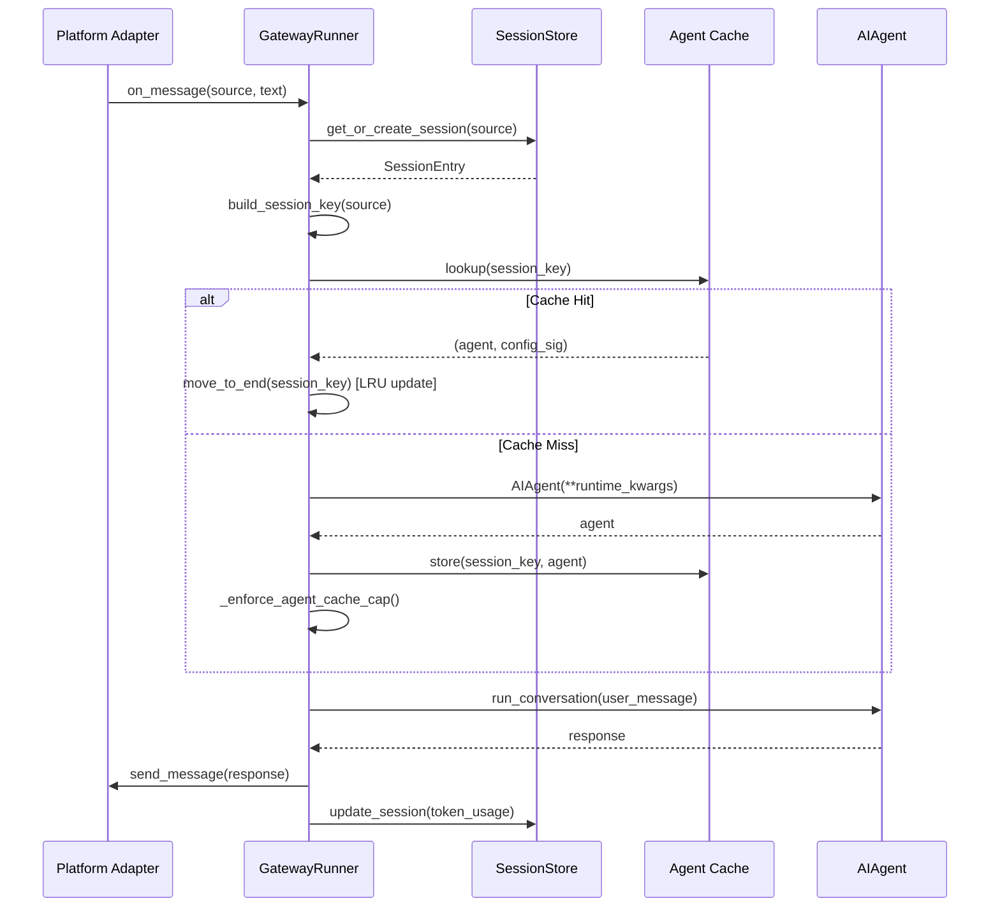

# 第十三章 消息网关架构

> **如何用一个网关同时服务 Telegram、Discord、Slack 等 9 个平台的消息？**

## 为什么需要消息网关

在一个支持多平台的 AI 助手系统中，最直观的做法是为每个平台单独启动一个 Agent 进程：Telegram 一个、Discord 一个、Slack 一个……但这会导致几个严重问题：

1. **资源浪费**：每个 Agent 实例都要加载完整的工具集、系统提示词、内存提供者，9 个平台就要冗余 9 份
2. **会话隔离**：用户在 Telegram 和 Discord 上的对话无法共享上下文，Agent 无法跨平台记住用户偏好
3. **配置分散**：模型切换、工具启用、定时任务配置需要在 9 个地方重复设置

Hermes 的 **Gateway Runner** 采用了反向设计：**一个统一的网关进程 + 按需创建的 Agent 实例池**。所有平台适配器（`BasePlatformAdapter`）将消息路由到中央网关，网关根据会话 key 从缓存池中取出或创建 Agent 实例，处理完成后将响应通过适配器发回原平台。这个架构的核心优势：

- **Agent 复用**：同一用户在不同平台的会话可以共享同一个 Agent 实例（通过会话 key 映射）
- **Prompt Caching 优化**：缓存的 Agent 保留了冻结的系统提示词，避免每次消息都重建 prompt（Anthropic 等提供商的 prompt cache 能节省约 10 倍成本，见 `gateway/run.py:664-673`）
- **统一配置**：模型、工具集、内存策略在网关级别统一管理

但多平台统一入口也引入了新的工程挑战：

> **P-13-01 [Rel/High]** LRU 驱逐导致会话丢失
> 当 Agent 缓存达到上限（128 个）时，LRU 驱逐会销毁最久未使用的 Agent 实例。如果用户恰好在被驱逐后立即发送消息，新创建的 Agent 会丢失之前的 prompt cache 上下文，导致首次响应延迟显著增加（冷启动）。

> **P-13-02 [Rel/Medium]** 无 at-least-once 投递语义
> Gateway 将消息从平台适配器传递给 Agent 后，如果进程在 Agent 执行途中崩溃，消息会丢失——既没有持久化到消息队列，也没有 retry 机制。长时间运行的工具调用（如 `code_sandbox`）更容易触发此问题。

> **P-13-03 [Rel/Medium]** Agent 复用状态泄漏
> 缓存的 Agent 实例在多次消息处理间复用，如果上一次处理留下了未清理的状态（如 `_running_tools` 标志未重置、工具资源未关闭），会污染下一次调用，导致工具重复执行或资源泄漏。

> **P-13-04 [Arch/Low]** 配置桥接静默失败
> 当用户在 `config.yaml` 中配置了某个平台但未安装对应依赖（如配置了 Discord 但未 `pip install discord.py`），网关启动时会跳过该平台并记录 debug 日志，但不会向用户显式报错，导致"配置了但不生效"的困惑。

## GatewayRunner 设计

`GatewayRunner` 是网关的核心控制器，负责平台适配器的生命周期管理、消息路由、Agent 缓存维护（`gateway/run.py:597-11170`）。其初始化流程：

```python
# gateway/run.py:619-642
def __init__(self, config: Optional[GatewayConfig] = None):
    self.config = config or load_gateway_config()
    self.adapters: Dict[Platform, BasePlatformAdapter] = {}

    # 会话存储：sessions.json + SQLite 双写
    self.session_store = SessionStore(
        self.config.sessions_dir, self.config,
        has_active_processes_fn=lambda key: process_registry.has_active_for_session(key),
    )

    # 消息投递路由（定时任务输出目标解析）
    self.delivery_router = DeliveryRouter(self.config)

    # Agent 缓存：OrderedDict 保证 LRU 顺序
    self._agent_cache: "OrderedDict[str, tuple]" = OrderedDict()
    self._agent_cache_lock = threading.Lock()
```

**平台适配器注册** 通过遍历 `config.platforms` 动态加载（见启动流程 `start()` 方法），每个适配器实现 `BasePlatformAdapter` 接口：

- `connect()`: 建立与平台的连接（WebSocket、长轮询、Webhook）
- `send_message()`: 发送响应到平台
- `disconnect()`: 清理连接资源

网关在 `_safe_adapter_disconnect()` 中防御性地调用 `disconnect()`，即使 `connect()` 失败也能释放部分初始化的资源（`gateway/run.py:875-893`），避免 "Unclosed client session" 警告。

### 消息处理流程



关键设计点：

1. **竞态防护**：在 Agent 创建前先插入 `_AGENT_PENDING_SENTINEL` 占位符（`gateway/run.py:348`），防止并发消息绕过"已运行"检查而重复创建 Agent
2. **LRU 维护**：每次缓存命中后调用 `OrderedDict.move_to_end(session_key)` 更新访问时间，驱逐时 `popitem(last=False)` 弹出最旧条目
3. **配置签名**：Agent 缓存的 key 是 `(session_key, config_signature)` 的组合，当模型、API key、工具集等配置变化时自动失效缓存（`gateway/run.py:8600-8631`）

## Agent 缓存与驱逐

### 容量上限与 LRU 驱逐

为防止长时间运行的网关内存无限增长，Hermes 对 Agent 缓存实施硬上限：

```python
# gateway/run.py:40-41
_AGENT_CACHE_MAX_SIZE = 128
_AGENT_CACHE_IDLE_TTL_SECS = 3600.0  # evict agents idle for >1h
```

当缓存超出 128 个时，`_enforce_agent_cache_cap()` 从 LRU 端开始驱逐（`gateway/run.py:8790-8864`）：

```python
def _enforce_agent_cache_cap(self) -> None:
    """Evict oldest cached agents when cache exceeds _AGENT_CACHE_MAX_SIZE."""
    excess = max(0, len(_cache) - _AGENT_CACHE_MAX_SIZE)
    evict_plan: List[tuple] = []
    if excess > 0:
        ordered_keys = list(_cache.keys())
        for key in ordered_keys[:excess]:
            entry = _cache.get(key)
            agent = entry[0] if isinstance(entry, tuple) and entry else None
            if agent is not None and id(agent) in running_ids:
                continue  # 跳过正在执行的 Agent
            evict_plan.append((key, agent))

    for key, _ in evict_plan:
        _cache.pop(key, None)
```

**保护措施**：正在 `_running_agents` 中执行的 Agent **永远不会被驱逐**（`gateway/run.py:8838-8839`），即使缓存超限。这避免了驱逐导致的客户端连接、沙箱进程、子 Agent 等资源被中途销毁。如果所有待驱逐槽位都被活跃 Agent 占用，缓存会暂时超限，等下次插入时再检查。

### 空闲 TTL 清理

除了容量驱逐，网关还通过后台任务 `_sweep_idle_cached_agents()` 清理空闲超过 1 小时的 Agent（`gateway/run.py:8866-8913`）：

```python
def _sweep_idle_cached_agents(self) -> int:
    """Evict cached agents whose AIAgent has been idle > _AGENT_CACHE_IDLE_TTL_SECS."""
    now = time.time()
    to_evict: List[tuple] = []
    with _lock:
        for key, entry in list(_cache.items()):
            agent = entry[0] if isinstance(entry, tuple) and entry else None
            if agent is None or id(agent) in running_ids:
                continue
            last_activity = getattr(agent, "_last_activity_ts", None)
            if last_activity and (now - last_activity) > _AGENT_CACHE_IDLE_TTL_SECS:
                to_evict.append((key, agent))
        for key, _ in to_evict:
            _cache.pop(key, None)
```

该任务由 `_session_expiry_watcher()` 每 5 分钟触发一次（`gateway/run.py:2374-2379`），确保即使缓存未满，长期空闲会话也不会永久占用内存。

### 配置签名机制

为支持用户通过 `/model` 命令切换模型，网关需要在配置变化时让旧 Agent 失效。**配置签名** 通过哈希以下字段生成（`gateway/run.py:8600-8631`）：

- `model`: 模型名称
- `api_key`: API 密钥的 SHA256 哈希（全量哈希，避免 JWT token 前缀冲突）
- `base_url`: API 端点
- `provider`: 提供商标识
- `api_mode`: API 模式（chat/completion）
- `enabled_toolsets`: 启用的工具集列表
- `ephemeral_prompt`: 临时系统提示词

当任一字段变化时，签名不匹配会触发缓存未命中，创建新 Agent 实例。注意 `reasoning_config` **不包含在签名中**（`gateway/run.py:8624-8625`），因为它是每条消息的运行时参数，不影响系统提示词或工具模式。

## 会话存储

### 双层存储架构

Hermes 的会话数据存储在两个层次：

1. **sessions.json**：会话 key → session_id 的映射表 + 元数据（token 统计、重置标志、暂停状态）
2. **SQLite (`hermes_state/session_db.py`)**：消息历史记录的结构化存储，支持高效查询
3. **JSONL Fallback**：每个 session_id 对应一个 `.jsonl` 文件，保留向后兼容性

`SessionStore` 通过原子写入保证 `sessions.json` 的一致性（`gateway/session.py:603-624`）：

```python
def _save(self) -> None:
    """Save sessions index to disk (kept for session key -> ID mapping)."""
    data = {key: entry.to_dict() for key, entry in self._entries.items()}
    fd, tmp_path = tempfile.mkstemp(
        dir=str(self.sessions_dir), suffix=".tmp", prefix=".sessions_"
    )
    try:
        with os.fdopen(fd, "w", encoding="utf-8") as f:
            json.dump(data, f, indent=2)
            f.flush()
            os.fsync(f.fileno())
        os.replace(tmp_path, sessions_file)  # 原子替换
```

### Session Key 构建规则

会话 key 决定了消息如何隔离，其格式为 `agent:main:{platform}:{chat_type}:{chat_id}[:{thread_id}][:{user_id}]`（`gateway/session.py:491-547`）：

- **DM 规则**：包含 `chat_id`，每个私聊独立会话；有 `thread_id` 则进一步隔离线程
- **群组规则**：
  - 默认（`group_sessions_per_user=True`）：包含 `user_id`，群内每个用户独立会话
  - 共享模式（`group_sessions_per_user=False`）：忽略 `user_id`，全群共用一个会话
- **线程规则**：
  - 默认（`thread_sessions_per_user=False`）：线程内所有用户共享会话（符合 Telegram 论坛话题、Discord 线程的 UX）
  - 隔离模式（`thread_sessions_per_user=True`）：线程内每用户独立会话

示例：
- Telegram DM: `agent:main:telegram:dm:123456789`
- Discord 群组（每用户）: `agent:main:discord:group:987654321:user_abc123`
- Slack 线程（共享）: `agent:main:slack:thread:C12345:T67890`

### 会话重置策略

`SessionResetPolicy` 支持四种模式（通过 `_is_session_expired()` 评估，`gateway/session.py:634-670`）：

1. **none**：永不重置
2. **idle**：空闲 N 分钟后重置（默认 120 分钟）
3. **daily**：每天指定时刻重置（默认凌晨 3 点）
4. **both**：满足空闲或每日条件均重置

重置触发时，`get_or_create_session()` 会：
1. 结束旧 session_id（调用 `SessionDB.end_session()`）
2. 生成新 session_id（格式：`YYYYMMDD_HHMMSS_{8位uuid}`）
3. 设置 `was_auto_reset=True` 标志，下次消息时 Agent 会收到"会话已重置"提示

**进程保护**：如果会话有活跃的后台进程（通过 `process_registry.has_active_for_session()` 检查），重置会被**延迟**，避免打断长时间运行的任务（如文件监控、代码服务器）。

### 内存刷新机制

为防止会话重置导致对话上下文丢失，网关在后台任务 `_session_expiry_watcher()` 中提前刷新即将过期会话的内存（`gateway/run.py:2266-2379`）：

1. 每 5 分钟扫描一次 `_entries`，找出已过期但 `memory_flushed=False` 的会话
2. 为每个过期会话启动一个线程，运行 `_flush_memories_for_session()`（`gateway/run.py:897-1002`）
3. 该函数创建一个临时 Agent（`skip_memory=True`，仅启用 `memory` 和 `skills` 工具集），加载完整的对话历史，并提示 Agent：

```python
flush_prompt = (
    "[System: This session is about to be automatically reset due to "
    "inactivity or a scheduled daily reset. The conversation context "
    "will be cleared after this turn.\n\n"
    "Review the conversation above and:\n"
    "1. Save any important facts, preferences, or decisions to memory "
    "(user profile or your notes) that would be useful in future sessions.\n"
    "2. If you discovered a reusable workflow or solved a non-trivial "
    "problem, consider saving it as a skill.\n"
    "3. If nothing is worth saving, that's fine — just skip.\n\n"
)
```

刷新完成后设置 `entry.memory_flushed=True` 并持久化到 `sessions.json`，防止网关重启后重复刷新。

### 转录加载优先级

`load_transcript()` 在从 SQLite 和 JSONL 双源加载时，**选择消息更多的来源**（`gateway/session.py:1196-1242`）：

```python
def load_transcript(self, session_id: str) -> List[Dict[str, Any]]:
    db_messages = self._db.get_messages_as_conversation(session_id)
    jsonl_messages = [json.loads(line) for line in open(transcript_path)]

    # 优先使用更长的来源
    if len(jsonl_messages) > len(db_messages):
        logger.debug(
            "Session %s: JSONL has %d messages vs SQLite %d — "
            "using JSONL (legacy session not yet fully migrated)",
            session_id, len(jsonl_messages), len(db_messages),
        )
        return jsonl_messages

    return db_messages
```

这个设计解决了 **SQLite 迁移期间的上下文截断问题**：当 SQLite 层加入时，旧会话的历史消息只存在于 JSONL 中，首次新消息仅将增量写入 SQLite。如果下次加载只读 SQLite，Agent 会丢失数百条历史消息。通过长度比较，系统在迁移完成前始终保留完整上下文。

## 消息投递与钩子

### DeliveryRouter 路由逻辑

`DeliveryRouter` 负责将定时任务输出路由到正确的平台和聊天（`gateway/delivery.py`）。支持的目标格式：

- `origin`: 回到任务创建的原始会话
- `local`: 保存到本地文件（`~/.hermes/cron_outputs/`）
- `telegram`: Telegram home channel
- `telegram:123456789`: 特定 Telegram 聊天
- `discord:987654321:thread_123`: Discord 线程

**长度截断**（`gateway/delivery.py:21-22`）：
```python
MAX_PLATFORM_OUTPUT = 4000
TRUNCATED_VISIBLE = 3800
```

超过 4000 字符的输出会被截断至 3800 字符可见部分 + "... (truncated)" 提示，防止超过平台 API 限制（Telegram 单条消息 4096 字符，Discord 2000 字符）。

### Hook 系统

网关通过 `HookRegistry` 在关键生命周期点触发事件钩子（`gateway/hooks.py`）：

- `gateway:startup`: 网关进程启动（用于运行 `~/.hermes/BOOT.md`）
- `session:start`: 新会话创建（首次消息）
- `session:end` / `session:reset`: 会话结束/重置
- `agent:start` / `agent:step` / `agent:end`: Agent 执行周期
- `command:*`: 斜杠命令执行（通配符匹配）

钩子从 `~/.hermes/hooks/` 目录加载，每个钩子目录包含：
- `HOOK.yaml`: 元数据（name、description、events 列表）
- `handler.py`: Python 处理器，需实现 `async def handle(event_type, context)`

**内置钩子** `boot-md`（`gateway/hooks.py:54-67`）在网关启动时自动运行 `~/.hermes/BOOT.md` 中的命令，实现启动脚本功能。

钩子错误**永不阻塞主流程**——所有异常被捕获并记录日志，但不会导致消息处理失败。

## 配对审批

### DM Pairing 流程

为避免公开 Telegram/Discord bot token 导致滥用，Hermes 实现了基于 **一次性代码** 的审批流程（`gateway/pairing.py`）：

1. 未授权用户发送消息时，bot 生成 8 位配对码（从 32 字符不含 0/O/1/I 的字母表中随机选择）
2. 用户将配对码发送给 bot 管理员
3. 管理员通过 CLI 运行 `hermes pair approve <code>` 审批
4. 审批后用户 ID 加入 `{platform}-approved.json`，后续消息直接放行

**安全措施**（基于 OWASP + NIST SP 800-63-4 指南）：

- **密码学随机性**：使用 `secrets.choice()` 生成代码（`gateway/pairing.py:34`）
- **1 小时过期**：代码 TTL 3600 秒（`gateway/pairing.py:38`）
- **速率限制**：每用户 10 分钟内只能请求一次（`gateway/pairing.py:39`）
- **锁定机制**：5 次失败审批后锁定 1 小时（`gateway/pairing.py:40-44`）
- **文件权限**：所有数据文件 `chmod 0600`（`gateway/pairing.py:49-72`）
- **日志保护**：代码永不输出到 stdout

配对数据存储在 `~/.hermes/pairing/`：
- `{platform}-pending.json`: 待审批的配对请求
- `{platform}-approved.json`: 已授权用户列表
- `_rate_limits.json`: 速率限制跟踪

## SSL 证书检测

网关在导入任何 HTTP 库（如 `discord.py`、`aiohttp`）之前运行 `_ensure_ssl_certs()`（`gateway/run.py:47-84`），自动检测系统 CA 证书路径并设置 `SSL_CERT_FILE` 环境变量：

```python
def _ensure_ssl_certs() -> None:
    """Set SSL_CERT_FILE if the system doesn't expose CA certs to Python."""
    if "SSL_CERT_FILE" in os.environ:
        return

    # 1. Python 编译时默认路径
    paths = ssl.get_default_verify_paths()
    for candidate in (paths.cafile, paths.openssl_cafile):
        if candidate and os.path.exists(candidate):
            os.environ["SSL_CERT_FILE"] = candidate
            return

    # 2. certifi (Mozilla CA bundle)
    try:
        import certifi
        os.environ["SSL_CERT_FILE"] = certifi.where()
        return
    except ImportError:
        pass

    # 3. 11 个常见发行版路径
    for candidate in (
        "/etc/ssl/certs/ca-certificates.crt",               # Debian/Ubuntu/Gentoo
        "/etc/pki/tls/certs/ca-bundle.crt",                 # RHEL/CentOS 7
        "/etc/pki/ca-trust/extracted/pem/tls-ca-bundle.pem", # RHEL/CentOS 8+
        "/etc/ssl/ca-bundle.pem",                            # SUSE/OpenSUSE
        "/etc/ssl/cert.pem",                                 # Alpine / macOS
        "/usr/local/etc/openssl@1.1/cert.pem",               # macOS Homebrew Intel
        "/opt/homebrew/etc/openssl@1.1/cert.pem",            # macOS Homebrew ARM
        # ... 共 11 个候选路径
    ):
        if os.path.exists(candidate):
            os.environ["SSL_CERT_FILE"] = candidate
            return
```

这个设计解决了 **NixOS 等非标准系统** 的 SSL 验证失败问题——这些系统将 CA 证书放在非标准路径（如 `/nix/store/...`），Python 的默认 `ssl` 模块无法找到，导致所有 HTTPS 请求报 `CERTIFICATE_VERIFY_FAILED`。通过在启动早期设置环境变量，所有后续导入的 HTTP 库都能正确加载证书。

## 架构分析

### 网关消息分发架构

```mermaid
graph TB
    subgraph "Platform Adapters"
        T[Telegram Adapter]
        D[Discord Adapter]
        S[Slack Adapter]
        W[WhatsApp Adapter]
    end

    subgraph "GatewayRunner"
        G[Message Router]
        SS[SessionStore]
        AC[Agent Cache<br/>OrderedDict LRU]
        DR[DeliveryRouter]
    end

    subgraph "Agent Pool"
        A1[AIAgent #1<br/>session_key: telegram:dm:123]
        A2[AIAgent #2<br/>session_key: discord:group:456]
        A3[AIAgent #3<br/>session_key: slack:thread:789]
        AN[... 125 more agents]
    end

    subgraph "Storage Layer"
        SJ[sessions.json<br/>key → session_id]
        DB[(SQLite<br/>Message History)]
        JL[JSONL Fallback<br/>{session_id}.jsonl]
    end

    T -->|on_message| G
    D -->|on_message| G
    S -->|on_message| G
    W -->|on_message| G

    G -->|build_session_key| SS
    SS -->|get_or_create_session| SJ
    SS -.->|load_transcript| DB
    SS -.->|fallback| JL

    G -->|cache lookup| AC
    AC -->|hit: reuse| A1
    AC -->|miss: create| A2
    AC -->|LRU evict| AN

    A1 -->|response| G
    A2 -->|response| G
    G -->|send_message| T
    G -->|send_message| D

    DR -->|cron output| G
```

### 设计权衡

#### 为什么用 OrderedDict 而不是 LRU Cache 库？

Python 标准库的 `functools.lru_cache` 是装饰器，无法支持复杂的驱逐保护逻辑（如跳过正在运行的 Agent）。`OrderedDict` 提供了精确控制：

- `move_to_end(key)` 更新访问顺序（O(1) 操作）
- `popitem(last=False)` 获取最旧条目
- 可在驱逐前检查 `id(agent) in running_ids` 保护活跃实例

#### 为什么需要配置签名？

不能简单用 `session_key` 作为缓存 key，因为同一会话的模型配置可能变化（用户运行 `/model gpt-4`）。如果复用旧 Agent，它仍然使用旧的 `gpt-3.5-turbo` 客户端，切换无效。配置签名确保配置变化时缓存失效，创建新 Agent。

#### 为什么 SQLite + JSONL 双写？

历史原因：Hermes 最初仅用 JSONL 存储，后来引入 SQLite 支持结构化查询（如"查找包含关键词 X 的所有会话"）。双写保证向后兼容——老代码可以继续读 JSONL，新功能可以查询 SQLite。未来可能移除 JSONL，但需要迁移工具将所有旧会话导入 SQLite。

#### 为什么内存刷新在后台线程？

`_flush_memories_for_session()` 需要创建临时 Agent 并运行完整的工具调用循环（保存内存/技能），可能耗时数秒。如果在主事件循环中同步执行，会阻塞所有平台的消息处理。通过 `asyncio.run_in_executor()` 放到线程池，网关可以继续服务其他会话。

### Run Anywhere 的实现路径

**Design Bet: Run Anywhere** 意味着 Hermes 能在从树莓派到企业服务器的任何环境运行。网关架构的适配策略：

1. **依赖隔离**：每个平台适配器在独立模块中导入依赖（如 `telegram` 仅在 `adapters/telegram_adapter.py` 中 import），未安装的依赖不会导致整个网关崩溃
2. **SSL 自动检测**：支持 11 种不同发行版的证书路径，无需用户手动配置
3. **资源限制感知**：Agent 缓存上限可通过环境变量 `HERMES_AGENT_CACHE_SIZE` 调整，低内存环境可设为 32
4. **优雅降级**：SQLite 不可用时回退到 JSONL，pairing 系统故障时允许配置静态白名单

但 **P-13-04** 揭示了权衡：为了容错性，网关对配置错误过于宽容，导致"静默失败"。改进方向是在启动日志中明确列出"已配置但未启用"的平台及原因。

## 问题清单

1. **P-13-01 [Rel/High] LRU 驱逐导致会话丢失**
   **现象**：缓存满时驱逐 Agent，用户下次消息需冷启动，丢失 prompt cache（首次响应慢 2-10 倍）
   **根因**：硬上限 128 个 + 严格 LRU，高并发场景下频繁驱逐活跃会话
   **影响**：Anthropic prompt caching 命中率下降，API 成本增加 ~10 倍
   **缓解**：增大 `_AGENT_CACHE_MAX_SIZE` 或启用 prompt cache 持久化（需 LLM 提供商支持）

2. **P-13-02 [Rel/Medium] 无 at-least-once 投递语义**
   **现象**：网关崩溃时正在处理的消息丢失，用户需重发
   **根因**：消息直接从适配器传递到 Agent，无中间队列或 WAL
   **影响**：长时间工具调用（code_sandbox 执行 10min+）更易触发，数据分析任务可能需多次重试
   **缓解**：引入消息队列（如 Redis Streams）或 checkpoint 机制，记录每条消息的处理状态

3. **P-13-03 [Rel/Medium] Agent 复用状态泄漏**
   **现象**：缓存的 Agent 实例在连续消息间保留脏状态，导致工具重复执行
   **根因**：`_cleanup_agent_resources()` 可能遗漏某些工具的清理逻辑
   **影响**：`code_sandbox` 会话未关闭、`browser` 标签页泄漏、`memory` 写入冲突
   **缓解**：在每次 `run_conversation()` 前调用 `reset_turn_state()`，强制清理所有工具资源

4. **P-13-04 [Arch/Low] 配置桥接静默失败**
   **现象**：`config.yaml` 配置了 Discord 但未安装 `discord.py`，启动日志仅 debug 级别警告
   **根因**：`load_platform_adapter()` 捕获 `ImportError` 后 continue，不向用户明确报错
   **影响**：用户困惑"为什么配置了但 bot 不上线"
   **缓解**：在 `start()` 结束后输出摘要："已启用 3/5 平台（Telegram, Slack, WhatsApp），未启用 2/5（Discord: 缺少依赖 discord.py, Signal: 认证失败）"

## 本章小结

消息网关通过 **统一入口 + Agent 实例池** 的架构，实现了多平台消息的高效路由和资源复用。核心机制包括：

- **LRU Agent 缓存**：基于 `OrderedDict` 的 128 槽位缓存 + 1 小时空闲 TTL，保护运行中 Agent 不被驱逐
- **配置签名驱动失效**：模型/工具集/API key 变化时自动重建 Agent，确保配置切换生效
- **双层会话存储**：`sessions.json` 索引 + SQLite 结构化历史 + JSONL 回退，兼顾性能与兼容性
- **主动内存刷新**：后台任务在会话过期前提前保存对话上下文，避免重置丢失信息
- **事件钩子系统**：在生命周期关键点触发自定义逻辑，支持启动脚本、审计日志等扩展

但统一网关也引入了新的可靠性挑战：LRU 驱逐可能清除活跃会话的 prompt cache、无消息队列导致崩溃时丢消息、Agent 复用可能泄漏状态。下一章我们将深入平台适配器的实现，分析 Telegram 长轮询、Discord WebSocket、Slack 事件订阅等不同连接模式的权衡。
