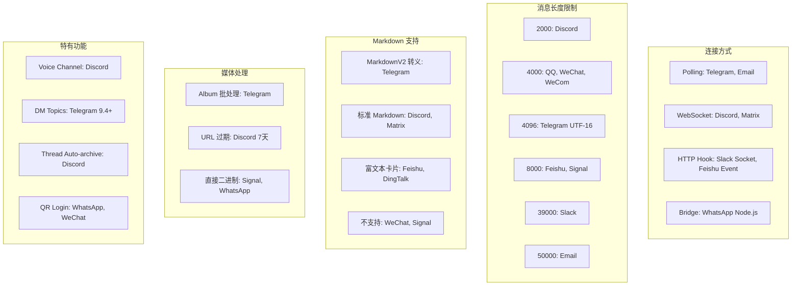

# 第十四章：平台适配器 — 消化 18 种消息 API 的差异

**开篇思考：9 个消息平台有 9 种 API 风格，如何用统一的适配器模式消化差异？**

当你打开 `/gateway/platforms/` 目录时，会发现事实比这个问题更复杂：Hermes 不是适配 9 个平台，而是 **18+ 个平台**，每个都有独特的连接方式、消息格式、认证机制和限制条件。Telegram 用 long-polling 或 webhook，Discord 用 Gateway WebSocket，WhatsApp 甚至需要一个 Node.js 桥接进程……如何用一套统一的抽象框架消化这些差异，同时保持每个平台的原生特性不被阉割？

本章将深入解析 Hermes 的平台适配器架构，从基类设计到具体实现，展示如何在"统一接口"和"平台特性"之间找到最佳平衡点。

---

## 为什么需要适配器模式

### 问题：API 碎片化

每个消息平台都是一个"独立王国"，拥有自己的规则：

| 平台维度 | 差异实例 |
|---------|---------|
| **连接方式** | Telegram (polling/webhook), Discord (WebSocket), WhatsApp (Node.js 进程通信), Slack (Socket Mode) |
| **消息长度限制** | Discord 2000 字符, Telegram 4096 UTF-16 单元, Slack 39000 字符, Email 50000 字符 |
| **Markdown 支持** | Telegram (MarkdownV2 转义地狱), Discord (标准 Markdown), 微信 (不支持) |
| **媒体处理** | Telegram (album batching), Discord (attachment URLs 过期), Signal (直接二进制) |
| **认证机制** | Telegram (bot token), Discord (OAuth2), WhatsApp (QR code 扫描), Email (SMTP credentials) |

如果没有统一抽象，Gateway 核心（第 13 章）就会变成一个巨大的 `if-elif` 迷宫：

```python
# 反面教材：没有适配器的代码
async def send_message(platform, chat_id, text):
    if platform == "telegram":
        return await bot.send_message(chat_id, escape_mdv2(text), parse_mode="MarkdownV2")
    elif platform == "discord":
        return await channel.send(text[:2000])
    elif platform == "whatsapp":
        response = requests.post("http://localhost:3000/send", ...)
        # ... 100+ lines of if-elif hell
```

### 解决方案：适配器模式 + ABC

Hermes 采用经典的 **适配器模式**（Adapter Pattern），通过抽象基类定义统一接口，每个平台实现自己的适配器：

```
┌─────────────────────────────────────┐
│   BasePlatformAdapter (ABC)        │  ← 抽象基类定义契约
│   - connect() -> bool              │
│   - send(chat_id, text) -> SendResult │
│   - send_typing(chat_id)           │
│   - handle_message(event)          │
└─────────────────────────────────────┘
            ▲
            │ 继承
    ┌───────┴──────┬──────────┬──────────┐
    │              │          │          │
┌───┴────┐  ┌──────┴───┐  ┌──┴────┐  ┌──┴────────┐
│Telegram│  │ Discord  │  │ Slack │  │ WhatsApp  │
│Adapter │  │ Adapter  │  │Adapter│  │  Adapter  │
│ (1360  │  │  (3300   │  │(1650  │  │  (1070    │
│ lines) │  │  lines)  │  │lines) │  │  lines)   │
└────────┘  └──────────┘  └───────┘  └───────────┘
   ↓              ↓            ↓           ↓
polling/      Gateway      Socket      Node.js
webhook      WebSocket      Mode       Bridge
```

**核心收益：**
1. **Gateway 核心解耦**：网关只需调用 `adapter.send()`，无需关心底层是 HTTP 还是 WebSocket
2. **平台特性保留**：Discord 可以有 `VoiceReceiver`，Telegram 可以处理 MarkdownV2 表格
3. **增量扩展**：新增平台只需实现适配器，无需修改核心代码（符合开闭原则）

---

## 基类设计：BasePlatformAdapter

### 核心抽象方法

`gateway/platforms/base.py:879` 定义了所有适配器必须实现的契约：

```python
class BasePlatformAdapter(ABC):
    """
    Base class for platform adapters.

    Subclasses implement platform-specific logic for:
    - Connecting and authenticating
    - Receiving messages
    - Sending messages/responses
    - Handling media
    """

    @abstractmethod
    async def connect(self) -> bool:
        """Connect to the platform and start receiving messages."""
        pass

    @abstractmethod
    async def disconnect(self) -> None:
        """Disconnect from the platform."""
        pass

    @abstractmethod
    async def send(
        self,
        chat_id: str,
        content: str,
        reply_to: Optional[str] = None,
        metadata: Optional[Dict[str, Any]] = None
    ) -> SendResult:
        """Send a message to a chat."""
        pass
```

这三个方法构成了适配器的**生命周期骨架**：
- `connect()`: 建立连接、启动监听器，返回 `True` 表示成功
- `send()`: 发送消息，返回 `SendResult` 包含成功/失败信息
- `disconnect()`: 清理资源、关闭连接

### 统一数据模型

#### MessageEvent：入站消息的标准化

`base.py:682` 定义了所有平台消息的统一表示：

```python
@dataclass
class MessageEvent:
    """Incoming message from a platform."""
    # 消息内容
    text: str
    message_type: MessageType = MessageType.TEXT

    # 来源信息
    source: SessionSource = None

    # 原始数据
    raw_message: Any = None
    message_id: Optional[str] = None

    # 媒体附件
    media_urls: List[str] = field(default_factory=list)  # 本地文件路径
    media_types: List[str] = field(default_factory=list)

    # 回复上下文
    reply_to_message_id: Optional[str] = None
    reply_to_text: Optional[str] = None

    # 平台特定字段
    auto_skill: Optional[str | list[str]] = None  # Discord 频道绑定技能
    channel_prompt: Optional[str] = None  # 频道专属 prompt
```

**设计亮点：**
1. **媒体路径本地化**：`media_urls` 存储的是缓存后的本地路径（如 `/cache/images/img_abc123.jpg`），而非原始 URL，这样 Vision 工具可以直接读取文件，无需重新下载
2. **平台原始数据保留**：`raw_message` 保留平台原生对象（如 `telegram.Update`），供特殊场景使用
3. **扩展字段支持**：`auto_skill` 和 `channel_prompt` 允许平台特定功能（如 Discord 频道技能绑定）透传到核心

#### SendResult：出站结果的统一反馈

```python
@dataclass
class SendResult:
    """Result of sending a message."""
    success: bool
    message_id: Optional[str] = None
    error: Optional[str] = None
    raw_response: Any = None
    retryable: bool = False  # 是否可重试（网络错误）
```

`retryable` 标志非常关键：
- `True` 表示瞬时网络错误（如 `ConnectionReset`），Gateway 会自动重试
- `False` 表示业务错误（如 "chat not found"），立即失败

### 共性功能：内置工具集

基类提供了 **2500+ 行**的共性代码，避免每个适配器重复实现：

#### 1. 媒体缓存 (`base.py:318-657`)

所有平台都需要下载和缓存媒体文件，基类提供统一实现：

```python
async def cache_image_from_url(url: str, ext: str = ".jpg", retries: int = 2) -> str:
    """
    Download an image from a URL and save it to the local cache.

    Retries on transient failures (timeouts, 429, 5xx) with exponential
    backoff so a single slow CDN response doesn't lose the media.
    """
    from tools.url_safety import is_safe_url
    if not is_safe_url(url):
        raise ValueError(f"Blocked unsafe URL (SSRF protection)")

    # ... 重试逻辑 + SSRF 防护
```

**SSRF 防护** (`base.py:292`)：拒绝下载内网地址（如 `http://192.168.1.1/secret`），防止攻击者利用 Bot 探测内网。

#### 2. UTF-16 长度计算 (`base.py:26-77`)

Telegram 的 4096 字符限制是按 **UTF-16 code units** 计算的，而 Python 的 `len()` 按 Unicode 码点计算。Emoji 如 😀 在 UTF-16 中占 2 个单元（surrogate pair），但 `len("😀")` 返回 1：

```python
def utf16_len(s: str) -> int:
    """Count UTF-16 code units in *s*.

    Telegram's message-length limit (4 096) is measured in UTF-16 code units,
    **not** Unicode code-points. Characters outside the Basic Multilingual
    Plane (emoji like 😀, CJK Extension B, musical symbols, …) are encoded as
    surrogate pairs and therefore consume **two** UTF-16 code units each.
    """
    return len(s.encode("utf-16-le")) // 2
```

配合 `_prefix_within_utf16_limit()` 使用二分查找确保截断不会切断 surrogate pair，避免发送无效字符。

#### 3. 消息截断 (`base.py:2236`)

不同平台有不同的长度限制，`truncate_message()` 提供智能截断：

```python
def truncate_message(
    self,
    text: str,
    max_length: int,
    len_fn: Callable[[str], int] = len,
) -> List[str]:
    """
    Split a long message into chunks that fit the platform's limit.

    Args:
        text: Message text
        max_length: Platform limit (e.g. 2000 for Discord)
        len_fn: Custom length function (e.g. utf16_len for Telegram)
    """
    # ... 按代码块边界、段落边界智能切分
```

#### 4. 代理解析 (`base.py:150-169`)

支持 `http_proxy`/`https_proxy` 环境变量，自动应用到所有 HTTP 请求。

---

## 代表性适配器深入分析

### Telegram 适配器：Polling 冲突检测

#### 基本架构

`gateway/platforms/telegram.py:202` 是最早实现的适配器（1360+ 行），使用 `python-telegram-bot` 库：

```python
class TelegramAdapter(BasePlatformAdapter):
    MAX_MESSAGE_LENGTH = 4096  # UTF-16 单元

    def __init__(self, config: PlatformConfig):
        super().__init__(config, Platform.TELEGRAM)
        self._app: Optional[Application] = None
        self._bot: Optional[Bot] = None
        self._webhook_mode: bool = False
```

**连接模式选择：**
- **Polling**（默认）：客户端主动调用 `getUpdates` 长轮询获取消息
- **Webhook**：Telegram 服务器推送消息到指定 URL（需公网 IP）

#### 问题 P-14-02：Polling 冲突处理

**现象：** 同一个 Bot Token 只能有一个进程 polling，否则 Telegram 返回 409 Conflict：
```
Error: Conflict: terminated by other getUpdates request
```

**根因：** 用户启动多个 Gateway 实例（或忘记停止旧进程），导致资源竞争。

**解决方案** (`telegram.py:404-460`)：

```python
async def _handle_polling_conflict(self, error: Exception) -> None:
    """Handle Telegram polling conflicts with retry logic."""
    self._polling_conflict_count += 1

    MAX_CONFLICT_RETRIES = 3
    RETRY_DELAY = 10  # seconds

    if self._polling_conflict_count <= MAX_CONFLICT_RETRIES:
        logger.warning(
            "[%s] Telegram polling conflict (%d/%d), will retry in %ds",
            self.name, self._polling_conflict_count, MAX_CONFLICT_RETRIES,
            RETRY_DELAY,
        )
        # 停止当前 updater
        await self._app.updater.stop()
        await asyncio.sleep(RETRY_DELAY)

        # 重新启动
        await self._app.updater.start_polling(...)
        self._polling_conflict_count = 0  # 成功后重置
        return

    # 重试耗尽 → 标记为致命错误
    message = (
        "Another process is already polling this Telegram bot token. "
        "Hermes stopped Telegram polling after 3 retries."
    )
    self._set_fatal_error("telegram_polling_conflict", message, retryable=False)
    await self._notify_fatal_error()
```

**设计亮点：**
1. **渐进式重试**：瞬时冲突（如 `--replace` 切换时旧进程未完全退出）会自动恢复
2. **致命错误标记**：持续冲突会调用 `_set_fatal_error()`，写入 `runtime_status.json`（第 8 章），用户可通过 `hermes status` 查看
3. **不可重试标志**：`retryable=False` 防止 systemd 无限重启

#### GFW 规避：Fallback IPs

Telegram 在部分地区被封锁，适配器支持 **Fallback IPs** 绕过 DNS 污染 (`telegram.py:287-292`)：

```python
def _fallback_ips(self) -> list[str]:
    """Return validated fallback IPs from config."""
    configured = self.config.extra.get("fallback_ips", [])
    if isinstance(configured, str):
        configured = configured.split(",")
    return parse_fallback_ip_env(",".join(str(v) for v in configured))
```

配合 `TelegramFallbackTransport` 使用硬编码 IP（如 `149.154.167.220`）替代域名请求。

#### MarkdownV2 表格封装

Telegram 的 MarkdownV2 格式要求转义 15 个特殊字符（`_*[]()~`>#+\-=|{}.!\\`），但代码块中的表格不应转义。`telegram.py:130-198` 实现了表格检测和封装逻辑：

```python
def _wrap_tables_in_code_blocks(md: str) -> str:
    """Wrap ASCII tables in code blocks for MarkdownV2."""
    lines = md.split('\n')
    in_table = False
    result = []

    for line in lines:
        # 检测表格行（包含 | 且数量 ≥ 2）
        if '|' in line and line.count('|') >= 2:
            if not in_table:
                result.append('```')
                in_table = True
        else:
            if in_table:
                result.append('```')
                in_table = False
        result.append(line)

    if in_table:
        result.append('```')

    return '\n'.join(result)
```

### Discord 适配器：Voice Channel + 最大代码量

#### 规模：3300+ 行

Discord 适配器是**代码量最大的平台** (`discord.py:472`)，因为它支持：
- 文本消息（DM + 服务器频道）
- 语音频道（加入/监听/转录）
- Slash Commands（原生 `/ask` `/reset`）
- 线程自动创建和归档
- Reaction 反馈

#### VoiceReceiver：RTP 解密 + Opus 解码

Discord 语音频道使用 **RTP 协议**传输加密的 Opus 音频包，`discord.py:119` 实现了完整的接收链路：

```python
class VoiceReceiver:
    """Captures and decodes voice audio from a Discord voice channel.

    Attaches to a VoiceClient's socket listener, decrypts RTP packets
    (NaCl transport + DAVE E2EE), decodes Opus to PCM, and buffers
    per-user audio.
    """

    SILENCE_THRESHOLD = 1.5    # seconds of silence → end of utterance
    MIN_SPEECH_DURATION = 0.5  # minimum seconds to process
    SAMPLE_RATE = 48000        # Discord native rate
    CHANNELS = 2               # Discord sends stereo

    def __init__(self, voice_client, allowed_user_ids: set = None):
        self._vc = voice_client
        self._secret_key: Optional[bytes] = None  # NaCl 密钥
        self._dave_session = None  # DAVE E2EE 会话
        self._buffers: Dict[int, bytearray] = defaultdict(bytearray)
```

**处理流程：**

```
┌─────────────┐
│ Discord RTP │  原始加密包（20ms Opus 帧）
│   Packet    │
└──────┬──────┘
       │
       ▼
┌─────────────┐
│ NaCl Decrypt│  解密传输层（XSalsa20-Poly1305）
└──────┬──────┘
       │
       ▼
┌─────────────┐
│ DAVE Decrypt│  解密端到端（如果启用）
└──────┬──────┘
       │
       ▼
┌─────────────┐
│ Opus Decode │  解码到 PCM（使用 opuslib）
└──────┬──────┘
       │
       ▼
┌─────────────┐
│ Silence Det │  检测静音（1.5 秒无声音 → 发话结束）
└──────┬──────┘
       │
       ▼
┌─────────────┐
│ Whisper STT │  调用 Whisper API 转录
└─────────────┘
```

**实现难点：**
1. **SSRC 映射**：RTP 包只包含 SSRC（同步源标识符），需通过 Discord 的 SPEAKING 事件映射到 user_id
2. **时间戳处理**：RTP 时间戳是相对值，需维护 `_last_packet_time` 检测静音
3. **并发用户**：多人同时说话时需独立缓冲区（`_buffers: Dict[int, bytearray]`）

#### AllowedMentions 安全防护

Discord 默认解析所有 `@everyone`、`@role` 提及，LLM 输出的 `@everyone` 会 ping 整个服务器。`discord.py:84-117` 设置安全默认值：

```python
def _build_allowed_mentions():
    """Build Discord AllowedMentions with safe defaults."""
    return discord.AllowedMentions(
        everyone=False,  # 禁止 @everyone 和 @here
        roles=False,     # 禁止 @role pings
        users=True,      # 允许 @user（正常对话需要）
        replied_user=True,  # 允许回复提及
    )
```

可通过环境变量 `DISCORD_ALLOW_MENTION_EVERYONE=true` 覆盖。

#### 消息长度限制：2000 字符

Discord 的限制最严格 (`discord.py:487`)：

```python
MAX_MESSAGE_LENGTH = 2000
```

适配器使用 `truncate_message()` 自动切分，配合 `reply_to_mode` 控制切分块的回复行为：
- `"first"` (默认)：只在第一块回复原消息
- `"all"`：每块都保留回复引用
- `"off"`：不使用回复

### WhatsApp 适配器：Node.js 桥接架构

#### 问题 P-14-03：无官方 Bot API

WhatsApp 不像 Telegram/Discord 提供官方 Bot API，只有：
1. **Business API**：需 Meta 企业认证，审核周期长
2. **whatsapp-web.js**：Node.js 库，模拟 Web 端协议（个人账号可用）

Hermes 选择方案 2，但面临语言隔阂：Gateway 是 Python，whatsapp-web.js 是 Node.js。

#### 解决方案：HTTP 桥接

`gateway/platforms/whatsapp.py:134` 实现了一个 **Python ↔ Node.js** 桥接架构：

```
┌──────────────────────────────────────────────────────────┐
│                  Python Gateway Process                  │
│  ┌────────────────────────────────────────────────────┐  │
│  │         WhatsAppAdapter (Python)                   │  │
│  │  - send() → HTTP POST to localhost:3000            │  │
│  │  - _ensure_bridge() → 启动 Node.js 子进程          │  │
│  │  - _health_check_loop() → 30s 心跳检测             │  │
│  └─────────────┬──────────────────────────────────────┘  │
│                │ HTTP (localhost:3000)                    │
└────────────────┼──────────────────────────────────────────┘
                 │
                 ▼
┌──────────────────────────────────────────────────────────┐
│              Node.js Bridge Process                      │
│  ┌────────────────────────────────────────────────────┐  │
│  │     whatsapp-web.js Server (Express)               │  │
│  │  - POST /send → client.sendMessage()               │  │
│  │  - client.on('message') → 转发到 Python            │  │
│  │  - QR code 扫描登录                                 │  │
│  └─────────────┬──────────────────────────────────────┘  │
└────────────────┼──────────────────────────────────────────┘
                 │
                 ▼
          WhatsApp Web 协议
```

#### 端口清理：避免残留进程

Node.js 进程崩溃可能导致端口 3000 被占用，`whatsapp.py:35-69` 实现了强制端口清理：

```python
def _kill_port_process(port: int) -> None:
    """Kill any process listening on the given TCP port."""
    try:
        if _IS_WINDOWS:
            # Windows: netstat + taskkill
            result = subprocess.run(
                ["netstat", "-ano", "-p", "TCP"],
                capture_output=True, text=True, timeout=5,
            )
            for line in result.stdout.splitlines():
                parts = line.split()
                if len(parts) >= 5 and parts[3] == "LISTENING":
                    local_addr = parts[1]
                    if local_addr.endswith(f":{port}"):
                        pid = parts[4]
                        subprocess.run(["taskkill", "/F", "/PID", pid], ...)
        else:
            # Unix/Linux/macOS: lsof + kill
            result = subprocess.run(
                ["lsof", "-ti", f":{port}"],
                capture_output=True, text=True, timeout=5,
            )
            if result.stdout.strip():
                pid = int(result.stdout.strip())
                os.kill(pid, signal.SIGKILL)
    except Exception as e:
        logger.warning("Failed to kill process on port %d: %s", port, e)
```

#### 健康检查：30 秒心跳

桥接进程可能僵死而不退出，`whatsapp.py:456-518` 实现了心跳检测：

```python
async def _health_check_loop(self):
    """Poll the Node.js bridge every 30s to detect failures."""
    while self._running:
        await asyncio.sleep(30)
        try:
            async with httpx.AsyncClient() as client:
                resp = await client.get(
                    "http://localhost:3000/health",
                    timeout=5.0
                )
                if resp.status_code != 200:
                    logger.error("Bridge health check failed: %d", resp.status_code)
                    await self._restart_bridge()
        except Exception as e:
            logger.error("Bridge unreachable: %s", e)
            await self._restart_bridge()
```

#### Markdown 转换

WhatsApp 使用自己的格式（`*bold*`, `_italic_`, `~strike~`），与标准 Markdown 不同。`whatsapp.py:607-662` 实现了格式转换：

```python
def _convert_markdown(self, text: str) -> str:
    """Convert standard Markdown to WhatsApp format."""
    # **bold** → *bold*
    text = re.sub(r'\*\*(.+?)\*\*', r'*\1*', text)
    # __italic__ → _italic_
    text = re.sub(r'__(.+?)__', r'_\1_', text)
    # ~~strike~~ → ~strike~
    text = re.sub(r'~~(.+?)~~', r'~\1~', text)
    # ```code``` → ```code```（保持不变）
    return text
```

---

## 共性模式提取

### 模式 1：消息批处理（Album Batching）

Telegram 用户发送图片集时，会快速收到多个 PHOTO 消息（同一个 `media_group_id`）。如果每个都触发一次 LLM 调用，会造成浪费且打断对话。

**解决方案：** 延迟合并 (`telegram.py:230-242`)

```python
# Telegram 适配器配置
MEDIA_GROUP_WAIT_SECONDS = 0.8  # 等待 800ms 收集同组照片
_media_batch_delay_seconds = float(
    os.getenv("HERMES_TELEGRAM_MEDIA_BATCH_DELAY_SECONDS", "0.8")
)
```

当收到 PHOTO 消息时：
1. 存入 `_pending_photo_batches[session_key]`
2. 启动 800ms 定时器 `_pending_photo_batch_tasks[session_key]`
3. 定时器到期前收到同组照片 → 合并到同一个 `MessageEvent`
4. 定时器到期 → 调用 `handle_message()` 处理整个相册

**Discord、Slack 复用相同模式**：
- Discord: `_text_batch_delay_seconds = 0.6` (用于切分消息合并)
- Slack: 无需批处理（API 已去重）

### 模式 2：build_source() 统一构建

所有适配器都需要构建 `SessionSource` 对象（包含 `platform`, `chat_id`, `user_name` 等），基类提供统一方法 (`base.py:2182`)：

```python
def build_source(
    self,
    chat_id: str,
    user_id: Optional[str] = None,
    user_name: Optional[str] = None,
    chat_name: Optional[str] = None,
    chat_type: Optional[str] = None,
    **extra_fields
) -> SessionSource:
    """Build a SessionSource with platform set to self.platform."""
    return SessionSource(
        platform=self.platform.value,
        chat_id=chat_id,
        user_id=user_id,
        user_name=user_name or "Unknown",
        chat_name=chat_name,
        chat_type=chat_type,
        **extra_fields
    )
```

**所有适配器调用示例：**
- Telegram (`telegram.py:3024`)：`source = self.build_source(chat_id=str(chat.id), user_id=str(user.id), ...)`
- Discord (`discord.py:2380`)：`source = self.build_source(chat_id=str(message.channel.id), ...)`
- WhatsApp (`whatsapp.py:971`)：`source = self.build_source(chat_id=data["from"], ...)`

### 模式 3：错误重试逻辑

网络错误应自动重试，业务错误应立即失败。基类定义了可重试错误模式 (`base.py:832-842`)：

```python
_RETRYABLE_ERROR_PATTERNS = (
    "connecterror",
    "connectionerror",
    "connectionreset",
    "connectionrefused",
    "connecttimeout",  # 注意：不包括 "timeout"（可能已发送）
    "network",
    "broken pipe",
    "remotedisconnected",
    "eoferror",
)
```

**为什么排除 "timeout"？** 因为 `send_message()` 是非幂等操作，read/write timeout 可能消息已送达（Telegram 服务器已收到但响应慢），重试会导致重复发送。只有 `connecttimeout`（连接建立超时）可安全重试。

适配器在 `send()` 中使用：

```python
async def send(self, chat_id, text, ...) -> SendResult:
    try:
        response = await self._bot.send_message(chat_id, text)
        return SendResult(success=True, message_id=str(response.message_id))
    except Exception as e:
        error_str = str(e).lower()
        retryable = any(pat in error_str for pat in _RETRYABLE_ERROR_PATTERNS)
        return SendResult(success=False, error=str(e), retryable=retryable)
```

Gateway 核心会检查 `SendResult.retryable`，自动重试 3 次（第 13 章逻辑）。

---

## 平台对比矩阵

下面的对比矩阵展示了 18 个平台的核心差异：



**核心发现：**

| 维度 | 最大值 | 最小值 | 中位数 |
|------|-------|-------|--------|
| **代码量** | Feishu 4000 行, Discord 3300 行 | Mattermost 330 行, Home Assistant 450 行 | 1200 行 |
| **消息长度** | Email 50000 | Discord 2000 | 4000 |
| **Markdown 复杂度** | Telegram MarkdownV2 (15 字符转义) | WeChat (不支持) | 标准 Markdown |

**反常识点：**
- **最大适配器 ≠ 最复杂平台**：Feishu 4000 行是因为事件回调种类繁多（消息、审批、日历、文档……），而非协议复杂
- **消息长度不影响切分逻辑**：Discord 2000 和 Slack 39000 都使用相同的 `truncate_message()` 方法

---

## 架构分析

### 优势：符合开闭原则

**开放扩展，封闭修改**：新增平台（如未来的 Threads、Bluesky）只需：
1. 创建 `gateway/platforms/newplatform.py`
2. 继承 `BasePlatformAdapter`
3. 实现 3 个抽象方法 + 可选方法
4. 在 `gateway/run.py` 注册工厂函数

**无需修改**：
- Gateway 核心（`GatewayRunner`）
- Session 管理
- 工具调用逻辑

### 劣势：代码重复未完全消除

#### 问题 P-14-01：适配器代码大量重复

尽管基类提供了 2500+ 行共性代码，但仍有重复模式：

**重复 1：媒体缓存调用**

几乎所有适配器都有类似代码：

```python
# Telegram 版本
if update.message.photo:
    file = await update.message.photo[-1].get_file()
    data = await file.download_as_bytearray()
    local_path = cache_image_from_bytes(bytes(data), ".jpg")
    event.media_urls.append(local_path)

# Discord 版本
if message.attachments:
    for att in message.attachments:
        if att.content_type.startswith("image/"):
            local_path = await cache_image_from_url(att.url, ".jpg")
            event.media_urls.append(local_path)

# WhatsApp 版本
if media := data.get("media"):
    response = requests.get(f"http://localhost:3000/media/{media['id']}")
    local_path = cache_image_from_bytes(response.content, ".jpg")
    event.media_urls.append(local_path)
```

**潜在改进：** 抽象为 `_handle_media_attachment()` 基类方法，子类只需提供下载回调。

**重复 2：指数退避重连**

Telegram、Discord、Slack 都实现了类似的重连逻辑：

```python
# 伪代码
retry_count = 0
while retry_count < MAX_RETRIES:
    try:
        await self._connect_internal()
        break
    except Exception as e:
        retry_count += 1
        delay = min(2 ** retry_count, 60) + random.uniform(0, 5)  # jitter
        await asyncio.sleep(delay)
```

**潜在改进：** 基类提供 `_retry_with_backoff()` 装饰器或上下文管理器。

### 扩展性：集成清单化

`gateway/platforms/ADDING_A_PLATFORM.md` (314 行) 提供了详尽的集成清单，涵盖 16 个集成点：

1. **核心适配器** (`gateway/platforms/<platform>.py`)
2. **平台枚举** (`gateway/config.py`)
3. **适配器工厂** (`gateway/run.py`)
4. **授权映射** (`gateway/run.py`)
5. **Session Source** (`gateway/session.py`)
6. **系统提示** (`agent/prompt_builder.py`)
7. **工具集** (`toolsets.py`)
8. **Cron 投递** (`cron/scheduler.py`)
9. **Send Message 工具** (`tools/send_message_tool.py`)
10. **Cronjob 工具 Schema** (`tools/cronjob_tools.py`)
11. **频道目录** (`gateway/channel_directory.py`)
12. **状态显示** (`hermes_cli/status.py`)
13. **Gateway 设置向导** (`hermes_cli/gateway.py`)
14. **敏感信息脱敏** (`agent/redact.py`)
15. **文档** (5 个 Markdown 文件)
16. **测试** (`tests/gateway/test_<platform>.py`)

**验证命令：**

```bash
# 检查是否遗漏集成点
grep -r "telegram\|discord\|whatsapp" gateway/ tools/ agent/ \
  --include="*.py" -l | sort -u
# 如果某文件提到其他平台但没有你的平台，说明遗漏了
```

这种清单化设计降低了集成门槛，但也暴露了"集成点过多"的架构债务。

---

## 问题清单

### P-14-01 [Arch/High] 适配器代码大量重复

**现象：** 媒体缓存、重连逻辑、错误处理在多个适配器中重复实现。

**影响：**
- 修复 bug 需要同步更新 18 个文件
- 新平台集成成本高（1000+ 行重复代码）
- 测试覆盖率难以提升

**建议方案：**

1. **基类混入 (Mixin)**：将共性模式提取为 Mixin 类
   ```python
   class MediaHandlerMixin:
       async def _download_and_cache_media(
           self,
           download_fn: Callable[[], Awaitable[bytes]],
           media_type: str
       ) -> str:
           data = await download_fn()
           return cache_image_from_bytes(data, f".{media_type}")

   class TelegramAdapter(BasePlatformAdapter, MediaHandlerMixin):
       async def _handle_photo(self, photo):
           return await self._download_and_cache_media(
               lambda: photo.get_file().download_as_bytearray(),
               "jpg"
           )
   ```

2. **重连装饰器**：
   ```python
   @retry_with_exponential_backoff(max_retries=3, base_delay=2)
   async def connect(self) -> bool:
       # 连接逻辑，异常会自动重试
   ```

3. **测试覆盖共性逻辑**：基类测试套件应覆盖所有 Mixin 行为。

### P-14-02 [Rel/Medium] 错误处理不一致

**现象：** 不同适配器对相同错误的处理策略不一致：

- Telegram：Polling 冲突重试 3 次，然后标记为 fatal
- Discord：WebSocket 断线重连无限重试（直到手动停止）
- WhatsApp：桥接进程崩溃后 30 秒心跳检测才发现

**影响：**
- 用户体验不一致（为什么 Telegram 自动放弃，Discord 一直重试？）
- 难以设置统一的监控告警阈值

**建议方案：**

1. **基类定义错误策略枚举**：
   ```python
   class ErrorStrategy(Enum):
       RETRY_FOREVER = "retry_forever"      # 网络抖动
       RETRY_LIMITED = "retry_limited"      # 资源冲突（最多 3 次）
       FAIL_FAST = "fail_fast"              # 认证失败
   ```

2. **适配器声明策略**：
   ```python
   class TelegramAdapter(BasePlatformAdapter):
       ERROR_STRATEGIES = {
           "polling_conflict": ErrorStrategy.RETRY_LIMITED,
           "invalid_token": ErrorStrategy.FAIL_FAST,
           "network_error": ErrorStrategy.RETRY_FOREVER,
       }
   ```

3. **基类统一执行**：`_handle_error(error_type)` 根据策略自动决定重试/放弃。

### P-14-03 [Arch/Medium] WhatsApp 依赖 Node.js

**现象：** WhatsApp 适配器需要启动 Node.js 子进程，引入额外依赖和复杂度。

**影响：**
- **部署复杂**：需要安装 Node.js + npm 依赖（`whatsapp-web.js`, `qrcode-terminal`）
- **资源占用**：额外进程消耗 50-100MB 内存
- **故障点增加**：Node.js 进程崩溃、端口冲突、健康检查失败
- **日志分散**：Python Gateway 日志 + Node.js 日志（不同格式）

**反思：** 为什么不用 Python 重写 whatsapp-web.js？

- whatsapp-web.js 维护活跃，协议逆向工作量大
- WhatsApp 经常更新协议，Python 库跟进慢（如 `yowsup` 已停止维护）
- 桥接模式隔离了协议复杂度，即使 Node.js 部分崩溃也不影响其他平台

**建议方案：**

1. **短期：容器化隔离**
   - 使用 Docker Compose 将 Node.js 桥接作为独立服务
   - 定义清晰的健康检查接口（`/health`, `/metrics`）
   - 崩溃后自动重启（restart: unless-stopped）

2. **中期：探索 Python 原生库**
   - 跟进 `whatsapp-web.py` 等社区项目
   - 评估协议稳定性后迁移

3. **长期：官方 Business API**
   - 随着个人 Bot 需求增长，Meta 可能放宽限制
   - 企业用户建议直接使用 Business API

---

## 本章小结

### 核心设计决策回顾

1. **适配器模式**：通过 `BasePlatformAdapter` ABC 定义统一契约，隔离平台差异
2. **数据模型标准化**：`MessageEvent` 和 `SendResult` 作为所有平台的通用语言
3. **共性功能下沉**：2500+ 行基类代码覆盖媒体缓存、UTF-16 计算、SSRF 防护
4. **桥接模式**：WhatsApp 通过 HTTP 桥接 Node.js，隔离语言异构

### 权衡分析

| 设计目标 | 实现方式 | 代价 |
|---------|---------|------|
| **统一接口** | 抽象基类 + 3 个抽象方法 | 限制了平台特性表达（如 Discord 语音需要额外方法） |
| **平台特性保留** | 可选方法 + 平台专属字段 | 基类膨胀到 2500+ 行 |
| **快速集成** | 314 行集成清单 | 16 个集成点分散在 7 个模块，容易遗漏 |
| **代码复用** | 媒体缓存、错误模式共享 | 仍有 30% 重复代码（媒体处理、重连逻辑） |

### 关键数据

- **平台数量**：18 个适配器（Telegram、Discord、Slack、WhatsApp、Signal、DingTalk、Feishu、QQ、WeChat、WeCom、Matrix、Mattermost、Email、SMS、BlueBubbles、Webhook、API Server、Home Assistant）
- **代码量范围**：330 行 (Mattermost) ~ 4000 行 (Feishu)
- **消息长度限制**：2000 字符 (Discord) ~ 50000 字符 (Email)
- **共性代码**：2500+ 行基类，覆盖媒体缓存、消息截断、错误模式
- **集成点**：16 个模块需要修改才能完成新平台集成

### 架构启示

Hermes 的平台适配器设计展示了"统一抽象"与"保留特性"的经典张力：

- **过度抽象**会阉割平台能力（如强制所有平台支持语音会导致 Email 适配器臃肿）
- **过度具体**会导致接口碎片化（每个平台一套 API，Gateway 核心变成 if-elif 地狱）

当前设计通过**可选方法** + **平台专属字段**在两者间取得平衡，但也付出了代码重复的代价。未来优化方向应聚焦于：
1. 提取重复模式为 Mixin（减少维护成本）
2. 标准化错误处理策略（提升可靠性）
3. 容器化异构依赖（降低部署复杂度）

**下一章预告：** 第 15 章将分析 **Agent 调度引擎**，展示如何在 Gateway 收到消息后，触发 LLM 调用、工具执行、审批流程的完整编排逻辑。适配器解决了"如何接收消息"，调度引擎解决"收到消息后如何处理"。

---

**参考文件索引：**
- 基类定义：`/Users/jguo/Projects/hermes-agent/gateway/platforms/base.py:879`
- Telegram 适配器：`/Users/jguo/Projects/hermes-agent/gateway/platforms/telegram.py:202`
- Discord 适配器：`/Users/jguo/Projects/hermes-agent/gateway/platforms/discord.py:472`
- WhatsApp 适配器：`/Users/jguo/Projects/hermes-agent/gateway/platforms/whatsapp.py:134`
- 集成清单：`/Users/jguo/Projects/hermes-agent/gateway/platforms/ADDING_A_PLATFORM.md`
- Polling 冲突处理：`/Users/jguo/Projects/hermes-agent/gateway/platforms/telegram.py:404`
- VoiceReceiver 实现：`/Users/jguo/Projects/hermes-agent/gateway/platforms/discord.py:119`
- 端口清理逻辑：`/Users/jguo/Projects/hermes-agent/gateway/platforms/whatsapp.py:35`
