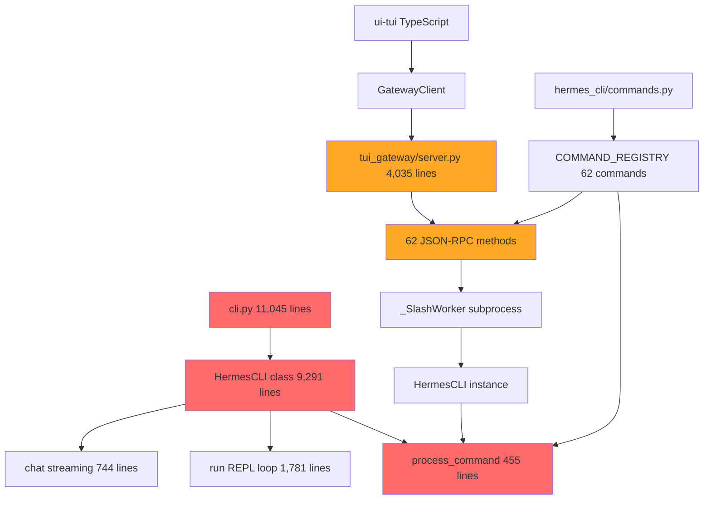
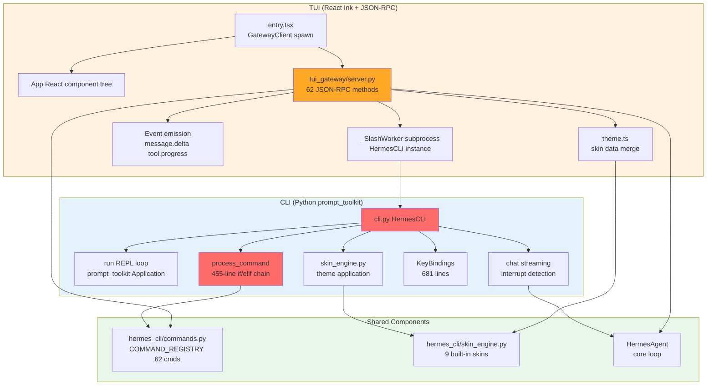

# 第十五章：CLI 与 TUI — 两套终端实现的权衡与代价

**开篇之问**：为什么 Hermes 同时维护 Python prompt_toolkit CLI 和 React Ink TUI 两套终端实现？

答案藏在一个设计权衡中：**CLI-First**（终端体验是第一优先级）。Hermes 选择了两条并行的技术路线来满足不同场景的需求，但这个选择也带来了显著的架构复杂度和维护成本。

本章将深入剖析这两套实现的技术细节、重复逻辑、架构问题，以及它们为何能共存至今。

---

## 为什么存在两套实现

Hermes 的终端界面需求可以归纳为三个核心诉求：

1. **沉浸式交互体验**：实时流式输出、进度动画、状态栏、模态提示（approval/clarify/sudo）
2. **成熟的生态支持**：命令补全、历史记录、快捷键绑定、主题引擎
3. **跨平台兼容性**：macOS/Linux/Windows 终端模拟器兼容性

### CLI：Python prompt_toolkit 实现

`cli.py` 采用 **prompt_toolkit** 构建了一个完整的 TUI（Text User Interface）：

- **核心优势**：Python 生态原生集成，直接调用 `HermesAgent`，无进程通信开销
- **技术栈**：prompt_toolkit 6.x + Rich（渲染）+ FileHistory（持久化）
- **适用场景**：本地开发、快速迭代、直接 Python 调试

**关键特性**：

- **固定底部输入区**：`cli.py:8985-10766` 的 `run()` 方法实现了完整的 REPL 循环
- **实时流式渲染**：`chat()` 方法（`cli.py:8240-8984`）处理流式响应，支持中断检测
- **模态提示系统**：approval（`cli.py:10100-10300`）、clarify（`cli.py:10015-10095`）、sudo（`cli.py:9815-9853`）
- **键盘绑定**：`cli.py:9116-9797` 定义了 681 行的按键处理逻辑

### TUI：React Ink + JSON-RPC 实现

`ui-tui/` 采用 **React + Ink** 构建了声明式的终端 UI：

- **核心优势**：声明式组件模型，状态管理更清晰，TypeScript 类型安全
- **技术栈**：React 19 + Ink 6 + nanostores（状态）+ vitest（测试）
- **适用场景**：需要复杂 UI 状态管理、前后端分离、异步消息场景

**架构模型**：

```
┌─────────────────────────────────────────────────────────────┐
│  ui-tui/src/entry.tsx (TypeScript/React)                    │
│  ├─ GatewayClient (spawn Python subprocess)                 │
│  └─ App (Ink component tree)                                │
│      ├─ Static transcript output                            │
│      ├─ Streaming assistant row                             │
│      ├─ Prompt overlays (approval/clarify/sudo)             │
│      ├─ Status bar + input line                             │
│      └─ Completion menu                                     │
└─────────────────────────────────────────────────────────────┘
                          ↕ stdio (JSON-RPC)
┌─────────────────────────────────────────────────────────────┐
│  tui_gateway/entry.py (Python subprocess)                   │
│  └─ server.py (62 JSON-RPC methods)                         │
│      ├─ Session lifecycle (create/resume/branch/interrupt)  │
│      ├─ Message processing (prompt.submit → HermesAgent)    │
│      ├─ Command dispatch (slash.exec → _SlashWorker)        │
│      ├─ Config management (config.set/get)                  │
│      └─ Event emission (message.delta, tool.progress, etc.) │
└─────────────────────────────────────────────────────────────┘
```

**关键机制**：

- **JSON-RPC 协议**：Newline-delimited JSON over stdio（`tui_gateway/server.py:181-189`）
- **事件驱动**：Python 通过 `_emit()` 发送事件，TypeScript 订阅处理（`ui-tui/README.md:234-258`）
- **异步 RPC 调度**：长运行方法（6 个）路由到线程池（`tui_gateway/server.py:54-68`）
- **_SlashWorker 子进程**：持久化的 HermesCLI 实例处理斜杠命令（`tui_gateway/server.py:78-160`）

**为什么需要 Node.js？**

Ink 是基于 React reconciler 的终端渲染引擎，需要 Node.js 运行时。Hermes 在 `ui-tui/packages/hermes-ink/` 维护了一个 fork 版本来支持自定义渲染需求。

---

## CLI 实现：HermesCLI

### 单文件巨兽

`cli.py` 是一个 **11,045 行**的单文件类，`HermesCLI` 类本身占据 **9,291 行**（`cli.py:1754-11045`）：

```python
class HermesCLI:
    """Interactive CLI for the Hermes Agent.

    Provides a REPL interface with rich formatting, command history,
    and tool execution capabilities.
    """

    def __init__(self, model=None, toolsets=None, provider=None, ...):
        # cli.py:1762-2061 (300 lines)
        # Config loading, model selection, provider setup
        self.console = Console()
        self.config = CLI_CONFIG
        self.compact = compact if compact is not None else CLI_CONFIG["display"].get("compact", False)
        # ... 280+ more lines of initialization
```

**核心方法职责划分**：

| 方法 | 行数区间 | 职责 |
|------|---------|------|
| `__init__()` | 1762-2061 | 配置加载、模型选择、Provider 初始化 |
| `run()` | 8985-10766 | REPL 主循环、prompt_toolkit Application 构建 |
| `chat()` | 8240-8984 | 消息处理、流式输出、中断检测 |
| `process_command()` | 5825-6280 | 斜杠命令调度（450+ 行的 if/elif 链） |
| `_build_context_bar()` | 2081-2084 | ASCII 进度条渲染 |
| `_render_spinner_text()` | 2276-2291 | 工具调用 spinner 文本 |

### 状态栏实现

`cli.py:2070-2123` 实现了一个基于 ASCII 字符的上下文使用进度条：

```python
def _build_context_bar(self, percent_used: Optional[int], width: int = 10) -> str:
    """Build ASCII progress bar: [███████░░░]"""
    safe_percent = max(0, min(100, percent_used or 0))
    filled = round((safe_percent / 100) * width)
    return f"[{('█' * filled) + ('░' * max(0, width - filled))}]"

def _status_bar_context_style(self, percent_used: Optional[int]) -> str:
    """Dynamic color based on context usage."""
    if percent_used is None:
        return "class:status-bar-dim"
    if percent_used >= 95:
        return "class:status-bar-critical"  # 红色警告
    if percent_used > 80:
        return "class:status-bar-bad"       # 橙色警告
    if percent_used >= 50:
        return "class:status-bar-warn"      # 黄色提示
    return "class:status-bar-good"          # 绿色健康
```

这个简单的设计在 TUI 中被完全重新实现（`ui-tui/src/components/appChrome.tsx`）。

### Spinner 动画

`cli.py:2276-2291` 实现了工具调用时的 spinner 文本：

```python
def _render_spinner_text(self) -> str:
    """Return the live spinner/status text exactly as rendered in the TUI."""
    txt = getattr(self, "_spinner_text", "")
    if not txt:
        return ""
    t0 = getattr(self, "_tool_start_time", 0) or 0
    if t0 > 0:
        elapsed = time.monotonic() - t0
        if elapsed >= 60:
            _m, _s = int(elapsed // 60), int(elapsed % 60)
            elapsed_str = f"{_m}m {_s}s"
        else:
            elapsed_str = f"{elapsed:.1f}s"
        return f"  {txt}  ({elapsed_str})"
    return f"  {txt}"
```

这段逻辑与 TUI 的 `thinking.tsx` 组件功能重复，但实现完全独立。

### 按键绑定

`cli.py:9116-9797` 定义了所有快捷键逻辑：

```python
kb = KeyBindings()

@kb.add('enter')
def handle_enter(event):
    """Handle Enter key - submit input.

    Routes to the correct queue based on active UI state:
    - Sudo password prompt: password goes to sudo response queue
    - Approval selection: selected choice goes to approval response queue
    - Clarify freetext mode: answer goes to the clarify response queue
    - Clarify choice mode: selected choice goes to the clarify response queue
    - Agent running: goes to _interrupt_queue (chat() monitors this)
    - Agent idle: goes to _pending_input (process_loop monitors this)
    """
    # cli.py:9132-9215 (83 lines of routing logic)
    if self._sudo_state:
        text = event.app.current_buffer.text
        self._sudo_state["response_queue"].put(text)
        self._sudo_state = None
        event.app.invalidate()
        return
    # ... 60+ more lines
```

**关键问题**：这 681 行的按键逻辑无法被 TUI 复用，因为 prompt_toolkit 和 Ink 的事件模型完全不同。

---

## 斜杠命令系统

### 中心化注册表

`hermes_cli/commands.py` 是整个命令系统的**单一真相来源**（Single Source of Truth）：

```python
@dataclass(frozen=True)
class CommandDef:
    """Definition of a single slash command."""

    name: str                          # canonical name without slash: "background"
    description: str                   # human-readable description
    category: str                      # "Session", "Configuration", etc.
    aliases: tuple[str, ...] = ()      # alternative names: ("bg",)
    args_hint: str = ""                # argument placeholder: "<prompt>", "[name]"
    subcommands: tuple[str, ...] = ()  # tab-completable subcommands
    cli_only: bool = False             # only available in CLI
    gateway_only: bool = False         # only available in gateway/messaging
    gateway_config_gate: str | None = None  # config dotpath override
```

**COMMAND_REGISTRY**（`commands.py:59-175`）定义了 **62 个命令**，按 4 个类别组织：

- **Session** (14 commands)：new, clear, history, save, retry, undo, title, branch, compress, rollback, snapshot, stop, approve, deny, background, btw, agents, queue, steer, status
- **Configuration** (11 commands)：config, model, provider, gquota, personality, statusbar, verbose, yolo, reasoning, fast, skin, voice
- **Tools & Skills** (8 commands)：tools, toolsets, skills, cron, reload, reload-mcp, browser, plugins
- **Info** (9 commands)：commands, help, restart, usage, insights, platforms, copy, paste, image, update, debug

### 别名解析

`commands.py:182-200` 实现了命令别名解析：

```python
def resolve_command(name: str) -> CommandDef | None:
    """Resolve a command name or alias to its canonical CommandDef."""
    canonical = _CANONICAL_MAP.get(name)
    if canonical:
        return _NAME_TO_DEF.get(canonical)
    return _NAME_TO_DEF.get(name)
```

这个机制让 `/q`、`/bg`、`/exit` 等短别名能够路由到对应的完整命令。

### CLI 端的巨型 if/elif 链

`cli.py:5825-6280` 的 `process_command()` 方法是一个 **455 行**的命令调度器：

```python
def process_command(self, command: str) -> bool:
    """Process a slash command.

    Returns:
        bool: True to continue, False to exit
    """
    cmd_lower = command.lower().strip()
    cmd_original = command.strip()

    # Resolve aliases via central registry
    from hermes_cli.commands import resolve_command as _resolve_cmd
    _base_word = cmd_lower.split()[0].lstrip("/")
    _cmd_def = _resolve_cmd(_base_word)
    canonical = _cmd_def.name if _cmd_def else _base_word

    if canonical in ("quit", "exit", "q"):
        return False
    elif canonical == "help":
        self.show_help()
    elif canonical == "profile":
        self._handle_profile_command()
    elif canonical == "tools":
        self._handle_tools_command(cmd_original)
    elif canonical == "toolsets":
        self.show_toolsets()
    elif canonical == "config":
        self.show_config()
    elif canonical == "clear":
        self.new_session(silent=True)
        # ... 30 more lines for /clear
    elif canonical == "history":
        self.show_history()
    # ... 400+ more lines of if/elif
```

**问题**：每个命令的实现都内联在这个方法中，导致：

1. **单一职责违反**：一个方法承担了 62 个命令的路由和执行逻辑
2. **测试困难**：无法独立测试单个命令的逻辑
3. **代码可读性差**：450 行的 if/elif 链难以导航和维护

### TUI 端的三层调度

TUI 实现了更清晰的三层架构：

```
┌─────────────────────────────────────────────┐
│  1. Local Slash Handler (TypeScript)       │
│     ui-tui/src/app/createSlashHandler.ts    │
│     处理 UI 专属命令：                        │
│     /help, /quit, /clear, /resume, /copy    │
└─────────────────────────────────────────────┘
                    ↓ fallthrough
┌─────────────────────────────────────────────┐
│  2. slash.exec (Python RPC)                 │
│     tui_gateway/server.py:3354-3419         │
│     转发到 _SlashWorker subprocess           │
└─────────────────────────────────────────────┘
                    ↓ fallthrough
┌─────────────────────────────────────────────┐
│  3. command.dispatch (Python RPC)           │
│     tui_gateway/server.py:2925-3086         │
│     调用 HermesCLI.process_command()        │
└─────────────────────────────────────────────┘
```

**_SlashWorker 机制**：

`tui_gateway/server.py:78-160` 实现了一个持久化的 HermesCLI 子进程：

```python
class _SlashWorker:
    """Persistent HermesCLI subprocess for slash commands."""

    def __init__(self, session_key: str, model: str):
        self._lock = threading.Lock()
        self._seq = 0
        self.stderr_tail: list[str] = []
        self.stdout_queue: queue.Queue[dict | None] = queue.Queue()

        argv = [
            sys.executable,
            "-m",
            "tui_gateway.slash_worker",
            "--session-key",
            session_key,
        ]
        if model:
            argv += ["--model", model]

        self.proc = subprocess.Popen(
            argv,
            stdin=subprocess.PIPE,
            stdout=subprocess.PIPE,
            stderr=subprocess.PIPE,
            text=True,
            bufsize=1,
            cwd=os.getcwd(),
            env=os.environ.copy(),
        )
        threading.Thread(target=self._drain_stdout, daemon=True).start()
        threading.Thread(target=self._drain_stderr, daemon=True).start()
```

这个设计允许 TUI 复用 CLI 的命令逻辑，但引入了新的复杂度：

- **进程间通信**：JSON-RPC over pipes
- **超时处理**：`_SLASH_WORKER_TIMEOUT_S` 默认 45 秒（`server.py:41-43`）
- **错误隔离**：子进程崩溃不会影响主 TUI

---

## TUI 实现：React Ink + JSON-RPC

### 62 个 JSON-RPC 方法

`tui_gateway/server.py` 使用装饰器注册了 **62 个 RPC 方法**：

```python
def method(name: str):
    """Register a JSON-RPC method."""
    def dec(fn):
        _methods[name] = fn
        return fn
    return dec

@method("session.create")
def _(rid, params: dict) -> dict:
    """Create a new session."""
    # server.py:1279-1402
    model = params.get("model")
    # ... 120+ lines of session creation logic
    return _ok(rid, {"session_id": session_key, "model": model, ...})
```

**方法类别分布**：

| 类别 | 数量 | 示例方法 |
|------|------|---------|
| Session 管理 | 12 | session.create, session.resume, session.branch, session.interrupt |
| 消息处理 | 5 | prompt.submit, prompt.background, prompt.btw |
| 用户交互 | 4 | clarify.respond, sudo.respond, approval.respond, secret.respond |
| 配置管理 | 3 | config.get, config.set, config.show |
| 工具管理 | 5 | tools.list, tools.show, tools.configure, toolsets.list |
| 命令调度 | 4 | slash.exec, command.dispatch, command.resolve, commands.catalog |
| 其他 | 29 | clipboard.paste, image.attach, voice.toggle, rollback.list, etc. |

### 异步 RPC 调度

`server.py:45-68` 定义了需要异步执行的 6 个长运行方法：

```python
# Long-running handlers that block the dispatcher loop
_LONG_HANDLERS = frozenset(
    {
        "cli.exec",
        "session.branch",
        "session.resume",
        "shell.exec",
        "skills.manage",
        "slash.exec",
    }
)

_pool = concurrent.futures.ThreadPoolExecutor(
    max_workers=max(2, int(os.environ.get("HERMES_TUI_RPC_POOL_WORKERS", "4") or 4)),
    thread_name_prefix="tui-rpc",
)
```

**为什么需要异步？**

这些方法可能运行数秒到数分钟，如果在主线程执行，会阻塞 RPC 事件循环，导致：

- **approval.respond** 无法及时到达（用户批准危险命令的响应被阻塞）
- **session.interrupt** 失效（Ctrl+C 中断无法生效）

线程池确保这些方法在后台执行，主线程继续处理 RPC 请求。

### 事件驱动模型

Python Gateway 通过 `_emit()` 发送事件到 TypeScript 前端：

```python
def _emit(event: str, sid: str, payload: dict | None = None):
    """Emit a JSON-RPC notification event."""
    params = {"type": event, "session_id": sid}
    if payload is not None:
        params["payload"] = payload
    write_json({"jsonrpc": "2.0", "method": "event", "params": params})
```

**核心事件类型**（`ui-tui/README.md:234-258`）：

- **message.start** / **message.delta** / **message.complete**：流式响应
- **thinking.delta** / **reasoning.delta**：思考过程
- **tool.start** / **tool.progress** / **tool.complete**：工具调用进度
- **status.update**：状态栏更新
- **clarify.request** / **approval.request** / **sudo.request**：模态提示
- **background.complete** / **btw.complete**：后台任务结果

TypeScript 端通过 `createGatewayEventHandler.ts` 订阅这些事件并更新 React 状态。

### 组件架构

`ui-tui/src/app.tsx` 是顶层组件，组合了以下模块：

```typescript
// State management hooks
import { useComposerState } from './app/useComposerState';
import { useInputHandlers } from './app/useInputHandlers';
import { useTurnState } from './app/useTurnState';
import { createGatewayEventHandler } from './app/createGatewayEventHandler';
import { createSlashHandler } from './app/createSlashHandler';

// Component tree
return (
  <Box flexDirection="column">
    <Static items={transcript}>
      {/* Historical messages */}
    </Static>

    {/* Live streaming row */}
    {streamingAssistant && <AssistantMessage />}

    {/* Prompt overlays */}
    <AppOverlays />

    {/* Status bar + input + completions */}
    <AppChrome />
  </Box>
);
```

**关键组件**：

- **appChrome.tsx**：状态栏、输入框、补全菜单
- **branding.tsx**：Banner + session summary
- **markdown.tsx**：Markdown → Ink 渲染器
- **prompts.tsx**：approval + clarify 模态框
- **thinking.tsx**：Spinner + reasoning + tool activity

---

## 皮肤引擎

### 统一的主题系统

`hermes_cli/skin_engine.py` 实现了一个数据驱动的皮肤系统，**CLI 和 TUI 共享**：

```python
@dataclass
class SkinConfig:
    """Complete skin configuration."""
    name: str
    description: str = ""
    colors: Dict[str, str] = field(default_factory=dict)
    spinner: Dict[str, Any] = field(default_factory=dict)
    branding: Dict[str, str] = field(default_factory=dict)
    tool_prefix: str = "┊"
    tool_emojis: Dict[str, str] = field(default_factory=dict)
    banner_logo: str = ""    # Rich-markup ASCII art
    banner_hero: str = ""    # Rich-markup hero art
```

**内置皮肤**（`skin_engine.py:163-639`）：

1. **default**：经典金色 + kawaii 风格
2. **ares**：战神主题，深红 + 青铜，自定义 spinner wings
3. **mono**：纯灰度单色
4. **slate**：冷蓝色开发者主题
5. **daylight**：亮色背景主题（深色文本 + 蓝色强调）
6. **warm-lightmode**：暖色亮色主题（棕金文本）
7. **poseidon**：海神主题，深蓝 + 海泡绿
8. **sisyphus**：灰度 + 坚持主题
9. **charizard**：火山主题，橙色 + 灰烬

### YAML 皮肤定义

用户可以在 `~/.hermes/skins/<name>.yaml` 定义自定义皮肤：

```yaml
name: mytheme
description: My custom theme

colors:
  banner_border: "#CD7F32"
  banner_title: "#FFD700"
  ui_accent: "#FFBF00"
  prompt: "#FFF8DC"

spinner:
  waiting_faces: ["(⚔)", "(⛨)"]
  thinking_verbs: ["forging", "plotting"]
  wings: [["⟪⚔", "⚔⟫"]]

branding:
  agent_name: "Custom Agent"
  welcome: "Welcome message"
  prompt_symbol: "⚔ ❯ "
```

### CLI 与 TUI 的皮肤应用

**CLI 端**（`cli.py:9010-9027`）：

```python
from hermes_cli.skin_engine import get_active_skin

skin = get_active_skin()
welcome_text = skin.get_branding("welcome", "Welcome to Hermes Agent!")
welcome_color = skin.get_color("banner_text", "#FFF8DC")
self._console_print(f"[{welcome_color}]{welcome_text}[/]")
```

**TUI 端**（`ui-tui/src/theme.ts`）：

```typescript
// Merge gateway skin data into default theme
export function mergeSkinData(skin: GatewaySkin): Theme {
  return {
    ...DEFAULT_THEME,
    colors: {
      ...DEFAULT_THEME.colors,
      ...skin.colors,
    },
    branding: {
      ...DEFAULT_THEME.branding,
      ...skin.branding,
    },
  };
}
```

Gateway 在 `gateway.ready` 事件中发送皮肤数据：

```python
# tui_gateway/server.py (startup)
from hermes_cli.skin_engine import get_active_skin

skin = get_active_skin()
_emit("gateway.ready", "", {
    "skin": {
        "colors": skin.colors,
        "branding": skin.branding,
    }
})
```

**优点**：单一皮肤定义，两端自动同步。

**局限**：TUI 端无法使用 Python Rich 标记的 `banner_logo` 和 `banner_hero`（ASCII art），需要独立实现。

---

## 重复分析

### 1. 命令调度逻辑重复

**CLI**：`cli.py:5825-6280` 的 455 行 if/elif 链
**TUI**：`tui_gateway/server.py:2925-3086` 的 `command.dispatch` 方法调用 CLI 的 `process_command()`

**重复率**：TUI 通过 RPC 调用 CLI，看似无重复，但实际上：

- **本地命令**（`createSlashHandler.ts`）重新实现了 `/help`、`/quit`、`/clear` 等 UI 操作
- **_SlashWorker**（`server.py:78-160`）为每个 session 维护一个 HermesCLI 子进程，引入了进程通信开销

### 2. 工具列表展示重复

**CLI**（`cli.py:4253-4332`）：

```python
def _handle_tools_command(self, cmd: str):
    """Handle /tools command with subcommands."""
    # 80+ lines of tools listing/disable/enable logic
    from model_tools import get_tool_definitions, get_toolset_for_tool
    tools = get_tool_definitions(enabled_toolsets=self.enabled_toolsets, quiet_mode=True)
    # ... render Rich table
```

**TUI**（`tui_gateway/server.py:3722-3790`）：

```python
@method("tools.list")
def _(rid, params: dict) -> dict:
    """List all toolsets with enabled status."""
    from toolsets import get_all_toolsets, get_toolset_info
    items = []
    for name in sorted(get_all_toolsets().keys()):
        info = get_toolset_info(name)
        items.append({
            "name": name,
            "description": info["description"],
            "tool_count": info["tool_count"],
            "enabled": name in enabled,
            "tools": info["resolved_tools"],
        })
    return _ok(rid, {"toolsets": items})
```

**重复内容**：

- 工具集枚举逻辑
- Enabled 状态检测
- 工具描述提取

**差异**：CLI 直接渲染 Rich table，TUI 返回 JSON 由前端渲染。

### 3. 状态栏渲染重复

**CLI**（`cli.py:2070-2123`）：

```python
def _build_context_bar(self, percent_used: Optional[int], width: int = 10) -> str:
    """ASCII progress bar: [███████░░░]"""
    safe_percent = max(0, min(100, percent_used or 0))
    filled = round((safe_percent / 100) * width)
    return f"[{('█' * filled) + ('░' * max(0, width - filled))}]"
```

**TUI**（`ui-tui/src/components/appChrome.tsx`）：

```typescript
function buildContextBar(percentUsed: number, width: number): string {
  const filled = Math.round((percentUsed / 100) * width);
  return '[' + '█'.repeat(filled) + '░'.repeat(width - filled) + ']';
}
```

**重复率**：100%（逻辑完全一致，语言不同）

### 4. Spinner 动画重复

**CLI**（`cli.py:2276-2291`）：计算 elapsed time 并格式化
**TUI**（`ui-tui/src/components/thinking.tsx`）：独立实现相同的 elapsed time 计算

### 5. 模态提示 UI 重复

**CLI**（`cli.py:10015-10095`）：Clarify prompt 的边框绘制、选项渲染、快捷键处理
**TUI**（`ui-tui/src/components/prompts.tsx`）：React 组件重新实现相同的 UI 逻辑

**代码量对比**：

- CLI clarify panel：约 300 行（包括 approval/sudo 的共用边框逻辑）
- TUI prompts.tsx：约 250 行（TypeScript + JSX）

---

## 架构分析

### 设计优势

#### CLI 优势

1. **零延迟**：直接调用 `HermesAgent`，无 IPC 开销
2. **Python 生态原生**：Rich、prompt_toolkit、colorama 无缝集成
3. **调试友好**：单进程，pdb/ipdb 可以直接断点
4. **轻量依赖**：只需 Python 运行时，无 Node.js 要求

#### TUI 优势

1. **声明式 UI**：React 组件模型，状态管理更清晰
2. **类型安全**：TypeScript 静态类型检查
3. **测试友好**：vitest + React Testing Library
4. **前后端分离**：UI 逻辑与 Agent 逻辑解耦

### 设计劣势

#### CLI 劣势

1. **单文件巨兽**：11,045 行 `cli.py`，难以维护
2. **状态管理混乱**：70+ 实例变量（`self._xxx`），缺乏清晰边界
3. **测试困难**：巨型类难以 mock，集成测试成本高
4. **代码导航困难**：450 行 if/elif 链，IDE 跳转效率低

#### TUI 劣势

1. **Node.js 依赖**：增加了部署复杂度（需要 npm install）
2. **IPC 开销**：JSON-RPC over stdio，每次调用都有序列化开销
3. **双进程模型**：Gateway + _SlashWorker，资源占用更高
4. **协议复杂度**：62 个 RPC 方法 + 20+ 事件类型，协议维护成本高

### 架构债务



**债务清单**：

1. **P-15-01 [Arch/Critical]**：`cli.py` 单文件 11,045 行
   **影响**：可维护性极差，新人难以上手，代码审查困难

2. **P-15-02 [Arch/High]**：CLI 与 TUI 逻辑重复
   **影响**：Bug 需要在两处修复，功能同步成本高

3. **P-15-03 [Arch/Medium]**：TUI 依赖 Node.js
   **影响**：部署流程复杂，CI/CD 需要额外步骤

4. **P-15-04 [Design/Medium]**：`process_command()` 455 行 if/elif 链
   **影响**：单一职责违反，测试覆盖率低

5. **P-15-05 [Design/Low]**：_SlashWorker 子进程模型
   **影响**：资源开销、超时处理、错误隔离增加复杂度

---

## CLI vs TUI 双实现架构对比图



**架构对比总结**：

| 维度 | CLI (prompt_toolkit) | TUI (React Ink) |
|------|----------------------|-----------------|
| **实现语言** | Python | TypeScript + Python |
| **UI 框架** | prompt_toolkit 6.x | React 19 + Ink 6 |
| **代码规模** | 11,045 lines (单文件) | 4,035 lines (server) + ~3,000 lines (TypeScript) |
| **进程模型** | 单进程 | 双进程 (Gateway + _SlashWorker) |
| **Agent 通信** | 直接调用 | JSON-RPC over stdio |
| **状态管理** | 70+ 实例变量 | React hooks + nanostores |
| **命令调度** | 455-line if/elif | 3-layer (local → slash.exec → dispatch) |
| **测试** | 困难 (巨型类) | 友好 (vitest + 组件测试) |
| **部署依赖** | Python only | Python + Node.js |

---

## 问题清单

### P-15-01 [Arch/Critical] cli.py 11,045 行单文件

**问题描述**：
`cli.py` 是一个单文件巨兽，包含 11,045 行代码，其中 `HermesCLI` 类占据 9,291 行。这违反了单一职责原则，导致：

- **可维护性极差**：新功能难以找到合适的插入点
- **代码审查困难**：单个 PR 可能涉及数百行改动
- **合并冲突频繁**：多人同时修改同一个文件
- **IDE 性能下降**：大文件导致语法高亮、跳转缓慢

**影响范围**：所有 CLI 功能的开发和维护

**优先级**：Critical — 这是整个 CLI 架构的核心问题

**建议方案**：

1. **垂直切分**：按功能模块拆分成独立文件
   - `cli/repl.py`：REPL 循环 + prompt_toolkit Application
   - `cli/chat.py`：消息处理 + 流式输出
   - `cli/commands.py`：命令调度 + 执行逻辑
   - `cli/prompts.py`：模态提示（approval/clarify/sudo）
   - `cli/status.py`：状态栏 + spinner

2. **水平切分**：提取通用基础设施
   - `cli/base.py`：HermesCLI 基类，只包含初始化和配置
   - `cli/mixins/`：功能 mixin（ToolsMixin, SessionMixin, etc.）

3. **命令注册表驱动**：使用 `COMMAND_REGISTRY` 替换 if/elif 链
   ```python
   # 伪代码示例
   COMMAND_HANDLERS = {
       "help": HelpCommand(),
       "tools": ToolsCommand(),
       "config": ConfigCommand(),
   }

   def process_command(self, command: str):
       canonical = resolve_command(command)
       handler = COMMAND_HANDLERS.get(canonical)
       if handler:
           return handler.execute(self, command)
   ```

---

### P-15-02 [Arch/High] CLI 与 TUI 逻辑重复

**问题描述**：
CLI 和 TUI 在以下方面存在重复实现：

1. **工具列表展示**：`cli.py:4253-4332` vs `server.py:3722-3790`
2. **状态栏渲染**：`cli.py:2070-2123` vs `appChrome.tsx`
3. **Spinner 动画**：`cli.py:2276-2291` vs `thinking.tsx`
4. **模态提示 UI**：`cli.py:10015-10095` vs `prompts.tsx`

**影响范围**：

- **Bug 修复成本翻倍**：相同 bug 需要在两处修复
- **功能同步困难**：CLI 新增功能后，TUI 需要手动同步
- **测试覆盖率低**：重复代码导致测试用例也重复

**优先级**：High — 影响开发效率和代码质量

**建议方案**：

1. **抽象共享逻辑到 Python 模块**：
   ```python
   # hermes_cli/ui_primitives.py
   def build_context_bar(percent_used: int, width: int) -> str:
       """Shared ASCII progress bar logic."""
       safe_percent = max(0, min(100, percent_used or 0))
       filled = round((safe_percent / 100) * width)
       return f"[{('█' * filled) + ('░' * max(0, width - filled))}]"
   ```

   CLI 和 TUI Gateway 都调用这个函数，确保逻辑一致。

2. **TUI 通过 RPC 获取渲染数据**：
   ```python
   @method("ui.context_bar")
   def _(rid, params: dict) -> dict:
       percent = params.get("percent_used", 0)
       width = params.get("width", 10)
       return _ok(rid, {"bar": build_context_bar(percent, width)})
   ```

3. **统一模态提示协议**：
   - 将 clarify/approval/sudo 的 UI 逻辑抽象为通用的 `PromptRequest` 数据结构
   - CLI 和 TUI 各自实现渲染器，但共享数据模型

---

### P-15-03 [Arch/Medium] TUI 依赖 Node.js

**问题描述**：
TUI 实现依赖 Node.js + npm 生态，导致：

1. **部署复杂度增加**：
   - CI/CD 需要安装 Node.js 和 npm
   - 用户需要运行 `cd ui-tui && npm install`
   - 构建产物 `ui-tui/dist/` 需要版本控制或发布时打包

2. **依赖管理成本**：
   - `package.json` 维护 26 个依赖（dev + runtime）
   - `hermes-ink` fork 需要手动同步上游 Ink 更新

3. **跨平台兼容性**：
   - Windows 环境 npm 安装路径可能不一致
   - Node.js 版本兼容性（需要 Node 18+）

**影响范围**：TUI 用户体验、部署流程

**优先级**：Medium — 不影响 CLI，但增加 TUI 维护成本

**建议方案**：

1. **短期**：提供预构建的 TUI bundle
   - CI 自动构建 `ui-tui/dist/entry.js`
   - 用户无需安装 Node.js，直接运行 `hermes --tui`

2. **长期**：评估替代方案
   - **Textual**（Python）：基于 Rich 的异步 TUI 框架，无需 Node.js
   - **Ratatui**（Rust）：高性能终端 UI 库，可通过 PyO3 绑定

---

### P-15-04 [Design/Medium] process_command() 455 行 if/elif 链

**问题描述**：
`cli.py:5825-6280` 的 `process_command()` 方法是一个 455 行的 if/elif 链，违反了开闭原则（Open-Closed Principle）：

- **新增命令**：需要修改这个巨型方法
- **测试困难**：无法独立测试单个命令的逻辑
- **代码可读性差**：450 行代码难以一次性理解

**影响范围**：所有斜杠命令的开发和维护

**优先级**：Medium — 影响代码质量，但不阻塞功能

**建议方案**：

**方案 1：命令类注册表**

```python
# hermes_cli/command_base.py
class CommandHandler(ABC):
    @abstractmethod
    def execute(self, cli: 'HermesCLI', args: str) -> bool:
        """Execute command. Returns False to exit."""
        pass

# hermes_cli/commands/help.py
class HelpCommand(CommandHandler):
    def execute(self, cli, args):
        cli.show_help()
        return True

# hermes_cli/commands/registry.py
COMMAND_HANDLERS = {
    "help": HelpCommand(),
    "tools": ToolsCommand(),
    "config": ConfigCommand(),
    # ... 62 commands
}

# cli.py
def process_command(self, command: str) -> bool:
    canonical = resolve_command(command.split()[0].lstrip("/"))
    handler = COMMAND_HANDLERS.get(canonical)
    if handler:
        return handler.execute(self, command)
    self._console_print(f"Unknown command: {command}")
    return True
```

**方案 2：装饰器注册**

```python
# hermes_cli/command_decorators.py
_COMMAND_HANDLERS = {}

def command(name: str, aliases: tuple = ()):
    def decorator(fn):
        _COMMAND_HANDLERS[name] = fn
        for alias in aliases:
            _COMMAND_HANDLERS[alias] = fn
        return fn
    return decorator

# cli.py
@command("help")
def _cmd_help(self, args: str):
    self.show_help()

@command("tools")
def _cmd_tools(self, args: str):
    self._handle_tools_command(args)

def process_command(self, command: str) -> bool:
    canonical = resolve_command(command.split()[0].lstrip("/"))
    handler = _COMMAND_HANDLERS.get(canonical)
    if handler:
        handler(self, command)
        return True
```

---

## 本章小结

Hermes 的 CLI/TUI 双实现架构是一个经典的**工程权衡案例**：

**成功之处**：

1. **CLI-First 原则**：确保了终端体验的优先级，用户无需依赖 Web UI
2. **皮肤引擎共享**：`skin_engine.py` 是两端共享的唯一亮点，避免了主题定义的重复
3. **命令注册表中心化**：`COMMAND_REGISTRY` 作为单一真相来源，CLI 和 TUI 都依赖它

**失败之处**：

1. **cli.py 单文件巨兽**（11,045 行）：严重违反模块化原则，可维护性极差
2. **重复实现的代价**：工具列表、状态栏、Spinner、模态提示等核心逻辑在两端完全重复
3. **架构复杂度爆炸**：TUI 引入了 Node.js、JSON-RPC、_SlashWorker 子进程，却没有带来足够的收益

**关键问题**：

- **P-15-01**：cli.py 11,045 行单文件 → 拆分为模块化架构
- **P-15-02**：CLI 与 TUI 逻辑重复 → 抽象共享逻辑到独立模块
- **P-15-03**：TUI 依赖 Node.js → 提供预构建 bundle 或评估 Textual 替代
- **P-15-04**：process_command() 455 行 if/elif 链 → 命令类注册表驱动

**本章核心观点**：

> **双实现不是问题，重复实现才是问题**。CLI 和 TUI 可以共存，但必须共享核心逻辑，而非各自为政。

在下一章《重写方案：统一终端引擎》中，我们将提出基于 Rust + Ratatui 的统一终端方案，彻底解决这些架构债务。

---

**相关文件引用**：

- `cli.py:1754-11045` — HermesCLI 类定义
- `cli.py:5825-6280` — process_command() 方法
- `cli.py:8240-8984` — chat() 消息处理
- `cli.py:8985-10766` — run() REPL 循环
- `hermes_cli/commands.py:40-175` — COMMAND_REGISTRY
- `hermes_cli/skin_engine.py:1-883` — 皮肤引擎完整实现
- `tui_gateway/server.py:1-4035` — JSON-RPC Gateway
- `tui_gateway/server.py:78-160` — _SlashWorker 子进程
- `ui-tui/README.md` — TUI 架构文档
- `ui-tui/package.json` — TUI 依赖清单
