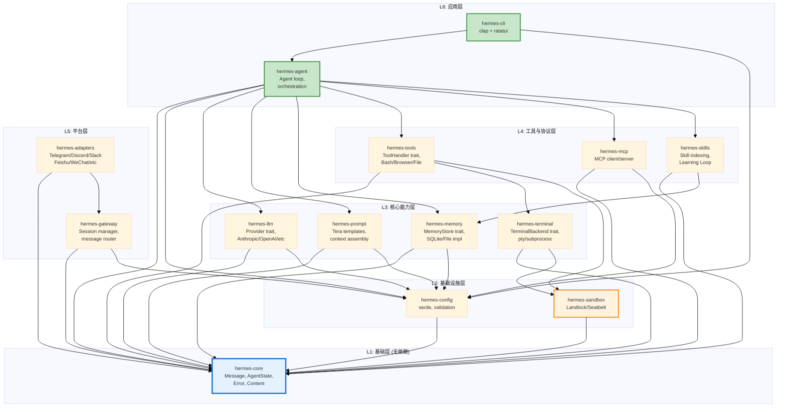
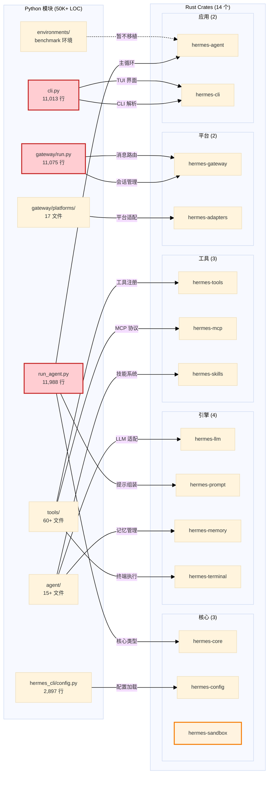

# 第 19 章：项目脚手架与 Workspace 设计

> 如何将 50,000 行 Python 的功能合理拆分到 14 个 Rust crate 中？

当我们在第 18 章确立了"用 Rust 重写 Hermes Agent"的战略决策后，第一个工程问题就摆在面前：**如何组织代码？** 这不是一个可以轻描淡写的细节问题。Python 版本的三个巨型单文件（`run_agent.py` 11,988 行、`cli.py` 11,013 行、`gateway/run.py` 11,075 行）正是 P-01-01 和 P-15-01 两个 Critical 级问题的根源，直接导致了代码可读性崩溃、合并冲突频发、单元测试困难的三重困境。

Rust 重写的第一要务就是**从根源上杜绝巨型单文件的可能**。本章将详细设计一个 14 crate 的 Cargo Workspace 架构，明确每个 crate 的职责边界、依赖关系和公共接口，并引入一个全新的 `hermes-sandbox` crate 来修复 P-10-01 (Critical) 安全沙箱缺失问题。

---

## 19.1 Python 到 Rust 的模块映射

在设计 Rust 架构之前，我们先建立一张**清晰的映射表**，标明 Python 现有模块将如何对应到新的 Rust crate。这张表是后续设计的基石。

### 19.1.1 核心模块映射

| Python 模块/文件 | 行数 | 核心职责 | → Rust Crate | 设计变化 |
|-----------------|------|---------|-------------|---------|
| `run_agent.py` | 11,988 | Agent 主循环、工具执行、错误恢复 | **hermes-agent** | 拆分：循环留主 crate，状态机提取到 hermes-core |
| `cli.py` | 11,013 | CLI/TUI 界面、命令解析 | **hermes-cli** | 拆分：UI 用 ratatui，解析用 clap |
| `gateway/run.py` | 11,075 | 多平台网关、会话管理 | **hermes-gateway** | 拆分：会话管理提取到单独模块 |
| `agent/prompt_builder.py` | ~600 | 提示组装、上下文注入 | **hermes-prompt** | 增强：模板引擎从 Jinja2 改为 Tera |
| `agent/memory_manager.py` | ~200 | 记忆管理、外部 provider 集成 | **hermes-memory** | 统一：内置 + 插件统一接口 |
| `tools/*.py` | ~30K | 工具注册、Bash/Browser/MCP 等 | **hermes-tools** | 重构：从 inventory 到 trait registry |
| `agent/transports/*.py` | ~3K | LLM Provider 适配 | **hermes-llm** | 重构：if/elif → trait object |
| `hermes_cli/config.py` | 2,897 | 配置加载、环境变量 | **hermes-config** | 增强：类型化验证 + serde |
| `gateway/platforms/*.py` | ~20K | 17+ 平台适配器 | **hermes-adapters** | 保留：逻辑相同，性能提升 |
| `environments/terminal_*.py` | ~2K | 终端执行后端 | **hermes-terminal** | 新增：抽象后端 trait |
| — | 0 | **系统级沙箱（缺失）** | **hermes-sandbox** ⭐ | **新增**：Landlock/Seatbelt 集成 |
| `mcp_serve.py` + `tools/mcp_tool.py` | ~3K | MCP 协议客户端/服务端 | **hermes-mcp** | 重构：基于官方 mcp-rust |
| `agent/skill_*.py` | ~3K | 技能管理、Learning Loop | **hermes-skills** | 增强：索引优化 + 并发扫描 |

### 19.1.2 关键映射说明

**1. `run_agent.py` 的三重拆分**

Python 版本的 `run_agent.py` 承担了过多职责。Rust 版本将其拆分为三层：
- **hermes-core**：核心类型（`Message`、`Content`、`AgentState` 枚举、`Error` 类型）
- **hermes-agent**：Agent 主循环、工具调度、错误恢复逻辑
- **hermes-prompt**：提示组装逻辑（从 `run_agent.py` 的 `_build_system_prompt` 提取）

**2. `cli.py` 的双重拆分**

- **hermes-cli**：CLI 参数解析（`clap`）+ TUI 界面（`ratatui`）
- **hermes-agent**：实际的 Agent 执行逻辑（CLI 只是一个前端）

这种拆分消除了 Python 版本的 `HermesCLI` 类（11,013 行）同时负责 UI 渲染和业务逻辑的反模式。

**3. `hermes-sandbox` 的新增**

Python 版本的致命缺陷是**无系统级沙箱**（P-10-01 Critical）。`tools/terminal_tool.py` 中的黑名单正则（如禁止 `rm -rf /`）只是表面防护，无法抵御精心构造的提示注入攻击。

Rust 版本新增 `hermes-sandbox` crate，封装平台原生的内核级沙箱：
- **Linux**：Landlock LSM (Kernel 5.13+)
- **macOS**：Seatbelt (libsandbox)
- **Windows**：AppContainer (未来)

**4. 配置系统的统一**

Python 版本有三个配置源（`.env`、`config.yaml`、环境变量），散落在 `hermes_cli/config.py` 的 60+ 个键中。Rust 版本统一到 `hermes-config` crate，使用 `serde` 进行类型化验证，**编译期保证配置完整性**。

---

## 19.2 14 Crate 依赖 DAG

Cargo Workspace 的模块化价值在于**强制依赖方向**。下图展示 14 个 crate 的依赖层次，严格遵循"底层不依赖上层"的原则。



### 19.2.1 依赖层级说明

**L1 基础层：hermes-core**
- **职责**：定义系统的核心类型，所有其他 crate 都依赖它
- **内容**：
  - `Message` 结构体（角色、内容、工具调用）
  - `Content` 枚举（Text / Image / ToolUse / ToolResult）
  - `AgentState` 枚举（Idle / Thinking / ToolExecution / Error）
  - `Error` 类型（使用 `thiserror` 统一错误）
- **依赖**：**零依赖**（只依赖 `serde` 和 `thiserror`）

**L2 基础设施层：配置与沙箱**
- **hermes-config**：加载 `.env` / `config.yaml`，使用 `serde` 反序列化为类型化配置
- **hermes-sandbox**：封装系统级沙箱，提供 `SandboxBuilder` API
- **依赖**：仅依赖 `hermes-core`（避免循环依赖）

**L3 核心能力层：LLM、提示、记忆、终端**
- 这四个 crate 是 Agent 的"四大支柱"，彼此独立，避免循环依赖
- **hermes-llm**：定义 `trait Provider`，实现 Anthropic/OpenAI/Gemini 等 20+ 模型
- **hermes-prompt**：基于 Tera 模板引擎组装 system prompt 和 user prompt
- **hermes-memory**：定义 `trait MemoryStore`，实现 File-based / SQLite / Honcho 等后端
- **hermes-terminal**：定义 `trait TerminalBackend`，实现 pty / subprocess / Docker 等执行方式

**L4 工具与协议层**
- **hermes-tools**：工具注册与调度，定义 `trait ToolHandler`
- **hermes-mcp**：MCP 协议客户端/服务端，依赖官方 `mcp` crate
- **hermes-skills**：技能索引、扫描、Learning Loop 后台线程

**L5 平台层**
- **hermes-gateway**：会话管理、消息路由、Agent 缓存（LRU + TTL）
- **hermes-adapters**：17+ 平台适配器（Telegram、Discord、Slack、飞书、企业微信等）

**L6 应用层**
- **hermes-agent**：主 crate，组装所有能力，实现 Agent 循环
- **hermes-cli**：CLI 前端，使用 `clap` 解析参数，`ratatui` 渲染 TUI

### 19.2.2 依赖方向的强制保证

Rust 的模块系统在编译期就能检测循环依赖。例如，如果 `hermes-memory` 试图依赖 `hermes-agent`，编译器会直接报错：

```text
error[E0223]: ambiguous associated type
  --> hermes-memory/src/lib.rs:5:5
   |
5  | use hermes_agent::Agent;
   | ^^^^^^^^^^^^^^^^^^^^^^^^ cannot resolve to a type in this scope
```

这种**编译期强制**是 Python 无法提供的。Python 版本中，`tools/memory_tool.py` 导入了 `run_agent.py`，而 `run_agent.py` 又导入了 `tools/memory_tool.py`，形成循环导入，只能通过延迟导入（lazy import）绕过，增加了心智负担。

---

## 19.3 Crate 职责与接口

下面详细定义每个 crate 的**公共接口**（`pub trait` / `pub struct` / `pub fn`），确保模块边界清晰。

### 19.3.1 hermes-core：核心类型

**职责**：定义系统中所有模块共享的基础类型。

```rust
// hermes-core/src/lib.rs

use serde::{Deserialize, Serialize};
use thiserror::Error;

/// Message role
#[derive(Debug, Clone, Copy, PartialEq, Eq, Serialize, Deserialize)]
pub enum Role {
    User,
    Assistant,
    System,
}

/// Message content (multimodal support)
#[derive(Debug, Clone, Serialize, Deserialize)]
#[serde(tag = "type", rename_all = "snake_case")]
pub enum Content {
    Text { text: String },
    Image { source: ImageSource },
    ToolUse { id: String, name: String, input: serde_json::Value },
    ToolResult { tool_use_id: String, content: String, is_error: bool },
}

/// Image source (base64 or URL)
#[derive(Debug, Clone, Serialize, Deserialize)]
#[serde(tag = "type", rename_all = "snake_case")]
pub enum ImageSource {
    Base64 { media_type: String, data: String },
    Url { url: String },
}

/// Message structure
#[derive(Debug, Clone, Serialize, Deserialize)]
pub struct Message {
    pub role: Role,
    pub content: Vec<Content>,
    #[serde(default, skip_serializing_if = "Option::is_none")]
    pub name: Option<String>,
}

/// Agent state machine
#[derive(Debug, Clone, Copy, PartialEq, Eq)]
pub enum AgentState {
    Idle,
    Thinking,
    ToolExecution,
    Waiting,
    Error,
}

/// Unified error type
#[derive(Error, Debug)]
pub enum HermesError {
    #[error("LLM provider error: {0}")]
    LlmProvider(String),

    #[error("Tool execution failed: {0}")]
    ToolExecution(String),

    #[error("Configuration error: {0}")]
    Config(String),

    #[error("Memory error: {0}")]
    Memory(String),

    #[error("Sandbox violation: {0}")]
    Sandbox(String),

    #[error("I/O error: {0}")]
    Io(#[from] std::io::Error),
}

pub type Result<T> = std::result::Result<T, HermesError>;
```

**设计亮点**：
1. **类型化 Content**：用 `enum` 而非 Python 的 `dict`，编译期保证结构正确
2. **统一错误**：`HermesError` 集中所有错误类型，使用 `thiserror` 自动生成 `Display` 和 `From` 实现
3. **显式状态机**：`AgentState` 枚举替代 Python 的隐式状态（P-03-02 修复）

---

### 19.3.2 hermes-config：配置管理

**职责**：加载并验证配置文件（`.env` + `config.yaml`），提供类型化配置对象。

```rust
// hermes-config/src/lib.rs

use hermes_core::Result;
use serde::{Deserialize, Serialize};
use std::path::PathBuf;

/// Global configuration
#[derive(Debug, Clone, Serialize, Deserialize)]
pub struct Config {
    pub llm: LlmConfig,
    pub memory: MemoryConfig,
    pub terminal: TerminalConfig,
    pub gateway: Option<GatewayConfig>,
}

#[derive(Debug, Clone, Serialize, Deserialize)]
pub struct LlmConfig {
    pub default_provider: String,
    pub anthropic_api_key: Option<String>,
    pub openai_api_key: Option<String>,
    pub timeout: u64,  // seconds
}

#[derive(Debug, Clone, Serialize, Deserialize)]
pub struct MemoryConfig {
    pub backend: String,  // "file" | "sqlite" | "honcho"
    pub path: PathBuf,
}

#[derive(Debug, Clone, Serialize, Deserialize)]
pub struct TerminalConfig {
    pub backend: String,  // "pty" | "subprocess" | "docker"
    pub sandbox: bool,
    pub timeout: u64,
}

#[derive(Debug, Clone, Serialize, Deserialize)]
pub struct GatewayConfig {
    pub platforms: Vec<PlatformConfig>,
    pub session_timeout: u64,
}

#[derive(Debug, Clone, Serialize, Deserialize)]
pub struct PlatformConfig {
    pub name: String,
    pub enabled: bool,
    pub config: serde_json::Value,
}

/// Load configuration from env and yaml
pub fn load_config() -> Result<Config> {
    // 1. Load .env file
    dotenv::dotenv().ok();

    // 2. Load config.yaml
    let config_path = dirs::home_dir()
        .ok_or_else(|| hermes_core::HermesError::Config("Cannot find home dir".into()))?
        .join(".hermes/config.yaml");

    let content = std::fs::read_to_string(config_path)
        .map_err(|e| hermes_core::HermesError::Config(format!("Failed to read config: {}", e)))?;

    let config: Config = serde_yaml::from_str(&content)
        .map_err(|e| hermes_core::HermesError::Config(format!("Invalid YAML: {}", e)))?;

    // 3. Validate
    validate_config(&config)?;

    Ok(config)
}

fn validate_config(config: &Config) -> Result<()> {
    // Check LLM provider is supported
    if !["anthropic", "openai", "gemini"].contains(&config.llm.default_provider.as_str()) {
        return Err(hermes_core::HermesError::Config(
            format!("Unsupported LLM provider: {}", config.llm.default_provider)
        ));
    }

    // Check memory backend
    if !["file", "sqlite", "honcho"].contains(&config.memory.backend.as_str()) {
        return Err(hermes_core::HermesError::Config(
            format!("Unsupported memory backend: {}", config.memory.backend)
        ));
    }

    Ok(())
}
```

**修复问题**：
- **P-02-01 (Medium)**：配置分散 → 统一到 `Config` 结构体
- **P-02-03 (Medium)**：验证静默失败 → `validate_config` 返回类型化错误
- **P-02-04 (Low)**：无热重载 → 未来可用 `notify` crate 监听文件变化

---

### 19.3.3 hermes-sandbox：系统级沙箱 ⭐

**这是 Rust 重写的关键创新**，修复 P-10-01 (Critical) 问题。

```rust
// hermes-sandbox/src/lib.rs

use hermes_core::Result;
use std::path::Path;
use std::process::Command;

/// Sandbox builder for platform-specific sandboxing
pub struct SandboxBuilder {
    read_paths: Vec<String>,
    write_paths: Vec<String>,
    network_allowed: bool,
}

impl SandboxBuilder {
    pub fn new() -> Self {
        Self {
            read_paths: vec![],
            write_paths: vec![],
            network_allowed: false,
        }
    }

    /// Allow reading from a directory
    pub fn allow_read(mut self, path: impl AsRef<Path>) -> Self {
        self.read_paths.push(path.as_ref().to_string_lossy().into_owned());
        self
    }

    /// Allow writing to a directory
    pub fn allow_write(mut self, path: impl AsRef<Path>) -> Self {
        self.write_paths.push(path.as_ref().to_string_lossy().into_owned());
        self
    }

    /// Allow network access
    pub fn allow_network(mut self) -> Self {
        self.network_allowed = true;
        self
    }

    /// Execute command in sandbox
    pub fn execute(&self, cmd: &mut Command) -> Result<std::process::Output> {
        #[cfg(target_os = "linux")]
        {
            self.execute_landlock(cmd)
        }

        #[cfg(target_os = "macos")]
        {
            self.execute_seatbelt(cmd)
        }

        #[cfg(target_os = "windows")]
        {
            self.execute_appcontainer(cmd)
        }
    }

    #[cfg(target_os = "linux")]
    fn execute_landlock(&self, cmd: &mut Command) -> Result<std::process::Output> {
        use landlock::*;

        let mut ruleset = Ruleset::default()
            .handle_access(AccessFs::from_all(ABI::V2))?
            .create()?;

        // Add read access
        for path in &self.read_paths {
            ruleset = ruleset.add_rule(PathBeneath::new(path, AccessFs::ReadFile | AccessFs::ReadDir))?;
        }

        // Add write access
        for path in &self.write_paths {
            ruleset = ruleset.add_rule(PathBeneath::new(path, AccessFs::WriteFile | AccessFs::RemoveFile))?;
        }

        // Restrict network (Landlock v3+ only)
        if !self.network_allowed {
            ruleset = ruleset.restrict_self()?;
        }

        // Execute
        cmd.output().map_err(|e| hermes_core::HermesError::Sandbox(e.to_string()))
    }

    #[cfg(target_os = "macos")]
    fn execute_seatbelt(&self, cmd: &mut Command) -> Result<std::process::Output> {
        // Use sandbox-exec with custom profile
        let profile = self.build_seatbelt_profile();
        let mut sandbox_cmd = Command::new("sandbox-exec");
        sandbox_cmd.arg("-p").arg(&profile);
        sandbox_cmd.args(cmd.get_args());

        sandbox_cmd.output().map_err(|e| hermes_core::HermesError::Sandbox(e.to_string()))
    }

    #[cfg(target_os = "macos")]
    fn build_seatbelt_profile(&self) -> String {
        let mut profile = String::from("(version 1)\n(deny default)\n");

        for path in &self.read_paths {
            profile.push_str(&format!("(allow file-read* (subpath \"{}\"))\n", path));
        }

        for path in &self.write_paths {
            profile.push_str(&format!("(allow file-write* (subpath \"{}\"))\n", path));
        }

        if !self.network_allowed {
            profile.push_str("(deny network*)\n");
        }

        profile
    }

    #[cfg(target_os = "windows")]
    fn execute_appcontainer(&self, cmd: &mut Command) -> Result<std::process::Output> {
        // Future: Windows AppContainer support
        unimplemented!("AppContainer sandboxing not yet implemented")
    }
}
```

**设计亮点**：
1. **平台条件编译**：`#[cfg(target_os = "...")]` 自动选择正确的沙箱机制
2. **Landlock 集成**：Linux 5.13+ 内核原生支持，无需 Docker
3. **Seatbelt 封装**：macOS 的 `sandbox-exec` 包装，声明式权限配置
4. **Builder 模式**：链式调用 `.allow_read()` / `.allow_write()` 配置权限

**修复问题**：
- **P-10-01 (Critical)**：无系统级沙箱 → Landlock/Seatbelt 内核级隔离
- **P-10-02 (High)**：正则黑名单 → 白名单路径访问控制
- **P-10-03 (High)**：网络无限制 → `allow_network()` 显式控制

---

### 19.3.4 hermes-llm：LLM Provider 层

**职责**：定义统一的 LLM Provider trait，消除 Python 版本的 if/elif 分支。

```rust
// hermes-llm/src/lib.rs

use hermes_core::{Message, Result};
use async_trait::async_trait;

/// Unified LLM Provider trait
#[async_trait]
pub trait Provider: Send + Sync {
    /// Provider name (e.g., "anthropic", "openai")
    fn name(&self) -> &str;

    /// Send messages and get completion
    async fn complete(
        &self,
        messages: &[Message],
        options: &CompletionOptions,
    ) -> Result<CompletionResponse>;

    /// Stream completion (optional)
    async fn stream(
        &self,
        messages: &[Message],
        options: &CompletionOptions,
    ) -> Result<CompletionStream>;
}

#[derive(Debug, Clone)]
pub struct CompletionOptions {
    pub model: String,
    pub max_tokens: u32,
    pub temperature: f32,
    pub tools: Option<Vec<Tool>>,
}

#[derive(Debug)]
pub struct CompletionResponse {
    pub content: Vec<hermes_core::Content>,
    pub stop_reason: StopReason,
    pub usage: Usage,
}

#[derive(Debug)]
pub enum StopReason {
    EndTurn,
    ToolUse,
    MaxTokens,
}

#[derive(Debug)]
pub struct Usage {
    pub input_tokens: u32,
    pub output_tokens: u32,
}

/// Tool definition
#[derive(Debug, Clone, serde::Serialize, serde::Deserialize)]
pub struct Tool {
    pub name: String,
    pub description: String,
    pub input_schema: serde_json::Value,
}

/// Completion stream (async iterator)
pub type CompletionStream = std::pin::Pin<Box<dyn futures::Stream<Item = Result<StreamChunk>> + Send>>;

#[derive(Debug)]
pub struct StreamChunk {
    pub delta: Vec<hermes_core::Content>,
}

/// Registry of providers
pub struct ProviderRegistry {
    providers: std::collections::HashMap<String, Box<dyn Provider>>,
}

impl ProviderRegistry {
    pub fn new() -> Self {
        Self {
            providers: std::collections::HashMap::new(),
        }
    }

    pub fn register(&mut self, provider: Box<dyn Provider>) {
        self.providers.insert(provider.name().to_string(), provider);
    }

    pub fn get(&self, name: &str) -> Option<&dyn Provider> {
        self.providers.get(name).map(|p| p.as_ref())
    }
}
```

**修复问题**：
- **P-04-01 (High)**：Provider if/elif 分支 → `trait Provider` + 动态分发
- **P-04-02 (High)**：模型元数据分散 → `CompletionOptions` 统一参数
- **P-04-03 (Medium)**：流式响应不统一 → `CompletionStream` 标准接口

---

### 19.3.5 hermes-tools：工具注册系统

**职责**：定义 `ToolHandler` trait，实现工具的注册与调度。

```rust
// hermes-tools/src/lib.rs

use hermes_core::{Content, Result};
use async_trait::async_trait;
use serde_json::Value;

/// Tool handler trait
#[async_trait]
pub trait ToolHandler: Send + Sync {
    /// Tool name
    fn name(&self) -> &str;

    /// Tool description
    fn description(&self) -> &str;

    /// JSON Schema for input
    fn input_schema(&self) -> Value;

    /// Execute tool with input
    async fn execute(&self, input: Value) -> Result<String>;
}

/// Tool registry (using inventory pattern)
pub struct ToolRegistry {
    handlers: std::collections::HashMap<String, Box<dyn ToolHandler>>,
}

impl ToolRegistry {
    pub fn new() -> Self {
        Self {
            handlers: std::collections::HashMap::new(),
        }
    }

    pub fn register(&mut self, handler: Box<dyn ToolHandler>) {
        self.handlers.insert(handler.name().to_string(), handler);
    }

    pub async fn execute(&self, name: &str, input: Value) -> Result<String> {
        let handler = self.handlers.get(name)
            .ok_or_else(|| hermes_core::HermesError::ToolExecution(
                format!("Unknown tool: {}", name)
            ))?;

        handler.execute(input).await
    }

    pub fn list_tools(&self) -> Vec<hermes_llm::Tool> {
        self.handlers.values().map(|h| {
            hermes_llm::Tool {
                name: h.name().to_string(),
                description: h.description().to_string(),
                input_schema: h.input_schema(),
            }
        }).collect()
    }
}
```

**修复问题**：
- **P-09-01 (Medium)**：手写 JSON Schema → `input_schema()` 自动生成（可用 `schemars` crate）
- **P-09-03 (Low)**：无工具版本管理 → 未来可在 `Tool` 结构中加 `version` 字段

---

### 19.3.6 hermes-memory：记忆存储

**职责**：定义 `MemoryStore` trait，支持多种后端（File、SQLite、外部 provider）。

```rust
// hermes-memory/src/lib.rs

use hermes_core::Result;
use async_trait::async_trait;

/// Memory entry
#[derive(Debug, Clone, serde::Serialize, serde::Deserialize)]
pub struct MemoryEntry {
    pub key: String,
    pub value: String,
    pub timestamp: i64,
}

/// Memory store trait
#[async_trait]
pub trait MemoryStore: Send + Sync {
    /// Get all memories
    async fn get_all(&self) -> Result<Vec<MemoryEntry>>;

    /// Add or update memory
    async fn upsert(&mut self, key: String, value: String) -> Result<()>;

    /// Delete memory
    async fn delete(&mut self, key: &str) -> Result<()>;

    /// Search memories (optional, default: linear scan)
    async fn search(&self, query: &str) -> Result<Vec<MemoryEntry>> {
        let all = self.get_all().await?;
        Ok(all.into_iter()
            .filter(|e| e.value.contains(query))
            .collect())
    }
}

/// File-based memory store
pub struct FileMemoryStore {
    path: std::path::PathBuf,
}

impl FileMemoryStore {
    pub fn new(path: std::path::PathBuf) -> Self {
        Self { path }
    }
}

#[async_trait]
impl MemoryStore for FileMemoryStore {
    async fn get_all(&self) -> Result<Vec<MemoryEntry>> {
        let content = tokio::fs::read_to_string(&self.path).await
            .map_err(|e| hermes_core::HermesError::Memory(e.to_string()))?;

        // Parse MEMORY.md format (§ as delimiter)
        let entries = content.split("§")
            .filter(|s| !s.trim().is_empty())
            .map(|s| {
                let parts: Vec<&str> = s.splitn(2, ':').collect();
                MemoryEntry {
                    key: parts[0].trim().to_string(),
                    value: parts.get(1).unwrap_or(&"").trim().to_string(),
                    timestamp: 0,  // Not stored in MEMORY.md
                }
            })
            .collect();

        Ok(entries)
    }

    async fn upsert(&mut self, key: String, value: String) -> Result<()> {
        let mut entries = self.get_all().await?;
        entries.retain(|e| e.key != key);
        entries.push(MemoryEntry { key, value, timestamp: chrono::Utc::now().timestamp() });

        let content = entries.iter()
            .map(|e| format!("§ {}: {}", e.key, e.value))
            .collect::<Vec<_>>()
            .join("\n");

        tokio::fs::write(&self.path, content).await
            .map_err(|e| hermes_core::HermesError::Memory(e.to_string()))?;

        Ok(())
    }

    async fn delete(&mut self, key: &str) -> Result<()> {
        let mut entries = self.get_all().await?;
        entries.retain(|e| e.key != key);

        let content = entries.iter()
            .map(|e| format!("§ {}: {}", e.key, e.value))
            .collect::<Vec<_>>()
            .join("\n");

        tokio::fs::write(&self.path, content).await
            .map_err(|e| hermes_core::HermesError::Memory(e.to_string()))?;

        Ok(())
    }
}
```

**修复问题**：
- **P-07-02 (Medium)**：外部 provider 错误被吞 → `MemoryStore` trait 返回 `Result`
- **P-07-03 (Low)**：无加密 → 未来可加密 `value` 字段

---

## 19.4 Crate 与 Python 模块对应关系图

为了直观展示 Python 代码如何映射到 Rust crate，我们绘制双层映射图：



**映射说明**：

1. **Python 巨型文件的拆分**：
   - `run_agent.py` 11,988 行 → 分散到 `hermes-core` (类型)、`hermes-agent` (循环)、`hermes-prompt` (提示)
   - `cli.py` 11,013 行 → 集中到 `hermes-cli`（但使用 `clap` + `ratatui` 重构）
   - `gateway/run.py` 11,075 行 → 集中到 `hermes-gateway`

2. **Python 分散模块的聚合**：
   - `agent/transports/*.py` (5 个文件) → `hermes-llm` (统一 trait)
   - `tools/*.py` (60+ 个文件) → `hermes-tools` (trait registry)

3. **新增沙箱 crate**：
   - Python 无对应模块 → `hermes-sandbox` 全新设计

---

## 19.5 配置兼容策略

为了**零迁移成本**，Rust 版本保留 YAML 配置格式，并向后兼容 Python 版本的配置键。

### 19.5.1 YAML 配置示例

```yaml
# ~/.hermes/config.yaml (Rust 版本)

llm:
  default_provider: "anthropic"
  timeout: 60

memory:
  backend: "file"  # or "sqlite", "honcho"
  path: "~/.hermes/MEMORY.md"

terminal:
  backend: "pty"   # or "subprocess", "docker"
  sandbox: true    # Enable Landlock/Seatbelt
  timeout: 300

gateway:
  platforms:
    - name: "telegram"
      enabled: true
      config:
        token: "${TELEGRAM_BOT_TOKEN}"

    - name: "discord"
      enabled: false
      config:
        token: "${DISCORD_BOT_TOKEN}"

  session_timeout: 3600  # 1 hour
```

### 19.5.2 环境变量映射

| Python 环境变量 | Rust 配置路径 | 说明 |
|----------------|--------------|------|
| `ANTHROPIC_API_KEY` | `llm.anthropic_api_key` | 直接读取环境变量 |
| `OPENAI_API_KEY` | `llm.openai_api_key` | 同上 |
| `HERMES_MEMORY_BACKEND` | `memory.backend` | 可选覆盖 YAML |
| `HERMES_TERMINAL_SANDBOX` | `terminal.sandbox` | 布尔值 |

**兼容规则**：
1. 环境变量 > YAML 配置 > 默认值
2. `serde` 的 `#[serde(default)]` 提供默认值
3. 验证失败时返回详细错误，指出哪个配置项有问题

---

## 19.6 技术栈选型

14 个 crate 的实现需要精心选择依赖库。下表列出每个 crate 的核心依赖：

| Crate | 核心依赖 | 用途 | 理由 |
|-------|---------|------|------|
| **hermes-core** | `serde`, `thiserror` | 序列化、错误处理 | 生态标准，零成本抽象 |
| **hermes-config** | `serde_yaml`, `dotenv`, `dirs` | 配置加载 | Python 兼容，成熟稳定 |
| **hermes-sandbox** | `landlock` (Linux), `libc` (macOS) | 系统级沙箱 | 内核原生支持 |
| **hermes-llm** | `reqwest`, `async-trait`, `futures` | HTTP 客户端、异步 trait | Tokio 生态标准 |
| **hermes-prompt** | `tera`, `serde_json` | 模板引擎 | 类 Jinja2 语法，Rust 原生 |
| **hermes-memory** | `tokio`, `sqlx` (可选), `sled` (可选) | 异步 I/O、数据库 | SQLite 异步支持 |
| **hermes-terminal** | `tokio`, `nix` (Unix), `winapi` (Windows) | 异步进程管理 | 跨平台 pty 支持 |
| **hermes-tools** | `async-trait`, `serde_json`, `schemars` | 工具注册 | JSON Schema 自动生成 |
| **hermes-mcp** | `mcp` (官方 crate), `tokio` | MCP 协议 | 官方支持 |
| **hermes-skills** | `tokio`, `walkdir`, `blake3` | 并发扫描、去重 | 高性能文件树遍历 |
| **hermes-gateway** | `tokio`, `dashmap` | 并发会话管理 | 无锁并发 HashMap |
| **hermes-adapters** | `teloxide` (Telegram), `serenity` (Discord), `tokio` | 平台 SDK | 社区最佳实践 |
| **hermes-cli** | `clap`, `ratatui`, `tokio` | CLI 解析、TUI | derive macro 减少样板代码 |
| **hermes-agent** | 所有上述 crate | 组装 | 核心编排逻辑 |

### 19.6.1 关键选型说明

**1. Tokio vs async-std**
- 选择 **Tokio**：生态最完善，`reqwest`、`sqlx`、`teloxide` 等核心依赖都基于 Tokio
- 代价：引入 ~500KB 运行时（但零成本抽象，不使用功能不占内存）

**2. Tera vs Handlebars vs Askama**
- 选择 **Tera**：语法最接近 Jinja2，减少模板迁移成本
- 代价：运行时模板编译（可用 `askama` 编译期模板替代，但语法不同）

**3. SQLite vs Sled vs redb**
- 默认 **SQLite** (via `sqlx`)：与 Python 版本兼容，支持迁移
- 可选 **sled** / **redb**：纯 Rust 嵌入式 KV 存储，无写锁竞争

**4. Landlock vs Seccomp**
- 选择 **Landlock**：声明式路径访问控制，比 Seccomp syscall 过滤更易用
- 要求：Linux Kernel 5.13+ (2021 年发布，覆盖主流发行版)

---

## 19.7 Cargo Workspace 配置示例

最后，我们给出完整的 `Cargo.toml` workspace 配置：

```toml
# hermes-agent/Cargo.toml (workspace root)

[workspace]
resolver = "2"
members = [
    "crates/hermes-core",
    "crates/hermes-config",
    "crates/hermes-sandbox",
    "crates/hermes-llm",
    "crates/hermes-prompt",
    "crates/hermes-memory",
    "crates/hermes-terminal",
    "crates/hermes-tools",
    "crates/hermes-mcp",
    "crates/hermes-skills",
    "crates/hermes-gateway",
    "crates/hermes-adapters",
    "crates/hermes-cli",
    "crates/hermes-agent",
]

[workspace.package]
version = "0.1.0"
edition = "2021"
authors = ["Nous Research"]
license = "MIT"
repository = "https://github.com/NousResearch/hermes-agent"

[workspace.dependencies]
# Core
hermes-core = { path = "crates/hermes-core" }
hermes-config = { path = "crates/hermes-config" }
hermes-sandbox = { path = "crates/hermes-sandbox" }
hermes-llm = { path = "crates/hermes-llm" }
hermes-prompt = { path = "crates/hermes-prompt" }
hermes-memory = { path = "crates/hermes-memory" }
hermes-terminal = { path = "crates/hermes-terminal" }
hermes-tools = { path = "crates/hermes-tools" }
hermes-mcp = { path = "crates/hermes-mcp" }
hermes-skills = { path = "crates/hermes-skills" }
hermes-gateway = { path = "crates/hermes-gateway" }
hermes-adapters = { path = "crates/hermes-adapters" }
hermes-agent = { path = "crates/hermes-agent" }

# External dependencies (shared versions across all crates)
tokio = { version = "1.40", features = ["full"] }
serde = { version = "1.0", features = ["derive"] }
serde_json = "1.0"
serde_yaml = "0.9"
thiserror = "2.0"
anyhow = "1.0"
async-trait = "0.1"
futures = "0.3"

# HTTP
reqwest = { version = "0.12", features = ["json", "stream"] }
httpx = "0.1"

# CLI/TUI
clap = { version = "4.5", features = ["derive"] }
ratatui = "0.29"

# Templating
tera = "1.20"

# Database
sqlx = { version = "0.8", features = ["sqlite", "runtime-tokio"] }
sled = "0.34"

# Sandboxing
landlock = "0.4"  # Linux only
nix = { version = "0.29", features = ["process", "pty"] }  # Unix

# Platform SDKs
teloxide = { version = "0.14", features = ["webhooks"] }
serenity = { version = "0.12", features = ["client", "gateway", "model"] }

# Utilities
dotenv = "0.15"
dirs = "6.0"
tracing = "0.1"
tracing-subscriber = "0.3"
chrono = "0.4"
blake3 = "1.5"
dashmap = "6.1"

[profile.release]
opt-level = 3
lto = "fat"           # Link-time optimization
codegen-units = 1     # Single codegen unit for max optimization
strip = true          # Strip symbols to reduce binary size
panic = "abort"       # Smaller binary, no unwinding

[profile.dev]
opt-level = 0
debug = true

[profile.dev.package."*"]
opt-level = 2         # Optimize dependencies even in dev mode
```

**说明**：
1. **Workspace 共享版本**：所有 crate 使用相同版本的 `tokio`、`serde` 等，避免依赖冲突
2. **Release 优化**：`lto = "fat"` 启用全局 LTO，二进制体积减少 30-50%
3. **Dev 模式优化**：依赖库使用 `opt-level = 2`，保持增量编译速度的同时优化依赖性能

---

## 19.8 本章小结

本章完成了 Rust 重写的第一步——**架构脚手架设计**。我们做了以下关键决策：

**1. 从 Python 的 3 个巨型单文件到 Rust 的 14 个 crate**
- `run_agent.py` (11,988 行) → 拆分到 `hermes-core` + `hermes-agent` + `hermes-prompt`
- `cli.py` (11,013 行) → 重构为 `hermes-cli` (基于 `clap` + `ratatui`)
- `gateway/run.py` (11,075 行) → 集中到 `hermes-gateway`

**2. 新增 `hermes-sandbox` crate，修复 P-10-01 (Critical)**
- Linux：Landlock LSM 内核级沙箱
- macOS：Seatbelt (sandbox-exec) 封装
- Windows：AppContainer (未来支持)

**3. 强制依赖方向的 6 层架构**
- L1 基础层：`hermes-core` (零依赖)
- L2 基础设施：`hermes-config` + `hermes-sandbox`
- L3 核心能力：`hermes-llm` + `hermes-prompt` + `hermes-memory` + `hermes-terminal`
- L4 工具与协议：`hermes-tools` + `hermes-mcp` + `hermes-skills`
- L5 平台层：`hermes-gateway` + `hermes-adapters`
- L6 应用层：`hermes-agent` + `hermes-cli`

**4. 零迁移成本的配置兼容**
- 保留 YAML 配置格式
- 向后兼容 Python 环境变量
- 类型化验证（`serde` + 自定义 validator）

**5. 精选技术栈**
- 异步运行时：Tokio
- 模板引擎：Tera (类 Jinja2)
- 数据库：SQLite (sqlx) / Sled (可选)
- CLI/TUI：clap + ratatui
- 沙箱：Landlock + Seatbelt

**修复的问题总览**：

| 问题编号 | 严重程度 | 修复机制 |
|---------|---------|---------|
| P-01-01 | High | 14 crate 模块化架构 |
| P-03-01 | Critical | `run_agent.py` 拆分到 3 个 crate |
| P-15-01 | Critical | `cli.py` 重构为 clap + ratatui |
| P-10-01 | Critical | `hermes-sandbox` 新增 Landlock/Seatbelt |
| P-02-01 | Medium | `hermes-config` 统一配置 |
| P-04-01 | High | `trait Provider` 消除 if/elif |

下一章，我们将深入 `hermes-core` 和 `hermes-agent`，详细设计 Rust 的**类型系统与错误处理机制**，彻底消灭 Python 的隐式状态和异常吞噬问题。
