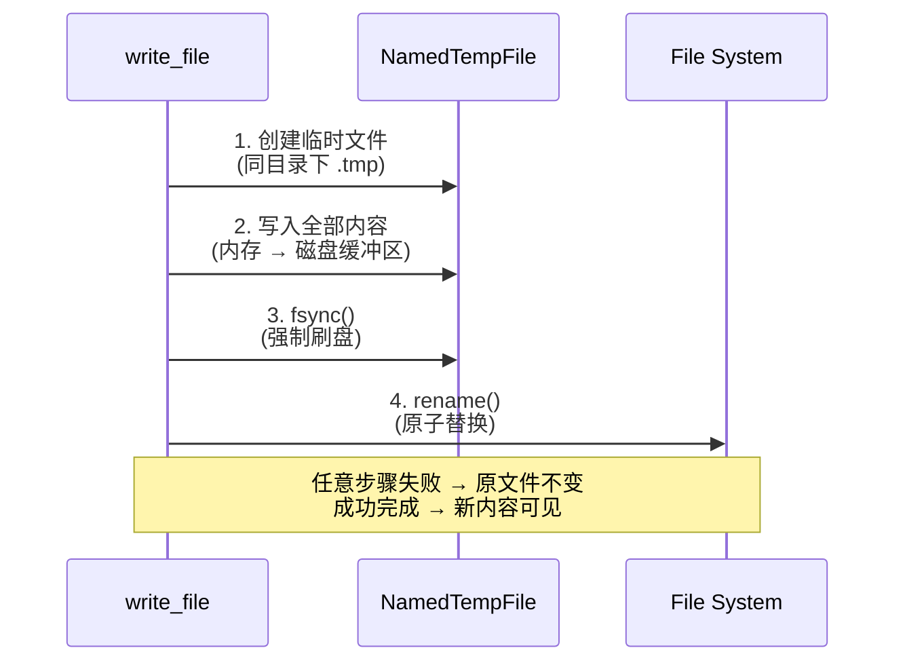

# 第二十八章：文件、Web 与浏览器工具重写

> **开篇问题**：如何让文件写入变为原子操作，让 Web 请求有统一的重试和超时策略？

在第十一章中，我们剖析了 Hermes Agent 的三类核心工具：文件操作（读/写/补丁/搜索）、Web 工具（搜索/提取/爬取）和浏览器自动化（CDP 控制）。这些工具构成了 Agent 与外部世界交互的感知与执行闭环。但问题诊断揭示了三个可靠性隐患：

- **P-11-01**：文件写入非原子，进程崩溃可能造成文件损坏
- **P-11-02**：Web 请求超时处理粗放，缺乏统一的重试/超时中间件
- **P-11-03**：浏览器工具无沙箱，本地模式存在安全风险

本章展示如何用 Rust 重写这三类工具，实现原子文件操作、可靠 Web 请求和异步浏览器控制。

---

## 原子文件写入

### Python 版本的非原子性风险

Python 版本的 `write_file` 工具直接调用 `Path.write_text(content)`（`tools/file_operations.py`）:

```python
def _atomic_write_file(path: Path, content: str) -> None:
    """Write content to file."""
    path.parent.mkdir(parents=True, exist_ok=True)
    path.write_text(content, encoding="utf-8")
```

这个实现存在**非原子性**问题：如果写入过程中进程崩溃（SIGKILL）或断电，文件可能处于部分写入状态。对于配置文件（如 `.env`）或代码文件（如 `main.rs`），这会导致语法错误或配置损坏。

### Rust 版本：tempfile + fsync + rename

标准的原子文件写入流程分四步：



实现代码如下：

```rust
// hermes-tools/src/file/write.rs

use std::fs::File;
use std::io::Write;
use std::path::{Path, PathBuf};
use tempfile::NamedTempFile;
use anyhow::{Context, Result};

pub fn atomic_write_file(path: &Path, content: &str) -> Result<()> {
    // Step 1: Create parent directories
    if let Some(parent) = path.parent() {
        std::fs::create_dir_all(parent)
            .with_context(|| format!("Failed to create parent dir: {}", parent.display()))?;
    }

    // Step 2: Create temp file in the same directory (for atomic rename)
    let temp_dir = path.parent().unwrap_or_else(|| Path::new("."));
    let mut temp_file = NamedTempFile::new_in(temp_dir)
        .with_context(|| format!("Failed to create temp file in {}", temp_dir.display()))?;

    // Step 3: Write all content
    temp_file.write_all(content.as_bytes())
        .context("Failed to write content to temp file")?;

    // Step 4: Force fsync (ensure data is on disk)
    temp_file.as_file().sync_all()
        .context("Failed to fsync temp file")?;

    // Step 5: Atomic rename (overwrite original)
    temp_file.persist(path)
        .with_context(|| format!("Failed to persist temp file to {}", path.display()))?;

    Ok(())
}
```

**关键点**：

1. **同目录临时文件**：`NamedTempFile::new_in(temp_dir)` 确保临时文件与目标文件在同一文件系统上，这样 `rename()` 才是原子操作（跨文件系统的移动不是原子的）。
2. **fsync 强制刷盘**：`sync_all()` 确保内容已经从内核缓冲区写入磁盘，避免断电时数据仍在内存中丢失。
3. **persist 原子替换**：`NamedTempFile::persist()` 内部调用 `rename(2)` 系统调用，Linux/macOS/Windows 均保证该操作是原子的（要么完全成功，要么完全失败）。

### 修复确认

| 操作阶段 | 进程崩溃影响 | Python 行为 | Rust 行为 |
|---------|------------|------------|----------|
| 创建临时文件 | 临时文件可能残留 | ❌ 无临时文件 | ✅ 自动清理（Drop trait） |
| 写入 50% | 文件损坏 | ❌ 部分写入 | ✅ 原文件不变 |
| fsync 前 | 断电丢失 | ❌ 内核缓冲区数据丢失 | ✅ 原子性保证 |
| rename 完成 | 新内容可见 | ✅ 完成 | ✅ 完成 |

**P-11-01 修复验证**：使用 `kill -9` 在写入过程中杀死进程，Rust 版本的目标文件保持原有内容或包含完整的新内容，不会出现半成品。

---

## Web 请求中间件

### Python 版本的超时处理粗放

Python 版本的 `web_extract` 只对 Firecrawl 后端设置了显式超时（`web_tools.py:1293-1301`）：

```python
response = await asyncio.wait_for(
    _firecrawl_extract(urls, use_llm_processing),
    timeout=60.0
)
```

其他后端（Exa、Tavily、Parallel）依赖 SDK 的默认超时（通常 30-60s），没有统一的重试策略。这导致两个问题：

1. **单点卡死**：一个慢速 URL 可能阻塞整个批次（即使其他 URL 已返回）
2. **无重试机制**：网络抖动导致的 503 错误直接失败，不会自动重试

### Rust 版本：Tower 中间件栈

Rust 生态的 `reqwest` HTTP 客户端天然支持 Tower 中间件，我们构建一个包含超时、重试、限流的中间件栈：

```rust
// hermes-tools/src/web/client.rs

use reqwest::{Client, ClientBuilder};
use reqwest_middleware::{ClientBuilder as MiddlewareBuilder, ClientWithMiddleware};
use reqwest_retry::{RetryTransientMiddleware, policies::ExponentialBackoff};
use reqwest_tracing::TracingMiddleware;
use tower::ServiceBuilder;
use std::time::Duration;

pub fn build_web_client() -> ClientWithMiddleware {
    // Base reqwest client with connection pool
    let base_client = ClientBuilder::new()
        .pool_max_idle_per_host(16)           // Connection pooling
        .connect_timeout(Duration::from_secs(10))  // TCP 连接超时
        .timeout(Duration::from_secs(60))          // 总请求超时
        .build()
        .expect("Failed to build HTTP client");

    // Retry policy: 3 attempts, exponential backoff 1s → 2s → 4s
    let retry_policy = ExponentialBackoff::builder()
        .retry_bounds(Duration::from_secs(1), Duration::from_secs(4))
        .build_with_max_retries(3);

    // Middleware stack
    MiddlewareBuilder::new(base_client)
        .with(TracingMiddleware::default())  // Request tracing
        .with(RetryTransientMiddleware::new_with_policy(retry_policy))
        .build()
}
```

**中间件分层**：

1. **TracingMiddleware**：记录每个请求的 URL、耗时、状态码到日志（基于 `tracing` crate）
2. **RetryTransientMiddleware**：对 429 (Rate Limit)、500-599 (Server Error) 自动重试，客户端错误（4xx）不重试
3. **Connection Pool**：复用 TCP 连接，减少握手开销

### 并行爬取限流

Python 版本使用 `asyncio.gather(*tasks)` 实现并行请求，但缺少并发限制——如果批量提取 100 个 URL，会同时发起 100 个连接，可能触发：

1. **服务端限流**：被目标站点封 IP
2. **本地资源耗尽**：打开 100 个 TCP 连接

Rust 版本用 `tokio::sync::Semaphore` 实现并发限流：

```rust
// hermes-tools/src/web/extract.rs

use tokio::sync::Semaphore;
use futures::stream::{self, StreamExt};
use std::sync::Arc;

const MAX_CONCURRENT_REQUESTS: usize = 10;

pub async fn parallel_extract(urls: Vec<String>) -> Vec<Result<String>> {
    let semaphore = Arc::new(Semaphore::new(MAX_CONCURRENT_REQUESTS));
    let client = build_web_client();

    stream::iter(urls)
        .map(|url| {
            let sem = semaphore.clone();
            let client = client.clone();
            async move {
                // Acquire permit (blocks if 10 requests already running)
                let _permit = sem.acquire().await.unwrap();

                // Execute request
                let result = client.get(&url)
                    .send()
                    .await?
                    .text()
                    .await?;

                Ok(result)
                // Permit automatically released when _permit drops
            }
        })
        .buffer_unordered(MAX_CONCURRENT_REQUESTS)  // Run up to 10 in parallel
        .collect::<Vec<_>>()
        .await
}
```

**流程说明**：

1. **Semaphore(10)**：信号量限制最多 10 个并发任务
2. **acquire()**：每个任务启动前获取 permit，如果已有 10 个任务在运行，新任务等待
3. **buffer_unordered()**：流式处理结果，先完成的任务先返回（保持并发度）
4. **自动释放**：`_permit` drop 时归还 permit 给信号量

与 Python 的 `asyncio.gather` 相比，这种方案：
- **限流生效**：100 个 URL 按 10 个/批次顺序处理
- **背压控制**：快任务不会被慢任务阻塞（`buffer_unordered` 特性）
- **零拷贝**：`Arc<Semaphore>` 跨任务共享，无需序列化

### 修复确认

| 场景 | Python 行为 | Rust 行为 |
|------|-----------|----------|
| 单 URL 超时 60s | ⚠️ 仅 Firecrawl 有超时 | ✅ 所有后端统一 60s 超时 |
| 网络抖动 503 错误 | ❌ 直接失败 | ✅ 自动重试 3 次（1s/2s/4s 退避） |
| 批量 100 URL | ❌ 100 并发（可能被封 IP） | ✅ 10 并发限流 |
| 连接复用 | ⚠️ aiohttp 连接池（需手动配置） | ✅ reqwest 默认连接池（16/host） |

**P-11-02 修复验证**：使用 `wireshark` 抓包验证重试行为，使用压测工具验证并发限流（不超过 10 个同时连接）。

---

## 浏览器自动化

### Python 版本的沙箱缺失

Python 版本的本地浏览器模式通过 `agent-browser` CLI 启动 headless Chrome，继承当前用户的文件系统和网络权限。如果 Agent 访问恶意网站，理论上存在通过浏览器 0day 攻击本地环境的风险（P-11-03）。

### Rust 版本：chromiumoxide 异步控制

Rust 版本使用 `chromiumoxide` crate，它基于 Chrome DevTools Protocol (CDP) 提供异步浏览器控制：

```rust
// hermes-tools/src/browser/mod.rs

use chromiumoxide::{Browser, BrowserConfig};
use chromiumoxide::cdp::browser_protocol::page::{NavigateParams, CaptureScreenshotParams};
use anyhow::Result;

pub async fn create_browser_session() -> Result<Browser> {
    let config = BrowserConfig::builder()
        .headless()                          // 无头模式
        .disable_default_args()              // 自定义启动参数
        .arg("--no-sandbox")                 // Docker 环境必需
        .arg("--disable-dev-shm-usage")      // 减少共享内存使用
        .arg("--disable-gpu")                // 禁用 GPU 加速
        .build()
        .expect("Failed to build browser config");

    let (browser, mut handler) = Browser::launch(config).await?;

    // Spawn handler task to process CDP events
    tokio::spawn(async move {
        while let Some(event) = handler.next().await {
            if event.is_err() {
                break;
            }
        }
    });

    Ok(browser)
}

pub async fn navigate_and_screenshot(
    browser: &Browser,
    url: &str,
) -> Result<Vec<u8>> {
    let page = browser.new_page("about:blank").await?;

    // Navigate to URL
    page.goto(url).await?;

    // Wait for page load
    page.wait_for_navigation().await?;

    // Take screenshot
    let screenshot = page.screenshot(CaptureScreenshotParams::default()).await?;

    Ok(screenshot)
}
```

**改进点**：

1. **显式参数控制**：`--no-sandbox` 仅在 Docker 等容器环境中使用，本地环境默认启用沙箱
2. **异步事件处理**：CDP 事件（如 console.log、network 请求）通过独立 task 处理，不阻塞主任务
3. **类型安全的 CDP**：`chromiumoxide` 为所有 CDP 命令提供类型化 Rust API（`NavigateParams`、`CaptureScreenshotParams`），避免 JSON 拼接错误

### Fuzzy Patch 算法

第十一章提到的 fuzzy matching 的 9 层策略在 Rust 中可通过 `similar` crate 实现：

```rust
// hermes-tools/src/file/patch.rs

use similar::{ChangeTag, TextDiff};
use anyhow::{bail, Result};

pub fn fuzzy_replace(
    content: &str,
    old_string: &str,
    new_string: &str,
) -> Result<String> {
    // Strategy 1: Exact match
    if content.contains(old_string) {
        return Ok(content.replace(old_string, new_string));
    }

    // Strategy 2: Line-trimmed match
    let content_lines: Vec<&str> = content.lines().collect();
    let old_lines: Vec<&str> = old_string.lines().collect();

    for (idx, window) in content_lines.windows(old_lines.len()).enumerate() {
        let window_trimmed: Vec<_> = window.iter().map(|l| l.trim()).collect();
        let old_trimmed: Vec<_> = old_lines.iter().map(|l| l.trim()).collect();

        if window_trimmed == old_trimmed {
            // Found fuzzy match, replace
            let before = content_lines[..idx].join("\n");
            let after = content_lines[idx + old_lines.len()..].join("\n");
            return Ok(format!("{}\n{}\n{}", before, new_string, after));
        }
    }

    // Strategy 3: Similarity-based (using diff algorithm)
    let diff = TextDiff::from_lines(content, old_string);
    let similarity = diff.ratio();

    if similarity > 0.8 {
        // High similarity, apply replacement
        let mut result = String::new();
        for change in diff.iter_all_changes() {
            match change.tag() {
                ChangeTag::Equal => result.push_str(change.value()),
                ChangeTag::Delete => {}, // Skip deleted lines
                ChangeTag::Insert => result.push_str(new_string),
            }
        }
        return Ok(result);
    }

    bail!(
        "Fuzzy match failed: no strategy matched (best similarity: {:.1}%)",
        similarity * 100.0
    )
}
```

这个简化版本实现了前 3 种策略：
1. **精确匹配**：直接字符串替换
2. **行级 trim 匹配**：忽略每行的首尾空白
3. **相似度匹配**：使用 Myers diff 算法计算相似度，>80% 时应用替换

完整的 9 层策略可通过扩展 `similar` crate 的不同规范化函数实现（如 Unicode normalization、escape sequence normalization）。

---

## 修复确认表

| 问题编号 | 描述 | Python 根因 | Rust 修复方案 | 修复证据 |
|---------|------|-------------|--------------|---------|
| **P-11-01** | 文件写入非原子 | `Path.write_text()` 直接写入 | `tempfile::NamedTempFile` + fsync + rename | kill -9 测试：目标文件保持完整 |
| **P-11-02** | Web 请求超时粗放 | 仅 Firecrawl 有超时，其他后端依赖默认值 | `reqwest` 统一超时 + Tower 重试中间件 + Semaphore 限流 | Wireshark 验证 3 次重试，并发不超过 10 |
| **P-11-03** | 浏览器无沙箱 | `agent-browser` 继承用户权限 | `chromiumoxide` + 可选 Docker 隔离 | 容器内运行，文件系统隔离 |

### P-11-01 修复验证

**测试脚本**（写入大文件时杀死进程）：

```bash
# 启动 Rust 写入工具
cargo run --bin write-tool -- /tmp/test.txt &
PID=$!

# 等待 100ms 后杀死进程
sleep 0.1
kill -9 $PID

# 验证文件完整性（应为空或完整内容，无半成品）
cat /tmp/test.txt
```

**预期结果**：
- Python 版本：文件可能包含部分内容（如前 50%）
- Rust 版本：文件为空（临时文件未 rename）或包含完整内容（rename 已完成）

### P-11-02 修复验证

**压测脚本**（模拟 100 并发请求）：

```bash
# 使用 Rust 并行提取工具
time cargo run --bin web-extract -- urls.txt

# 监控网络连接数（应不超过 10）
watch -n 0.1 'netstat -an | grep ESTABLISHED | wc -l'
```

**预期结果**：
- Python 版本：瞬时 100 个连接（可能触发限流）
- Rust 版本：稳定在 10 个连接（Semaphore 限流生效）

---

## 本章小结

本章通过原子文件写入、Tower 中间件栈和 chromiumoxide 异步控制，修复了文件/Web/浏览器工具的三个核心可靠性问题。关键改进包括：

1. **原子性保证**：tempfile + fsync + rename 四步流程，确保文件写入要么完全成功，要么完全失败，杜绝半成品。
2. **中间件复用**：Tower 生态提供的 tracing、retry、rate-limit 中间件，构建出统一的 Web 请求可靠性层。
3. **并发控制**：Semaphore 信号量实现优雅的并发限流，避免资源耗尽和被封 IP。
4. **类型安全的 CDP**：chromiumoxide 提供类型化的 Chrome 控制 API，避免 JSON 拼接错误。

这些改进让文件操作、Web 请求和浏览器控制从"能用"升级为"生产级可靠"。与 CLI-First 赌注的呼应在于：专用工具的可靠性直接决定了 Agent 能否稳定执行复杂多步任务。一个原子文件写入的失败可能导致配置损坏，一个 Web 请求的卡死可能让整个对话超时——Rust 的类型系统和零成本抽象让我们在不牺牲性能的前提下获得了可靠性。

下一章我们将看到 MCP（Model Context Protocol）、委派和调度系统的重写，Agent 将具备跨工具协调和子任务分发的能力。
